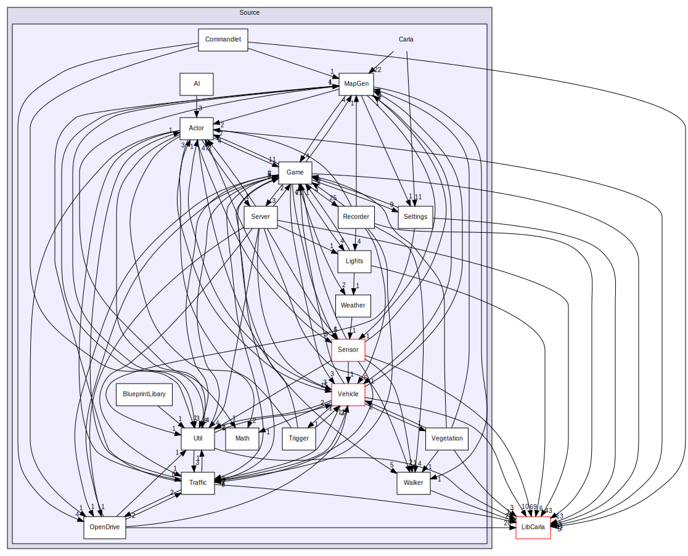

# CarlaUE4

目录依赖图：

## 内部实现

- [管线](./ue/ue_pipeline.md)

- [commandlet](./ue/ue_commandlet.md)

## 扩展

- [添加声音](https://www.youtube.com/watch?v=0X2KgGakK24) ：服务端可以有声音，客户端暂时不支持声音传输，参考[链接](https://github.com/carla-simulator/carla/issues/6749) 。