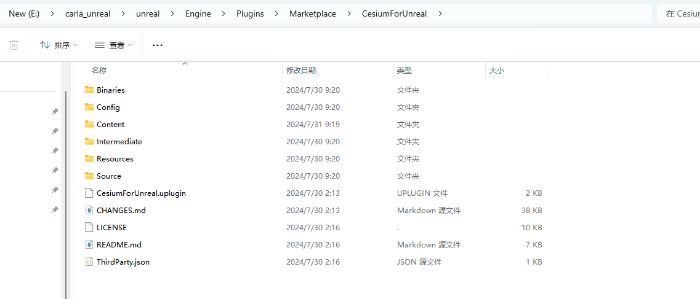
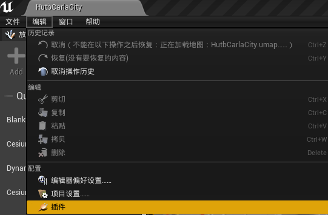
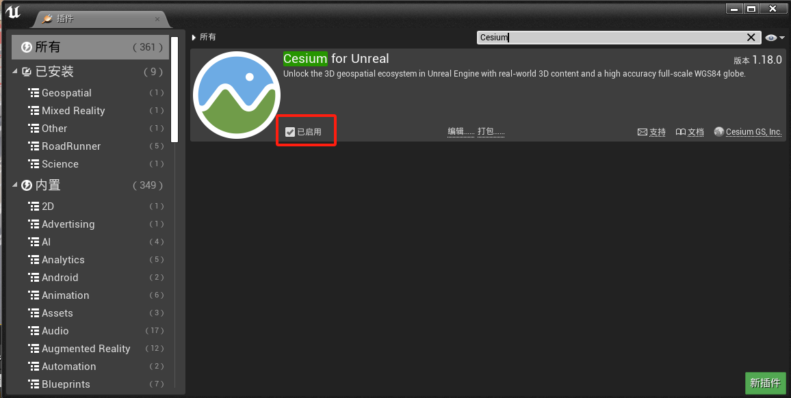
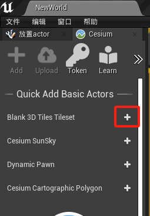
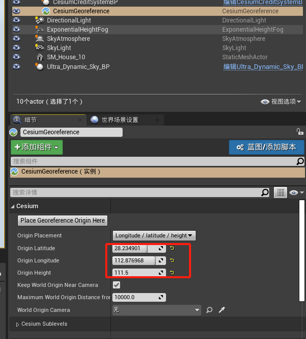
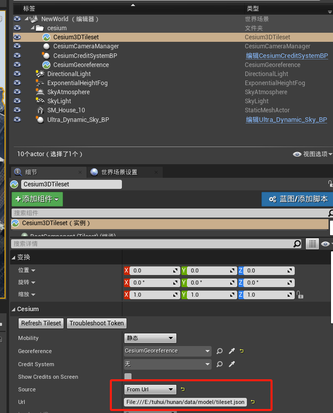
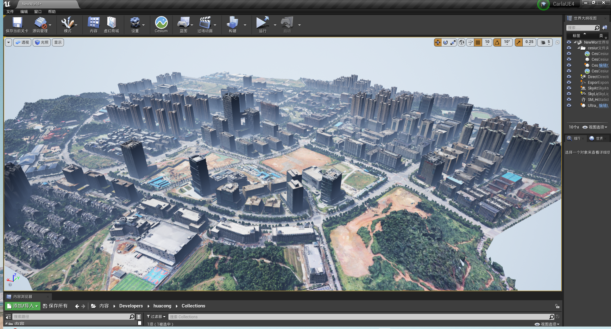

# 倾斜模型导入Carla

## 导入道路和红绿灯

0.将`RoadRunner插件.zip`解压到`carla\Unreal\CarlaUE4\Plugins`，运行`make launch`重启编辑器。

1.在`carla\Unreal\CarlaUE4\Content\roadrunner`中新建`static`（放资产）和`map`（放地图）；

在编辑器中static目录中右键导入baidutest2test.fbx。
导入选项：
勾选 纹理中`反转法线贴图`。

2.将`light.umap`拷贝到`carla\Unreal\CarlaUE4\Content\roadrunner\map`路径下。

3.在虚幻编辑器中点“文件”菜单中的“关卡另存为”（方便管理，把地图和红绿灯放一块），选择`carla\Unreal\CarlaUE4\Content\roadrunner\map`

4.将`light.umap`引入到`baidutest2test.umap`（虚幻编辑器中点“窗口”菜单中的“关卡”，将`carla\Unreal\CarlaUE4\Content\roadrunner\map\light`拖入到关卡窗口中->右键light，修改流送方式->固定加载）。

5.将`carla\Unreal\CarlaUE4\Content\Carla\Maps\OpenDrive\baidutest2test.xodr`拷贝到`carla\Unreal\CarlaUE4\Content\roadrunner\map\OpenDrive\baidutest2test.xodr`

## 倾斜模型导入Carla

1.下载并解压 [Cesium for Unreal 插件](https://github.com/CesiumGS/cesium-unreal/releases/download/v1.18.0-ue4/CesiumForUnreal-426-v1.18.0-ue4.zip) 到CarlaUE引擎的plugins/Marketplace文件夹下：

2.如果CesiumForUnreal未启用，则在CarlaUE中添加插件

 

>> 
添加完成后重启引擎。

3.添加插件对象到场景中，配置参数和模型路径：

`CesiumGeoreference`设置为：`28.235238,  112.877178,  0`

`Source`设置为`File:///D:/ssd/model/tileset.json`。 

>>>  

>>> 

>>> 

!!! 注意
    从[链接](https://pan.baidu.com/s/1n2fJvWff4pbtMe97GOqtvQ?pwd=hutb) 中的`map`文件夹内下载`中电软件园_cesium_model.zip`并解压。这里测试用的是本地路径，也可以用静态资源服务。

去掉`Keep World Origin Near Camear`勾选。

（4.将Trees.umap中放到本地文件夹下，菜单中点击`窗口->关卡`，从`内容浏览器`中将`Trees.umap`拖进导弹出界面，然后右键`Trees`关卡，选择`修改流送方法->固定加载`。）

（5.在`世界大纲视图`中选中`Cesium3DTileset`，将`Cesium`中的`Mobility`修改为`可移动`。）

（6.添加光源`DirectionalLight`、`ExponentialHeightFog`、`SkyAtmosphere`、`SkyLight`。）

7.模型在CarlaUE中的场景效果

!!! 注意
    在编辑器中如果运行时出现倾斜摄影模型部分不加载，则使用独立进程运行可全部加载。

## 倾斜摄影
由倾斜摄影osgb转换成3Dtiles格式（cesium可直接使用）。

## 导入中电软件园场景

1.[从源代码编译Carla](./build_windows.md)；

2.导入插件：roadrunner插件（包括RoadRunnerCarlaContent、RoadRunnerCarlaDatasmith、RoadRunnerCarlaIntegration、RoadRunnerDatasmith、RoadRunnerImporter、RoadRunnerMaterials、RoadRunnerRuntime）、Cesium插件；

3.导入fbx地图（导入选项都是默认），默认生成的地图是`Content/Carla/Maps/roadbuild`；

4.根据[倾斜模型导入Carla](./adv_cesium.md)的步骤添加除了建筑以外的其他资产；

5.导入自己设计的关卡：虚幻编辑器->窗口->关卡，从`内容浏览器`中将`langan.umap`、`tafficsign.umap`、`Trees1.umap`等关卡拖到弹出的`关卡`页面，并`右键每个关卡->修改流送方法->固定加载`；

## 打包地图

1.参考 [RoadRunner Scenario+CARLA联合仿真](https://zhuanlan.zhihu.com/p/552983835) 进行地图打包。

2.将打包后场景的`WindowsNoEditor\CarlaUE4\Content\Carla\Maps\OpenDrive\baidutest2test.xodr`文件拷贝到`WindowsNoEditor\CarlaUE4\Content\RoadRunner\map\OpenDrive\baidutest2test.xodr`，否则调用`client.get_trafficmanager(args.tm_port)`会出现`failed to generate map`的错误。

3.报警告`WARNING: requested 30 vehicles, but could only find 0 spawn points`，重新运行场景即可。

## 参考
- [Cesium for Unreal快速入门](https://zhuanlan.zhihu.com/p/365834299)
- [Cesium for Unreal 加载本地倾斜摄影](https://blog.csdn.net/ChaoChao66666/article/details/131569339)
- [RoadRunner Scenario+CARLA联合仿真](https://zhuanlan.zhihu.com/p/552983835)