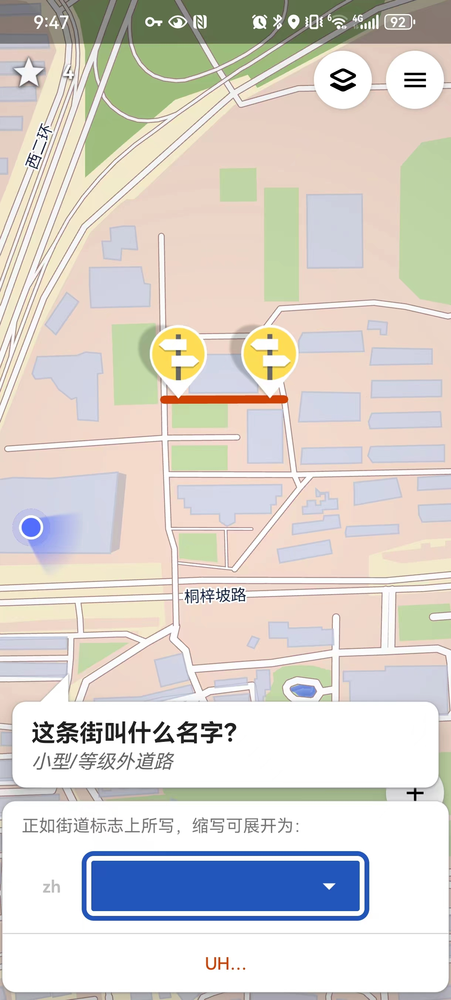

# OpenStreetMap地图编辑

## 进入编辑页面

进入 [OpenStreetMap首页](https://www.openstreetmap.org/) （需要科学上网），点击`编辑`按钮，以进入地图编辑页面（如果没有注册，请注册账号再操作）。

## 地图编辑

选中对需要修改的地图元素进行编辑。

对照卫星地图（比如百度地图的卫星地图）进行绘制：

通过实景地图数出楼的层数：

 

## 提交修改

点击页面保存按钮或者按`Ctrl+S`进行修改的保存和提交。

# 手机APP进行地图编辑
为了在移动环境下进行方便的地图编辑，下载手机软件[StreetComplete](https://github.com/streetcomplete/StreetComplete/releases) 。

