# UE编辑器本地化

## 前言
在本文中，我们将探讨如何使用UE4的本地化工具来优化你的游戏项目，涵盖从基本设置到高级功能的各个方面。无论是初次尝试游戏开发还是寻求提高现有项目的全球可及性，本指南都将提供必要的信息和步骤，帮助你顺利实现游戏本地化。

#### 1.工具说明

导航至 **窗口/本地化控制面板**

​    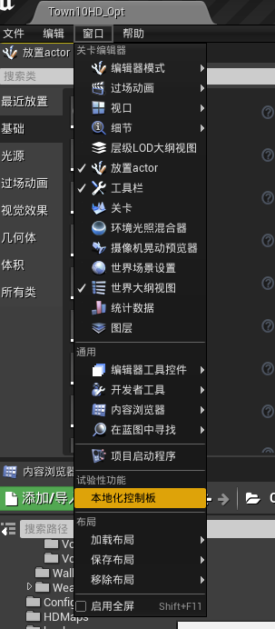

主界面部分详解

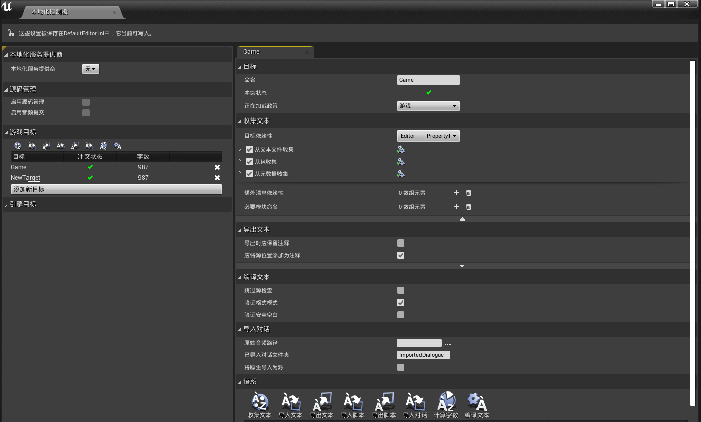

- 本地化游戏目标，默认会创建一个，如果要创建新的本地化目标，请确保为其指定适当的极爱在策略，通常为 **游戏** 或者 **固定**。默认是 **永不** ，是永不加载的。

- 目标依赖性如图所示：

  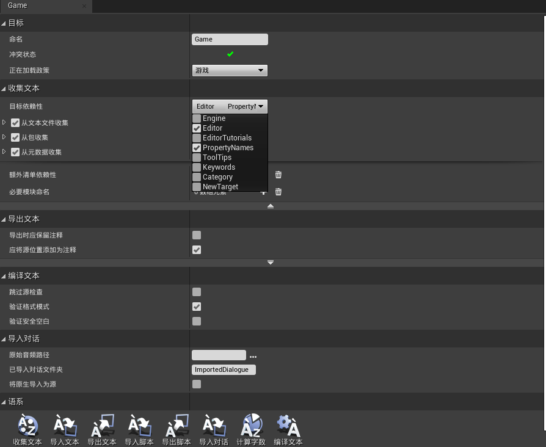

- 选择收集方式：

  1. 从文本收集：文本文件，比如我们的代码；
  2. 从包收集：对蓝图等uassest资源的本地化；
  3. 从元数据收集：对元数据Metadata的本地化，包括翻译变量名，分类，工具提示。

  其中，对于元数据的收集，必须包含至少一个路径通配符和一个键规格。路径和上面一样添加Source文件就好，键规格可以照抄引擎目标中的示例，以Property Name为例：

  **元数据键** 填 **DisplayName**

  **文本命名空间** 填 **UObjectDisplayNames**

  **文本键图案** 填 **{FieldPath}**

#### 2.翻译文本流程

上述配置完以后，主要操作都在 **语系** 中。

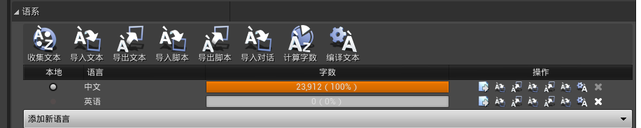

1. 如上图所示，先添加你需要翻译的语言地区和你本地文本默认的语言地区。

2. 然后点击收集文本，收集本地需要翻译的文本，成功后

   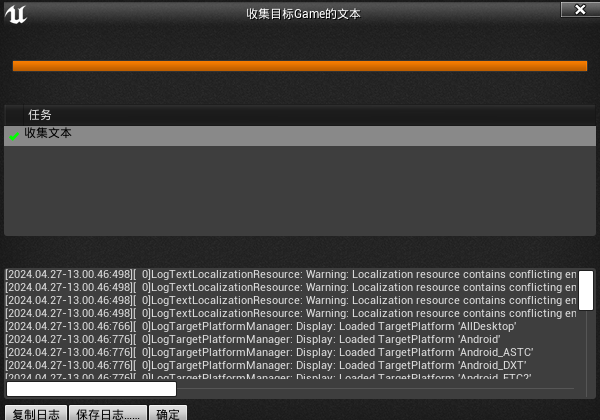

###### 开始翻译文本

这里有两种方式，一种是直接在UE工具中翻译，一种是导出使用第三方工具翻译。

**UE工具翻译**：点击每个文化语言后面

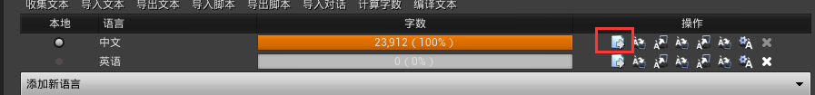

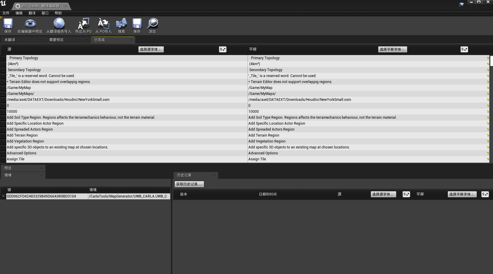

在翻译中写入翻译后的文本即可，然后点击保存。

**自行导出翻译**

如下图所示：

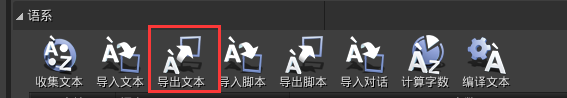

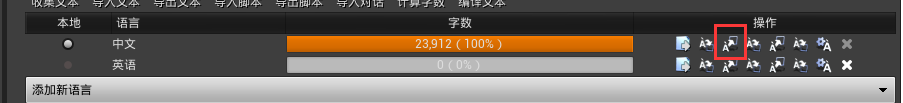

上述第一种导出方式是导出全部语系，第二种是导出指定语系的文本，选择路径导出后会生成.po格式文件，是包含要翻译的每种文化文本以及当前翻译的文件，是一种通用格式，可直接手动编辑。

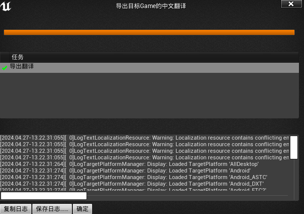

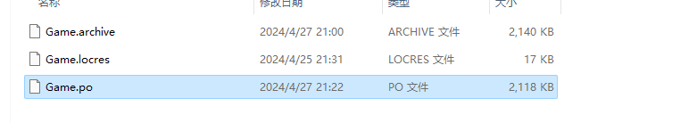

但是不建议这么做，这里我们使用 [**Poedit**](https://poedit.net) 翻译工具去进行编辑，里面功能齐全，包括自动翻译，翻译提示，多人协同等。

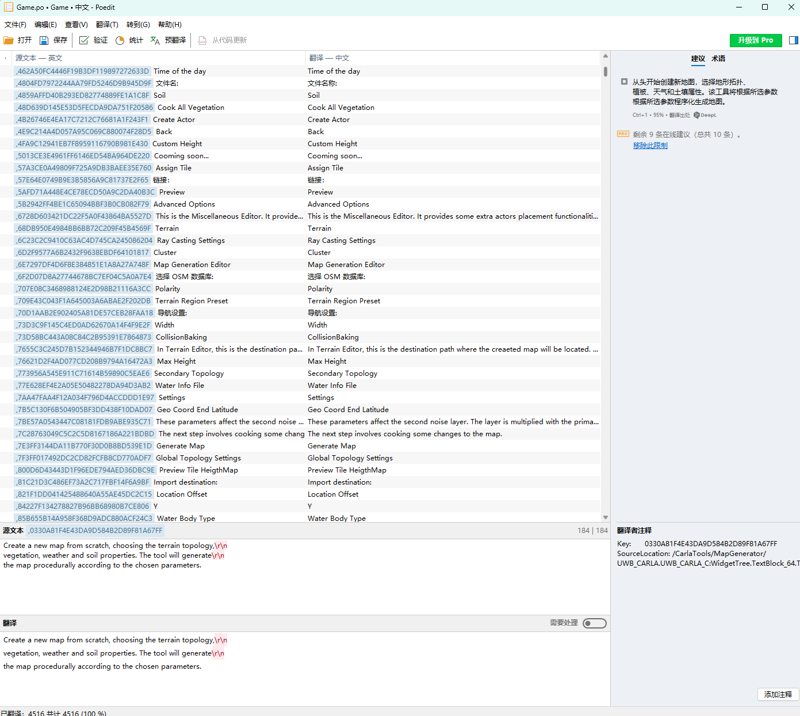

编辑完保存后，直接导入即可，按照导出的方式，再导入。

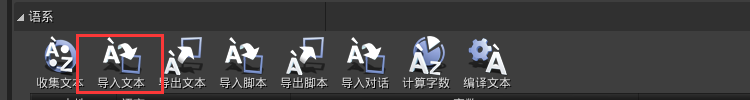

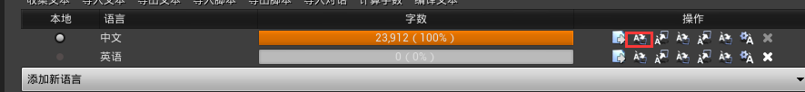

统计翻译文本，编译翻译文本。

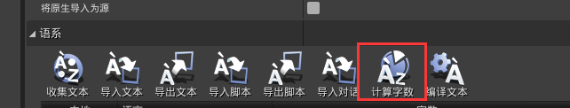

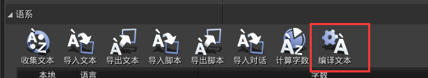

最后，需要重新打开Carla。

