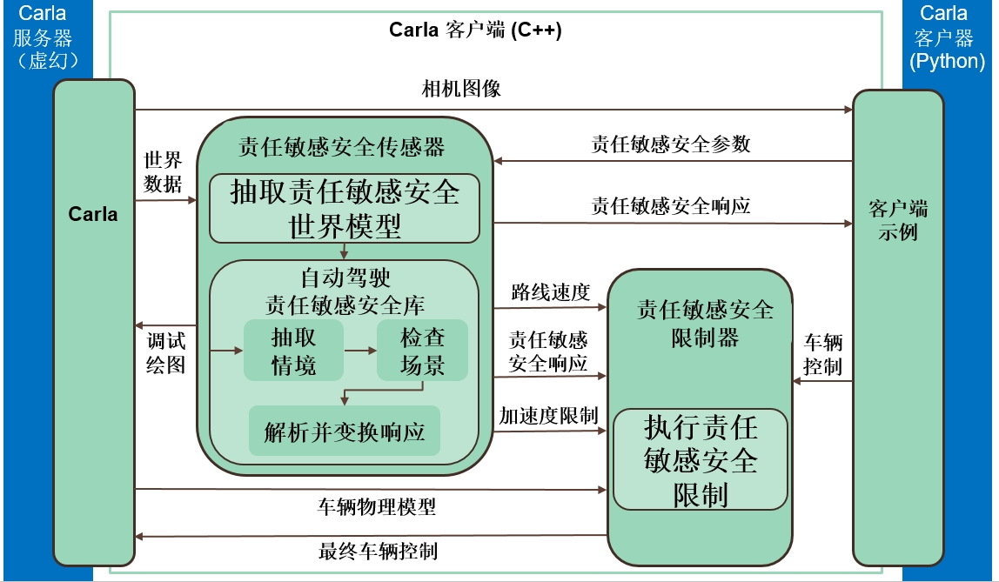

# [责任敏感安全](https://carla.readthedocs.io/en/latest/adv_rss/)

CARLA 在客户端库中集成了 [责任敏感安全的 C++ 库](https://github.com/intel/ad-rss-lib) 。此功能允许用户调查责任敏感安全(Responsibility Sensitive Safety, RSS)的行为，而无需执行任何操作。Carla 将负责提供输入，并将输出动态应用到自动驾驶(Autonomous Driving, AD) 系统。

*   [__概述__](#overview)
*   [__编译__](#compilation)
	*   [以来](#dependencies)
	*   [构建](#build)
*	[__当前状态__](#current-state)
	*   [RssSensor](#rsssensor)
	*   [RssRestrictor](#rssrestrictor)

!!! 重要
    此功能正在开发中。目前，它仅适用于 Linux 版本。

---
## 概述


责任敏感安全库实现了安全保证的数学模型。它接收传感器信息，并向车辆控制器提供限制。综上所述，责任敏感安全模块使用传感器数据来定义 __情况__。情境描述了自我车辆与环境元素的状态。对于每种情况，都会进行安全检查，并计算适当的响应。总体响应是所有响应的综合结果。有关该库的具体信息，请阅读 [文档](https://intel.github.io/ad-rss-lib/) ，尤其是 [背景部分](https://intel.github.io/ad-rss-lib/ad_rss/Overview/) 。

这是在 CARLA 中使用两个元素实现的。

*	__RssSensor__ 负责情况分析，并使用 *ad-rss-lib* 生成响应。
*	__RssRestrictor__ 通过限制车辆的命令来应用响应。

下图描绘了 __责任敏感安全__ 与 Carla 架构的集成。



__1. 服务器__

- 将相机图像发送给客户端。 <small>（仅当客户需要可视化时）。</small>
- 为 RssSensor 提供世界数据。
- 将车辆的物理模型发送到 RssRestrictor。 <small>（仅当默认值被覆盖时）。</small>

__2. 客户端__

- 为 *RssSensor* 提供一些需要考虑的 [参数](https://intel.github.io/ad-rss-lib/ad_rss/Appendix-ParameterDiscussion/) 。
- 向 *RssResrictor* 发送初始 [carla.VehicleControl](python_api.md#carla.VehicleControl).

__3. RssSensor__

- 使用 *ad-rss-lib* 提取情境、执行安全检查并生成响应。
- 向 *RssRestrictor* 发送包含正确响应和要应用的加速限制的响应。

__4. RssRestrictor__

- 如果客户端请求，则将响应应用于 [carla.VehicleControl](python_api.md#carla.VehicleControl)，并返回结果。

[](https://www.youtube.com/watch?v=UxKPXPT2T8Q)
<div style="text-align: right"><i>Visualization of the RssSensor results.</i></div>

---
## 编译

__责任敏感安全__ 集成必须与 Carla 的其余部分分开构建。__ad-rss-lib__ 附带 LGPL-2.1 开源许可证，这会产生冲突。它必须静态链接到 *libCarla*。

提醒一下，到目前为止，该功能仅适用于 Linux 版本。

### 依赖

构建 __责任敏感安全__ 及其依赖项还需要其他先决条件。查看[官方文档](https://intel.github.io/ad-rss-lib/BUILDING) 以了解更多信息。

Ubunutu (>= 16.04) 提供的依赖项。
```sh
sudo apt-get install libgtest-dev libpython-dev libpugixml-dev libtbb-dev
```

依赖项是使用 [colcon](https://colcon.readthedocs.io/en/released/user/installation.html) 构建的，因此必须安装它。 
```sh
pip3 install --user -U colcon-common-extensions
```

Python 绑定还有一些额外的依赖项。
```sh
sudo apt-get install castxml
pip3 install --user pygccxml pyplusplus
```

### 构建

完成此操作后，即可构建完整的依赖项和 __责任敏感安全__ 组件集。

*	编译 LibCarla 以使用 __责任敏感安全__。

```sh
make LibCarla.client.rss
```

*	编译 PythonAPI 以包含 __责任敏感安全__ 功能。

```sh
make PythonAPI.rss
```

*	作为替代方案，可以直接构建包。
```sh
make package.rss
```

---
## 当前状态

### RssSensor

[__carla.RssSensor__](python_api.md#carla.RssSensor) 完全支持 [ad-rss-lib v4.2.0 功能集](https://intel.github.io/ad-rss-lib/RELEASE_NOTES_AND_DISCLAIMERS) ，包括交叉路口、 [stay on road](https://intel.github.io/ad-rss-lib/ad_rss_map_integration/HandleRoadBoundaries/) 支持和 [unstructured constellations (e.g. with pedestrians)](https://intel.github.io/ad-rss-lib/ad_rss/UnstructuredConstellations/) 。

到目前为止，服务器为传感器提供了周围环境的真实数据，包括其他交通参与者和交通信号灯的状态。

### RssRestrictor

当客户但调用时，[__carla.RssRestrictor__](python_api.md#carla.RssRestrictor) 将修改车辆控制器，以通过给定的响应最好地达到所需的加速度或减速度。

由于 [carla.VehicleControl](python_api.md#carla.VehicleControl) 对象的结构，所应用的限制具有一定的局限性。这些控制器包括油门(`throttle`)、刹车(`brake`)和方向盘(`streering`)值。然而，由于汽车物理原理和简单的控制选项，这些可能无法满足。只需通过朝平行车道方向反向转向即可在横向方向进行限制干预。如果 __责任敏感安全__ 请求减速，制动器将被激活。这取决于 [carla.Vehicle](python_api.md#carla.Vehicle) 提供的车辆质量和制动扭矩。

!!! 注意
    在自动车辆控制器中，可以使计划的轨迹适应限制。可以使用快速控制环路（>1KHz）来确保遵循这些要求。

---

这奠定了 Carla 中 __责任敏感安全__ 传感器的基础知识。在 [传感器参考](ref_sensors.md#rss-sensor) 中查找有关特定属性和参数的更多信息。

打开 Carla 并闲逛一会儿。如果有任何疑问，请随时在论坛中发布。

<div class="build-buttons">
<p>
<a href="https://github.com/carla-simulator/carla/discussions/" target="_blank" class="btn btn-neutral" title="Go to the CARLA forum">
Carla 论坛</a>
</p>
</div>
