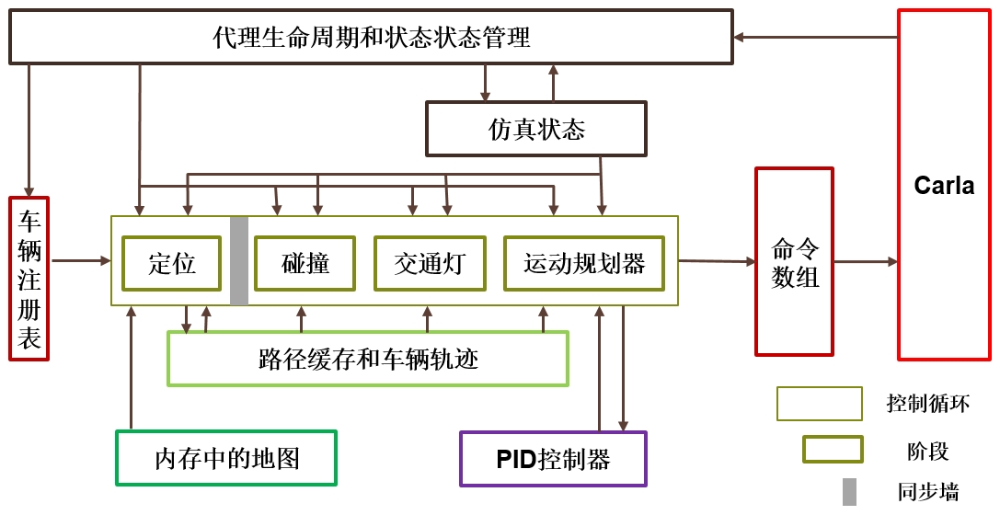

# [交通管理器](https://carla.readthedocs.io/en/latest/adv_traffic_manager/#traffic-manager)

- [__什么是交通管理器？__](#what-is-the-traffic-manager)
  - [结构化设计](#structured-design)
  - [用户定制](#user-customization)
- [__架构__](#architecture)
  - [概述](#overview)
  - [代理的生命周期和状态管理](#alsm)
  - [车辆注册表](#vehicle-registry)
  - [仿真状态](#simulation-state)
  - [控制循环](#control-loop)
  - [内存地图](#in-memory-map)
  - [路径缓存和车辆轨迹](#pbvt)
  - [PID 控制器](#pid-controller)
  - [命令数组](#command-array)
  - [控制循环的阶段](#stages-of-the-control-loop)
- [__使用交通管理器__](#using-the-traffic-manager)
  - [车辆行为考虑因素](#vehicle-behavior-considerations)
  - [创建交通管理器](#creating-a-traffic-manager)
  - [配置自动驾驶行为](#configuring-autopilot-behavior)
  - [停止交通管理器](#stopping-a-traffic-manager)
- [__确定性模式__](#deterministic-mode)
- [__混合物理模式__](#hybrid-physics-mode)
- [__运行多个流量管理器__](#running-multiple-traffic-managers)
  - [流量管理器服务端和客户端](#traffic-manager-servers-and-clients)
  - [多客户端仿真](#multi-client-simulations)
  - [多交通管理器仿真](#multi-tm-simulations)
  - [多重仿真](#multi-simulation)
- [__同步模式__](#synchronous-mode)
- [__大地图中的交通管理器__](#traffic-manager-in-large-maps)

---
## 什么是交通管理器？

交通管理器 (Traffic Manager, TM) 是在仿真中以自动驾驶模式控制车辆的模块。其目标是在模拟中填充真实的城市交通状况。用户可以自定义一些行为，例如设置特定的学习环境。

### 结构化设计

交通管理器构建于 Carla 的客户端之上。执行流程分为多个阶段，每个阶段都有独立的操作和目标。这有利于相位相关功能和数据结构的开发，同时提高计算效率。每个阶段都在不同的线程上运行。与其他阶段的通信通过同步消息传递进行管理。信息朝一个方向流动。

### 用户定制

用户可以通过设置允许、强制或鼓励特定行为的参数来对流量进行一定程度的控制。用户可以根据自己的喜好改变流量行为，无论是在线还是离线。例如，可以允许汽车忽略速度限制或强制变道。在尝试仿真现实时，能够尝试各种行为是必不可少的。驾驶系统需要在特定和非典型情况下进行训练。

---
## 架构

### 概述



上图是交通管理器的内部架构示意图。每个组件的 C++ 代码可以在  `LibCarla/source/carla/trafficmanager` 中找到。以下各节详细解释了每个组件。逻辑概述如下：

__1. 存储并更新仿真的当前状态。__

- [代理的生命周期和状态管理](#alsm) (Agent Lifecycle & State Management, ALSM)  扫描世界，跟踪所有存在的车辆和行人，并清理不再存在的条目。所有数据均从服务器检索并经过多个[阶段](#stages-of-the-control-loop)。ALSM 是唯一调用服务器的组件。
- [车辆注册表](#vehicle-registry) 包含一系列处于自动驾驶状态的车辆（由交通管理器控制）以及一系列不处于自动驾驶状态（不受交通管理器控制控制）的行人和车辆。
- [仿真状态](#simulation-state) 是仿真中所有车辆和行人的位置、速度和附加信息的缓存存储。

__2. 计算每辆自动驾驶车辆的运动。__

交通管理器根据[仿真状态](#simulation-state)为[车辆注册表](#vehicle-registry)中的所有车辆生成可行的命令。每辆车的计算都是单独进行的。这些计算分为不同的[阶段](#stages-of-the-control-loop)。[控制循环](#control-loop)通过在阶段之间创建同步屏障来确保所有计算的一致性。在当前阶段的所有车辆计算完成之前，没有车辆进入下一阶段。每辆车都会经历以下阶段：

>__2.1 - [定位阶段](#stage-1-localization-stage)__

>路径是使用从[内存地图](#in-memory-map)中收集的附近路径点列表动态创建的，内存地图是仿真地图作为路径点网格的简化。路口的方向是随机选择的。每辆车的路径均由路径缓存和车辆轨迹(Path Buffers & Vehicle Tracking, [PBVT](#pbvt)) 组件存储和维护，以便在未来阶段轻松访问和修改。

>__2.2 - [碰撞阶段](#stage-2-collision-stage)__

>边界框延伸到每辆车的路径上，以识别和导航潜在的碰撞危险。

>__2.3 - [交通灯阶段](#stage-3-traffic-light-stage).__

>与碰撞阶段类似，会识别由于交通灯影响、停车标志和路口优先级而影响每辆车路径的潜在危险。

>__2.4 - [运动规划器阶段](#stage-4-motion-planner-stage).__

>车辆运动是根据定义的路径计算的。[PID 控制器](#pid-controller)确定如何到达目标路径点。然后将其转换为 Carla 命令以供下一步应用。

>__2.5 - [车灯阶段](#stage-5-vehicle-lights-stage).__

> 车灯根据环境因素（例如阳光和雾或雨的存在）和车辆行为（例如，如果车辆将在下一个路口左转/右转，则打开方向指示灯；如果制动，则打开刹车灯）。


__3. 在仿真中应用命令__

上一步生成的命令被收集到[命令数组](#command-array)中，批量发送到 Carla 服务器，在同一帧中应用。

以下部分将更详细地解释上述交通管理器逻辑中的每个组件和阶段。

### 代理的生命周期和状态管理

代理的生命周期和状态管理。它是交通管理器逻辑周期的第一步，提供仿真当前状态的上下文。

代理的生命周期和状态管理组件：

- 扫描世界以跟踪所有车辆和行人的位置和速度。如果启用物理功能，则通过[Vehicle.get_velocity()](python_api.md#carla.Vehicle)检索速度。否则，将使用位置随时间更新的历史记录来计算速度。
- 存储[仿真状态](#simulation-state)组件中每辆车和行人的位置、速度和附加信息（交通灯影响、边界框等）。
- 更新[车辆注册表](#vehicle-registry)中交通管理器控制的车辆列表。
- 更新[控制循环](#control-loop)和[路径缓存和车辆轨迹](#pbvt)组件中的条目以匹配车辆注册表。

__相关的 .cpp 文件：__ `ALSM.h`, `ALSM.cpp`.

### 车辆注册表

车辆注册表记录仿真中的所有车辆和行人。

车辆注册表：

- 从[代理的生命周期和状态管理](#alsm)传递来最新的车辆和行人列表。
- 将注册到交通管理器的车辆存储在单独的数组中，以便在[控制循环](#control-loop)期间进行迭代。

__相关的 .cpp 文件：__ `MotionPlannerStage.cpp`.

### 仿真状态

仿真状态存储仿真中所有车辆的信息，以便在后期阶段轻松访问和修改。

仿真状态：

- 从[代理的生命周期和状态管理](#alsm)接收数据，包括当前参与者位置、速度、交通灯影响、交通灯状态等。
- 将所有信息存储在缓存中，避免在[控制循环](#control-loop)期间对服务器的后续调用。

__相关的 .cpp 文件：__ `SimulationState.cpp`, `SimulationState.h`.

### 控制循环

控制循环管理所有自动驾驶车辆的下一个命令的计算，以便它们同步执行。控制循环由五个不同的[阶段](#stages-of-the-control-loop)组成;定位，碰撞，交通灯，运动规划和车辆灯。

控制循环:

- 从[车辆注册表](#vehicle-registry)接收TM-控制的车辆数组。
- 通过循环遍历数组，分别对每辆车执行计算。
- 将计算分成一系列的[阶段](#stages-of-the-control-loop)。
- 在阶段之间创建同步屏障以保证一致性。所有车辆的计算在任何车辆移动到下一阶段之前完成，确保所有车辆在同一帧中更新。
- 协调各[阶段](#stages-of-the-control-loop)之间的过渡，使所有计算同步完成。
- 当最后一个阶段(**[运动规划阶段](#stage-4-motion-planner-stage)和[车辆灯光阶段](#stage-5-vehicle-lights-stage)**)完成时，将[命令数组](#command-array)发送到服务器，因此在命令计算和命令应用之间没有帧延迟。

__相关的 .cpp 文件:__ `TrafficManagerLocal.cpp`.

### 内存地图

内存地图是包含在[路径缓存和车辆轨迹](#pbvt)中的辅助模块，在[定位阶段](#stage-1-localization-stage)使用。

内存地图:

- 将地图转换为离散路径点的网格。
- 包含特定数据结构中的路点，并提供更多信息来连接路点和识别道路、路口等。
- 通过识别这些建筑物的ID来快速定位附近区域的车辆。

__相关的 .cpp 文件:__ `InMemoryMap.cpp` and `SimpleWaypoint.cpp`.

### PBVT

PBVT代表路径缓存和车辆轨迹。PBVT是一种数据结构，它包含每辆车的预期路径，并允许在[**控制循环**](#control-loop)期间轻松访问数据。

PBVT:

- 包含一个deque对象的地图，每辆车有一个入口。
- 包含每辆车的一组路点，描述其当前位置和近期路径。
- 包含[**定位阶段**](#stage-1-localization-stage)使用的[**内存地图**](#in-memory-map)，用于将每个车辆与最近的路点和可能的重叠路径关联起来。

### PID 控制器

PID控制器是在[**运动规划阶段**](#stage-4-motion-planner-stage)执行计算的辅助模块。

 PID 控制器:

- 根据[**运动规划阶段**](#stage-4-motion-planner-stage)收集的信息，估算达到目标值所需的油门、刹车和转向输入。
- 根据控制器的具体参数化进行调整。如果需要，可以修改参数。阅读更多关于[**PID控制器**](https://en.wikipedia.org/wiki/PID_controller)的信息，了解如何进行修改。

__相关的 .cpp 文件:__ `PIDController.cpp`.
### 命令数组

命令数组表示 TM 逻辑周期中的最后一步。它接收所有注册车辆的命令并应用它们。

命令数组:

- 从[**路径规划阶段**](#stage-4-motion-planner-stage)接收一系列 [carla.VehicleControl](python_api.md#carla.VehicleControl)。
- 批处理要在同一帧内应用的所有命令。
- 将批处理发送到在 carla 中调用 **apply_batch**（） 或 **apply_batch_synch（）** 的 CARLA **[服务器.客户端](../python_api/#carla.Client)**，具体取决于模拟是分别以异步模式还是同步模式运行。

__相关的 .cpp 文件:__ `TrafficManagerLocal.cpp`.

### 控制循环的阶段

##### 第 1 阶段 - 定位阶段

定位阶段为TM控制的车辆定义了近未来的路径。

本地化阶段：

- 从[**仿真状态**](#simulation-state)获取所有车辆的位置和速度。
- 使用[**内存地图**](#in-memory-map)将每辆车与航点列表相关联，该航点列表根据其轨迹描述其当前位置和近期路径。车辆行驶得越快，列表就越长。
- 根据规划决策更新路径，例如变道、限速、与前方车辆的距离参数化等。
- 将所有车辆的路径存储在 [**PBVT**](#pbvt) 模块中。
- 相互比较路径以估计可能的碰撞情况。结果将传递到碰撞阶段。

__相关的 .cpp 文件:__ `LocalizationStage.cpp` and `LocalizationUtils.cpp`.

##### 第 2 阶段 - 碰撞阶段

碰撞阶段会触发碰撞危险。

碰撞阶段：

- 从[**定位阶段**](#stage-1-localization-stage)接收路径可能重叠的车辆对列表。
- 前方路径（测地线边界）扩展每个车辆对的边界框，以检查它们是否实际重叠并确定碰撞风险是否真实。
- 将所有可能的碰撞的危险发送到 [**运动规划器阶段**](#stage-4-motion-planner-stage)，以相应地修改路径。

__相关的 .cpp 文件:__ `CollisionStage.cpp`.

##### 第三阶段 - 交通灯阶段

交通信号灯阶段会触发交通管制器造成的危险，例如交通信号灯、停车标志和路口的优先权。

交通灯阶段：

- 如果车辆受到黄色或红色交通信号灯或停车标志的影响，则设置交通危险。
- 如果边界框位于无信号灯的交汇点，则沿车辆路径延伸边界框。路径重叠的车辆遵循“先进先出”的顺序移动。等待时间设置为固定值。

__相关的 .cpp 文件:__ `TrafficLightStage.cpp`.

##### 第 4 阶段 - 运动规划器阶段

“运动规划器阶段”（Motion Planner Stage） 生成要应用于车辆的 CARLA 命令。

运动规划器阶段：

- 收集车辆的位置和速度（[**仿真状态**](#simulation-state))）、路径 （[**路径缓存和车辆轨迹**](#pbvt)） 和危险（[**碰撞**](#stage-2-collision-stage)阶段和[**交通信号灯阶段**](#stage-3-traffic-light-stage)）。
- 对车辆应如何移动做出高级决策，例如，计算防止碰撞危险所需的制动器。[**PID控制器**](#pid-controller)用于根据目标值估计行为。
- 将期望的运动转化为适用于车辆的 **[carla.VehicleControl。](python_api.md#carla.VehicleControl)**
- 将生成的CARLA命令发送到[**命令数组**](#command-array)。

__相关的.cpp文件:__ `MotionPlannerStage.cpp`.


##### 第 5 阶段 - 车灯阶段

车灯阶段根据车辆状况和周围环境激活车灯。
​	
车灯阶段:

- 检索车辆的计划航点、有关车辆灯光的信息（例如灯光状态和计划应用的命令）和天气状况。
- 确定车灯的新状态:
  - 如果车辆计划在下一个路口左转/右转，则打开闪光灯。
  - 如果应用的命令要求车辆制动，则打开停车灯。
  - 从日落到黎明或在大雨中打开近光灯和位置灯。
  - 在大雾条件下打开雾灯。
- 如果车灯状态已更改，请更新车灯状态。

__相关的 .cpp 文件:__ `VehicleLightStage.cpp`.

---
## 使用交通管理器

### 车辆行为注意事项

TM 实现了将车辆设置为自动驾驶时必须考虑的一般行为模式：

- **车辆不是以目标为导向的**，它们遵循动态产生的轨迹，并在接近路口时随机选择路径。他们的道路是无止境的。
- 除非设置了任何其他值，**否则车辆的目标速度是其当前速度限制的 70%。**
- **路口优先权不遵守交通法规。**TM 在路口使用自己的优先级系统。此限制的解决工作正在进行中。同时，可能会出现一些问题，例如，环形交叉路口内的车辆让步给试图进入的车辆。

TM 行为可以通过 Python API 进行调整。有关具体方法，请参阅 Python API [**文档**](../python_api/#carla.TrafficManager)的 TM 部分。以下是通过 API 实现的功能的一般摘要：

|     主题      |                    描述                    |
| :---------: | :--------------------------------------: |
|   **常规:**   |    - 创建连接到端口的TM实例。 <br> - 检索TM连接的端口。     |
|  **安全条件:**  | - 设置停止车辆之间的最小距离（对于单个车辆或者所有车辆）。这将影响最小移动距离。<br> - 将所需速度设置为当前速度现状的百分比（对于单个车辆或所有车辆）。 <br> - 重置交通信号灯。 |
|  **碰撞管理:**  | - 启用/禁用车辆与特定参与者之间的碰撞。 <br> - 让车辆忽略所有其他车辆。<br> - 让车辆忽略所有步行者<br> - 让车辆忽略所有交通灯。 |
|   **变道:**   |    - 强制变道，忽略可能的碰撞。<br> - 启用/禁用车辆的变道。     |
| **混合物理模式:** |     - 启用/禁用混合物理模式。 <br> - 更改启用物理的半径。     |


### 创建交通管理器

!!! 注意
	TM 设计为在同步模式下工作。在异步模式下使用 TM 可能会导致意外和不良结果。有关详细信息，请参阅 [__同步模式__](#synchronous-mode)部分.

TM 实例由 [`carla 创建.客户端`](python_api.md#carla.Client)，传递要使用的端口。缺省端口为 `8000`。

要创建 TM 实例：

```python
tm = client.get_trafficmanager(port)
```

要为一组车辆启用 autopilot，请检索 TM 实例的端口并设置set_autopilot为True ，同时传递 TM 端口。如果未提供端口，它将尝试连接到默认端口 （8000） 中的 TM。如果 TM 不存在，它将创建一个。

```python
tm_port = tm.get_port()
 for v in vehicles_list:
     v.set_autopilot(True,tm_port)
```
!!! 注意

    在多客户端情况下创建或连接到 TM 与上述示例不同。有关详细信息，请参阅 [__运行多个交通管理器__](#running-multiple-traffic-managers)部分。

`/PythonAPI/examples` 中的 `generate_traffic.py`脚本提供了一个示例， 说明如何使用作为脚本参数传递的端口创建 TM 实例，并通过批量将自动驾驶仪设置为以下值来注册生成的每辆车。

```py
traffic_manager = client.get_trafficmanager(args.tm-port)
tm_port = traffic_manager.get_port()
...
batch.append(SpawnActor(blueprint, transform).then(SetAutopilot(FutureActor, True,tm_port)))
...
traffic_manager.global_percentage_speed_difference(30.0)
```

### 配置 autopilot 行为

以下示例创建一个 TM 实例，并为特定车辆配置危险行为，使其忽略所有交通信号灯，不与其他车辆保持安全距离，并以比当前限速快 20% 的速度行驶：

```python
tm = client.get_trafficmanager(port)
tm_port = tm.get_port()
for v in my_vehicles:
  v.set_autopilot(True,tm_port)
danger_car = my_vehicles[0]
tm.ignore_lights_percentage(danger_car,100)
tm.distance_to_leading_vehicle(danger_car,0)
tm.vehicle_percentage_speed_difference(danger_car,-20)
```

以下示例将相同的车辆列表设置为自动驾驶仪，但将其配置为适度驾驶行为。车辆的行驶速度比当前限速慢 80%，与其他车辆之间至少留出 5 米的距离，并且从不进行变道：

```python
tm = client.get_trafficmanager(port)
tm_port = tm.get_port()
for v in my_vehicles:
  v.set_autopilot(True,tm_port)
danger_car = my_vehicles[0]
tm.global_distance_to_leading_vehicle(5)
tm.global_percentage_speed_difference(80)
for v in my_vehicles: 
  tm.auto_lane_change(v,False)
```

#### 委派交通管理器自动更新车灯

默认情况下，TM 管理的车辆的车灯（刹车灯、转向灯等）永远不会更新。可以委托 TM 来更新给定车辆参与者的车灯：

```python
tm = client.get_trafficmanager(port)
for actor in my_vehicles:
  tm.update_vehicle_lights(actor, True)
```

车灯管理必须按每辆车进行指定，并且在任何给定时间都可以有带和不带自动灯管理的车辆。


### 停止交通管理器

TM 不是一个需要被摧毁的参与者;当创建它的客户端停止时，它将停止。这是由 API 自动管理的，用户无需执行任何操作。但是，在关闭 TM 时，用户必须摧毁由它控制的车辆，否则它们将在地图上保持不动。 `generate_traffic.py `脚本会自动执行此操作:

```py
client.apply_batch([carla.command.DestroyActor(x) for x in vehicles_list])
```

!!! 警告
    关闭 __TM-Server__ 将关闭连接到它的 __TM-Clients__ 。 要了解 __TM-Server__ 和 a __TM-Client__之间的区别, 请阅读 [__Running multiple Traffic Managers__](#running-multiple-traffic-managers).
---
## 确定性模式

在确定性模式下，交通管理器将在相同条件下产生相同的结果和行为。不要将确定性论误认为是记录器。虽然记录器允许您存储仿真日志以进行回放，但确定性可确保只要维持相同的条件，交通管理器在脚本的不同执行过程中始终具有相同的输出。

确定性模式 __仅在同步模式下__ 可用。在异步模式下，对仿真的控制较少，并且无法实现确定性。在开始之前，请阅读[同步模式](#synchronous-mode)部分的更多信息。

要启用确定性模式，请使用以下方法：

```py
my_tm.set_random_device_seed(seed_value)
```

`seed_value` 是一个将生成随机数的数字的 `int` 种子数。该值本身并不相关，但相同的值将始终导致相同的输出。具有相同条件、使用相同种子值的两次仿真将是确定性的。

为了保持多次仿真运行的确定性，__必须为每次仿真设置种子__。例如，每次[重新加载](python_api.md#carla.Client.reload_world)世界时，都必须重新设置种子：


```py
client.reload_world()
my_tm.set_random_device_seed(seed_value)
```

可以通过将种子值作为参数传递来在示例脚本`generate_traffic.py`中测试确定性模式。以下示例在同步模式下使用 50 个自动驾驶参与者填充地图，并将种子设置为任意值`9`：

```sh
cd PythonAPI/examples
python3 generate_traffic.py -n 50 --seed 9
```

!!! 警告
    在启用确定性模式之前，Carla 服务器和交通管理器必须处于同步模式。在此处阅读有关交通管理器中同步模式的[更多信息](#synchronous-mode)。
---
## 混合物理模式

混合模式允许用户禁用所有自动驾驶车辆或标记为`英雄`的车辆特定半径之外的自动驾驶车辆的大多数物理计算。这消除了仿真中的车辆物理瓶颈。物理功能被禁用的车辆将通过隐形传送移动。维持线性加速度的基本计算，以确保位置更新和车辆速度保持真实，并且车辆上物理计算的切换是流畅的。

混合模式使用 [`Actor.set_simulate_physics()`](https://carla.readthedocs.io/en/latest/python_api/#carla.Actor.set_simulate_physics) 方法来切换物理计算。默认情况下它是禁用的。有两个选项可以启用它：

*   [__`TrafficManager.set_hybrid_physics_mode(True)`__](https://carla.readthedocs.io/en/latest/python_api/#carla.TrafficManager.set_hybrid_physics_mode) — 此方法为调用它的交通管理器对象启用混合模式。
*   __以`--hybrid`标志运行 `generate_traffic.py`__ — 此示例脚本创建一个交通管理器并在自动驾驶仪中生成车辆。当标志`--hybrid`作为脚本参数传递时，它将这些车辆设置为混合模式。

要修改混合模式的行为，请使用以下两个参数：

*   __Radius__ *(默认 = 50 米)* — 半径相对于标记有 `英雄` 的车辆。该半径内的所有车辆都将启用物理功能；半径之外的车辆将禁用物理功能。使用 [`traffic_manager.set_hybrid_physics_radius(r)`](python_api.md#carla.TrafficManager.set_hybrid_physics_radius) 修改半径的大小。
*   __Hero vehicle__ — 带有标记 `role_name='hero'` 的车辆作为半径的中心。
  *   __如果没有英雄车辆，__ 所有车辆的物理功能将被禁用。
  *   __如果有不止一辆英雄车辆，__ 则会考虑所有英雄车辆的半径，从而在启用物理功能的情况下创建不同的影响区域。

下面的剪辑显示了混合模式处于活动状态时如何启用和禁用物理功能。__英雄车辆__ 标有 __红色方块__。__禁用物理功能__ 的车辆标有 __蓝色方块__。当在英雄车辆的影响半径内时，__启用物理功能__ 并且标签变为 __绿色__。


---
## 运行多个交通管理器

### 交通管理器的服务端和客户端

Carla 客户端通过向服务器指定要使用的端口来创建交通管理器。如果未指定端口，将使用默认 `8000` 端口。如果在同一端口上创建更多交通管理器，它们将成为 __交通管理器的客户端__，而原始交通管理器将成为 __交通管理器的服务端__。这些标题定义了交通管理器在仿真中的行为方式。

###### 交通管理器的服务端

如果交通管理器的服务端是第一个连接到空闲端口的交通管理器，然后其他交通管理器（交通管理器的客户端）连接到它正在运行的同一端口，则创建交通管理器服务端。__交通管理器服务端将规定所有交通管理器客户端的行为__，例如，如果 __交通管理器的服务端__ 停止，则所有 __交通管理器客户端__ 将停止。

以下代码创建两个交通管理器服务端。每个端口都连接到不同且都未使用的端口：

```py 
tm01 = client01.get_trafficmanager() # tm01 --> tm01 (p=8000)
```
```py
tm02 = client02.get_trafficmanager(5000) # tm02(p=5000) --> tm02 (p=5000)
```

###### 交通管理器的客户端

当一个交通管理器连接到另一个交通管理器（交通管理器服务端）占用的端口时，就会创建交通管理器客户端。交通管理器客户端的行为将由交通管理器服务端决定。

以下代码创建两个交通管理器客户端，每一个都与上一节中创建的交通管理器服务端连接。

```py
tm03 = client03.get_trafficmanager() # tm03 --> tm01 (p=8000). 
```
```py
tm04 = client04.get_trafficmanager(5000) # tm04(p=5000) --> tm02 (p=5000)
```

Carla 服务器通过存储链接到它们的端口和客户端 IP（对用户隐藏）来保存所有交通管理器实例的寄存器。目前无法检查到目前为止已创建的交通管理器实例。尝试创建实例时始终会尝试连接，并且它将创建新的 __交通管理器服务端__ 或 __交通管理器客户端__ 。


### 多客户端仿真

在多客户端模拟中，在同一端口上创建多个TM。第一个 TM 将是 TM 服务器，其余的将是连接到它的 TM 客户端。TM-Server 将规定所有 TM 实例的行为：

```py
terminal 1: ./CarlaUE4.sh -carla-rpc-port=4000
terminal 2: python3 generate_traffic.py --port 4000 --tm-port 4050 # TM-Server
terminal 3: python3 generate_traffic.py --port 4000 --tm-port 4050 # TM-Client
```

### 多交通管理器仿真

在多交通管理器仿真中，在不同的端口上创建多个交通管理器实例。每个交通管理器实例都会控制自己的行为：

```py
terminal 1: ./CarlaUE4.sh -carla-rpc-port=4000
terminal 2: python3 generate_traffic.py --port 4000 --tm-port 4050 # TM-Server A
terminal 3: python3 generate_traffic.py --port 4000 --tm-port 4550 # TM-Server B
```

### 多重仿真

多重仿真是指多个 Carla 服务器同时运行。交通管理器需要连接到相关的 Carla 服务器端口。只要计算能力允许，交通管理器可以一次运行多个仿真，不会出现任何问题：

```py
terminal 1: ./CarlaUE4.sh -carla-rpc-port=4000 # simulation A 
terminal 2: ./CarlaUE4.sh -carla-rpc-port=5000 # simulation B
terminal 3: python3 generate_traffic.py --port 4000 --tm-port 4050 # TM-Server A connected to simulation A
terminal 4: python3 generate_traffic.py --port 5000 --tm-port 5050 # TM-Server B connected to simulation B
```

多重仿真的概念独立于交通管理器本身。上面的示例并行运行两个 Carla 仿真 A 和 B。在每个仿真中，都独立创建一个交通管理器服务端。仿真 A 可以运行多客户端交通管理程序，而仿真 B 则运行多交通管理器或根本不运行交通管理器。

上述设置最可能出现的问题是客户端尝试连接到未在所选仿真上运行的现有交通管理器。如果发生这种情况，将会出现错误消息，并且连接将被中止，以防止仿真之间的干扰。

---
## 同步模式


交通管理器设计为在同步模式下工作。Carla 服务器和交通管理器应设置为同步才能正常运行。__在异步模式下使用交通管理器可能会导致意外和不良结果__，但是，如果需要异步模式，则仿真应至少以 20-30 fps 运行。

下面的脚本演示了如何将服务器和交通管理器设置为同步模式：

```py
...

# Set the simulation to sync mode
init_settings = world.get_settings()
settings = world.get_settings()
settings.synchronous_mode = True
# After that, set the TM to sync mode
my_tm.set_synchronous_mode(True)

...

# Tick the world in the same client
world.apply_settings(init_settings)
world.tick()
...

# Always disable sync mode before the script ends to prevent the server blocking whilst waiting for a tick
settings.synchronous_mode = False
my_tm.set_synchronous_mode(False)
```

示例脚本 `generate_traffic.py` 启动交通管理器并用车辆和行人填充地图。它自动将交通管理器和 Carla 服务器设置为同步模式：

```sh
cd PythonAPI/examples
python3 generate_traffic.py -n 50
```

如果需要异步模式，请在运行上述命令时使用 `--async` 标志。

如果多个交通管理器设置为同步模式，同步将会失败。请遵循以下准则以避免出现问题：

- 在[多客户端](#multiclient)情况下，只有 __交通管理器服务端__ 应设置为同步模式。
- 在[多交通管理器](#multitm)情况下，只需将一台 __交通管理器服务端__ 设置为同步模式。
- [ScenarioRunner 模块](https://carla-scenariorunner.readthedocs.io/en/latest/)自动运行交通管理器。ScenarioRunner 内的交通管理器将自动设置为同步模式。

!!! 警告
    在管理时钟的脚本完成之前禁用同步模式（对于世界和交通管理器），以防止服务器阻塞，永远等待时钟。
---

## 大地图中的交通管理器

要了解交通管理器如何在大型地图上工作，请务必首先阅读[此处](large_map_overview.md)的文档来熟悉大型地图的工作原理。

自动驾驶车辆在大地图中的行为取决于是否存在英雄车辆：


__不存在英雄车辆__

所有自动驾驶车辆都将被视为休眠参与者。休眠的自动驾驶参与者将像混合模式一样在地图上移动。由于没有英雄车辆来触发地图瓦片流，因此不会渲染车辆。


__呈现英雄车辆__

当自动驾驶车辆超过 `actor_active_distance` 定义的值时，将进入休眠状态actor_active_distance。要设置此值，请使用 Python API：

```py
settings = world.get_settings()

# Actors will become dormant 2km away from the ego vehicle
settings.actor_active_distance = 2000

world.apply_settings(settings)
```

在交通管理器中，休眠的参与者可以配置为在英雄车辆周围不断重生，而不是在地图的其他部分保持休眠状态。可以使用`set_respawn_dormant_vehicles` Python API 中的方法配置此选项。车辆将在英雄车辆的用户定义距离内重生。可重生距离的上下边界可以使用`set_boundaries_respawn_dormant_vehicles`方法设置。注意，上距离不会大于大地图的瓦片流距离，距离最小为 20m。

要使英雄车辆 25 米和 700 米范围内的休眠车辆重生：

```py
my_tm.set_respawn_dormant_vehicles(True)
my_tm.set_boundaries_respawn_dormant_vehicles(25,700)
```

如果碰撞阻止休眠的参与者重生，交通管理器将重试下一个仿真步骤。

如果休眠车辆没有重生，它们的行为将取决于是否启用混合模式。如果启用了混合模式，则休眠的参与者将在地图上传送。如果未启用混合模式，则不会计算休眠参与者的物理特性，并且它们将保持在原位置，直到不再休眠。

---

If you have any questions about the TM, then you can ask in the [forum](https://github.com/carla-simulator/carla/discussions).

<div class="build-buttons">
<p>
<a href="https://github.com/carla-simulator/carla/discussions" target="_blank" class="btn btn-neutral" title="Go to the CARLA forum">
CARLA forum</a>
</p>
</div>
