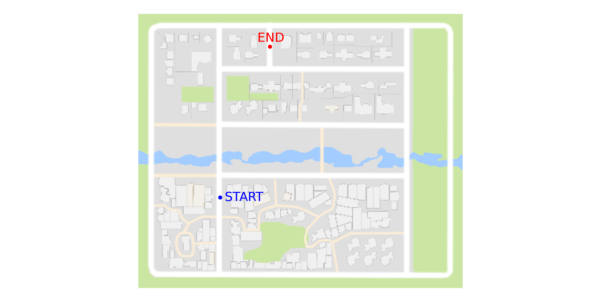

# 对你的代理进行基准测试
在本教程中我们展示：

- [如何定义一个具有前向策略的简单代理](https://carla.readthedocs.io/en/stable/benchmark_creating/#defining-the-agent) 。
- [如何定义一个基本的实验套件](https://carla.readthedocs.io/en/stable/benchmark_creating/#defining-the-experiment-suite) 。


驾驶基准测试与其他两个模块相关联。代理模块是另一个模块（实验套件）中执行的控制器。这两个模块都是抽象类，必须由用户重新定义。

以下代码摘录是如何应用驾驶基准的示例；

```python
# 我们实例化了一个转发代理，这是一个简单的策略，
# 只需将加速度设置为0.9，将转向设置为零
agent = ForwardAgent()

# 我们实例化了一个实验套件。
# 基本上是一组将在此基准上进行评估的实验。
experiment_suite = BasicExperimentSuite(city_name)

# 现在实际运行 driving_benchmark。
# 除了代理和实验套件之外，我们还应该发送城市名称（Town01，Town02）日志
run_driving_benchmark(agent, experiment_suite, city_name,
                      log_name, continue_experiment,
                      host, port)
```

这段摘录之后，有两个类需要定义。ForwardAgent() 和 BasicExperimentSuite()。之后，可以使用“run_driving_benchmark”函数运行基准测试。执行摘要、[性能指标](https://carla.readthedocs.io/en/stable/benchmark_metrics/) 存储在 json 文件中并打印到屏幕上。

## 定义代理
被测试的代理必须继承基类 `Agent`。我们先从派生一个简单的转发代理开始：

```python
from carla.agent.agent import Agent
from carla.client import VehicleControl

class ForwardAgent(Agent):
```

为了评估其性能，`ForwardAgent` 派生类必须 重新定义`run_step`函数，如下面摘录的那样：

```python
def run_step(self, measurements, sensor_data, directions, target):
    """
    在CARLA车辆中运行控制步骤的函数。
    """
    control = VehicleControl()
    control.throttle = 0.9
    return control
```

该函数接收以下参数：

- [测量值](https://carla.readthedocs.io/en/stable/measurements/) ：客户端从 CARLA 模拟器接收到的整个世界状态。这些测量值包含代理位置、方向、动态对象信息等。
- [传感器数据](https://carla.readthedocs.io/en/stable/cameras_and_sensors/) ：来自定义传感器的测量数据，例如激光雷达或 RGB 摄像机。
- 方向：来自高级规划器的信息。当前，规划器从下列集合发送高级命令：直行、右行、左行、无行。
- 目标位置：目标的位置和方向。

有了所有这些信息，`run_step` 函数预计会返回一个[车辆控制消息](https://carla.readthedocs.io/en/stable/measurements/) ，包含：转向值、油门值、刹车值等。

## 定义实验套件
要创建实验套件类，您需要执行以下步骤：

- 通过继承 ExperimentSuite 基类来创建您的自定义类。
- 定义要使用的测试和训练天气条件。
- 构建实验对象。

## 定义
定义的实验集必须派生 `ExperimentSuite` 类，如下面的代码摘录所示：
```python
from carla.agent_benchmark.experiment import Experiment
from carla.sensor import Camera
from carla.settings import CarlaSettings

from .experiment_suite import ExperimentSuite

class BasicExperimentSuite(ExperimentSuite):
```

## 定义测试和训练天气条件
用户必须选择要使用的天气。应该选择一组测试天气和一组训练天气。这被定义为类属性，如下例所示：
```python
@property
def train_weathers(self):
    return [1]
@property
def test_weathers(self):
    return [1]
```

## 构建实验
实验由一组姿势定义的任务组成。让我们从选择其中一个城市的姿势开始，以 Town01 为例。首先，我们需要查看所有可能的位置，为此，在终端中运行 CARLA 模拟器，运行 [view_start_positions.py](https://github.com/OpenHUTB/Self_Driving_Car_Trajectory_Tracking/blob/main/PythonClient/view_start_positions.py) ：
```shell
python view_start_positions.py
```


现在让我们选择 140 作为起始位置，134 作为终止位置。这两个位置可以通过运行以下命令来可视化：
```shell
python view_start_positions.py --pos 140,134 --no-labels
```



我们再选择两个姿势，一个用于直行，另一个用于简单转弯。此外，我们还为 Town02 选择三个姿势：


图：此基本实验套件示例中使用的姿势。姿势是目标导向情节的开始和结束位置的元组。开始位置显示为蓝色，结束位置显示为红色。左：直线姿势，其中目标与起始位置直线距离。中：一个转弯情节，其中目标与起点相距一个转弯。右：任意位置，目标距离起始位置较远，通常超过一个转弯。

我们将每个姿势定义为一项任务。此外，我们还为每个任务设置动态对象的数量，并重复任意位置任务，使其也使用动态对象进行定义。在下面的代码摘录中，我们展示了每个任务的最终定义位置和动态对象的数量：

```python
# Define the start/end position below as tasks
poses_task0 = [[7, 3]]
poses_task1 = [[138, 17]]
poses_task2 = [[140, 134]]
poses_task3 = [[140, 134]]
# Concatenate all the tasks
poses_tasks = [poses_task0, poses_task1 , poses_task1 , poses_task3]
# Add dynamic objects to tasks
vehicles_tasks = [0, 0, 0, 20]
pedestrians_tasks = [0, 0, 0, 50]
```

最后，通过使用定义的任务，我们可以构建实验向量，如下面的代码摘录所示：

```python
experiments_vector = []
    # The used weathers is the union between test and train weathers
    for weather in used_weathers:
        for iteration in range(len(poses_tasks)):
            poses = poses_tasks[iteration]
            vehicles = vehicles_tasks[iteration]
            pedestrians = pedestrians_tasks[iteration]

            conditions = CarlaSettings()
            conditions.set(
                SendNonPlayerAgentsInfo=True,
                NumberOfVehicles=vehicles,
                NumberOfPedestrians=pedestrians,
                WeatherId=weather

            )
            # Add all the cameras that were set for this experiments
            conditions.add_sensor(camera)
            experiment = Experiment()
            experiment.set(
                Conditions=conditions,
                Poses=poses,
                Task=iteration,
                Repetitions=1
            )
            experiments_vector.append(experiment)
```


完整代码可以在 [basic_experiment_suite.py](https://github.com/OpenHUTB/Self_Driving_Car_Trajectory_Tracking/blob/main/PythonClient/carla/driving_benchmark/experiment_suites/basic_experiment_suite.py) 找到。


## 预期结果
首先，您需要一个以固定时间步长运行的 CARLA 模拟器 ，这样您获得的结果将或多或少具有可重复性。为此，您应该按如下方式运行 CARLA 模拟器：
```shell
./CarlaUE4.sh /Game/Maps/<Town_name> -windowed -world-port=2000  -benchmark -fps=10
```
本教程中提供的示例可以针对 Town01 执行，如下所示：
```shell
./driving_benchmark_example.py -c Town01
```
您应该期望得到以下结果：[town01_basic_forward_results](https://carla.readthedocs.io/en/stable/benchmark_basic_results_town01)

对于 Town02：
```shell
./driving_benchmark_example.py -c Town02
```
您应该期望得到以下结果：[town01_basic_forward_results](https://carla.readthedocs.io/en/stable/benchmark_basic_results_town02) 

