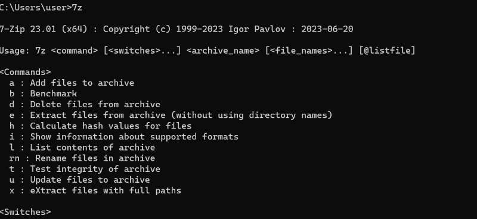

## 7Zip 安装
1. 打开 [7-Zip 的官方网站](https://www.7-zip.org/) 。
2. 根据平台版本（32 位或 64 位）选择合适的安装包，点击下载。
3. 下载完成后，双击安装程序启动安装。
4. 按照安装向导完成安装，建议保留默认设置（包括安装路径和快捷方式）。
5. 完成安装后，在终端（或 cmd 命令提示符）中输入 `7z`，出现下图版本号则安装成功。

