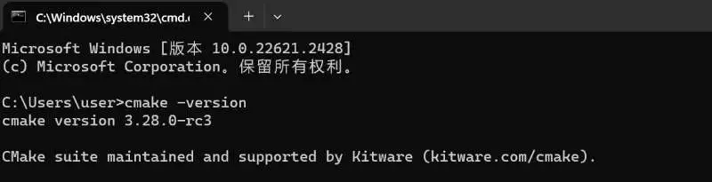

## Cmake 安装

1. 打开 CMake 的官方网站： https://cmake.org/download/。
2. 根据操作平台（Windows、MacOS 或 Linux）选择适合的 CMake 安装包，点击下载。可下滑至“Older Releases”，选择下载旧版本，推荐使用 3.28.2 版本。
3. 下载完成后，双击安装包启动安装程序。
4. 按照安装向导提示完成安装，注意修改默认设置将 CMake 添加到平台 PATH。

5. 安装完成后，在终端（或 cmd 命令提示符）中输入`cmake -version`，出现如下图所示版本号即表示安装成功。

