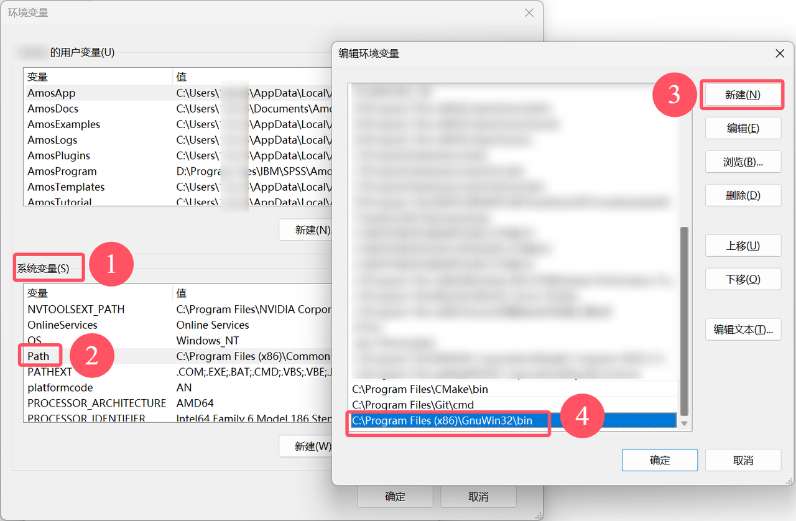

## Make 安装
1. 打开 [GNUWin32 Make 的官方网站](https://gnuwin32.sourceforge.net/packages/make.htm) 。
2. 下载版本为 **3.81** 的安装包。
3. 运行安装程序，选择安装目录，可以使用默认位置，或者根据需要自定义安装目录。
    - 记住上述选择的安装目录。
4. 安装完成后，将 Make 的路径添加到平台环境变量中：
    - 打开 **控制面板** > **平台** > **高级平台设置** > **环境变量**。
    - 在 **平台变量** 中找到 `Path`，双击编辑，将 **3** 中选择的 Make 的安装目录路径（例如：`C:\Program Files (x86)\GnuWin32\bin`）添加到变量中，点击 **确定** 保存。

5. 在终端（或 cmd 命令提示符）中输入`make --version`，出现如下图所示版本号即表示 Make 已安装成功。

!!! 注意
    必须使用 __Make 的 3.81 版本__，否则构建可能会失败。如果安装了多个版本的 Make，请检查构建 Carla 时在 PATH 中使用的版本是否为 3.81。您可以通过运行来检查默认的 Make 版本 `make --version`。（运行可能出现`由于找不到libintl3.dll`， 说明需要 Visual C++ Redistributable for Visual Studio 2015，但是vs2019安装不了低版本，所以安装了make-4.4.1 ）。
