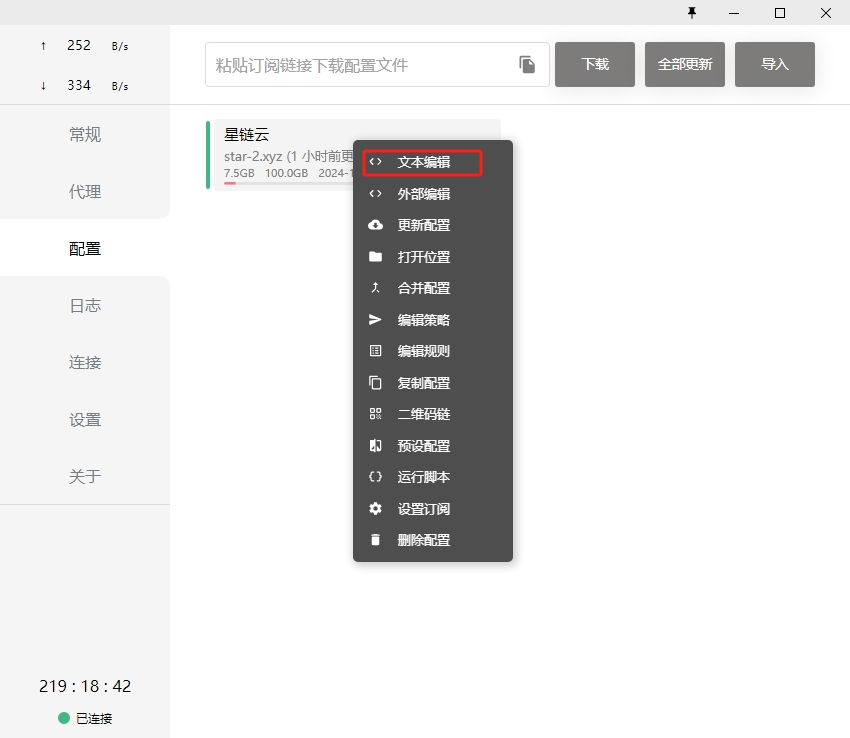
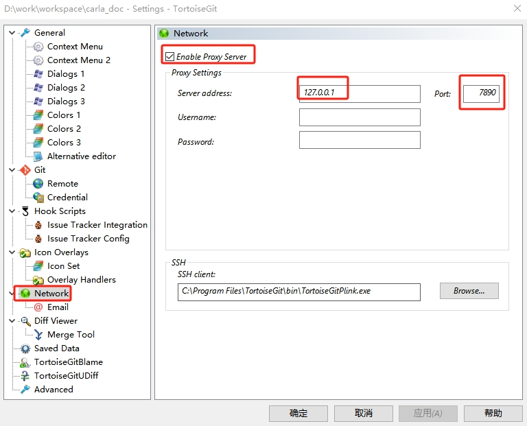

# 从源代码构建 Carla

用户可以从源代码构建 Carla 以用于开发目的。如果您想要向 Carla 添加额外的特性或功能，或者想要使用虚幻编辑器创建资源或操作地图，则建议您这样做。

构建说明适用于 Linux 和 Windows。您还可以在 Docker 容器中构建 Carla，以便部署在 AWS、Azure 或 Google 云服务中。访问 [__Carla GitHub__](https://github.com/OpenHUTB/carla) 并克隆存储库。

* [__Linux 构建__](build_linux.md)  
* [__Windows 构建__](build_windows.md)
* [__Docker__](build_docker.md)
* [__带虚幻引擎的 Docker__](build_docker_unreal.md)  
* [__更新 Carla__](build_update.md)  
* [__构建系统__](build_system.md)
* [__在 Linux 上使用虚幻引擎 5.3 构建__](build_linux_ue5.md)  
* [__在 Windows 使用虚幻引擎 5.3 构建__](build_windows_ue5.md)

* [__常见问题__](build_faq.md)  
 
### 带Carla插件的虚幻编辑器可执行版本

先安装vs2019社区版（带C++开发模块），然后根据 [CarlaUE4链接](https://pan.baidu.com/s/11YbDOsbzYOcnnE3ZTBF-eA?pwd=hutb) 或 [CarlaUE5链接](https://pan.baidu.com/s/1xPTssx-Wxg1hoOwq6PPFLQ?pwd=hutb) 下载所需版本的文件，解压后运行 `launch_carla_editor.bat` 就可以启动带Carla插件的虚幻编辑器。


### 科学上网 <span id="internet"></span>

参考其中的一个链接进行科学上网的订阅和环境配置：[链接1](https://www.starlinkcloud.cc/#/register?code=Ob4iMh8u) 、[链接2](https://portal.shadowsocks.au/) 、[链接3](https://mk.mikadonet.xyz/#/login) 、[链接4](https://711jsq.club/#/login) 。
比如使用Clash，首先在`配置`页面下根据订阅链接进行下载，然后在`常规`页面开启`系统代理`，最后测试是否可以正常科学上网。

#### Ubuntu 下的配置

Linux 科学上网配置[教程](https://opclash.com/article/302.html) 。下载[clash](https://github.com/zhongfly/Clash-premium-backup/releases/download/2023-09-05-gdcc8d87/clash-linux-amd64-n2023-09-05-gdcc8d87.gz) 。

首次启动`clash`，会新建文件`~/.config/clash/config.yaml`：
```shell
cd $HOME/.config/clash/
```

将Clash中的订阅地址写入`config.yaml`文件。

打开 Ubuntu 的“设置”管理，在“网络”内将“网络代理”的“自动”改为“手动”，根据以下内容进行填写 HTTP、HTTPS 和 Socks 地址
```shell
# HTTP 代理
127.0.0.1:7890

# HTTPS 代理
127.0.0.1:7890

# Socks 主机
127.0.0.1:7891
```

#### TortoiseGit 网络代理配置
如果使用TortoiseGit作为git的图形化界面软件，首页在文件资源管理器空白位置右键，选择`TortoiseGit->Setting`，然后在弹出的界面进行如下配置：



## 其他

* [虚幻引擎commandlet](ue/ue_commandlet.md)
* [虚幻引擎管线](ue/ue_pipeline.md)