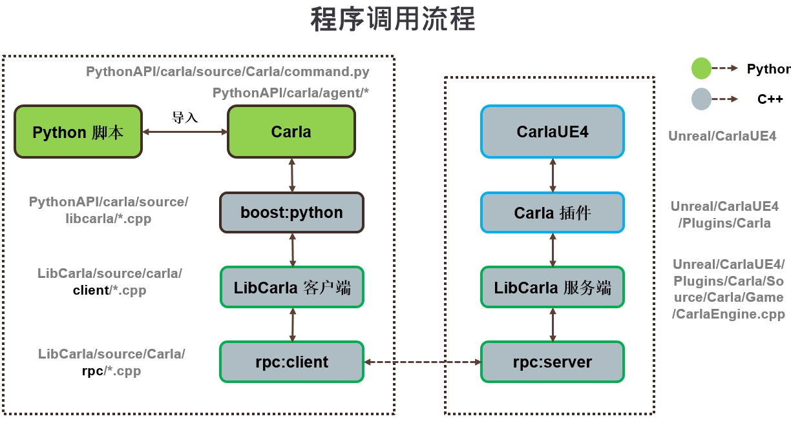

# 构建系统

* [__设置__](#setup)  
* [__LibCarla__](#libcarla)  
* [__CarlaUE4 和 Carla 插件__](#carlaue4_and_carla_plugin)  
* [__PythonAPI__](#pythonapi)
    - [0.9.12+ 版本](#versions-0912)
    - [0.9.12 之前的版本](#versions_prior_to_0912)
* [__常见问题与解决方案__](#faq)
* [__快速开始__](#quickstart) 
> _本文档是一个正在进行的工作，这里仅考虑 Linux 构建系统。_

设置中最具挑战性的部分是编译所有依赖项和模块，使其与 a) 服务器端的虚幻引擎 和 b) 客户端的 Python 兼容。

目标是能够从单独的 Python 进程调用虚幻引擎的函数。



在 Linux 中，我们使用 clang-8.0 和 C++14 标准编译 Carla 和所有依赖项。然而，我们根据代码的使用位置来链接不同的运行时 C++ 库，因为所有将与虚幻引擎链接的代码都需要使用 `libc++` 进行编译。

---
## 设置 <span id="setup"></span>

命令

```sh
make setup
```

获取并编译依赖项

  * llvm-8 (libc++ and libc++abi)
  * rpclib-2.2.1 (twice, with libstdc++ and libc++)
  * boost-1.72.0 (headers and boost_python for libstdc++)
  * googletest-1.8.1 (with libc++)

---
## 依赖检查

建议在构建前运行依赖检查脚本，确保环境无误

```sh
./Util/CheckDependencies.sh
```

该脚本会检测：

  * clang 和 clang++ 版本
  * Python 和 pip 版本
  * boost, llvm, rpclib 是否存在
  * Unreal Engine 路径是否配置正确 (UE4_ROOT 环境变量)
  
## LibCarla <span id="libcarla"></span>

使用 CMake 编译（最低版本需要 CMake 3.9）。

命令

```sh
make LibCarla
```

两种配置：


|           | 服务器                                 | 客户端                  |
|-----------|-------------------------------------|----------------------|
| **单元测试**  | 是                                   | 否                    |
| **要求**    | rpclib, gtest, boost                | rpclib, boost        |
| **标准运行时** | LLVM's `libc++`                     | 默认 `libstdc++`       |
| **输出**    | 头文件和`carla_server.lib` | `carla_server.lib` |
| **需要** | Carla plugin                        | PythonAPI            |


---
## CarlaUE4 和 Carla 插件 <span id="carlaue4_and_carla_plugin"></span>

两者均使用虚幻引擎构建工具在同一步骤进行编译。它们需要 `UE4_ROOT` 环境变量。

命令

```sh
make CarlaUE4Editor
```

要启动虚幻引擎的编辑器，请运行

```sh
make launch
```

编译 0.9.15 时候出现`carla/Unreal/CarlaUE4/Plugins/CarlaTools/Source/CarlaTools/Private/Online/CustomFileDownloader.cpp(11): fatal rror C1083: 无法打开包括文件: “OSM2ODR.h”: No such file or directory`

解决：将 Carla 0.9.14 版本中的 Build/osm2odr-visualstudio 文件夹复制到 0.9.15 版本中对应的 carla/Build/ 目录下。


---
## PythonAPI <span id="pythonapi"></span>

### 0.9.12+ 版本 <span id="versions-0912"></span>

使用 Python 的 `setuptools` ("setup.py")  编译。 目前需要在机器上安装以下软件：Python, libpython-dev, 和
libboost-python-dev, pip>=20.3, wheel, 和 auditwheel。

命令：

```sh
make PythonAPI
```

创建两个文件，每个文件包含客户端库并对应于系统上支持的 Python 版本。一个文件是 `.whl` 文件，另一个文件是 `.egg` 文件。这允许选择两种不同的、互斥的方式来使用客户端库。

>__A. .whl 文件__

>> `.whl` 使用以下命令安装：

>>      pip install <wheel_file>.whl

>>无需像以前版本或 `.egg` 文件中那样直接在脚本中导入库路径 (请参阅 [__0.9.12_之前的版本_](#versions-prior-to-0912)); `import carla` 就足够了。

>__B. .egg 文件__

>>请参阅 [__0.9.12 之前的版本__](#versions-prior-to-0912) 了解更多详细信息。


### 0.9.12 之前的版本 <span id="versions_prior_to_0912"></span>

使用 Python 的 `setuptools` ("setup.py")编译。 目前需要在机器上安装以下软件： Python, libpython-dev, 和
libboost-python-dev。

命令

```sh
make PythonAPI
```

它创造了两个 "egg" 包

  * `PythonAPI/dist/carla-X.X.X-py2.7-linux-x86_64.egg`
  * `PythonAPI/dist/carla-X.X.X-py3.7-linux-x86_64.egg`

通过将其添加到系统路径，可以将该包直接导入到 Python 脚本中。

```python
#!/usr/bin/env python

import sys

sys.path.append(
    'PythonAPI/dist/carla-X.X.X-py%d.%d-linux-x86_64.egg' % (sys.version_info.major,
                                                             sys.version_info.minor))

import carla

# ...
```

或者，可以使用 `easy_install` 安装

```sh
easy_install2 --user --no-deps PythonAPI/dist/carla-X.X.X-py2.7-linux-x86_64.egg
easy_install3 --user --no-deps PythonAPI/dist/carla-X.X.X-py3.7-linux-x86_64.egg
```


### 常见问题与解决方案  <span id="faq"></span> 

|问题描述           | 解决方法                                 | 
|-----------|-------------------------------------|
| **找不到clang-8**  | 手动安装：`sudo apt install clang-8`     | 
| **Unreal Engine**    | 确保设置正确的UE4_ROOT，并确认UE4已正确编译                |
| **`ImportError: No module named carla`** | 检查 PythonAPI 是否正确编译并安装，检查 Python 版本对应关系                    | 
| **C++ 编译找不到 libc++ 相关头文件**    | 确保 llvm-8 安装完整（特别是 libc++-dev，libc++abi-dev） | 
| **PythonAPI make 失败（auditwheel 错误）** | 升级 pip: `pip install --upgrade pip` 并重新安装 auditwheel                       | 


### 快速开始  <span id="quickstart"></span>

快速构建系统跑通Carla，简化步骤

1.**克隆仓库并初始化子模块**  
 ```bash
   git clone https://your.repo.url/carla.git
   cd carla
   git submodule update --init --recursive
```

2.**安装系统依赖**  
```bash
  sudo apt update
  sudo apt install -y clang-8 cmake python3-dev python3-pip \
                    libboost-python-dev llvm-8-dev \
                    libpython3-dev
  pip install --upgrade pip wheel auditwheel

```
3.**下载组件** 
```bash
  make setup            # 下载并编译 llvm, rpclib, boost, gtest
  make LibCarla         # 编译核心库
  export UE4_ROOT=/path/to/UnrealEngine
  make CarlaUE4Editor   # 编译 UE4 项目与插件
  make PythonAPI        # 构建并打包 Python 客户端

```
4.**验证结果** 
```bash
 python3 - <<EOF
 import carla
 client = carla.Client('localhost', 2000)
 world = client.get_world()
 print("World map:", world.get_map().name)
EOF


```
