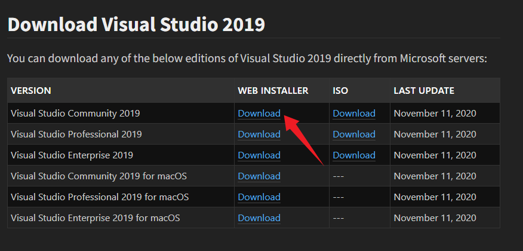
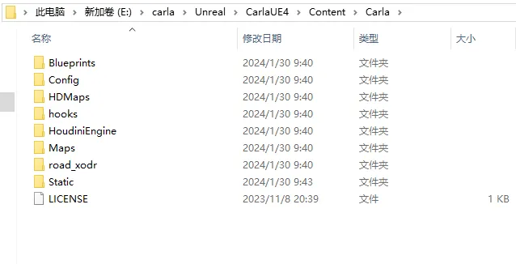
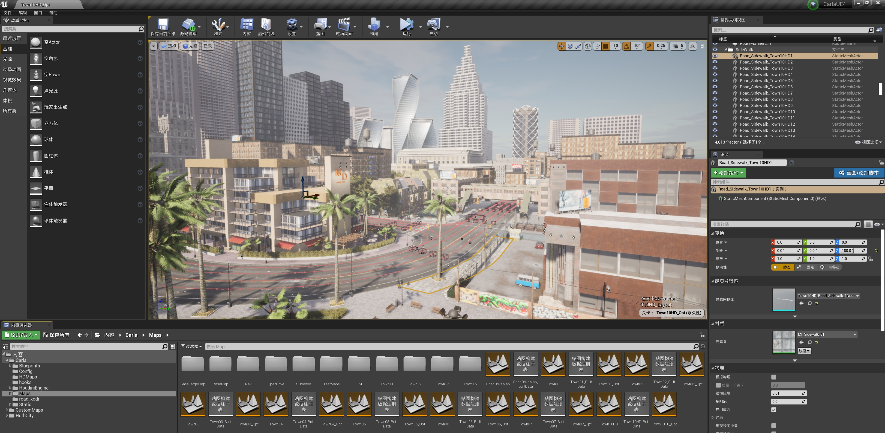

# Windows 下的构建

本指南详细介绍了如何在 Windows 上从源代码构建 Carla。有两个部分。第一部分详细介绍系统要求和所需软件的安装，第二部分详细介绍如何实际构建和运行 Carla。

构建过程很长（4小时或更长时间）并且涉及多种软件。强烈建议在开始之前完整阅读该指南。

如果您遇到错误或困难，请查看**[常见问题解答](build_faq.md)**页面，其中提供了最常见问题的解决方案。或者使用 [Carla 论坛](https://github.com/carla-simulator/carla/discussions) 发布您可能有的任何疑问。

- [__第一部分：先决条件__](#part-one-prerequisites)
    - [系统要求](#system-requirements)
    - [软件要求](#software-requirements)
        - [基础软件安装](#minor-installations)
        - [Python 依赖项](#python-dependencies)
        - [主要软件安装](#major-installations)
            - [Visual Studio 2019](#visual-studio-2019)
            - [虚幻引擎](#unreal-engine)
- [__第二部分：构建 Carla__](#part-two-build-carla)
    - [克隆 Carla 仓库](#clone-the-carla-repository)
    - [获取资产](#get-assets)
    - [构建 Carla](#build-carla)
    - [其他 make 命令](#other-make-commands)
    - [其他](#other)
- [__报错__](#error)

---
## 第一部分：先决条件 <span id="system-requirements"></span>

在本节中，您将找到开始构建 Carla 之前所需的系统要求、次要和主要软件安装以及 Python 依赖项的详细信息。

### 系统要求 <span id="system-requirements"></span>

* __64 位操作系统。__ 模拟器应在任何 64 位 Windows 系统中运行。 
* __165 GB 磁盘空间。__ Carla 本身将占用大约 32 GB，相关的主要软件安装（包括虚幻引擎）将占用大约 133 GB。
* __足够的 GPU。__ Carla 旨在实现真实模拟，因此服务器至少需要 6 GB GPU，但建议使用 8 GB。强烈建议使用专用 GPU 进行机器学习。
* __两个 TCP 端口和良好的互联网连接。__ 默认端口为 2000 和 2001 。 确保这些端口未被防火墙或任何其他应用程序阻止。 

!!! 笔记
    __如果您要从 Carla 0.9.12 升级到 0.9.13__: 您必须首先将虚幻引擎 4 的 Carla 分支升级到最新版本。有关升级虚幻引擎 4 的详细信息，请参阅 [__虚幻引擎__](#unreal-engine) 部分。

### 软件要求 <span id="software-requirements"></span>

#### 基础软件安装 <span id="minor-installations"></span>

* [__CMake__](./build/cmake_install.md) 从简单的配置文件生成标准构建文件。  
* [__Git__](./build/git_install.md) 是一个用于管理 Carla 存储库的版本控制系统。
* [__Make__](./build/make_install.md) 生成可执行文件。
* [__7Zip__](./build/7zip.md) 一款文件压缩软件。这是自动解压缩资产文件所必需的，并防止在构建期间由于错误或部分提取大文件而出现错误。
* [__Python3 x64__](https://www.python.org/downloads/) 是 Carla 中的主要脚本语言。安装 x32 版本可能会导致冲突，因此强烈建议卸载它。

!!! 重要
    确保将上述程序添加到 [环境路径](https://www.java.com/en/download/help/path.xml) 中。请记住，添加的路径应与程序的 `bin` 目录相对应。
#### Python 依赖项 <span id="python-dependencies"></span>

从 Carla 0.9.12 开始，用于可以选择使用 `pip3` 来安装 Carla 的 Python API。要检查您是否有合适的版本，请运行以下命令：

```sh
pip3 -V
```

如果您需要升级：

```sh
pip3 install --upgrade pip
```

您必须安装以下 Python 依赖项：

```sh
pip3 install --user setuptools
pip3 install --user wheel
```

#### 主要软件安装 <span id="major-installations"></span>
##### Visual Studio 2019 <span id="visual-studio-2019"></span>

从 [此处](https://developerinsider.co/download-visual-studio-2019-web-installer-iso-community-professional-enterprise) 获取 2019 版 Visual Studio 。选择 __社区__ 作为免费版本。使用 __Visual Studio 安装程序__ 安装三个附加元素： 


* __Windows 8.1 SDK.__ 在右侧的 _Installation details_ 部分中选择它，或者转到 _Indivdual Components_ 选项卡并在 _SDKs, libraries, and frameworks_ 标题下查看。
* __x64 Visual C++ Toolset.__ 在 _Workloads_ 部分中，选择 __Desktop development with C++__ 。这将启用用于构建的 x64 命令提示符。通过按 `Windows` 按钮并搜索 `x64` 来检查它是否已正确安装。小心 __不要打开`x86_x64`提示__。
* __.NET framework 4.6.2__. 在 _Workloads_ 部分中，选择 __.NET desktop development__ ，然后在右侧的安装详细信息面板中选择 `.NET Framework 4.6.2 development tools`。这是构建虚幻引擎所必需的。


!!! 重要
    其他 Visual Studio 版本可能会导致冲突。即使这些已被卸载，某些寄存器也可能仍然存在。要从计算机中彻底清除 Visual Studio，请转到`C:\Program Files (x86)\Microsoft Visual Studio\Installer\resources\app\layout`并运行 `.\InstallCleanup.exe -full`。

[命令行参数安装](https://learn.microsoft.com/zh-cn/visualstudio/install/use-command-line-parameters-to-install-visual-studio?view=vs-2019) 。

!!! 笔记
    还可以通过上述步骤使用 Visual Studio 2022，并将 Windows 8.1 SDK 替换为 Windows 11/10 SDK。要覆盖 CMake 中的默认 Visual Studio 2019 Generator，请在使用 makefile 命令时指定 GENERATOR="Visual Studio 17 2022"（请参见 [表](https://carla.readthedocs.io/en/latest/build_windows/#other-make-commands) ）。您可以指定任何与构建脚本中特定的构建命令配合使用的生成器，以进行完整列表运行`cmake -G`（到目前为止，Ninja 已经过测试可用于构建 LibCarla）。

##### 虚幻引擎 <span id="unreal-engine"></span>

从版本 0.9.12 开始，Carla 使用虚幻引擎 4.26 的修改版。该分支包含 Carla 特定的补丁。

请注意，要下载虚幻引擎的这个分支，__您需要有一个链接到虚幻引擎帐户的 GitHub 帐户__ 。如果您没有进行此设置，请先按照 [本指南](https://www.unrealengine.com/en-US/ue4-on-github) 进行操作，然后再继续操作。

要构建虚幻引擎的修改版本：

__1.__ 在Git终端中，导航到要保存虚幻引擎的位置并克隆 _carla_ 分支：

```sh
git clone --depth 1 -b carla https://github.com/CarlaUnreal/UnrealEngine.git .
```

或者打开 [UnrealEngine](https://github.com/CARLAUnreal/UnrealEngine) 进行项目文件下载：


!!! 笔记 
    虚幻引擎文件夹尽可能靠近`C:\\`，因为如果路径超过一定长度，`Setup.bat`则会在步骤 3 中返回错误。

__2.__ 运行配置脚本：

```sh
Setup.bat
GenerateProjectFiles.bat
```

__3.__ 编译修改后的引擎：

>1. 使用 Visual Studio 2019打开源文件夹内的文件`UE4.sln`。

>2. 在构建栏中，确保您已选择`Development Editor`、`Win64`和`UnrealBuildTool`选项。如果您需要任何帮助，请查看 [本指南](https://docs.unrealengine.com/en-US/ProductionPipelines/DevelopmentSetup/BuildingUnrealEngine/index.html) 。
        
>3. 在解决方案资源管理器中，右键单击`UE4`并选择`Build`。


以下是编译过程中可能遇到的错误：


在默认情况下，Unreal Engine 使用 CPU 的所有核心进行编译。这可能导致内存不足的问题，尤其是在高性能电脑但内存有限的情况下。为避免此问题，可以通过以下两种方式解决：减少 CPU 核心使用数量。增加虚拟内存。以下是通过修改 CPU 核心数来优化编译的详细解决方案：

（1）您需要修改 **BuildConfiguration.xml** 文件中的设置。文件路径如下：
`~/UnrealEngine\Engine\Saved\UnrealBuildTool\BuildConfiguration.xml`

（2）打开 **BuildConfiguration.xml** 文件，并添加或修改以下内容（使用7核进行编译）：
```xml
<?xml version="1.0" encoding="utf-8" ?>
<Configuration xmlns="https://www.unrealengine.com/BuildConfiguration">
  <BuildConfiguration>
    <ProcessorCountMultiplier>7</ProcessorCountMultiplier>
    <MaxParallelActions>7</MaxParallelActions>
    <bAllowParallelExecutor>true</bAllowParallelExecutor>
  </BuildConfiguration>
  <SNDBS>
    <ProcessorCountMultiplier>4</ProcessorCountMultiplier>
    <MaxProcessorCount>4</MaxProcessorCount>
  </SNDBS>
  <ParallelExecutor>
    <ProcessorCountMultiplier>7</ProcessorCountMultiplier>
    <MaxProcessorCount>7</MaxProcessorCount>
    <bStopCompilationAfterErrors>true</bStopCompilationAfterErrors>
  </ParallelExecutor>
</Configuration>
```

（3）清理配置文件。完成编译后，在执行 `make launch` 之前，务必删除 `BuildConfiguration.xml` 文件中新增的内容。否则，可能导致程序运行时出现卡顿或性能下降的问题。

__4.__ 设置虚幻引擎变量

需要设置一个环境变量，以便 Carla 可以找到虚幻引擎的安装文件夹。这允许用户选择要使用哪个特定版本的虚幻引擎。如果未指定环境变量，Carla 将在 Windows 注册表中搜索虚幻引擎并使用在那里找到的第一个版本。

设置环境变量：

1. 打开 Windows 控制面板，然后转至`Advanced System Settings`或在 Windows 搜索栏中搜索  `Advanced System Settings`。
2. 在面板上Advanced`Advanced`打开`Environment Variables...`。
3. 单击`New...`以创建变量。
4. 为变量`UE4_ROOT`命名并选择所需虚幻引擎安装的安装文件夹的路径。


__5.__ 编译解决方案后，您可以打开引擎，通过启动可执行文件 `Engine\Binaries\Win64\UE4Editor.exe` 来检查所有内容是否已正确安装。


!!! 笔记
    如果安装成功，虚幻引擎的版本选择器应该能够识别。您可以通过右键单击任何`.uproject`文件并选择 `Switch Unreal Engine version` 来检查这一点。您应该会看到一个弹出窗口，显示`Source Build at PATH`是您选择的安装路径。如果您在右键单击`.uproject`文件或`Generate Visual Studio project files`时看不到此选择器，则虚幻引擎安装出现问题，您可能需要重新正确安装。

!!! 重要
    到目前为止发生了很多事情。强烈建议在继续之前重新启动计算机。

---
## 第二部分：构建 Carla <span id="part-two-build-carla"></span>
 
### 克隆 Carla 存储库 <span id="clone-the-carla-repository"></span>

<div class="build-buttons">
<p>
<a href="https://github.com/carla-simulator/carla" target="_blank" class="btn btn-neutral" title="Go to the CARLA repository">
<span class="icon icon-github"></span> Carla 仓库</a>
</p>
</div>

上面的按钮将带您进入该项目的官方存储库。从那里下载并在本地提取它或使用以下命令克隆它：

```sh
git clone https://github.com/carla-simulator/carla
```

!!! 笔记
    该`master`分支包含 Carla 的当前版本以及最新的修复和功能。以前的 Carla 版本标有版本名称。永远记住使用命令`git branch`检查 git 中的当前分支。

### 获取资产 <span id="get-assets"></span>

通过在 Carla 根文件夹中运行以下命令，下载 __最新的__ 资产以使用当前版本的 Carla：

```sh
Update.bat
```

如果安装了 7zip，资源将被下载并解压到适当的位置。如果您没有安装此软件，则需要手动将文件内容解压到`Unreal\CarlaUE4\Content\Carla`。

要下载 __特定版本__ Carla 的资源：

1. 从 Carla 根目录，导航到`\Util\ContentVersions.txt`。本文档包含所有 Carla 版本的资产链接（将当中的 PUT_FILE_ID_HERE 替换为对应版本ID）。 如这里要下载 0.9.15 版本，即把 PUT_FILE_ID_HERE 替换为对应版本 ID：20231108 c5101a5
2. 提取 `Unreal\CarlaUE4\Content\Carla` 中的资产。如果该路径不存在，请创建它。

3. 使用类似于以下内容的命令提取文件：

```sh
tar -xvzf <assets_file_name>.tar.gz.tar -C C:\path\to\carla\Unreal\CarlaUE4\Content\Carla
```
下载好后解压到下图这个文件夹（注意是把所有解压的文件放到/Unreal/CARLAUE4/Content/CARLA 下，不是刚刚下载的压缩包解压到当前文件夹）像下面这样格式。否则后面执行 make launch 会失败。



### 构建 Carla <span id="build-carla"></span>

本节概述了构建 Carla 的命令。


- 命令应通过 VS 2019 的 __x64 Native Tools Command Prompt for VS 2019__ 执行。通过单击该Windows键并搜索 来打开它x64，或者运行`call "C:\Program Files (x86)\Microsoft Visual Studio\2019\Community\VC\Auxiliary\Build\vcvars64.bat"`。

- 所有命令都应在根 Carla 文件夹中运行。


Carla 的构建过程分为两部分：编译客户端和编译服务器。

__1.__ __编译 Python API 客户端__:

Python API 客户端授予对模拟的控制权。第一次构建 Carla 时需要编译 Python API 客户端，并且在执行任何更新后需要再次编译。客户端编译完成后，您将能够运行脚本与模拟进行交互。

以下命令编译 Python API 客户端：

```sh
make PythonAPI
```


!!! 注意
    常见错误问题分析：`make PythonAPI` 执行时运行的是 `CARLA\Util\BuildTools` 文件夹下的 `setup.bash` 脚本，`setup.bash` 脚本包含了许多依赖包的下载和安装。而 `setup.bash` 脚本中依赖包下载和安装脚本又分别位于 `CARLA\Util\InstallersWin` 中。因此当执行 `make PythonAPI` 时遇到依赖包下载和安装失败时，可以分别运行各个脚本进行单独安装，注意的是在 InstallersWin 中运行单独的脚本会直接安装在 InstallersWin 中，需要复制到 `CARLA\Build` 文件夹下。

生成的客户端安装文件位于`PythonAPI/carla/dist/`。Carla 客户端库将以两种截然不同、互斥的形式构建。这使用户可以自由选择他们喜欢的形式来运行 Carla 客户端代码。两种形式包括`.egg`文件和`.whl`文件。选择以下选项 __之一__ 来使用客户端库：

__A. `.egg` 文件__

>`.egg` 文件不需要安装。导入 Carla 时，Carla 的所有示例脚本都会自动 [查找此文件](build_system.md#versions-prior-to-0912) 。

>如果您之前安装了 Carla `.whl`，则 它将`.whl`优先于`.egg`文件。 

__B. `.whl` 文件__

>应使用以下`pip3`命令安装`.whl`文件：

```sh
pip3 install --force-reinstall <path/to/wheel>.whl
```

>`.whl`文件无法分发，因为它是专门为您的操作系统构建的。

!!! 警告
    使用不同方法安装 Carla 客户端库以及系统上安装不同版本的 Carla 可能会出现问题。建议在安装 `.whl` 时使用虚拟环境，并在安装新客户端库之前 [卸载](build_faq.md#how-do-i-uninstall-the-carla-client-library) 任何以前安装的客户端库。

__2.__ __编译服务端__:

以下命令编译并启动虚幻引擎。每次您想要启动服务器或使用虚幻引擎编辑器时运行此命令：

```sh
make launch
```


- **问题一**：
  - `make PythonAPI` 或者 `make launch` 的时候会遇到 `cmakelist.txt` 的错误，说没有这个文件，这可能是编译的时候由于网速问题，导致一些本该下载的东西直接跳过了，比如这个 txt，解决方法就是重新编译，最好是重新下载 CARLA 这个文件，然后重新编译，网速好的情况下应该就不会出现这个问题。
- **问题二**：fatal error C1083: 无法打开 包括文件: “CARLA/Version.h”: No such file or directory
  - 将 `CARLA\LibCARLA\source\CARLA` 中的 `version.h.in`，重命名，去掉`.in`，接着重新运行 `make launch`
  - 成功会在你的 CARLA\PythonAPI\CARLA 目录下生成一个 dist 文件夹，这个就是你的 CARLA 版本
  - 依次执行上面两个命令，过程需要很久。

该项目可能会要求构建其他实例，例如`UE4Editor-Carla.dll`第一次。同意才能打开项目。在首次启动期间，编辑器可能会显示有关着色器和网格距离场的警告。这些需要一些时间来加载，在此之前地图将无法正确显示。

!!! 笔记
    如果编译过程中出现中文乱码，为了便于寻找编译错误，可以使用`chcp 65001`命令将编码方式修改为UTF-8（选择“属性”。在“属性”>>“选项”一栏中，就可以看到当前代码页的编码方式）。



__3.__ __开始模拟__:

按**Play**开始服务器模拟。可以使用按键移动相机`WASD`，并通过在移动鼠标的同时单击场景来旋转相机。 

使用里面的示例脚本测试模拟器`PythonAPI\examples`。在模拟器运行的情况下，为每个脚本打开一个新终端并运行以下命令以在城镇中产生一些生命并创建天气循环：

```sh
# 终端 A 
cd PythonAPI\examples
pip3 install -r requirements.txt
python3 generate_traffic.py  

# 终端 B
cd PythonAPI\examples
python3 dynamic_weather.py 
```

!!! 重要
    如果模拟以非常低的 FPS 速率运行，请转至虚幻引擎编辑器`Edit -> Editor preferences -> Performance`并禁用。

### 其他 make 命令 <span id="other-make-commands"></span>

您可能会发现还有更多有用的`make`命令。在下表中找到它们：

| 命令                    | 描述                                                                                                                                |
|-----------------------|-----------------------------------------------------------------------------------------------------------------------------------|
| `make help`           | 打印所有可用的命令。                                                                                                                        |
| `make launch`         | 在编辑器窗口中启动 Carla 服务器。                                                                                                              |
| `make PythonAPI`      | 构建 Carla 客户端（需要重新安装Carla的Python包`pip install --force-reinstall carla/PythonAPI/carla/dist/carla-0.9.15-cp37-cp37m-win_amd64.whl`）。 |
| `make LibCarla`       | 准备将 Carla 库导入到任何地方。                                                                                                               |
| [`make package`](./build/make_package.md)      | 构建 Carla 并创建用于分发的打包版本                                                                |
| `make clean`          | 删除构建系统生成的所有二进制文件和临时文件。                                                                                                            |
| `make rebuild`        | `make clean` 和 `make launch` 两者都在一个命令中。                                                                                           |
| `make downloadplugin` | 构建虚幻引擎插件 StreetMap 。                                                                                                              |
| `make setup`          | 构下载并生成依赖库                                                                                                                         |
| `make LibCarla`       | 创建LibCarla的客户端和服务端（`make server`+`make client`）                                                                                   |
| `make osm2odr`        | 创建OSM转OpenDRIVE的库                                                                                                                 |
| `make import`         | 导入资产                                                                                                                              |


构建一个 egg 分发包（binary distribution），会在当前目录下的“dist”目录内创建一个“egg”文件，文件名格式就是”项目名-版本号-Python版本.egg”：
```shell
python setup.py bdist_egg
```

构建一个 wheel 分发包，egg 包是过时的，whl 包是新的标准：
```shell
python setup.py bdist_wheel
```

脚本`setup.py`中的`ext_modules`参数用于构建 C 和 C++ 扩展扩展包。其是 Extension 实例的列表，每一个 Extension 实例描述了一个独立的扩展模块，扩展模块可以设置扩展包名，头文件、源文件、链接库及其路径、宏定义和编辑参数等。

当你安装一个包后，这个包需要你不断修改，这时就采用这种安装方法：`python setup.py develop`。仅在`Python37/Lib/site-packages`目录下生成链接文件`carla.egg-link` 指向 `carla/PythonAPI/carla/source`和`../`。

而`python setup.py install`在`Python37\Lib\site-packages\carla-0.9.15-py3.7-win-amd64.egg`目录下生成运行包，包括`libcarla.cp37-win_amd64.pyd`。


### 其他 <span id="other"></span>

如果想重新编译LibCarla或者使用从其他地方拷贝过来的Build目录下的文件，需要删除`Build/libcarla-visualstudio`目录，然后重新运行编译命令（否则`PythonAPI\carla\dependencies`目录不会生成，生成.whl文件时遍历的不到依赖库，报错：`NotADirectoryError: [WinError 267] 目录名称无效。: 'dependencies/lib'`）：
```shell
make LibCarla
```
则服务端文件`carla_server.lib`生成至`carla\Unreal\CarlaUE4\Plugins\Carla\CarlaDependencies\`，客户端文件`carla_client.lib`生成至`carla\PythonAPI\carla\dependencies\`。


启动vs2019环境的命令：
```shell
call "C:\Program Files (x86)\Microsoft Visual Studio\2019\Community\VC\Auxiliary\Build\vcvars64.bat"
set PATH=C:\software\make-4.4.1\bin;%PATH%
echo %PATH%
```

启动Python虚拟环境报错：`CondaError: Run 'conda init' before 'conda activate'`
> 使用Anaconda Powershell Prompt打开，或者：
```shell
conda init cmd.exe  # 先执行这个，然后再激活虚拟环境
conda activate carla_cpp
```

报chrono模块的错：`D:/work/workspace/carla/Unreal/CarlaUE4/Plugins/Carla/Source/Carla/Sensor/V2X/PathLossModel.cpp(176): error C3861: “DrawDebugLine”: 找不到标识符`、
```text
D:/work/workspace/carla/Unreal/CarlaUE4/Plugins/Carla/Source/Carla/Sensor/V2X/PathLossModel.cpp(542): error C2027: 使用了未定义类型“URandomEngine”
D:/work/workspace/carla/Unreal/CarlaUE4/Plugins/Carla/Source/Carla/Sensor/V2XSensor.cpp(189): error C2653: “UCarlaStatics”: 不是类或命名空间名称
D:/work/workspace/carla/Unreal/CarlaUE4/Plugins/Carla/Source/Carla/Sensor/V2XSensor.cpp(189): error C3861: “GetCurrentEpisode”: 找不到标识符
```

> 解决：先使用VS编译后，然后再用命令行启动则可，原因不明。

Unreal/CarlaUE4/Plugins/Carla/Source/Carla/Sensor/V2XSensor.cpp添加头文件
```c++
#include "Carla/Game/CarlaStatics.h"
```

报错：
```text
D:/work/workspace/carla/Unreal/CarlaUE4/Plugins/Carla/Source/Carla/Sensor/V2X/PathLossModel.cpp(176): error C3861: “DrawDebugLine”: 找不到标识符
```
解决：Unreal/CarlaUE4/Plugins/Carla/Source/Carla/Sensor/V2X/PathLossModel.cpp添加头文件
```c++
#include "DrawDebugHelpers.h"
```

报错：
```text
错误	C2027	使用了未定义类型“URandomEngine”	CarlaUE4	D:\work\workspace\carla\Unreal\CarlaUE4\Plugins\Carla\Source\Carla\Sensor\V2X\PathLossModel.cpp	542	
```

解决：`Unreal\CarlaUE4\Plugins\Carla\Source\Carla\Sensor\V2X\PathLossModel.cpp`中添加头文件：
```text
#include "Carla/Util/RandomEngine.h"
```


执行`make PythonAPI`时候报错：`无法加载文件Microsoft.PowerShell_profile.ps1...因为在此系统上禁止运行脚本`：
```shell
# 使用管理员权限启动PowerShell，修改当前用户权限
Set-ExecutionPolicy -ExecutionPolicy RemoteSigned -Scope CurrentUser
# 弹出选择项后选择`A`
```

执行`make PythonAPI`时报错：
```text
-[BuildPythonAPI]: [Batch params]: --py3
信息: 用提供的模式无法找到文件。
-[BuildPythonAPI]: [ERROR] An error ocurred while executing the py.
-[BuildPythonAPI]: [ERROR] Possible causes:
-[BuildPythonAPI]: [ERROR]  - Make sure "py" is installed.
-[BuildPythonAPI]: [ERROR]  - py = python launcher. This utility is bundled with Python installation but not installed by default.
-[BuildPythonAPI]: [ERROR]  - Make sure it is available on your Windows "py".
make: *** [Util/BuildTools/Windows.mk:62: PythonAPI] Error 1
```
报错位置：`BuildPythonAPI.bat`：
```shell
where py 1>nul
if %errorlevel% neq 0 goto error_py
```
`%errorlevel%`表达上一条命令的返回值。`0`通常会被视为成功，`非0`为失败或者异常。
应该修改为：
```shell
```shell
where python 1>nul
if %errorlevel% neq 0 goto error_py
```

### 系统
Win11专业版 [激活方法](https://www.orcy.net.cn/1802.html) 。


## 报错 <span id="error"></span>
* 执行`make osm2odr`报错：
```text
CMake Error: The source directory "D:/work/workspace/carla/Build/osm2odr-visualstudio/x64" does not appear to contain CMakeLists.txt.
Specify --help for usage, or press the help button on the CMake GUI.
Error: could not load cache
```
从其他地方把`Build\osm2odr-visualstudio\CMakeCache.txt`拷贝过来，修改里面对应的目录为当前工程的目录。

---

* 执行`make PythonAPI`报错：
```text
libcarla.obj : error LNK2001: 无法解析的外部符号 "class std::basic_string<char,struct std::char_traits<char>,class std::allocator<char> > __cdecl osm2odr::ConvertOSMToOpenDRIVE(class std::basic_string<char,struct std::char_traits<char>,class std::allocator<char> >,struct osm2odr::OSM2ODRSettings)" (?ConvertOSMToOpenDRIVE@osm2odr@@YA?AV?$basic_string@DU?$char_traits@D@std@@V?$allocator@D@2@@std@@V23@UOSM2ODRSettings@1@@Z)
```
从其他编译成功的地方将`PythonAPI\carla\dependencies\lib\osm2odr.lib`拷贝过来。


* 同一台机器中之前安装过vs，再安装时报错：`无法安装  Microsoft.VisualStudio.Debugger.JustInTime.Msi`
和 `Could not open key: UNKNOWNComponents Werify that you have sufficient access to that key, or contact your support personnel.`

解决：[`注册表编辑器无法在当前所选的项及其部分子项上设置安全性`](https://blog.csdn.net/hsuehgw/article/details/131000227) 。

注意：使用在线安装文件`vs_community__2019.exe`进行安装，不要使用离线版的vs2019安装包，否则会出现错误：`系统错误：&H8007007E(-2147024770)。 找不到指定的模块`。


* 执行`make launch`时报错`D:/work/workspace/carla/Unreal/CarlaUE4/Plugins/Carla/Source/Carla/Server/CarlaServer.cpp(46): fatal error C1083: 无法打开包括文件: “carla/rpc/BoundingBox.h”: No such file or directory`

换了vs环境，需要重新删除`Build/libcarla-visualstudio`，删除之前的 cmake 结果目录并再次运行 make launch(cmake) 后问题就消失了。

* 或者`D:\work\workspace\carla\Build\osm2odr-source\src\utils/geom/GeoConvHelper.h(31,10): fatal error C1083: 无法打开包括文件: “proj_api.h”: No such file or directory`

目录`Build/proj-install`没有生成，尝试从其他电脑中拷贝过来。


* 执行`make PythonAPI`提示成功，但是没生成dist文件夹，前面报错：`C:\Program Files (x86)\Microsoft Visual Studio\2019\Community\VC\Tools\MSVC\14.29.30133\include\xtree(885) : fatal error C1128: 节数超过对象文件格式限制: 请使用 /bigobj 进行编译`

原因：文件`PythonAPI/carla/setup.cfg`中配置了调试选项。
解决：将`debug = 1`改为`debug = 0`。


* 执行`make PythonAPI` 报错：`libboost_filesystem-vc142-mt-gd-x64-1_80.lib(path_traits.obj) : error LNK2038: 检测到“_ITERATOR_DEBUG_LEVEL”的不匹配项: 值“2”不匹配值“0”(libcarla.obj 中)`

原因：链接的是libboost库的调式版本。
解决：将`PythonAPI\carla\dependencies\lib`目录下`libboost-*`开头的文件中，包含`*-gd-*`的文件（调试版本）移除，则可编译通过。

* 使用`make Python`编译 Carla 0.9.13 时报错：`osm2odr.lib(GeoConvHelper.obj) : error LNK2001: 无法解析的外部符号 proj_create`：

删除位于Build目录下的proj源代码和安装目录，然后运行下面命令（参数改为对应的Build目录）：
```shell
install_proj.bat --build-dir D:\work\DReyeVR\carla\Build
```
如果还报错sqlite的错误，需要把`sqlite3-install`和`sqlite3-src`删除后重新编译。


---

## 参考

[持续集成](./dev/cicd.md)

[构建系统](./build_tools.md)

[Windows平台下的依赖安装脚本](./build/installers_win.md)

[车载HUD设计与验证平台文档](https://github.com/ZhilingResearch/Libra) ：[文档](https://g06o7xylva3.feishu.cn/docx/M4dQdH8saoenDTx1w4Ac07i0nNe) 包括：当前驾驶车辆工况、导航路径引导、提示周围环境信息、接管提升和辅助、个性化娱乐功能。。

---

有关本指南的任何问题， 请阅读 **[常见问题解答](build_faq.md)** 页面或在 [Carla 论坛](https://github.com/carla-simulator/carla/discussions) 中发帖。

现在您已经构建了 Carla，接下来了解如何更新 Carla 构建或在模拟中迈出第一步，并学习一些核心概念。

<div class="build-buttons">

<p>
<a href="../build_update" target="_blank" class="btn btn-neutral" title="Learn how to update the build">
更新 Carla</a>
</p>

<p>
<a href="../core_concepts" target="_blank" class="btn btn-neutral" title="Learn about CARLA core concepts">
第一步</a>
</p>

</div>
