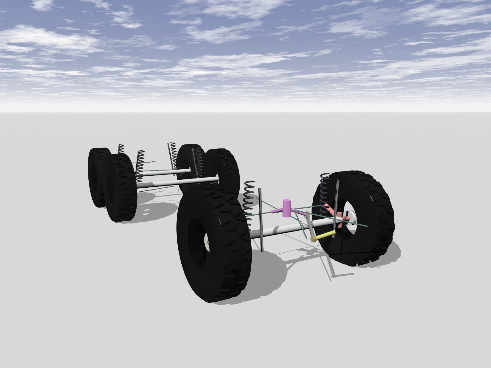

# 车辆模型

## 轮式车辆模型
### 悍马
HMMWV 代表高机动性多用途轮式车辆系列。Chrono 示例展示了 M966 部队运输车。与真实车辆一样，它在两个车轴上都采用双叉臂悬架，所有车轮都可以驱动。它有一个带变矩器的三档自动变速箱和一个逼真的发动机子系统。它采用转向臂转向。该模型可以使用 Chrono 提供的所有类型的轮胎。

### 联邦开发署
FED ALPHA 是一款由工程公司里卡多与美国军方合作开发的概念车。
Chrono::Vehicle FEDA 是一款 4WD 车型，配备双叉臂前后悬架、防倾杆和转向臂转向机构。目前仅实施 Pacejka 2002 和刚性轮胎车型。

### 轿车
轿车示例展示了一款普通的乘用车。它在前轴上采用双叉臂悬架，在后轴上采用多连杆悬架。转向系统为齿条齿轮式。

### 城市巴士
顾名思义，Citybus 是一款典型的巴士，在世界每个城市都能找到。与所有重型车辆一样，它使用板簧实心轴。Chrono 板簧轴基于功能方法。因此看不到板簧。前轮由旋转臂转向，这种组合也称为前束转向。该模型还展示了双轮的使用。

### 调频电视
中型战术车辆系列 (FMTV) 是奥什科什公司目前生产的一系列卡车。

Chrono 车辆模型库为这些车辆的两种变体提供了模型：

- LMTV（轻型中型战术车辆），一辆 2.5 吨重的 4x4 卡车
- MTV（中型战术车辆），一辆 5 吨、6x4 卡车

两种车型均采用板簧后轴和带趾杆转向的板簧前轴，并包括驾驶室和货物之间的扭转柔顺性模型。MTV 车型采用平衡梁后转向架。

### 男人
MAN（奥格斯堡纽伦堡机械制造厂）Kat 1 卡车系列专为战术越野使用而设计。所有系列成员均采用由连杆引导的螺旋弹簧实心轴系统。这种设计允许非常高的车轮行程。车辆框架为箱形，因此模型可以使用刚性底盘方法，因为在真实车辆中几乎没有车架扭转。所有转向轴都配有摇臂/旋转臂机构。所有车轮均由驱动。

它最初是为德国联邦国防军设计的，今天在世界上的许多军队中都可以找到它，例如在美国陆军中作为 M1001 原动机或 M1002 回收车。

5t（载重量）卡车是该家族中最小的成员。

7t 卡车是配置最多样化的卡车，可用于运载特殊设备或作为自卸车。在 Chrono 中，它只有一个载货床。

10t卡车是70年代末投入使用的最早的车型。它们大多用作运输卡车，一些还配备了装载起重机。

### 乌克兰阿斯
UAZ 代表乌里扬诺夫斯基汽车制造厂。UAZ 452 型客车/厢式货车/卡车自 1965 年以来在俄罗斯一直很受欢迎。它采用全轮驱动，配有两个板簧车轴。前轴配有前束转向机构。

UAZ 469 吉普车自 1965 年以来一直服役于苏联军队。它与 UAZ 452 共享许多部件（车轴、发动机）。转向系统也是前束/旋转臂式，但配置略有不同。

### 鳄鱼
Tha Gator 是一款配备自动驾驶功能的 John Deere 电动多用途车。Gator 车型前部采用单叉臂悬架，后部采用刚性轴。它采用齿条齿轮转向机构，仅在后轮上制动。电动机通过差速器连接到后轮。

### 克拉兹
该车型基于乌克兰 Kraz 64431，是一款半挂卡车。牵引车采用前叉板簧式悬架，通过旋转臂机构转向，后悬架为两个板簧式。牵引车为 6x4 配置，两个后轴驱动。拖车通过挂钩与牵引车相连，有三个轴，均为板簧式。

### 遥控车
这是一个小型遥控四轮驱动车的模型。

### 通用轮式车辆
通用轮式车辆模型是用于测试各种模板和设置的沙箱。它不代表任何特定车辆，并且为此模型提供的所有具体子系统不一定彼此一致。

