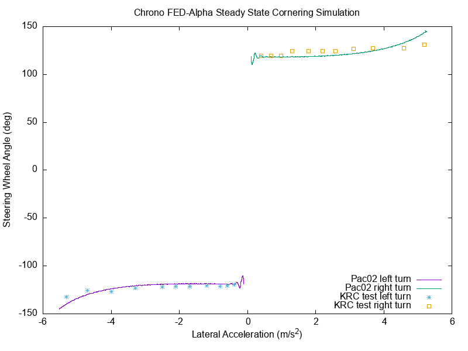

# 轮胎模型
Chrono::Vehicle 目前支持三种不同类别的轮胎模型：刚性、操控和有限元。

- [__刚性轮胎模型__](#rigid_tire)
- [__处理（半经验）轮胎模型__](#two_wheel)

刚性轮胎是提供的三种轮胎类别中最简单的一种。这些模型的假设是轮胎完全刚性，并且它通过与 Chrono 中其他刚体相同的底层摩擦和接触算法与地面和任何其他刚性物体相互作用。这些轮胎的接触几何形状可以像圆柱体一样简单，也可以像 3D 三角网格一样复杂。这些模型不仅可用于调试整体车辆模型，而且还可用于运行时很重要、地形比轮胎软得多且不需要高度详细的轮胎模型的情况。事实上，半经验轮胎模型不适合越野车模拟，即使用可变形地形（SCM、粒状或基于 FEA；请参阅可用地形模型的描述）。对于此类场景，刚性或基于 FEA 的轮胎模型是目前在 Chrono::Vehicle 中实现的仅有的两个可用选项。

参见 [ChRigidTire](https://api.projectchrono.org/classchrono_1_1vehicle_1_1_ch_rigid_tire.html) 和 [RigidTire](https://api.projectchrono.org/classchrono_1_1vehicle_1_1_rigid_tire.html) 。

以下是通过 Wavefront OBJ 文件提供网格几何形状的刚性轮胎的示例：

```json
{
  "Name":                       "HMMWV Rigid Mesh Tire",
  "Type":                       "Tire",
  "Template":                   "RigidTire",
 
  "Radius":                     0.4699,
  "Width":                      0.254,
  "Mass":                       37.6,
  "Inertia":                    [3.84, 6.69, 3.84],
 
  "Contact Material":
  {
      "Coefficient of Friction":    0.9,
      "Coefficient of Restitution": 0.1,
 
      "Properties": {
          "Young Modulus":          2e7,
          "Poisson Ratio":          0.3
      },
 
      "Coefficients": {
          "Normal Stiffness":       2e5,
          "Normal Damping":         40.0,
          "Tangential Stiffness":   2e5,
          "Tangential Damping":     20.0
      }
  },
 
  "Contact Mesh":
  {
    "Mesh Filename":            "hmmwv/hmmwv_tire_fine.obj",
    "Sweep Sphere Radius":      0.005
  },
 
  "Visualization":
  {
    "Mesh Filename Left":       "hmmwv/hmmwv_tire_fine.obj",
    "Mesh Filename Right":      "hmmwv/hmmwv_tire_fine.obj"
  }
}
```

## 处理（半经验）轮胎模型
提供的第二类轮胎模型是常用于车辆操控的半经验模型。`Chrono::Vehicle` 目前已实现 Pacejka（89 和 2002）、TMeasy 和 Fiala 轮胎模型。操控轮胎模型专为平坦路面而设计，通常使用单点接触或四点接触（TMeasy）。对于在起伏路面上进行行驶测试或越障，已实现了一种称为“包络”的特殊接触算法。它基于 Sui 和 Hershey 的论文，可用于 Chrono 中包含的所有操控轮胎模型。使用技术演示器进行的验证测试与测量的真实车辆测试数据相比，结果良好，而且数值工作量较少。如果需要更高的精度，用户应该考虑考虑基于 FEA 的轮胎模型进行非操控测试。

有些用户可能希望根据轮胎测试数据构建自己的操控轮胎参数集。务必熟悉每个轮胎模型中的不同滑移定义和不同坐标系！

### Pacejka 89（Pac89）轮胎模型

参见 [ChPac89Tire](https://api.projectchrono.org/classchrono_1_1vehicle_1_1_ch_pac89_tire.html) 和 [Pac89Tire](https://api.projectchrono.org/classchrono_1_1vehicle_1_1_pac89_tire.html) 。

### Pacejka 2002（Pac02）轮胎模型

该模型是 Pacejka 早期 Magic Formula 轮胎模型的扩展，增加了方程和系数。由于在稳态滑移条件下不会发生大量车辆动力学操作，因此包括接触面滑移状态方程，以便在瞬态条件下提供更准确的结果。由于缺乏参考数据集，充气压力依赖项和大外倾角项实际上并未实现。

此 Chrono 轮胎模型还可以使用与 Adams/Car 兼容的 TIR 文件来指定。

参见 [ChPac02Tire](https://api.projectchrono.org/classchrono_1_1vehicle_1_1_ch_pac02_tire.html) 和 [Pac02Tire](https://api.projectchrono.org/classchrono_1_1vehicle_1_1_pac02_tire.html) 。


### TMeasy轮胎模型（基础版）

TMeasy（轮胎模型简易版）由 Georg Rill 教授开发，可作为商业代码使用（有关更多信息，请参阅http://www.tmeasy.de/）。该模型的目的是允许轻松参数化。其复杂性大致与基于 Magic Formula 的模型相当。此外，基于卡车和乘用车的已知参数集，可以从少量输入数据中估计完整的参数集。TMeasy 考虑非线性效应并包括接触面滑移状态方程。与最新的商业 TMeasy 版本相比，Chrono 中使用的实现缺少一些功能。例如，没有皮带动力学，也无法计算动态停车扭矩。Chrono TMeasy 轮胎实现包含已在 [Road Vehicle Dynamics - Fundamentals and Modeling with MATLAB](https://www.routledge.com/Road-Vehicle-Dynamics-Fundamentals-and-Modeling-with-MATLAB/Rill-Castro/p/book/9780367199739) 一书中发表的算法，Georg Rill 和 Abel Arrieta Castro，CRC Press，2020 年。

参见 [ChTMeasyTire](https://api.projectchrono.org/classchrono_1_1vehicle_1_1_ch_t_measy_tire.html) 和 [TMeasyTire](https://api.projectchrono.org/classchrono_1_1vehicle_1_1_t_measy_tire.html) 。

下面提供了一个具有 TMeasy 轮胎规范的示例 JSON 文件：

```json
{
  "Name": "HMMWV TMeasy Tire",
  "Type": "Tire",
  "Template": "TMeasyTire",
 
  // ------------------------------------------------
  // Tire design (REQUIRED)
 
  "Design": {
    "Unloaded Radius [m]": 0.4699,
    "Mass [kg]": 37.6,
    "Inertia [kg.m2]": [ 3.84, 6.69, 3.84 ],
    "Width [m]": 0.3175,
    "Rim Radius [m]": 0.2095
  },
 
  "Coefficient of Friction": 0.8,
 
  "Rolling Resistance Coefficient": 0.015,
 
  // ------------------------------------------------
  // Vehicle type.
  // Required only if tire specified with "load index" or "bearing capacity".
  // Must be one of "Truck" or "Passenger"
 
  "Vehicle Type": "Truck",
 
  // ------------------------------------------------
  // Load index specification.
  // Takes priority over "bearing capacity" (used only if a full parameterization not provided)
 
  "Load Index": 108,
 
  // ------------------------------------------------
  // Bearing capacity specification.
  // Lowest priority (used only if no other specification provided)
 
  "Maximum Bearing Capacity [N]": 17167.5,
 
  // ------------------------------------------------
  // Visualization mesh (OPTIONAL)
 
    "Visualization": {
        "Mesh Filename Left": "hmmwv/hmmwv_tire_left.obj",
        "Mesh Filename Right": "hmmwv/hmmwv_tire_right.obj"
    }
 
}
```

### Fiala 轮胎型号
`Chrono::Vehicle` 中实现的 Fiala 轮胎模型主要基于 MSC ADAMS/轮胎帮助文档中介绍的瞬态 Fiala 轮胎模型，该模型使用轮胎滑移状态方程来改善模型在低速至零前进速度下的行为。Fiala 轮胎模型基于刷子模型假设，只需要少量系数。该轮胎模型假设轮胎相对于道路的外倾角为零，并且没有任何产生倾覆力矩的措施。但是，它在力和力矩计算中结合了轮胎的横向和纵向滑移状态，从而提供了更真实的组合滑移描述。Fiala 轮胎模型不应用于严肃的车辆操纵模拟，因为它没有考虑影响结果的重要影响。

参见 [ChFialaTire](https://api.projectchrono.org/classchrono_1_1vehicle_1_1_ch_fiala_tire.html) 和 [FialaTire](https://api.projectchrono.org/classchrono_1_1vehicle_1_1_fiala_tire.html) 。

下面提供了一个具有 TMeasy 轮胎规范的示例 JSON 文件：

```json
{
    "Name": "HMMWV Fiala Tire",
    "Type": "Tire",
    "Template": "FialaTire",
    "Mass": 37.6,
    "Inertia": [
        3.84,
        6.69,
        3.84
    ],
    "Coefficient of Friction": 0.8,
    "Fiala Parameters": {
        "Unloaded Radius": 0.47,
        "Width": 0.318,
        "Vertical Damping": 7500,
        "Vertical Stiffness": 326332, // linear stiffness (if no curve table present)
        "Vertical Curve Data":        // nonlinear stifness (has precedence over linear model)
        [
            [ 0.000,     0 ],
            [ 0.005,   585 ],
            [ 0.010,  1286 ],
            [ 0.015,  2352 ],
            [ 0.020,  3477 ],
            [ 0.025,  4798 ],
            [ 0.030,  6190 ],
            [ 0.035,  7540 ],
            [ 0.040,  9027 ],
            [ 0.045, 10570 ],
            [ 0.050, 12139 ],
            [ 0.055, 13654 ],
            [ 0.060, 15368 ],
            [ 0.065, 16904 ],
            [ 0.070, 18469 ],
            [ 0.075, 20089 ],
            [ 0.080, 21699 ]
        ],
        "Rolling Resistance": 0.015,
        "CSLIP": 193929.0,
        "CALPHA": 50000.0,
        "UMIN": 0.5568,
        "UMAX": 0.9835,
        "X Relaxation Length": 2.0,
        "Y Relaxation Length": 2.0
    },
    "Visualization": {
        "Mesh Filename Left": "hmmwv/hmmwv_tire_left.obj",
        "Mesh Filename Right": "hmmwv/hmmwv_tire_right.obj",
        "Width": 0.318
    }
}
```

上述 JSON 文件中嵌入的垂直负载曲线如下所示：


## 轮胎操作模型验证

下面我们展示了针对密歇根州基威纳研究中心 (KRC) 为 FED-alpha 车辆提供的实验数据对 3 个 Chrono::Vehicle 操控轮胎模型进行的验证研究。

在这个称为 (SSC) 的测试中 `Steady State Cornering`，车辆以所谓的“阿克曼速度”开始沿圆圈行驶。该值约为 3 m/s，因此滑移值非常小，车辆在运动学上跟随圆圈行驶。真正的测试继续逐步增加车速并保持恒定。这些连续的速度增加步骤重复进行，直到达到最大可能的横向加速度，或发动机功率耗尽。KRC 测试在左转和右转中进行，以突出车辆的任何不对称性（如果存在）。

SSC 测试的目的是推断车辆对于普通驾驶员来说是否安全。车辆应该转向不足，这意味着驾驶员必须提供越来越多的方向盘转动角度，同时增加横向加速度，以保持车辆在圆圈上并保持车辆稳定性。“转向过度”的车辆往往会转向圆圈原点并变得不稳定，因为后轮没有足够的横向滑移储备。普通驾驶员在公共交通中使用的标准车辆应避免这种转向过度行为，尽管专业拉力赛车手更喜欢转向过度的车辆。

对于 FED-alpha，SSC 测试被定义 为准稳态运行，其中速度连续但非常缓慢地变化，因此没有明显的动态效应。因此，模拟结果显示为连续线。数据的符号选择方式是右侧显示右转，左侧显示左转。实验 KRC 数据用点表示。下图显示了 Chrono Pac02、TMsimple 和 TMeasy 轮胎模型的 SSC 模拟结果叠加在 KRC 实验数据上。




## 基于 FEA 的轮胎模型
最后，提供的第三类轮胎模型是轮胎的完整有限元表示。虽然这些模型由于其详细的轮胎物理模型而有可能成为最准确的模型，但它们也是 Chrono::Vehicle 中当前可用的轮胎模型中计算成本最高的模型。与刚性或半经验轮胎模型不同，基于有限元的轮胎模型能够同时考虑轮胎和地面的灵活性，这是许多类型的越野机动性和车辆动力学研究的重要特征。这些有限元轮胎模型利用了 Chrono 中的非线性有限元功能。


### ANCF壳可变形轮胎
参见 [ChANCFTire](https://api.projectchrono.org/classchrono_1_1vehicle_1_1_ch_a_n_c_f_tire.html) 和 [ANCFTire](https://api.projectchrono.org/classchrono_1_1vehicle_1_1_a_n_c_f_tire.html) 。

以下 JSON 文件包含 ANCFTire 的规范：

```json
{
  "Name":            "HMMWV ANCF 4-Node Tire",
  "Type":            "Tire",
  "Template":        "ANCFTire",
 
  "Tire Radius":     0.4673,
  "Rim Radius":      0.2683,
  "Rim Width":       0.254,
 
  "8-Node Elements":  false,
 
  "Contact Material":
  {
      "Coefficient of Friction":    0.9,
      "Coefficient of Restitution": 0.1,
 
      "Properties":
      {
          "Young Modulus":              2e6,
          "Poisson Ratio":              0.3
      },
 
      "Coefficients":
      {
          "Normal Stiffness":           2.0e6,
          "Normal Damping":             1.3e1,
          "Tangential Stiffness":       1.0e6,
          "Tangential Damping":         0
      }
  },
 
  "Materials":
  [
      {
         "Type":    "Orthotropic",
         "Density": 0.1000000E+04,
         "E":       [0.7560000E+10 , 0.4740000E+08 , 0.4740000E+08],
         "nu":      [0.4500000E+00 , 0.4500000E+00 , 0.4500000E+00],
         "G":       [0.1634483E+08 , 0.1634483E+08 , 0.1634483E+08]
      },
      
      {
         "Type":    "Orthotropic",
         "Density": 0.2639000E+04,
         "E":       [0.1800000E+12 , 0.4740000E+08 , 0.4740000E+08],
         "nu":      [0.4500000E+00 , 0.4500000E+00 , 0.4500000E+00],
         "G":       [0.1634483E+08 , 0.1634483E+08 , 0.1634483E+08]
      },
 
      {
         "Type":    "Orthotropic",
         "Density": 0.1100000E+04,
         "E":       [0.4740000E+08 , 0.4740000E+08 , 0.4740000E+08],
         "nu":      [0.4500000E+00 , 0.4500000E+00 , 0.4500000E+00],
         "G":       [0.1634483E+08 , 0.1634483E+08 , 0.1634483E+08]
      }
  ],
 
  "Structural Damping Coefficient":  0.005,
 
  "Default Pressure":                200.0e3,
 
  "Bead Section":
  {
      "Layer Thickness":   [ 0.5e-03 , 0.5e-02 , 0.5e-03 ],
      "Ply Angle":         [ 90 , 0 , 90],
      "Material ID":       [ 0 , 2 , 0],
      "Number Elements":   2
  },
 
  "Sidewall Section":
  {
      "Layer Thickness":   [ 0.5e-03 , 0.1e-03 , 0.5e-03 ],
      "Ply Angle":         [ 90 , 0 , 90 ],
      "Material ID":       [ 0 , 2 , 0 ],
      "Number Elements":   4
  },
 
  "Tread Section":
  {
      "Layer Thickness":   [ 0.1e-02 , 0.3e-03 , 0.3e-03 , 0.5e-03 ],
      "Ply Angle":         [ 0 , -20 , 20 , 90 ],
      "Material ID":       [ 2 , 1 , 1 , 0 ],
      "Number Elements":   6
 },
 
  "Number Elements Circumference":  90,
 
  "Profile": 
  [
      [ 0.000000E+00 , 0.000000E+00 , -1.150000E-01 ],
      [ 1.428571E-02 , 1.166670E-02 , -1.164180E-01 ],
      [ 2.857143E-02 , 2.333330E-02 , -1.192300E-01 ],
      [ 4.285714E-02 , 3.500000E-02 , -1.230200E-01 ],
      [ 5.714286E-02 , 4.666670E-02 , -1.273710E-01 ],
      [ 7.142857E-02 , 5.833330E-02 , -1.318700E-01 ],
      [ 8.571429E-02 , 7.000000E-02 , -1.361330E-01 ],
      [ 1.000000E-01 , 8.166670E-02 , -1.399910E-01 ],
      [ 1.142857E-01 , 9.333330E-02 , -1.433510E-01 ],
      [ 1.285714E-01 , 1.050000E-01 , -1.461240E-01 ],
      [ 1.428571E-01 , 1.166670E-01 , -1.482160E-01 ],
      [ 1.571429E-01 , 1.283330E-01 , -1.495390E-01 ],
      [ 1.714286E-01 , 1.400000E-01 , -1.500000E-01 ],
      [ 1.857143E-01 , 1.475000E-01 , -1.486380E-01 ],
      [ 2.000000E-01 , 1.550000E-01 , -1.457860E-01 ],
      [ 2.142857E-01 , 1.625000E-01 , -1.419760E-01 ],
      [ 2.285714E-01 , 1.700000E-01 , -1.360000E-01 ],
      [ 2.428571E-01 , 1.768970E-01 , -1.288420E-01 ],
      [ 2.571429E-01 , 1.831090E-01 , -1.216840E-01 ],
      [ 2.714286E-01 , 1.883940E-01 , -1.145260E-01 ],
      [ 2.857143E-01 , 1.925100E-01 , -1.073680E-01 ],
      [ 3.000000E-01 , 1.953230E-01 , -1.002110E-01 ],
      [ 3.142857E-01 , 1.970380E-01 , -9.305260E-02 ],
      [ 3.285714E-01 , 1.979260E-01 , -8.589470E-02 ],
      [ 3.428571E-01 , 1.982580E-01 , -7.873680E-02 ],
      [ 3.571429E-01 , 1.983020E-01 , -7.157890E-02 ],
      [ 3.714286E-01 , 1.983090E-01 , -6.442110E-02 ],
      [ 3.857143E-01 , 1.983540E-01 , -5.726320E-02 ],
      [ 4.000000E-01 , 1.984290E-01 , -5.010530E-02 ],
      [ 4.142857E-01 , 1.985240E-01 , -4.294740E-02 ],
      [ 4.285714E-01 , 1.986300E-01 , -3.578950E-02 ],
      [ 4.428571E-01 , 1.987380E-01 , -2.863160E-02 ],
      [ 4.571429E-01 , 1.988390E-01 , -2.147370E-02 ],
      [ 4.714286E-01 , 1.989220E-01 , -1.431580E-02 ],
      [ 4.857143E-01 , 1.989790E-01 , -7.157890E-03 ],
      [ 5.000000E-01 , 1.990000E-01 ,  0.000000E+00 ],
      [ 5.142857E-01 , 1.989790E-01 ,  7.157890E-03 ],
      [ 5.285714E-01 , 1.989220E-01 ,  1.431580E-02 ],
      [ 5.428571E-01 , 1.988390E-01 ,  2.147370E-02 ],
      [ 5.571429E-01 , 1.987380E-01 ,  2.863160E-02 ],
      [ 5.714286E-01 , 1.986300E-01 ,  3.578950E-02 ],
      [ 5.857143E-01 , 1.985240E-01 ,  4.294740E-02 ],
      [ 6.000000E-01 , 1.984290E-01 ,  5.010530E-02 ],
      [ 6.142857E-01 , 1.983540E-01 ,  5.726320E-02 ],
      [ 6.285714E-01 , 1.983090E-01 ,  6.442110E-02 ],
      [ 6.428571E-01 , 1.983020E-01 ,  7.157890E-02 ],
      [ 6.571429E-01 , 1.982580E-01 ,  7.873680E-02 ],
      [ 6.714286E-01 , 1.979260E-01 ,  8.589470E-02 ],
      [ 6.857143E-01 , 1.970380E-01 ,  9.305260E-02 ],
      [ 7.000000E-01 , 1.953230E-01 ,  1.002110E-01 ],
      [ 7.142857E-01 , 1.925100E-01 ,  1.073680E-01 ],
      [ 7.285714E-01 , 1.883940E-01 ,  1.145260E-01 ],
      [ 7.428571E-01 , 1.831090E-01 ,  1.216840E-01 ],
      [ 7.571429E-01 , 1.768970E-01 ,  1.288420E-01 ],
      [ 7.714286E-01 , 1.700000E-01 ,  1.360000E-01 ],
      [ 7.857143E-01 , 1.625000E-01 ,  1.419760E-01 ],
      [ 8.000000E-01 , 1.550000E-01 ,  1.457860E-01 ],
      [ 8.142857E-01 , 1.475000E-01 ,  1.486380E-01 ],
      [ 8.285714E-01 , 1.400000E-01 ,  1.500000E-01 ],
      [ 8.428571E-01 , 1.283330E-01 ,  1.495390E-01 ],
      [ 8.571429E-01 , 1.166670E-01 ,  1.482160E-01 ],
      [ 8.714286E-01 , 1.050000E-01 ,  1.461240E-01 ],
      [ 8.857143E-01 , 9.333330E-02 ,  1.433510E-01 ],
      [ 9.000000E-01 , 8.166670E-02 ,  1.399910E-01 ],
      [ 9.142857E-01 , 7.000000E-02 ,  1.361330E-01 ],
      [ 9.285714E-01 , 5.833330E-02 ,  1.318700E-01 ],
      [ 9.428571E-01 , 4.666670E-02 ,  1.273710E-01 ],
      [ 9.571429E-01 , 3.500000E-02 ,  1.230200E-01 ],
      [ 9.714286E-01 , 2.333330E-02 ,  1.192300E-01 ],
      [ 9.857143E-01 , 1.166670E-02 ,  1.164180E-01 ],
      [ 1.000000E+00 , 0.000000E+00 ,  1.150000E-01 ]
  ]
}
```

### Reissner壳形变轮胎
参见 [ChReissnerTire](https://api.projectchrono.org/classchrono_1_1vehicle_1_1_ch_reissner_tire.html) 和 [ReissnerTire](https://api.projectchrono.org/classchrono_1_1vehicle_1_1_reissner_tire.html) 。

