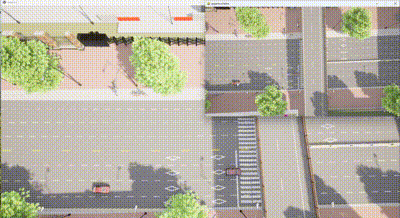

# 车辆按地图选点进行移动

​	此示例支持在 **pygame** 窗口对显示区域进行车辆生成并进行移动。

## **环境依赖**

- **python 3.7.9**
- **carla 0.9.15**
- **[湖工商场景](https://pan.baidu.com/s/15T1hGoWJ70tVmsTX7-zcSw?pwd=hutb )(WindowsNoEditor)**
- **[运行 locate_moving.py](https://github.com/OpenHUTB/carla_doc/tree/master/src/course/locate_moving.py)**


## CarlaSimulator 类

​	该类主要完成设置相机、处理相机图像、将Pygame坐标转换为CARLA世界坐标。


### 函数初始化__init__

​	初始化函数，设置模拟器窗口的宽度和高度，连接CARLA服务器，并获取世界和蓝图库。

```
def __init__(self, width, height):
    self.width = width
    self.height = height
    self.client = carla.Client('localhost', 2000)
    self.client.set_timeout(10.0)
    self.world = self.client.get_world()
    self.blueprint_library = self.world.get_blueprint_library()
    self.vehicle_bp = self.blueprint_library.filter('vehicle.*')[0]
    self.camera = None
    self.vehicles = []
    self.fov = VIEW_FOV

```

### setup_camera函数

​	设置相机，定义相机的蓝图、分辨率、视场角（FOV），并将相机生成在指定的位置和角度。

```
def setup_camera(self):
    camera_bp = self.blueprint_library.find('sensor.camera.rgb')
    camera_bp.set_attribute('image_size_x', str(self.width))
    camera_bp.set_attribute('image_size_y', str(self.height))
    camera_bp.set_attribute('fov', str(self.fov))
    camera_transform = carla.Transform(carla.Location(x=0, y=0, z=50), carla.Rotation(yaw=270, pitch=-90))
    self.camera = self.world.spawn_actor(camera_bp, camera_transform)

```

### process_image函数

​	处理相机捕获的图像，将其转换为Pygame可显示的格式。

```
def process_image(self, image):
    array = np.frombuffer(image.raw_data, dtype=np.uint8)
    array = array.reshape((self.height, self.width, 4))
    array = array[:, :, :3]  # Remove alpha channel
    array = array[:, :, ::-1]  # Convert BGR to RGB
    surface = pygame.surfarray.make_surface(array.swapaxes(0, 1))
    return surface

```

### convert_pygame_to_world函数

​	将Pygame窗口中的坐标转换为CARLA世界坐标。主要通过相机的视角和Pygame窗口的大小进行计算。

```
def convert_pygame_to_world(self, x, y):
    cam_transform = self.camera.get_transform()
    cam_loc = cam_transform.location

    aspect_ratio = self.width / self.height
    camera_fov_rad = np.radians(self.fov)
    camera_fov_y = 2 * np.arctan(np.tan(camera_fov_rad / 2) / aspect_ratio)

    world_units_per_pixel_x = (2 * cam_loc.z * np.tan(camera_fov_rad / 2)) / self.width
    world_units_per_pixel_y = (2 * cam_loc.z * np.tan(camera_fov_y / 2)) / self.height

    relative_x = (x - self.width / 2) * world_units_per_pixel_x
    relative_y = (y - self.height / 2) * world_units_per_pixel_y

    world_x = cam_loc.x + relative_x
    world_y = cam_loc.y - relative_y

    return world_x, world_y

```

### run函数

​	运行模拟器，初始化Pygame窗口，设置相机监听器，并处理Pygame事件，如点击事件生成车辆。

```
def run(self):
    pygame.init()
    display = pygame.display.set_mode((self.width, self.height), pygame.HWSURFACE | pygame.DOUBLEBUF)
    clock = pygame.time.Clock()

    self.setup_camera()
    self.camera.listen(lambda image: display.blit(self.process_image(image), (0, 0)))

    running = True
    while running:
        for event in pygame.event.get():
            if event.type == pygame.QUIT:
                running = False
            elif event.type == pygame.MOUSEBUTTONDOWN:
                x, y = event.pos
                world_x, world_y = self.convert_pygame_to_world(x, y)

                spawn_point = carla.Transform(carla.Location(x=world_x, y=-world_y, z=1), carla.Rotation())
                vehicle = self.world.spawn_actor(self.vehicle_bp, spawn_point)
                vehicle.set_autopilot()
                self.vehicles.append(vehicle)

        pygame.display.flip()
        clock.tick(30)

    for vehicle in self.vehicles:
        vehicle.destroy()
    self.camera.destroy()
    pygame.quit()

```





