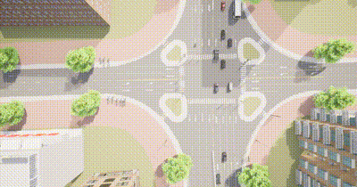

# 路口微观3D 动画演示运动场景spectator.py

#### **介绍**

此脚本连接到CARLA仿真环境，并定期切换湖工商附近的四个预设路口视角。通过不断改变观众（Spectator）的视角，用户可以观察到不同路口的交通状况。

- #### **环境要求**

  - Python 3.6 及以上版本

  - CARLA 仿真环境

  - 安装必要的Python库：


  - **[spectator.py](https://github.com/OpenHUTB/carla_doc/blob/master/course/spectator/spectator.py)**

  - [**湖工商场景**](https://pan.baidu.com/s/15T1hGoWJ70tVmsTX7-zcSw?pwd=hutb )**(WindowsNoEditor)**，并运行**[generate_traffic.py](https://github.com/OpenHUTB/carla_doc/blob/master/examples/generate_traffic.py)**


- 安装必要的python库

  ```
  pip install carla
  ```

#### **运行**

此示例支持设置  **spectator**  视角来观察交通路口运动情形。

以下示例通过预定义 **spectator** 对象视角的位置 **Location** 和旋转角度 **pitch** 来进行视角的更换

```
client = carla.Client('localhost', 2000)
client.set_timeout(10)
world = client.get_world()
spectator_transform = [
    carla.Transform(carla.Location(x=-323, y=-15.7, z=108), carla.Rotation(pitch=-90)),
    carla.Transform(carla.Location(x=-359.6, y=391.3, z=94), carla.Rotation(pitch=-90)),
    carla.Transform(carla.Location(x=426.2, y=-33.4, z=91.6), carla.Rotation(pitch=-90)),
    carla.Transform(carla.Location(x=375.1, y=-558.4, z=91.6), carla.Rotation(pitch=-90))
]
spectator = world.get_spectator()
spectator.set_transform(spectator_transform[0])
```

##### 定期切换视角

脚本将连接到CARLA服务器，并每5秒切换一次预设的观众视角。

```
start_time = time.time()
state = 0
while True:
    elapsed_time = time.time() - start_time
    if elapsed_time >= 5:
        spectator.set_transform(spectator_transform[state])
        state += 1
        if state > 3:
            state = 0
        start_time = time.time()
```

##### 运行结果：




