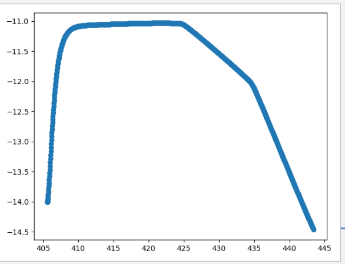

# 路线规划

​	此示例在 **Carla** 仿真环境中，使用 **RRT** 路径规划和 **PID** 控制进行自动驾驶车辆的路径跟踪， **RRT** 算法能够在复杂的环境中快速找到从起点到终点的路径，同时避开障碍物； **PID** 控制器根据路径的曲率和车辆的位置调整油门、刹车和方向盘，确保车辆能够按照规划的路径行驶。

#### **环境要求**

- Python 3.7

- CARLA 仿真环境

- 安装必要的Python库

- [main_v4_VO](../../src/course/Motion_Planning/main_v4_VO.py)

- [**湖工商场景**](https://pan.baidu.com/s/15T1hGoWJ70tVmsTX7-zcSw?pwd=hutb )**(WindowsNoEditor)**

  

  

## 导入CARLA模块

​	导入CARLA模块，并添加必要的路径。

```
try:
    sys.path.append(glob.glob('../carla/dist/carla-*%d.%d-%s.egg' % (
        sys.version_info.major,
        sys.version_info.minor,
        'win-amd64' if os.name == 'nt' else 'linux-x86_64'))[0])
    import carla
except IndexError:
    pass
```

## RednerObject  类

该类主要用于报错和传递 **pygame** 对象

```
class RenderObject(object):
    def __init__(self, width, height):
        init_image = np.random.randint(0, 255, (height, width, 3), dtype='uint8')
        self.surface = pygame.surfarray.make_surface(init_image.swapaxes(0, 1))
```

## pygame_callback 函数

​	相机传感器回调函数，将相机原始数据转换为2D RGB图像，并应用于 **Pygame** 。

```
def pygame_callback(data, obj):
    img = np.reshape(np.copy(data.raw_data), (data.height, data.width, 4))
    img = img[:, :, :3]
    img = img[:, :, ::-1]
    obj.surface = pygame.surfarray.make_surface(img.swapaxes(0, 1))

```

## CARLA_world 类

该类用于连接 **Carla** 服务器，设置同步模式，并管理车辆和相机。

```
class CARLA_world:
    def __init__(self):
        self.client = carla.Client('localhost', 2000)
        self.client.set_timeout(120.0)
        self.carla_world = self.client.get_world()
        self.map = self.carla_world.get_map()

        print("WORLD READY")

        settings = self.carla_world.get_settings()
        settings.synchronous_mode = True
        settings.fixed_delta_seconds = 0.02
        self.carla_world.apply_settings(settings)

        self.spectator = self.carla_world.get_spectator()

        self.vehicles = []
        self.ego_vehicle = None

```

## 主程序

### 初始化 **Carla** 世界对象

创建 **Carla** 世界实例，设置车辆的生成点，生成自车和障碍车辆。

```
CARLA_world = CARLA_world()
spawn_points = CARLA_world.map.get_spawn_points()
target_speed = 3.0
v_obs = 3.0
spawn_point1 = carla.Transform(carla.Location(x=428, y=-51.9, z=0.3), carla.Rotation(yaw=89))
blueprint_library = CARLA_world.carla_world.get_blueprint_library()
bp1 = blueprint_library.filter("model3")[0]
vehicle1 = CARLA_world.carla_world.spawn_actor(bp1, spawn_point1)
CARLA_world.vehicles.append(vehicle1)

spawn_point3 = carla.Transform(carla.Location(x=404, y=-14, z=0.3), carla.Rotation(yaw=0))
bp3 = blueprint_library.filter("model3")[0]
CARLA_world.ego_vehicle = CARLA_world.carla_world.spawn_actor(bp3, spawn_point3)
```

### 初始化相机

​	将相机附加到自车上，并设置回调函数处理相机图像。

```
camera_init_trans = carla.Transform(carla.Location(x=-10, y=-4, z=3), carla.Rotation(pitch=-20))
camera_bp = CARLA_world.carla_world.get_blueprint_library().find('sensor.camera.rgb')
camera_bp.set_attribute('image_size_x', str(VIEW_WIDTH))
camera_bp.set_attribute('image_size_y', str(VIEW_HEIGHT))
camera_bp.set_attribute('fov', str(VIEW_FOV))
camera = CARLA_world.carla_world.spawn_actor(camera_bp, camera_init_trans, attach_to=CARLA_world.ego_vehicle)
renderObject = RenderObject(VIEW_WIDTH, VIEW_HEIGHT)
camera.listen(lambda image: pygame_callback(image, renderObject))

```

### 初始化 Pygame

​	初始化Pygame窗口，并设置相应标题。

```
pygame.init()
gameDisplay = pygame.display.set_mode((VIEW_WIDTH, VIEW_HEIGHT), pygame.HWSURFACE | pygame.DOUBLEBUF)
pygame.display.set_caption("Camera View")

```

### 轨迹规划和控制

​	使用RRT算法进行轨迹规划，并通过PID控制器进行车辆路径跟踪。

```
goal = CARLA_world.map.get_waypoint(carla.Location(x=444, y=-14), project_to_road=True)
CARLA_world.carla_world.tick()
trans = CARLA_world.vehicles[0].get_transform()
v_obs = 7.8
obstacles = [trans, v_obs]
RRT_planner = RRT_VO(CARLA_world, goal, obstacles)
RRT_planner.RRT_star(n_pts=1000)
path = RRT_planner.path

path_x = []
path_y = []
trans = CARLA_world.ego_vehicle.get_transform()
thetai = trans.rotation.yaw * math.pi / 180
final_theta = thetai

for i in range(len(path) - 1):
    if i == len(path) - 2:
        thetaf = final_theta
    else:
        x1, y1 = path[i + 1].x, path[i + 1].y
        x2, y2 = path[i + 2].x, path[i + 2].y
        thetaf = math.atan2((y2 - y1), (x2 - x1))

    primitive = motion_primitive(thetai, thetaf, path[i].x,
                                 path[i + 1].x, path[i].y,
                                 path[i + 1].y)
    primitive.cubic_T_Matrix()
    primitive.trajectory()

    pos_x, pos_y = primitive.get_path(0.05)
    path_x += pos_x
    path_y += pos_y
    thetai = thetaf

```

### 循环移动

​	在 **Pygame** 窗口中显示相机视角，并根据RRT规划的路径控制车辆移动。

```
controller = VehiclePIDController(CARLA_world.ego_vehicle, [1.0, 0.05, 0.1], [0.5, 0.05, 0.1])
controller_obs = VehiclePIDController(CARLA_world.vehicles[0], [1.0, 0.05, 0.1], [0.5, 0.05, 0.1])
actual_x = []
actual_y = []
ti = time.time()
for i in range(len(path_x) - 1):
    trans = CARLA_world.ego_vehicle.get_transform()
    loc_x, loc_y = trans.location.x, trans.location.y
    w_x, w_y = path_x[i], path_y[i]
    w_x2, w_y2 = path_x[i + 1], path_y[i + 1]
    phi = math.atan2((w_y2 - w_y), (w_x2 - w_x))

    physics = CARLA_world.ego_vehicle.get_physics_control()
    wheels = physics.wheels
    wheel_F_x = (wheels[0].position.x + wheels[1].position.x) / 200
    wheel_F_y = (wheels[0].position.y + wheels[1].position.y) / 200

    while ((wheel_F_x - w_x2) ** 2 + (wheel_F_y - w_y2) ** 2) ** 0.5 >= 0.5:
        control = controller.run_step(RRT_planner.v * 3.6 / 3)
        control_obs = controller_obs.run_step(v_obs * 3.6 / 3)

        p1 = np.array([w_x, w_y])
        p2 = np.array([w_x2, w_y2])
        p3 = np.array([wheel_F_x, wheel_F_y])
        trans = CARLA_world.ego_vehicle.get_transform()
        yaw = trans.rotation.yaw
        phi = math.atan2((w_y2 - w_y), (w_x2 - w_x)) - yaw * (math.pi / 180)
        d = np.cross(p2 - p1, p3 - p1) / np.linalg.norm(p2 - p1)

        kp = 3
        ks = 0.2
        Vel = CARLA_world.ego_vehicle.get_velocity()
        v = math.sqrt(Vel.x ** 2 + Vel.y ** 2)
        control.steer = (-math.atan2(kp * d,
```

​	轨迹如下：图中蓝色的曲线表示车辆从起点到终点的行驶路径。从图中可以看出，车辆先是沿着x轴向右行驶，然后检测到障碍物后开始向左下方转弯，最后到达终点。

