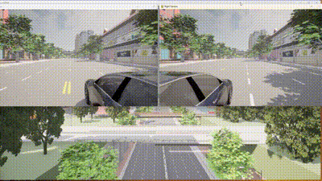

# 配置多视角摄像头camera.py

#### **介绍**

此脚本连接到CARLA仿真环境，在车辆的左右两侧设置相机，并使用Pygame显示相机捕获的实时图像。系统采用多进程架构，确保左右相机图像分别在不同窗口中实时显示。

- #### **环境要求**

  - Python 3.6 及以上版本
  - CARLA 仿真环境
  - 安装必要的Python库：
  - [**camera.py**](https://github.com/OpenHUTB/carla_doc/blob/master/course/camera.py)


  - [**湖工商场景**](https://pan.baidu.com/s/15T1hGoWJ70tVmsTX7-zcSw?pwd=hutb )**(WindowsNoEditor)**

```
pip install carla pygame numpy opencv-python
```

#### **脚本结构**

##### 初始化

```
def __init__(self):
    self.client = None
    self.world = None
    self.camera_left = None
    self.camera_right = None
    self.car = None
    self.image_left = None
    self.image_right = None
    self.capture = True
```

初始化CARLA客户端、世界、车辆和相机变量。

##### 相机设置

```python
def setup_camera(self):
    #设置相机的变换位置并附加到车辆上
    #左相机
    left_camera_transform = carla.Transform(carla.Location(x=-1.6, y=-1.5, z=1.7))
    self.camera_left = self.world.spawn_actor(self.camera_bp(), left_camera_transform, attach_to=self.car)
    #右相机
    right_camera_transform = carla.Transform(carla.Location(x=-1.6, y=1.5, z=1.7))
    self.camera_right = self.world.spawn_actor(self.camera_bp(), right_camera_transform, attach_to=self.car)
    #监听左右相机图像
    weak_self = weakref.ref(self)
    self.camera_left.listen(lambda image: weak_self().set_image(weak_self, 'left', image))
    self.camera_right.listen(lambda image: weak_self().set_image(weak_self, 'right', image))
```

在车辆的左右两侧生成相机，并设置监听器捕获相机图像。

##### 图像处理

```
@staticmethod
def set_image(weak_self, side, img):
    self = weak_self()
    if side == 'left':
        self.image_left = img
    elif side == 'right':
        self.image_right = img

def get_image_array(self, side):
    if side == 'left' and self.image_left is not None:
        array = np.frombuffer(self.image_left.raw_data, dtype=np.dtype("uint8"))
        array = array.reshape((VIEW_HEIGHT, VIEW_WIDTH, 4))
        array = array[:, :, :3]  # Drop alpha channel
        array = array[:, :, ::-1]  # Convert from BGRA to RGB
        return array
    elif side == 'right' and self.image_right is not None:
        array = np.frombuffer(self.image_right.raw_data, dtype=np.dtype("uint8"))
        array = array.reshape((VIEW_HEIGHT, VIEW_WIDTH, 4))
        array = array[:, :, :3]  # Drop alpha channel
        array = array[:, :, ::-1]  # Convert from BGRA to RGB
        return array
    else:
        return None
```

将相机捕获的图像从BGRA格式转换为RGB格式，并去除Alpha通道。

##### 渲染函数

```
def render(queue, side, x, y):
    pygame.init()
    os.environ['SDL_VIDEO_WINDOW_POS'] = f"{x},{y}"
    display = pygame.display.set_mode((VIEW_WIDTH, VIEW_HEIGHT), pygame.HWSURFACE | pygame.DOUBLEBUF)
    pygame.display.set_caption(f'{side.capitalize()} Camera')
    clock = pygame.time.Clock()

    try:
        while True:
            array = queue.get()
            if array is None:
                break
            surface = pygame.surfarray.make_surface(array.swapaxes(0, 1))
            display.blit(surface, (0, 0))
            pygame.display.flip()
            for event in pygame.event.get():
                if event.type == pygame.QUIT:
                    return
            clock.tick_busy_loop(30)
    finally:
        pygame.quit()
```

使用Pygame显示左右相机捕获的图像。

##### 多线程

为了在CARLA仿真环境中创建两个窗口来显示车辆的左右视角，我们需要利用Pygame和多进程来实现。

```
 left_process = multiprocessing.Process(target=render, args=(left_queue, 'left', 0, 100))
 right_process = multiprocessing.Process(target=render, args=(right_queue, 'right', VIEW_WIDTH + 10, 100))
```




