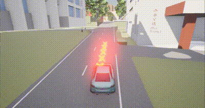
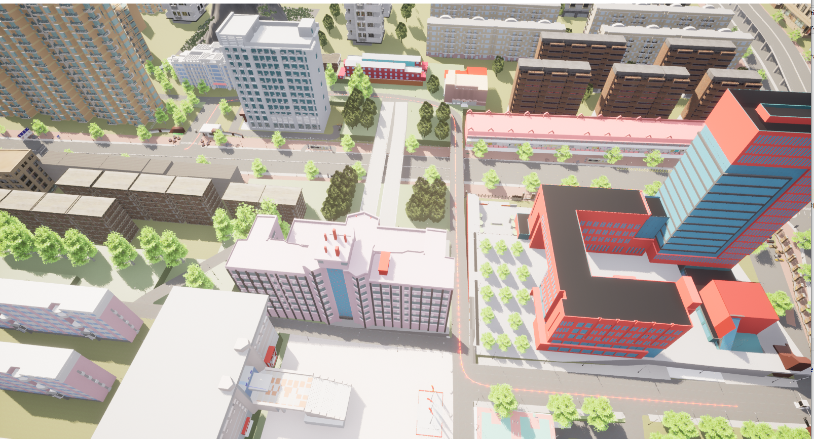

# 自定义车辆运行轨迹

​	车辆运动支持定义车辆运动起点和目标位置，为每辆车指定随机速度值，使其沿轨迹移动时不会发生碰撞或模拟碰撞，看到车辆沿指定轨迹行驶以到达其目标位置。

​	本示例设计了一个  [**automatic_control_revised.py**](https://github.com/OpenHUTB/carla_doc/blob/master/src/course/navigation/automatic_control_revised.py)  脚本进行实现



**注意**  需要将 [**agents**](https://github.com/OpenHUTB/carla_doc/tree/master/src/carla_agent) 文件夹位置添加到代码环境变量中，或者复制该文件夹使其与本示例脚本同级。

   [**湖工商场景**](https://pan.baidu.com/s/15T1hGoWJ70tVmsTX7-zcSw?pwd=hutb )**(WindowsNoEditor)**

自定义一些生成位置的起始点坐标<span id="definePoint"></span>

```python
diming = {
    "北门": {"x": 224.2, "y": 1.7, "z": 1},
    "西门": {"x": -146, "y": -161, "z": 10},
    "楚枫桥": {"x": 1.8, "y": -15.9, "z": 30},
    "楚枫轩": {"x": 14.8, "y": 64.7, "z": 20},
    "日新楼": {"x": 58, "y": -75, "z": 30},
    "体育馆": {"x": 160, "y": -265, "z": 40},
    "湘江楼": {"x": -2.4, "y": -100, "z": 30},
    "科技楼": {"x": -97.4, "y": -217, "z": 15},
}
```

定义命令行参数

```python
 argparser = argparse.ArgumentParser(
        description=__doc__)
    argparser.add_argument(
        '--s',
        default="北门",
        type=str)
    argparser.add_argument(
        '--e',
        default="西门",
        type=str)
    argparser.add_argument(
        '--speed',
        default=5,
        type=int)
```

获取模拟时间对象及设置

```python
client = carla.Client('localhost', 2000)
client.set_timeout(10)
world = client.get_world()
origin_settings = world.get_settings()

# 设置
settings = world.get_settings()
settings.synchronous_mode = True
settings.fixed_delta_seconds = 0.05
world.apply_settings(settings)
```

从车辆蓝图中自定义车辆对象，并获取车辆起点坐标

```python
# 生成车辆和代理
blueprint_library = world.get_blueprint_library()
# 将diming字典中的每个键值对转换为一个carla.Location对象
# 获取生成点
locations = {key: carla.Location(**value) for key, value in diming.items()}
spawn_location = carla.Location(locations[args.s])
spawn_rotation = carla.Rotation(yaw=180)
spawn_point = carla.Transform(spawn_location, spawn_rotation) #车辆起点
# 生成车辆
ego_vehicle_bp = blueprint_library.find('vehicle.audi.tt')
ego_vehicle_bp.set_attribute('color', '100, 250, 250')
vehicle = world.spawn_actor(ego_vehicle_bp, spawn_point)
#推进模拟环境时间
world.tick()
```

生成终点，给起点和终点生成一个车辆运行轨迹，定义初始速度<span id="initSpeed"></span>

```python
 # 设置初始速度
 vehicle.set_target_velocity(carla.Vector3D(args.speed, 0, 0))
# 创建代理
agent = BehaviorAgent(vehicle, behavior='normal')
destination = carla.Location(locations[args.e])
start = vehicle.get_location()
# 生成轨迹
agent.set_destination(destination)
```

给目标车辆设置多个相机传感器。这些相机可以提供不同的视角,用于观察和记录车辆在模拟环境中的行为。

```python
# 查找相机蓝图
camera_bp = world.get_blueprint_library().find('sensor.camera.rgb')

# 设置Camera的附加类型Camera跟随车辆
Atment_SpringArmGhost = carla.AttachmentType.SpringArmGhost
Atment_Rigid = carla.AttachmentType.Rigid
# 设置相对车辆的安装位置，配置上帝视图(Camera无法实现上帝视图，画面会抖动)
Vehicle_transform_list = [
    (carla.Location(z=35), carla.Rotation(pitch=-90))
]
# 设置camera的安装位置，配置后往前视图以及前后左右视图
Camera_transform_list = [
    (carla.Transform(carla.Location(x=-8, y=0, z=5),
                     carla.Rotation(pitch=15, yaw=0, roll=0)), Atment_SpringArmGhost)
]

# 拼接两个transform_list
spectator_transform_list = Vehicle_transform_list + Camera_transform_list

# 上帝视图坐标系以及所有camera对象填入spectator_obj_list；
for spectator_transform_index in spectator_transform_list:

    # spectator_transform_list第0个元素为上帝视图坐标系
    if spectator_transform_list.index(spectator_transform_index) == 0:
        spectator_obj_list.append(spectator_transform_index)

    # spectator_transform_list其余元素为Camera安装参数，下面生成Camera对象
    else:
        camera = world.spawn_actor(camera_bp, spectator_transform_index[0],
                                   attach_to=vehicle, attachment_type=spectator_transform_index[1])
        spectator_obj_list.append(camera)
```

更新代理、切换视角、处理代理局部规划器中的路径点。

```python
# 设置Vehicle_transform_list[0]为初始视图(上帝视图)；
spectator_obj = Vehicle_transform_list[0]
c = 1

while True:
    agent._update_information()

    world.tick()

    if len(agent._local_planner._waypoints_queue) < 1:
        time.sleep(2)
        print('======== Success=============')
        break

    # top view
    spectator = world.get_spectator()
    transform = vehicle.get_transform()
    if c:
        # 上一个spectator的索引号；
        last_spectator_obj_index = spectator_obj_list.index(spectator_obj)
        # 计算下一个spectator的索引，如果列表索引超限则重新拿第0个spectator；
        spectator_obj_index = last_spectator_obj_index + 1 if len(
            spectator_obj_list) - last_spectator_obj_index - 1 > 0 else 0
        spectator_obj = spectator_obj_list[spectator_obj_index]
        time.sleep(0.2)

        # 更新视图
    if spectator_obj_list.index(spectator_obj) == 0:
        # 设置上帝视图
        Vehicle_transform = carla.Transform(vehicle.get_transform().location + spectator_obj_list[0][0],
                                            spectator_obj_list[0][1])
        world.get_spectator().set_transform(Vehicle_transform)
    else:
        # 设置其他Camera视图
        world.get_spectator().set_transform(spectator_obj.get_transform())
    c = 0

    # speed_limit = vehicle.get_speed_limit()
    # agent.get_local_planner().set_speed(50)
    control = agent.run_step(debug=True)
    vehicle.apply_control(control)
```

###### 轨迹生成<span id="generateTrajectory"></span>

