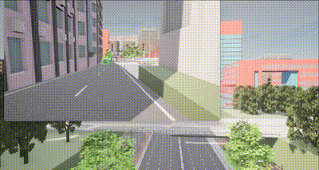

# 基于Carla仿真环境的目标检测

​	[**object_dection.py**](../../src/course/object_detection/object_detection.py)  脚本主要是在 **Carla** 中使用 **YOLOv3** 检测车辆。[相关链接](../algorithms/perception.md)  

​     [**湖工商场景**](https://pan.baidu.com/s/15T1hGoWJ70tVmsTX7-zcSw?pwd=hutb )**(WindowsNoEditor)**，并运行**[generate_traffic.py](../../src/examples/generate_traffic.py)**



​	导入必要的库及变量

```
import random
import weakref
import cv2
import pygame
import numpy as np
from imutils.video import FPS
import carla
VIEW_WIDTH = 1920 // 2
VIEW_HEIGHT = 1080 // 2
VIEW_FOV = 90
```

​	加载模型和配置文件

```
model = cv2.dnn.readNet("weights/yolov3.weights", "cfg/yolov3.cfg")
classes = [line.strip() for line in open("cfg/coco.names", "r").readlines()]
layers_names = model.getLayerNames()
output_layers = [layers_names[i[0] - 1] for i in model.getUnconnectedOutLayers()]
colors = np.random.uniform(0, 255, size=(len(classes), 3))
```

​	定义绘制标签的函数

```
def draw_labels(boxes, confs, colors, class_ids, classes, img):
    indexes = cv2.dnn.NMSBoxes(boxes, confs, 0.5, 0.4)
    font = cv2.FONT_HERSHEY_PLAIN
    for i in range(len(boxes)):
        if i in indexes:
            x, y, w, h = boxes[i]
            label = str(classes[class_ids[i]])
            color = colors[i]
            cv2.rectangle(img, (x, y), (x + w, y + h), color, 2)
            cv2.putText(img, label, (x, y - 5), font, 1, color, 1)
    return img
```

​	定义获取框维度的函数

```
def get_box_dimensions(outputs, height, width):
    boxes = []
    confs = []
    class_ids = []
    for output in outputs:
        for detect in output:
            scores = detect[5:]
            class_id = np.argmax(scores)
            conf = scores[class_id]
            if conf > 0.5:
                center_x = int(detect[0] * width)
                center_y = int(detect[1] * height)
                w = int(detect[2] * width)
                h = int(detect[3] * height)
                x = int(center_x - w / 2)
                y = int(center_y - h / 2)
                boxes.append([x, y, w, h])
                confs.append(float(conf))
                class_ids.append(class_id)
    return boxes, confs, class_ids
```

​	定义 **Carla** 客户端类

```
class CarlaClient():
    def __init__(self): #初始化实例变量
        self.client = None
        self.world = None
        self.camera = None
        self.car = None
        self.image = None
        self.capture = True
        self.display = None
    
    def set_synchronous_mode(self, synchronous_mode): #设置Carla世界的同步模式
        settings = self.world.get_settings()
        settings.synchronous_mode = synchronous_mode
        self.world.apply_settings(settings)
    
    def setup_car(self):  #从蓝图库中选中一个汽车对象
        blueprint_library = self.world.get_blueprint_library()
        car_bp = blueprint_library.filter('vehicle.*')[0]
        spawn_point = random.choice(self.world.get_map().get_spawn_points())
        self.car = self.world.spawn_actor(car_bp, spawn_point)
    
    def setup_camera(self): #获取摄像头对象，并将其附加到汽车上
        camera_bp = self.world.get_blueprint_library().find('sensor.camera.rgb')
        camera_transform = carla.Transform(carla.Location(x=1.5, z=2.4))
        camera_bp.set_attribute('image_size_x', f'{VIEW_WIDTH}')
        camera_bp.set_attribute('image_size_y', f'{VIEW_HEIGHT}')
        camera_bp.set_attribute('fov', f'{VIEW_FOV}')
        self.camera = self.world.spawn_actor(camera_bp, camera_transform, attach_to=self.car)
        weak_self = weakref.ref(self)
        self.camera.listen(lambda image: weak_self().set_image(weak_self, image))
    
    @staticmethod
    def set_image(weak_self, img): #捕获图像
        self = weak_self()
        if self.capture:
            self.image = img
            self.capture = False
    
    def render(self, display): #渲染捕获的图像，并在图像上绘制物体检测标签
        if self.image is not None:
            array = np.frombuffer(self.image.raw_data, dtype=np.dtype("uint8"))
            array = np.reshape(array, (self.image.height, self.image.width, 4))
            array = array[:, :, :3]
            
            # draw labels
            img = cv2.resize(array, None, fx=1, fy=1)
            height, width, channels = img.shape
            blob = cv2.dnn.blobFromImage(img, scalefactor=0.00392, size=(320, 320), mean=(0, 0, 0), swapRB=True, crop=False)
            model.setInput(blob)
            outputs = model.forward(output_layers)
            boxes, confs, class_ids = get_box_dimensions(outputs, height, width)
            array = draw_labels(boxes, confs, colors, class_ids, classes, img)
            
            array = array[:, :, ::-1]
            surface = pygame.surfarray.make_surface(array.swapaxes(0, 1))
            display.blit(surface, (0, 0))

```

​	**main**  函数中主要是在Carla模拟器中运行自动驾驶，并通过摄像头捕获图像后采用YOLOv3模型进行车辆物体的检测，最后使用Pygame显示处理后的图像。

```
if __name__ == '__main__':
    cc = CarlaClient()
    try:
        pygame.init()
        clock = pygame.time.Clock()
        cc.client = carla.Client('127.0.0.1', 2000)
        cc.client.set_timeout(5.0)
        cc.world = cc.client.get_world()
        
        cc.setup_car()
        cc.setup_camera()
        cc.display = pygame.display.set_mode((VIEW_WIDTH, VIEW_HEIGHT), pygame.HWSURFACE | pygame.DOUBLEBUF)
        pygame_clock = pygame.time.Clock()
        
        cc.car.set_autopilot(True)
        
        while True:
            fps = FPS().start()
            cc.world.tick()
            cc.capture = True
            pygame_clock.tick_busy_loop(30)
            cc.render(cc.display)
            pygame.display.flip()
            pygame.event.pump()
            cv2.waitKey(1)
            fps.stop()
            print("[INFO] elapsed time: {:.2f}".format(fps.elapsed()))
    
    except Exception as e:
        print(e)
    
    finally:
        cc.set_synchronous_mode(False)
        cc.camera.destroy()
        cc.car.destroy()
        pygame.quit()
        cv2.destroyAllWindows()

```

