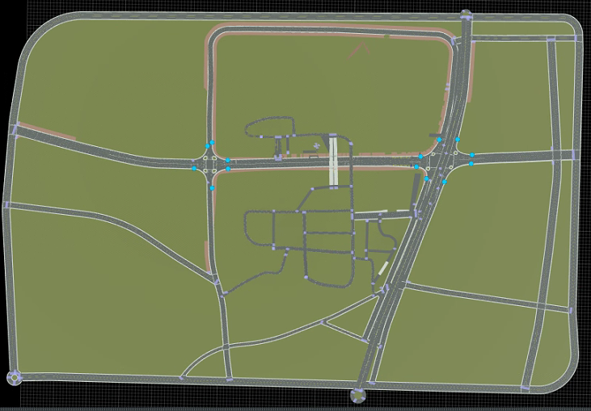
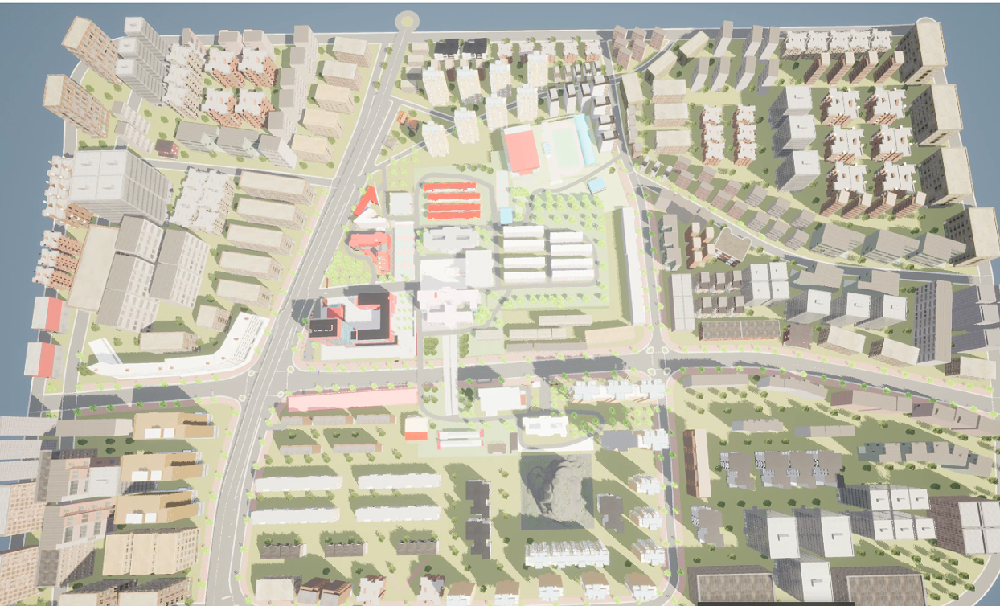
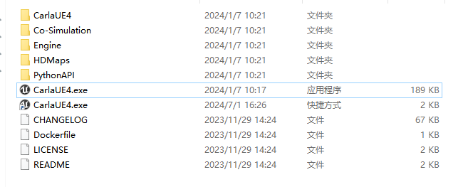
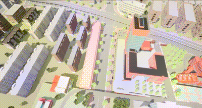

# 区域宏观

此示例支持联合虚拟引擎模拟模拟实验，得到 **3D** 宏观区域场景演示。

## 环境依赖

- [**roadrunner**](https://pan.baidu.com/s/15T1hGoWJ70tVmsTX7-zcSw?pwd=hutb )

- **carla编辑器**  [**配置教程**](https://zhuanlan.zhihu.com/p/552983835)

## 场景设计

针对大区域的场景设计，支持从 **[openstreet](https://www.openstreetmap.org/)** 官网导出路网文件作为模版，然后导入到  **roadrunner**  中进行道路修改。

## 导入到虚幻引擎

本示例使用的为 **carla** 插件作为渲染引擎，进行建筑、树、山等的设计。

       

## 导出可执行程序进行模拟模拟实验

运行下述exe程序作为服务端，采用python脚本与其通信。

## 宏观地图

将地图调整到全局俯视位置。

