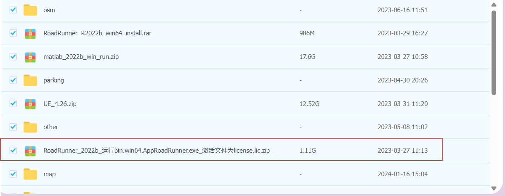
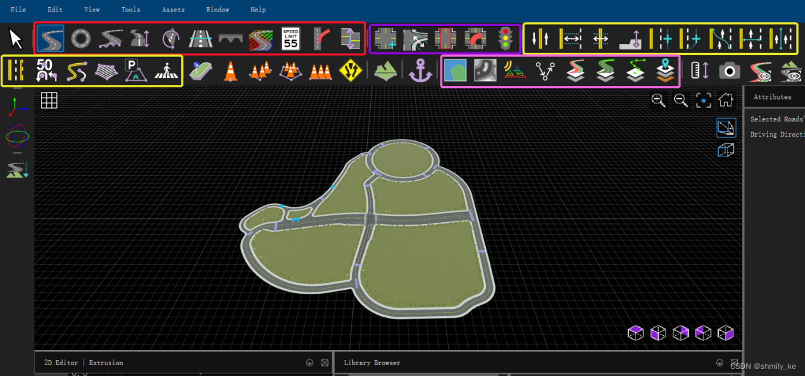
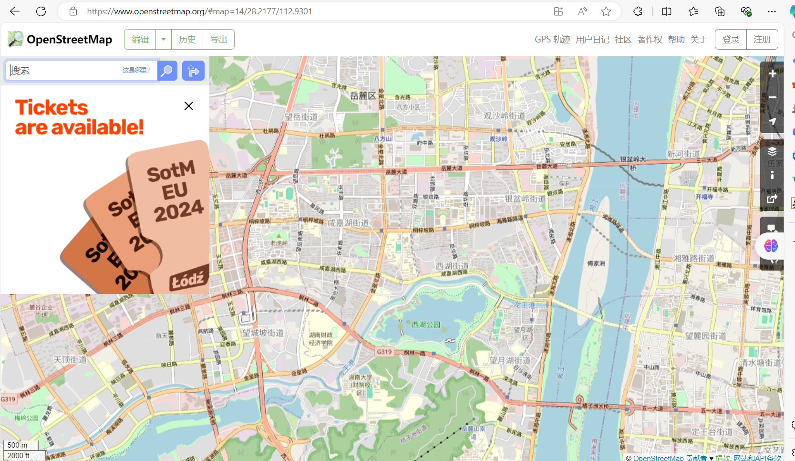
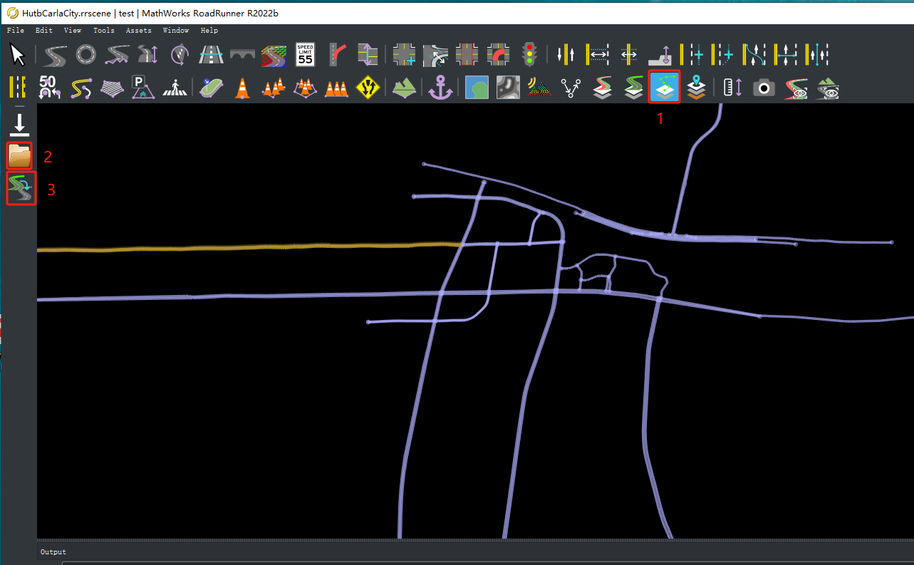

# RoadRunner进行道路场景建模

​	RoadRunner 是一款交互式编辑器，可以设计用于模拟和测试自动驾驶系统的 3D 场景，以及创建要导入 Carla 的大地图。

------

## RoadRunner简介

​	RoadRunner是一个交互式编辑器，可以让您设计3D场景来仿真和测试自动驾驶系统。它可以用来创建道路布局和伴随的opdrive和几何信息。

​	RoadRunner是MATLAB校园许可的一部分，因此许多大学可以提供无限制的学术访问。检查一下你的大学是否有访问权限。如果有任何关于可访问性的问题或麻烦，请联系[automated-driving@mathworks.com](mailto:automated-driving@mathworks.com)。

​	参加 Carla 排行榜的每个人都可以获得RoadRunner的许可证。

​    **[RoadRunner R2022b 安装包](https://pan.baidu.com/s/1n2fJvWff4pbtMe97GOqtvQ?pwd=hutb)**，如下图所示，解压后直接运行里面的exe程序。

------

## RoadRunner基本使用

RoadRunner界面分为Scene Editing和Scenario Editing，下图所示为roadrunner软件的Scene Editing(静态路网编辑)基本功能界面：

红色是建立道路和调整道路(分段，翻转，坡度等）

黄色右上是车道属性调整(宽度，车道分离/增加等)

黄色左下是车道标志编辑

紫色是交通信号和交叉路段的设置 

粉色是各种场景导入和建立工具

**RoadRunner基本使用教程链接**：**[快速入门]([手把手教你使用 RoadRunner 为自动驾驶模拟设计 3D 场景_哔哩哔哩_bilibili](https://www.bilibili.com/video/BV1qA4y1Q7Ea/?spm_id_from=333.337.search-card.all.click&vd_source=42cc81b5d990c3141581c22674232f60))**   [**MathWorks**完整教程](https://ww2.mathworks.cn/support/search.html/videos/design-3d-scenes-for-automated-driving-simulation-with-roadrunner-1606237745749.html?fq%5B%5D=asset_type_name:video&fq%5B%5D=category:driving/index&page=1)

------

### 使用公开道路地图生成道路网络

​	**[OpenStreetMap](https://www.openstreetmap.org/)**是一个开放、可编辑的地图项目，由全球志愿者贡献数据，其数据包括道路、建筑物、地理特征、交通设施等地理信息。使用者可以搜索相应的道路信息，选择导出**osm**路网文件。

**还可以进行对该网站的编辑修改**：**[OpenStreetMap地图编辑](../../adv_edit_openstreetmap/)**

#### 将osm路网文件导入RoadRunner

在**Scene Editing**的工具栏中选择 **SD Map Viewer Tool** 工具，点击**Open OpenStreetMap File** 选择**osm**路网文件位置，最后点击**Build Road**完成路网的生成。

------

## 在RoadRunner进行车辆模拟仿真

​	**Scenario Editing**为动态路网编辑，可以添加/删除车辆，进行车辆速度设置、轨迹的可视化规划等， 并支持编辑器内播放，用于可视化场景并连接到其他场景 用于协同仿真的模拟器。右上角的下拉栏可进行动/静编辑切换。

------

# 基于Carla与RoadRunner的联合仿真

参考链接：**[联合仿真](https://zhuanlan.zhihu.com/p/552983835)**

[RoadRunner导出大地图教程](../..//tuto_M_generate_map/)