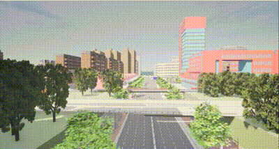

# 智能信号控制

该脚本用于在[CARLA仿真环境](https://pan.baidu.com/s/15T1hGoWJ70tVmsTX7-zcSw?pwd=hutb )中智能控制红绿灯信号。可以根据传入的参数设置特定红绿灯的颜色和持续时间。红绿灯的颜色设置包括绿灯、黄灯和红灯，分别对应颜色ID [1, 2, 3]。颜色持续时间以秒为单位。

#### 参数说明

[脚本](../../src/course/signal_control.py)接收以下参数：

1. `--host` (`-H`): CARLA服务器的IP地址，默认为`127.0.0.1`。
2. `--port` (`-p`): CARLA服务器的TCP端口，默认为`2000`。
3. `--traffic_id` (`-I`): 目标红绿灯的OpenDrive ID，默认为`-5`。
4. `--color_id` (`-C`): 红绿灯颜色ID，对应绿灯、黄灯和红灯，分别为1、2和3，默认为`1`。
5. `--color_time` (`-T`): 红绿灯颜色的持续时间，单位为秒，默认为`20`。

#### 参数格式

红绿灯颜色设置参数的格式为【红绿灯OpenDrive ID，颜色ID，设置时长】。

红绿灯颜色ID说明：

- 绿灯：`1`
- 黄灯：`2`
- 红灯：`3`

#### 示例

```
python signal_control.py --traffic_id -5 --color_id 1 --color_time 30
```

以上命令设置OpenDrive ID为`-5`的红绿灯为绿灯，持续时间为`30`秒。

#### 脚本工作流程

1. 连接到CARLA服务器并获取世界对象。
2. 设置世界为同步模式，以确保红绿灯设置的应用。
3. 获取所有红绿灯的对象。
4. 根据传入的参数，设置指定红绿灯的颜色和持续时间。
5. 通过`world.tick()`应用红绿灯的设置。
6. 恢复世界设置为异步模式。

#### 注意事项

- 在执行脚本前，请确保CARLA服务器已启动。
- 脚本中的默认参数适用于一般情况，可根据需要进行调整。
- 若需要添加更多的红绿灯配置，可在`lights_setting`列表中添加相应的项。

#### 运行结果



