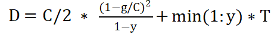

# 路口评价指标分析计算(HutbCarlaCity)

为支持  [**湖工商场景**](https://pan.baidu.com/s/15T1hGoWJ70tVmsTX7-zcSw?pwd=hutb) **(WindowsNoEditor)** 高保正的十字路口三维建模，设计  **[traffic_indicators.py](https://github.com/OpenHUTB/carla_doc/blob/master/course/traffic_indicators.py)**  脚本对路口交通流量、路口车均延误、路口饱和、排队长度四种路口真实性评价指标分析。


**首先需要对场景中添加车辆，运行 [generate_traffic.py](https://github.com/OpenHUTB/carla_doc/blob/master/examples/generate_traffic.py) 脚本，生成足够的车辆。**


## 定义命令行参数并获取仿真世界对象

```python
argparser = argparse.ArgumentParser(
    description=__doc__)
argparser.add_argument(
    '--host',
    metavar='H',
    default='127.0.0.1', #默认ip
    help='IP of the host server (default: 127.0.0.1)')
argparser.add_argument(
    '-p', '--port',
    metavar='P', #端口号
    default=2000,
    type=int,
    help='TCP port to listen to (default: 2000)')
args = argparser.parse_args()
client = carla.Client(args.host, args.port)
client.set_timeout(10.0)  # 设置超时
world = client.get_world()  # 获取世界对象
```


将路口定义为一个矩形区域，在Carla编辑器中得到相应坐标

```python
# 路口坐标,
junctions = [
    [-194, -372, 79, -34], #桐梓坡路-西二环路口
    [449, 381, 48, -87]    #桐梓坡路-望岳路口

]
# 用于跟踪已经计算的车辆id以及进入的时间
counted_vehicles = [
    {},
    {}
]
```


## **计算对应路口交通流量、车均延误、饱和度、排队长度**

定义俩个全局变量

```python
SATURATION = 32     # 路口最大容量
DWELL_TIME = 50      # 50秒后认为车辆已离开路口
```

### 路口交通流量函数get_traffic_flow()<span id="trafficFlow"></span>

```python
def get_traffic_flow(world, junction, traffic_flows, i, counted_vehicles):
    # 获取所有正在行驶的车辆列表
    vehicle_list = world.get_actors().filter('vehicle.*')
    # counted_vehicles = {} 是一个字典
    current_time = world.get_snapshot().timestamp.elapsed_seconds
    # 遍历所有正在行驶的车辆
    for vehicle in vehicle_list:
        vehicle_id = vehicle.id
        # 表示车辆还没经过路口
        if vehicle_id not in counted_vehicles:
            # 获取车辆的位置信息
            location = vehicle.get_location()
            x = location.x
            y = location.y
            # 车辆经过路口
            if x <= junction[0] and x >= junction[1] and y <= junction[2] and y >= junction[3]:
                # 车流量加1
                traffic_flows[i] = traffic_flows[i] + 1
                counted_vehicles[vehicle_id] = current_time

    # 移除离开路口时间超过dwell_time的车辆
    vehicles_to_remove = [vid for vid, enter_time in counted_vehicles.items() if current_time - enter_time > DWELL_TIME]
    for vehicle_id in vehicles_to_remove:
        del counted_vehicles[vehicle_id]
```

### 路口饱和度函数saturation()<span id="saturation"></span>

采用**路口实际车流量/路口道路最大所承载车流量** 计算  **路口饱和度**

```python
#计算路口饱和度
def saturation(world,junctions,counted_vehicles):
    saturation_degrees = [0, 0]
    ave_saturation = [0, 0]
    # 流量
    traffic_flows = [0, 0]

    # 用于跟踪已经计算的车辆id以及进入的时间

    queue_length = [0, 0]
    time_tamp = 0
    while True:
        time_tamp += 1
        # i表示第i个路口
        for i in range(len(junctions)):
            get_traffic_flow(world, junctions[i], traffic_flows, i, counted_vehicles[i])
            saturation_degrees[i] = traffic_flows[i] / SATURATION + saturation_degrees[i]
        if time_tamp == 10000:
            for i in range(len(junctions)):
                ave_saturation[i] = saturation_degrees[i] / 10000
                queue_length[i] = (traffic_flows[i] * 3) / 4
           
            break


    return ave_saturation
```

### 排队长度函数queue_lengths()<span id="queueLength"></span>

采用 **路口实际车流量*平均车辆长度**  计算 **排队长度**

```
#计算排队长度
def queue_lengths(world,junctions,counted_vehicles):
    # 流量
    traffic_flows = [0, 0]

    # 用于跟踪已经计算的车辆id以及进入的时间

    queue_length = [0, 0]
    time_tamp = 0
    while True:
        time_tamp += 1
        # i表示第i个路口
        for i in range(len(junctions)):
            get_traffic_flow(world, junctions[i], traffic_flows, i, counted_vehicles[i])


        # print(saturation_degrees)
        # 1000个时间步拟作1天
        # print(time_tamp)
        if time_tamp == 10000:
            for i in range(len(junctions)):
                queue_length[i] = (traffic_flows[i] * 3) / 4
            break
    return queue_length
```

### 车均延误函数ave_delay()<span id="aveDelay"></span>

采用以下计算公式进行计算：

​	其中**D**为路口车均延误参数，**C**为路口交通信号灯配时总时间，**y**为路口饱和度，**T**为当前分析时段的时长。

```
#得到交通灯的配时信息
def get_traffic_light(world, light_id):
    traffic_lights = world.get_actors().filter('traffic.traffic_light')
    total_time = 0
    green_time = 0
    for traffic_light in traffic_lights:
        if traffic_light.id == light_id:
            red_time = traffic_light.get_red_time()
            green_time = traffic_light.get_green_time()
            yellow_time = traffic_light.get_yellow_time()
            total_time = red_time + green_time + yellow_time

    return total_time, green_time


#计算平均路口车均延误
def ave_delay(world, light_id, ave_saturation, junctions):
    vehicle_ave_delays = []
    total_time, green_time = get_traffic_light(world, light_id)
    for i in range(len(junctions)):
        vehicle_ave_delay = 0.5 * total_time * (1-green_time / total_time)**2 / (1 - ave_saturation[i]) + min(1, ave_saturation[i]) * 2
        vehicle_ave_delays.append(vehicle_ave_delay)
    return vehicle_ave_delays
```