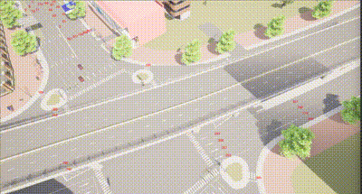

# 轨迹跟踪  Drive.py

​	本示例使用  **Carla**  模拟器来执行轨迹跟踪任务，  [**Drive.py**](https://github.com/OpenHUTB/carla_doc/blob/master/src/course/trajectory_tracking/Drive.py)  主要功能包括连接CARLA服务器、设置模拟环境、生成车辆、读取和处理路径点数据、控制车辆运动、记录和保存仿真结果下面对于主要函数进行介绍。

  基于 [**湖工商场景**](https://pan.baidu.com/s/15T1hGoWJ70tVmsTX7-zcSw?pwd=hutb )**(WindowsNoEditor)**，首先需要运行[generate_traffic.py](https://github.com/OpenHUTB/carla_doc/blob/master/src/examples/generate_traffic.py)

## 定义CARLA设置

​	创建 **Carla** 的世界设置对象，并根据配置设置天气条件

```python
#定义了一些全局变量用于控制模拟参数，如迭代次数、等待时间、总运行时间、天气条件等。
ITER_FOR_SIM_TIMESTEP = 10
WAIT_TIME_BEFORE_START = 5.00
TOTAL_RUN_TIME = 200.00
TOTAL_FRAME_BUFFER = 300
NUM_PEDESTRIANS = 0
NUM_VEHICLES = 2
SEED_PEDESTRIANS = 0
SEED_VEHICLES = 0

WEATHERID = {
    "DEFAULT": 0,
    "CLEARNOON": 1,
    "CLOUDYNOON": 2,
    ...
}

SIMWEATHER = WEATHERID["CLEARNOON"]

def make_carla_settings():
    settings = carla.WorldSettings(
        synchronous_mode=True,
        no_rendering_mode=False,
        fixed_delta_seconds=0.02
    )

    weather = carla.WeatherParameters.ClearNoon
    if SIMWEATHER == WEATHERID["CLEARNOON"]:
        weather = carla.WeatherParameters.ClearNoon
    elif SIMWEATHER == WEATHERID["CLOUDYNOON"]:
        weather = carla.WeatherParameters.CloudyNoon
    # Add other weather conditions as needed

    return settings, weather

```


## 计时器

**`	Timer`**为一个计时器类，用于测量时间间隔和计算每秒的tick数。

```
class Timer(object):
    def __init__(self, period):
        self.step = 0
        self._lap_step = 0
        self._lap_time = time.time()
        self._period_for_lap = period

    def tick(self):
        self.step += 1

    def has_exceeded_lap_period(self):
        return self.elapsed_seconds_since_lap() >= self._period_for_lap

    def lap(self):
        self._lap_step = self.step
        self._lap_time = time.time()

    def ticks_per_second(self):
        return float(self.step - self._lap_step) / self.elapsed_seconds_since_lap()

    def elapsed_seconds_since_lap(self):
        return time.time() - self._lap_time

```


## 获取车辆信息

​	获取车辆的当前位置和偏航角

```
def get_current_pose(vehicle):
    transform = vehicle.get_transform()
    x = transform.location.x
    y = transform.location.y
    yaw = math.radians(transform.rotation.yaw)
    return (x, y, yaw)

```

​	发送控制命令给车辆，控制油门、刹车、方向盘等

```
def send_control_command(vehicle, throttle, steer, brake, hand_brake=False, reverse=False):
    control = carla.VehicleControl()
    steer = np.fmax(np.fmin(steer, 1.0), -1.0)
    throttle = np.fmax(np.fmin(throttle, 1.0), 0)
    brake = np.fmax(np.fmin(brake, 1.0), 0)

    control.steer = steer
    control.throttle = throttle
    control.brake = brake
    control.hand_brake = hand_brake
    control.reverse = reverse
    vehicle.apply_control(control)

```

​	 将车辆的轨迹数据写入CSV文件

```
def write_trajectory_file(x_list, y_list, v_list, t_list, vehicle_id):
    create_controller_output_dir(CONTROLLER_OUTPUT_FOLDER)
    file_name = os.path.join(CONTROLLER_OUTPUT_FOLDER, f'Trajectory_{vehicle_id}.csv')
    with open(file_name, 'w') as trajectory_file:
        for i in range(len(x_list)):
            trajectory_file.write('%0.3f, %0.3f, %0.3f, %0.3f\n' % (t_list[i], x_list[i], y_list[i], v_list[i]))

```


## 执行轨迹跟踪任务

​	执行轨迹跟踪任务，包括连接CARLA服务器、设置模拟环境、生成车辆等

```
def exec_waypoint_nav_demo(args):
    client = carla.Client(args.host, args.port)
    client.set_timeout(10.0)
    world = client.get_world()
    settings, weather = make_carla_settings()
    world.apply_settings(settings)
    world.set_weather(weather)
    blueprint_library = world.get_blueprint_library()
    vehicle_bp = blueprint_library.filter('vehicle.audi.tt')[0]
    spawn_points = world.get_map().get_spawn_points()
    vehicles = []
    
    vehicle_1 = world.try_spawn_actor(vehicle_bp, spawn_points[216])
    vehicle_2 = world.try_spawn_actor(vehicle_bp, spawn_points[11])
    vehicles.append(vehicle_1)
    vehicles.append(vehicle_2)
```

##### 运行结果

