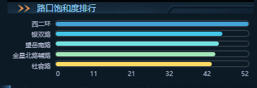
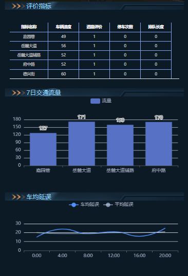
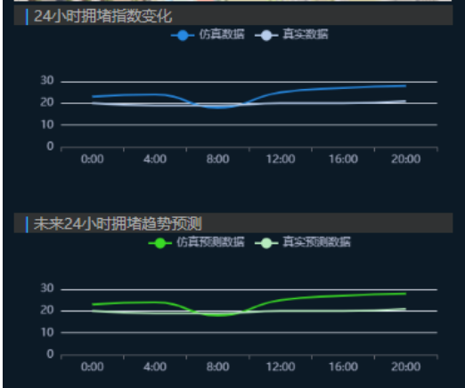
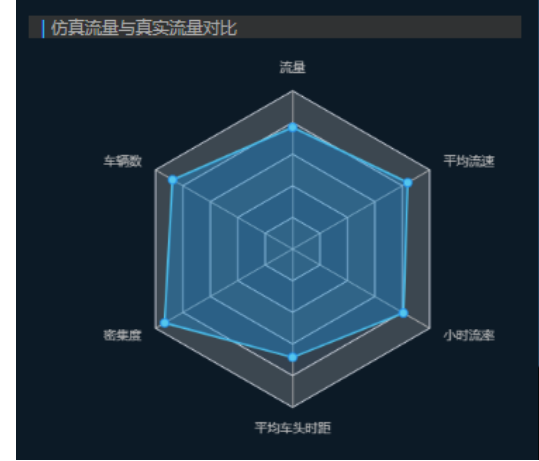

# 交通数据可视化分析

## 简介

交通数据的可视化分析是通过使用图表和图形来理解和解释交通数据，从而提供对交通模式和行为的洞察，交通系统数据来源如下：

- 交通传感器数据
- GPS数据

## 可视化界面

本系统基于[carla仿真平台](https://pan.baidu.com/s/15T1hGoWJ70tVmsTX7-zcSw?pwd=hutb)实时收集车辆仿真行驶数据进行相关交通数据指标的计算与可视化。

### 路口饱和度排行

路口饱和度是指某一时间段内，交通路口的交通流量与其最大通行能力之比。它反映了交通流量对路口承载能力的占用程度。本系统给出了场景中道路的饱和度排行可视化如下：

### 路口评价指标

本系统从车辆速度、道路评价、路口停车速度、排队长度、车均延误及一周交通流量情况来综合做出对道路拥堵情况进行评价，并对未来24小时拥堵趋势做出预测

### 仿真流量和真实流量对比

本系统将仿真流量与实际真实流量进行对比，以探索交通流量、拥堵状况等真实趋势与规律，并进行后续的场景优化及改进策略的验证实验。

