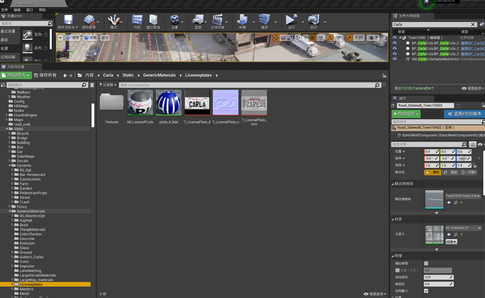
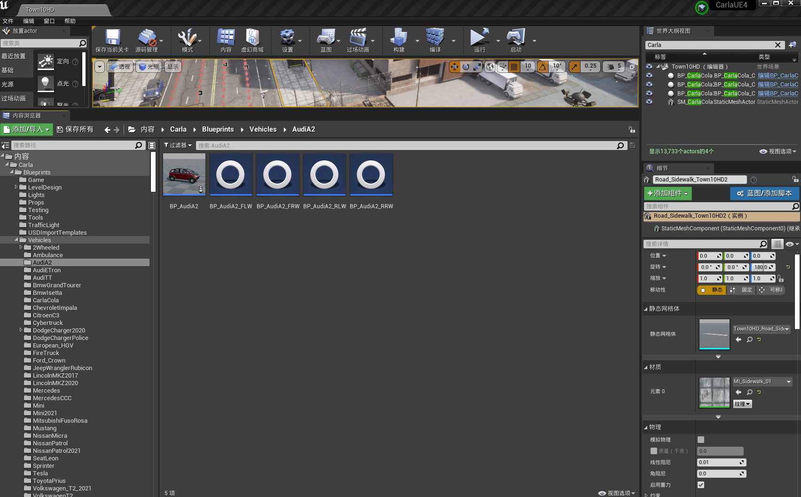
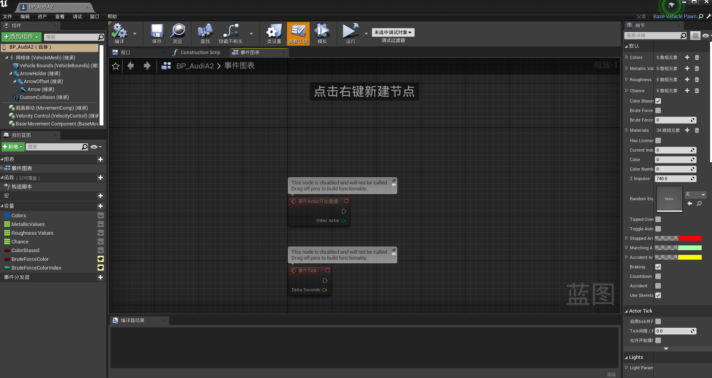
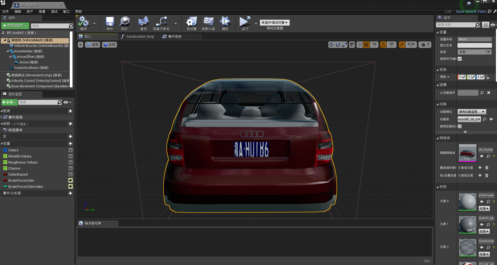
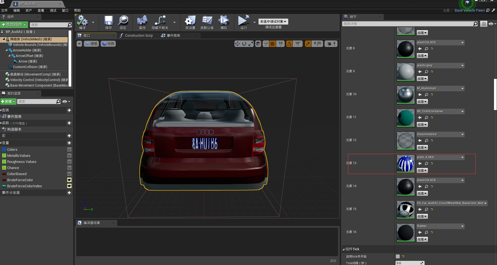
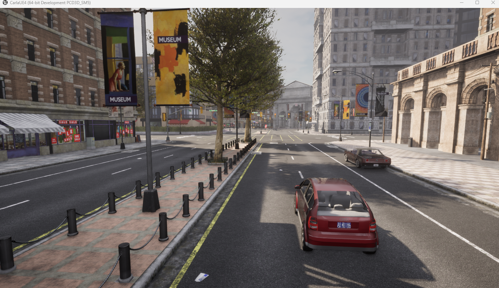

# 自定义Carla中车辆的车牌

在Carla模拟环境中，默认的车辆车牌是预设的静态资产。如果需要自定义车辆车牌以满足特定的测试需求或增强场景的真实性，可以通过以下专业方法来替换Carla中车辆的车牌：

## 自定义车辆车牌的步骤

**1.资产准备**

- 首先，设计或获取你想要应用的车牌图像。确保图像符合实际车牌的尺寸和设计规范。

- 车牌图像应保存为高分辨率的.PNG或.JPG文件，以保持视觉效果的清晰度。

- 将设计好的图片导入Carla中对应的目录下，并转换为材质。如下图所示：

  将图片直接拖至 /Game/Carla/Static/GenericMaterials/Licenseplates,右键选择创建材质

  

**2.材质替换**

- 导肮至Carla/Blueprints/Vehicles下的目标车辆，右键选择编辑。如下图所示：

  

-  进入车辆资产编辑界面后，双击**网格体（VehicleMesh）继承**，会出现车辆以及车辆所引用的资产，将车辆方法，以便查看是否修改成功。如下图所示：

  

  

- 找到车辆车牌位置，将材路径替换为先前所准备的自定义材质。

  

​       这样，我们的车牌已经替换成功！回到主界面，点击编译运行，则出现我们想要的效果！ 

**3.测试**

- 车牌替换成功后，将场景导出，打包成可执行文件。

- 运行python脚本在场景中添加已经被替换过车牌的车辆，调整视角，观察车牌。最后显示结果如下图所示：

  

