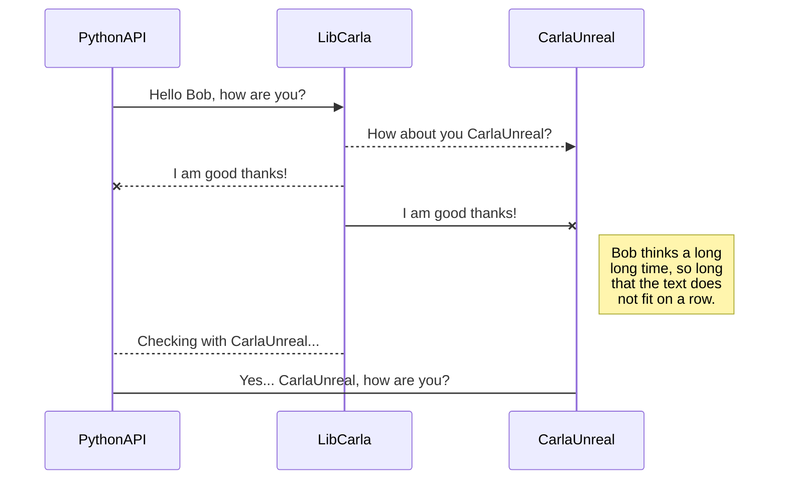
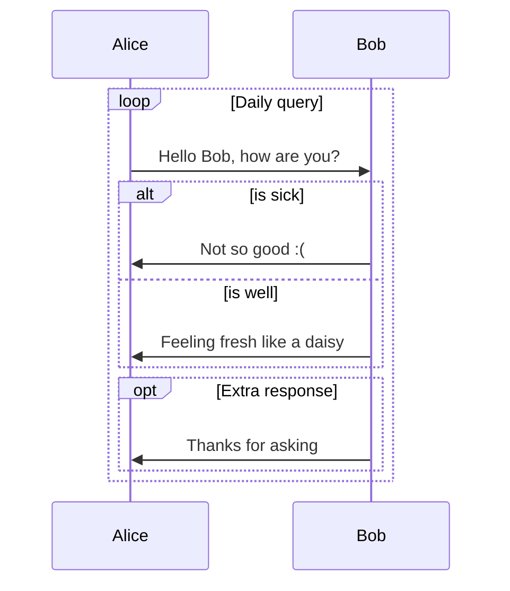

# 绘图效果

流程图：
```flow
st=>start: Start
op=>operation: Your Operation
cond=>condition: Yes or No?
e=>end

st->op->cond
cond(yes)->e
cond(no)->op
```

时序图1：


时序图2：


参考[链接1](https://blog.csdn.net/chuhanning9279/article/details/100970178) 、[链接2](https://16314-mkdocs-demo.readthedocs.io/en/latest/#4) 。
