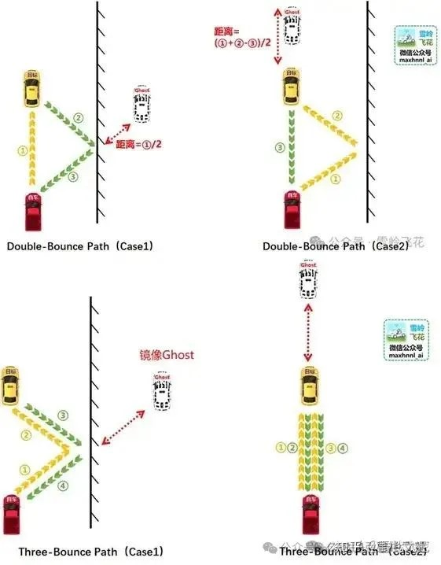

# [雷达](https://mp.weixin.qq.com/s/eM8z9EElqiz8txnTrw9fCw)

## Radar/雷达

1、CARLA自带雷达受天气影响吗？

> 答：答：不受影响，Lidar同理。物理过程仿真不是CARLA在意的东西。有能力的同学可以自己开发。

2、CARLA有理想传感器吗？

> 答：没有，有能力的同学可以自己开发。底层原理与Radar类似。

3、CARLA有4D毫米波雷达吗？

> 答：没有，有能力的同学可以自己开发。理想模型可以参考Lidar。这些底层都是基于RayCast做的。当然也看到过一个通过图像去生成4D毫米波雷达输出的方法，忘了哪篇论文了。
>
> 4D毫米波雷达是传统毫米波雷达的升级版，4D指的是速度、距离、水平角度、垂直高度四个维度。相比传统3D毫米波雷达，4D毫米波雷达增加了“高度”的探测，将第四个维度整合到传统毫米波雷达中，这使得4D毫米波雷达获取信息的维度更加丰富，可以测量 俯仰角度，且角度分辨率可以达到1度左右。而且毫米波雷达探测距离更长，最远探测距离可达350多米。

## Lidar/激光雷达

1、Lidar有运动畸变吗？

> 答：有一点点。因为引擎是离散时间，但离散的粒度没有达到激光雷达每一列（128线扫一次或两次）的时间，但CARLA Lidar的实现逻辑是根据delta time（同步模式下是fixed_delta_time）参数。所以CARLA Lidar计算一次，不懂参数的情况下，大概率也不是完整的一帧（输出只有半个圈的情况），从这个角度看，几帧拼成完整的一帧，几帧是在不同仿真时间下生成的，有粗粒度的运动畸变。理论上，只要粒度够小（1ms），拼出来的点云就是有运动畸变的。当然，运行的也会很慢。

> 2、为什么我的Lidar输出不是完整的点云？

答：建议了解三个参数概念：world tick (fixed_delta_time), sensor tick, rotation frequence。在CARLA默认的实现逻辑下，一个仿真秒的点云总数应该在 [ rotation frequence * points_per_second * 80% ] 左右，根据扫描的场地是否开阔决定返回的点云数。因为打出去的激光没击中物体就不会有点云，所以点云数一定是略少的。

3、Lidar受天气影响吗？

> 答：不受天气影响。也不受粒子系统影响（不管你是老的粒子系统还是Niagara粒子系统）。

4、怎么模拟Mems等非机械式Lidar？

> 答：有能力的可以自己设计RayCast发射方式。
       有一篇论文实现过、[Github项目地址](https://github.com/PJLab-ADG/PCSim) 。

5、怎么实现Lidar的多次反射？

> 答：上一个问题的论文也实现过。但原理是：计算第一次发射的强度，如果大于50%，就在击中点延入射方向与击中点法线的角度再发。第二次发射击中的点为点云的坐标。 
> 
> 个人理解：假。
> 
> 个人愚见：Lidar是通过盘码角和TTF决定点云位置的，盘码角决定点云方向，TTF（time to fly，飞行时间）决定距离。看了知乎雪岭飞花在[《激光雷达lidar目前的技术难点在哪，关键技术都有哪些？》](https://www.zhihu.com/question/59025491/answer/3524212461) 下的回答 ，我大概知道鬼影和膨胀的原因。所以多次反射能生成点云最重要的一点是：多次路径反射后，最终能被接收器感知。并且点云的方向只受盘码角决定，不是两次反射击中的点就是最终的点云的位置！（当然，理解了原理，也就有可能去实现了，性能消耗估计不小）
> 

6、怎么实现不同物体不同反射率？

> 答：个人了解两种方案：
> 
> 1）、一种基于CARLA的Tag系统，也就是Semantic语义分割的基础。不同的物体在语义分割里有不同的颜色，本质是被CARLA分类了，然后可以根据这个Tag给物体对应的反射率。
> 
> 方案缺点：粒度很粗，一辆车的玻璃和车牌是完全不同的反射情况。（上述论文用的就是这种方法）
> 
> 2）基于物理材质。RayCast的接口LineTrace和返回结果FHitResult可以看一下，里面可以拿到物理材质的信息。再根据这个标记给对应材质不同的反射率。
> 
> 方案缺点：物理材质UE默认只允许设置63个，而且得看实际材质的粒度，CARLA中有很多楼，一栋楼只有一个材质，所以也只能设置一个对应的物理材质。而且设置物理材质会影响动力学表现，毕竟这个本来就是给动力学用的。
> 
> 参考issue：https://github.com/carla-simulator/carla/issues/6171

7、CARLA的Lidar支持多回波吗？

> 答：不支持。了解多回波原理的可以手动实现，当然估计会伴随着性能消耗增长。

## UltraSonic/超声波

1、CARLA有没有超声波雷达？

> 答：没有。基本上这类主动发射探测性雷达，底层都是RayCast。

