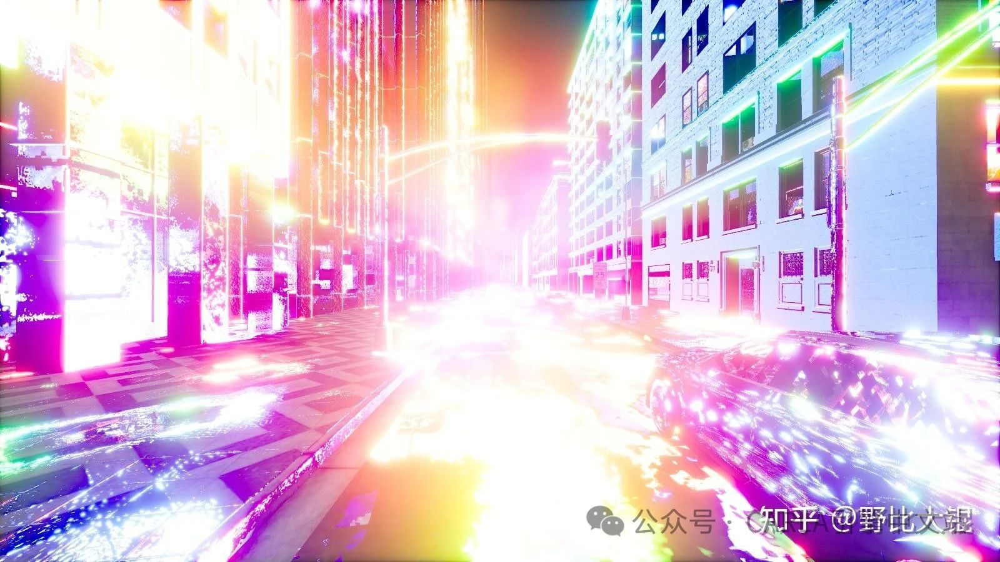
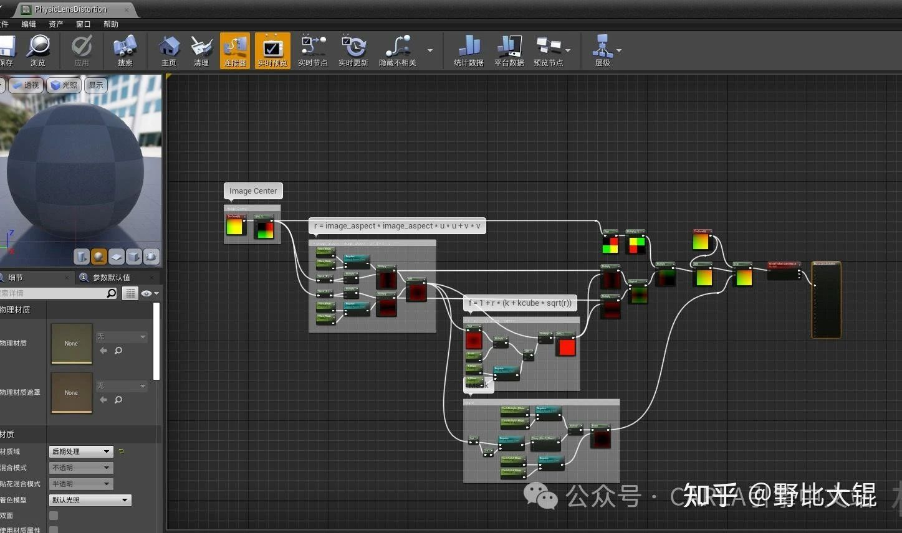
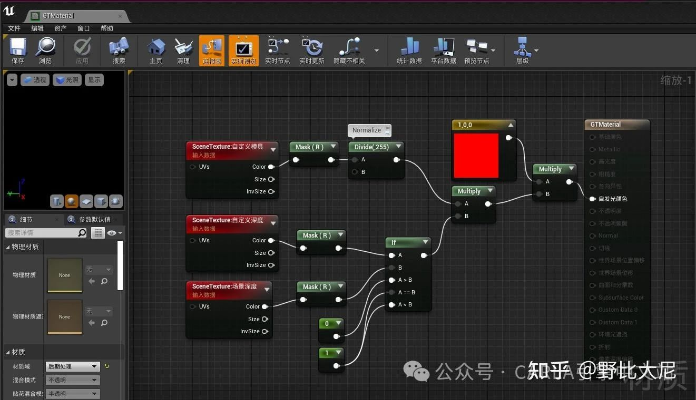

# [传感器](https://mp.weixin.qq.com/s/pnlRfi2TOLDJ7VIHzw4kNA)
本文主要是简述了在使用CARLA过程中遇到的关于传感器的一些常见问题。

1、CARLA有没有鱼眼摄像头？

> 答：有，在 [CARLA的PullRequest中](https://github.com/carla-simulator/carla/pull/3755/files) 传了鱼眼传感器。并且在issues和pullrequets中已经形成了比较完整的代码bug修复编译过程，主要是适配UE4.26的代码。
> 


2、CARLA有没有鱼眼的语义分割或实例分割传器？

> 答：可以实现，虽然没注意issues里有没有实现方式。但了解普通RGB和语义分割传感器的知道，这个其实是后处理材质的功劳。


3、为什么一个CARLA多个摄像头显卡还是利用率很低？

> 答：小编分析这个是多个SceneCapture其实是轮流进入渲染队列的。在底层RHI（渲染硬件接口）线程并不能并行执行渲染任务。这个问题应该限制在UE侧。


4、CARLA什么时候迁移UE5？

> 答：现在CARLA Github中已有UE5.x的版本。小编认为UE5的渲染效果并不能解决渲染不真的问题，也不能解决渲染性能的问题。当然，“有更好的用更好的”的出发点没啥问题。但高渲染画质伴随着高性能消耗的定律是不会变的。


5、传感器Listen的时候，总是卡死，内存爆炸

> 答：CARLA的数据流基于TCP，一般是在listen()调用的Callback函数运行时间较长。CARLA服务端在疯狂从Buffer Pool申请新的内存，在网络端堵塞。这个问题通常在单个传感器产生的数据量很大，而且还高频产出的情况下出现，如果是异步模式，那出现频率更高。
> 
> 解决办法：优化Python脚本，写个异步处理。


6、Carla 传感器出现眩光

> 答：一般这种情况会先出现显存不够用的Warning，然后就爆炸了。通常使用大显存可以减少这个问题出现的概率。
> 


7、CARLA自带的畸变模型怎么用？

> 答：参考[SynthEyes' lens-distortion畸变算法](https://support.borisfx.com/hc/en-us/articles/24284292845325-Lens-Distortion-White-Paper) 和 [SynthEyes' lens-distortion畸变算法原理](https://www.ssontech.com/content/lensalg.html) 。当然可以去看实现它的后处理材质蓝图PhysicLensDistortion。
> 
> 


8、CARLA能不能实现其他畸变模型？

> 答：会搞后处理材质蓝图，就可以自定义任何畸变模型。


9、实例分割和语义分割区别在哪？

> 答：与语义分割只关注像素级别的语义标签不同，实例分割还要求对同类但不是同一个物体实例进行区分和分割。实例分割输出的RGB图像：R通道是语义分割的结果，GB通道组成实例分割ID，实例分割ID是虚幻引擎下的UniqueID，并非CARLA层的Actor ID。用两个通道是出于位数大小考虑。
> 
> 语意分割输出的RGB图像：基于Tagger设置的自定义深度决定材质的自发光颜色。
> 语意分割材质：
> 
> [相关Issue](https://github.com/carla-simulator/carla/discussions/5253) 。
> 
> 实例分割颜色设置相关代码：
> ```cpp
> FLinearColor ATagger::GetActorLabelColor(const AActor &Actor, const crp::CityObjectLabel &Label)
> {  uint32 id = Actor.GetUniqueID();  
>    // TODO: Warn if id > 0xffff.
>    // Encode label and id like semantic segmentation does  
> 
>    // TODO: Steal bits from R channel and maybe A channel?  
>    FLinearColor Color(0.0f, 0.0f, 0.0f, 1.0f);  
>    Color.R = CastEnum(Label) / 255.0f;  Color.G = ((id & 0x00ff) >> 0) / 255.0f;  
>    Color.B = ((id & 0xff00) >> 8) / 255.0f;
> 
>    return Color;
> }
> ```

