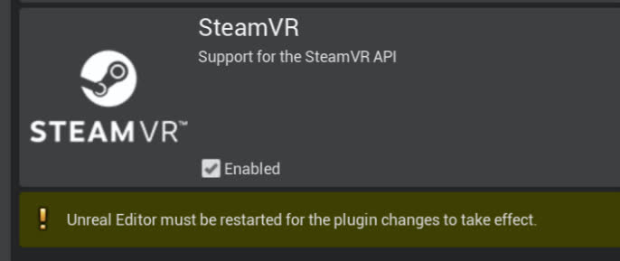
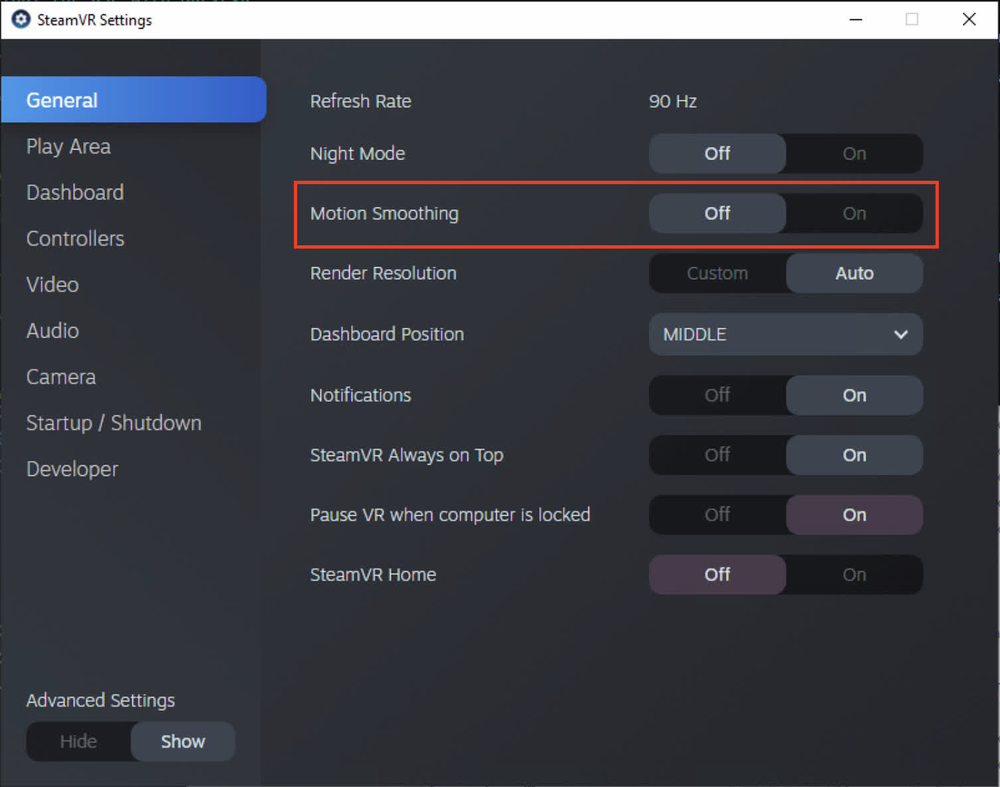
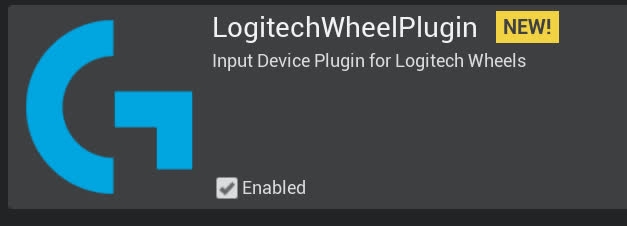

# 在构建的Carla 0.9.13工作空间中安装 `DReyeVR`
## 要求
- 确保您的机器满足 Carla 要求的先决条件： [Windows](https://carla.readthedocs.io/en/0.9.13/build_windows), [Linux](https://carla.readthedocs.io/en/0.9.13/build_linux), [Mac*](https://github.com/GustavoSilvera/carla/blob/m1/Docs/build_mac.md)
- **重要**：如果在 **Windows** 上，则 **需要** [`Make-3.81`](https://gnuwin32.sourceforge.net/packages/make.htm) ，如 [Carla 文档](https://carla.readthedocs.io/en/latest/build_windows/#system-requirements) 所述
- 如果你之前已经在 PYTHONPATH 中安装了 Carla，则需要删除所有之前的 PythonAPI 安装
  - 例如，如果您 [通过 pip 安装了 carla](https://pypi.org/project/carla/) ，则 **需要将其卸载** 才能继续。
    ```bash
    pip uninstall carla
    ```

## 开始 Getting started
- 应该首先保证 DReyeVR 已经下载：
  ```bash
  git clone https://github.com/HARPLab/DReyeVR --depth 1
  ```
- 首先需要从源代码安装虚 [幻引擎 4.26（CARLA fork）](https://github.com/CarlaUnreal/UnrealEngine) 
  ```bash
  git clone https://github.com/CarlaUnreal/UnrealEngine
  # 将此位置设置为您的 $UE4_ROOT 环境变量
  ```

  **重要** 在 DReyeVR for Carla 0.9.13 上，您需要将 UE4 存储库恢复为受支持的版本（用于 DReyeVR）。这是为了优化 DX11 渲染性能，在我们的测试中，DX11 是 VR 的最佳渲染后端。
  ```bash
  # in $UE4_ROOT
  git checkout d40ec35474e8793b4eea60dba6c4f051186e458e
  # or git reset --hard d40ec35474e8793b4eea60dba6c4f051186e458e
  ```

  - **重要：** 如果 `git clone` 链接对您不起作用，您可能需要 [加入 Epic Games 组织](https://www.unrealengine.com/en-US/ue4-on-github) 才能访问 UnrealEngine 及其所有分支。
  - 适用于您的系统的 UE4 构建说明可在此处找到：[Windows](https://carla.readthedocs.io/en/0.9.13/build_windows/#unreal-engine) 、[Linux](https://carla.readthedocs.io/en/0.9.13/build_linux/#unreal-engine) 、[Mac*](https://github.com/GustavoSilvera/carla/blob/m1/Docs/build_mac.md#unreal-engine-fork) 
  <!-- - 注意：我们只保留了 Carla 分支的我们自己的 HARPLab 分支，以保持版本兼容性并启用 Carla 不需要的次要功能（例如，注视点渲染）。  -->
  - 为了成功运行 `Setup.sh`，您需要下载并替换 `/Engine/Build` 中的 Commit.gitdeps.xml 文件。请参阅 [Commit.gitdeps.xml](https://github.com/HARPLab/UnrealEngine/blob/DReyeVR-0.9.13/Engine/Build/Commit.gitdeps.xml) 中更新的 XML 文件（注意：该链接已经失效，可以使用 [这个文件](https://github.com/EpicGames/UnrealEngine/blob/4.26/Engine/Build/Commit.gitdeps.xml) ）

<!-- vanilla 原意是指原味、香草，引申义就是原始的、最初的版本 --> 
- 然后你需要克隆并构建一个 [vanilla Carla 0.9.13](https://carla.readthedocs.io/en/0.9.13/#building-carla) 
  ```bash
  git clone https://github.com/carla-simulator/carla -b 0.9.13 --depth 1
  ```
  - 使用 [Building on Linux](https://carla.readthedocs.io/en/0.9.13/build_linux/)（适用于 Ubuntu 18.04 及以下的所有版本）或 [Building on Windows](https://carla.readthedocs.io/en/0.9.13/build_windows/) （按照其说明构建 CARLA 0.9.13）。使用我们的 Ubuntu 20.04 Carla 安装指南（适用于 Ubuntu 20.04）。
- （可选）同样，您可以安装原始的 [Carla Scenario Runner v0.9.13 ](https://github.com/carla-simulator/scenario_runner/tree/v0.9.13) 项目，将 DReyeVR+Carla 与 Scenario Runner 集成。
  ```bash
  git clone https://github.com/carla-simulator/scenario-runner -b v0.9.13 --depth 1
  ```

(*=Carla 不再正式支持 Mac 操作系统，但我们的开发团队已能够在搭载 Apple Silicon（arm64）硬件的新 Mac 机器上构建 UE4、Carla 和 DReyeVR。 )

<br>

# DReyeVR 安装命令总结
<details>

**注意** 您需要在 Linux/Mac 上安装一个终端。在 Windows 上，您可以使用与构建 Carla 时相同的 x64 Native Tools CMD prompt。 
<summary> 显示用于安装和构建 DReyeVR 的命令行 </summary>

```bash
mkdir CarlaDReyeVR && cd CarlaDReyeVR # 在这个 "CarlaDReyeVR" 目录中做所有事

#####################################################
########### 安装我们的 UnrealEngine fork ###########
#####################################################
# Rather than https://github.com/CarlaUnreal/UnrealEngine UE4, you SHOULD clone https://github.com/HARPLab/UnrealEngine
# 但除此之外，所有的指令都是一样的。 

# Linux: https://carla.readthedocs.io/en/0.9.13/build_linux/#unreal-engine
# Windows: https://carla.readthedocs.io/en/0.9.13/build_windows/#unreal-engine

#####################################################
################### 安装 Carla ###################
#####################################################
# Linux: https://carla.readthedocs.io/en/0.9.13/build_linux/
# Windows: https://carla.readthedocs.io/en/0.9.13/build_windows/
git clone https://github.com/carla-simulator/carla -b 0.9.13 --depth 1
cd carla
./Update.sh # linux/mac
Update.bat # Windows（已经失效，需要克隆然后切换到tag 为0.9.13的提交记录）
git clone https://bitbucket.org/carla-simulator/carla-content.git
make PythonAPI && make launch # 构建最初的 Carla

#####################################################
############## 安装 DReyeVR 插件 ##############
#####################################################
# (可选) 安装 SRanipal (眼动跟踪) SRanipal plugin
mv /PATH/TO/SRANIPALPLUGIN/SDK/03_Unreal/Plugins/SRanipal Unreal/CarlaUE4/Plugins/ 

# (可选) 安装 LogitechWheelPlugin (steering wheel)
git clone https://github.com/HARPLab/LogitechWheelPlugin
mv LogitechWheelPlugin/LogitechWheelPlugin Unreal/CarlaUE4/Plugins/ # install to carla

cd .. # 回到主目录

#####################################################
############## 安装 scenario_runner #################
#####################################################
# (可选) while you don't NEED scenario runner, it is certainly useful from a research
git clone https://github.com/carla-simulator/scenario_runner -b v0.9.13

#####################################################
################## 安装 DReyeVR ##################
#####################################################
git clone https://github.com/HARPLab/DReyeVR
cd DReyeVR
# CARLA= 和 SR= 变量是可选的
make install CARLA=../carla SR=../scenario_runner
# 或者
make install CARLA=../carla
make install SR=../scenario_runner

# run filesystem checks after installing
make check CARLA=../carla
cd ..

#####################################################
################## 构建所有 #########################
#####################################################
cd carla
make PythonAPI  # build the PythonAPI (and LibCarla) again
make launch     # launch in editor
make package    # create an optimized package
make check      # run Carla unit tests
```
</details>


<br>

## 简单安装
从技术上讲，上述先决条件就是您安装 DReyeVR 并获得**没有眼动追踪**和**赛车方向盘集成**的准系统 VR ego-vehicle 所需的全部条件。如果这适合您的需求，只需跳到本文档的 [安装 DReyeVR Core](Install.md#installing-dreyevr-core) 部分，并在以下位置设置以下变量：`Unreal/CarlaUE4/Source/CarlaUE4/CarlaUE4.Build.cs` 成 `false`：
```c#
/////////////////////////////////////////////////////////////
// 编辑这些变量以启用/禁用 DReyeVR 的功能
bool UseSRanipalPlugin = true;
bool UseLogitechPlugin = true;
...
/////////////////////////////////////////////////////////////
```
- 注意：仅当启用了 `UseSRanipalPlugin` 时才需要安装 SRanipal 插件，同样，仅当启用了 `UseLogitechPlugin` 时才需要安装 Logitech 插件。


# 安装 DReyeVR 插件
Before installing `DReyeVR`, we'll also need to install the dependencies:
- **SteamVR**: Required for VR
- **SRanipal***: Required for eye tracking (with HTC Vive Pro Eye), optional otherwise
- **LogitechWheelPlugin***: Required for Logitech Steering Wheel, optional otherwise

(* = optional, depends on the features you are looking for)

## SteamVR
### **Download Steam and SteamVR**
  - You'll need to use [SteamVR](https://store.steampowered.com/app/250820/SteamVR/) for the VR rendering environment, so you should first download the [Steam client application](https://store.steampowered.com/about/). 
    - From within the steam client, you can browse in store->search "[SteamVR](https://store.steampowered.com/app/250820/SteamVR/)" and download the free-to-install system utility. 
  <!-- - In the Editor for Carla go to `Settings->Plugins->Virtual Reality->SteamVR` and enable the plugin -->
  <!-- - Note that on Linux this you may need to install it through the [Valve GitHub repo](https://github.com/ValveSoftware/SteamVR-for-Linux) -->
  <!-- -  -->
  - You should be able to launch SteamVR from the client and in the small pop-up window reach both settings and "show VR view"
    - Make sure to calibrate the VR system to your setup and preferences!
  - Additionally we recommend disabling the "Motion Smoothing" effect within SteamVR Settings to avoid nasty distortion artifacts during rendering. 
    - 
***
## HTC Eye Tracker Plugin
### **Download `SRanipal`**
  0. *What is SRanipal?*
      - We are using [HTC's SRanipal plugin](https://developer.vive.com/resources/vive-sense/sdk/vive-eye-tracking-sdk-sranipal/) as the means to communicate between Unreal Engine 4 and the Vive's Eye Tracker. 
      - To learn more about SRanipal and for **first-time-setup**, see this [guide on foveated rendering using SRanipal](https://forum.vive.com/topic/7434-getting-started-with-vrs-foveated-rendering-using-htc-vive-pro-eye-unreal-engine/) by HTC developer MariosBikos_HTC
  1. You'll need a (free-to-create) [Vive developer account](https://hub.vive.com/sso/login) to download the following:
      - a) [`VIVE_SRanipalInstaller_1.3.2.0.msi`](https://hub.vive.com/en-US/download/VIVE_SRanipalInstaller_1.3.2.0.msi) -- executable to install Tobii firmware
      - b) [`SDK_v1.3.3.0.zip`](https://hub.vive.com/en-US/download/SDK-v1.3.3.0.zip) -- includes the Unreal plugin
        - **IMPORTANT**: The SRanipal versions above 1.3.6.0 are NOT supported and cause wild crashes!
      - **If the download links above don't work for you, make sure you have a Vive Developer account! (Or [contact](mailto:gustavo@silvera.cloud) us directly to help you)**
  2. Install the Tobii firmware by double-clicking the `.msi` installer
      - Once installed, you should see the `SR_runtime.exe` program available from the Start Menu. Launch it as administrator and you should see the robot head icon in the Windows system tray as follows:
      - 
        - Image Credit: [MariosBikos](https://forum.htc.com/topic/7434-getting-started-with-vrs-foveated-rendering-using-htc-vive-pro-eye-unreal-engine)

### **Installing SRanipal UE4 Plugin**
  - After downloading the `.zip` file, unzipping it should present a directory similar to this
    - ```
      SDK
      - 01_C/
      - 02_Unity/
      - 03_Unreal/
      - Eye_SRanipal_SDK_Guide.pdf
      - Lip_SRanipal_SDK_Guide.pdf
      ```
    - Then, unzip the SRanipal unreal plugin and copy over the `03_Unreal/Plugins/SRanipal/` directory to the Carla installation
    - ```bash
      # in SDK/
      cd 03_Unreal
      unzip Vive-SRanipal-Unreal-Plugin.zip # creates the PLugins/SRanipal folder
      # assumes CARLA_ROOT is defined, else just use your Carla path
      cp -r Plugins/SRanipal $CARLA_ROOT/Unreal/CarlaUE4/Plugins/
      ```
  - It is recommended to re-calibrate the SRanipal eye tracker plugin for every new participant in an experiment. You can do this by entering SteamVR home, and clicking the small icon in the bottom menu bar to calibrate eye tracker to the headset wearer. 
    - 
    - You can find more information by checking out this [guide on foveated rendering using SRanipal](https://forum.vive.com/topic/7434-getting-started-with-vrs-foveated-rendering-using-htc-vive-pro-eye-unreal-engine/) by HTC developer MariosBikos_HTC
***
## Logitech Wheel Plugin
### **Installing Logitech Wheel Plugin**
  - This is only for those who have a Logitech steering wheel/pedals driving setup. This hardware is not required to experience the VR experience (you can simply use keyboard/mouse) but greatly adds to the immersion and allows for granular analog controls. 
    - For reference, we used this [Logitech G923 Racing Wheel & Pedals](https://www.logitechg.com/en-us/products/driving/driving-force-racing-wheel.html).
  - We'll be using this [LogitechWheelPlugin](https://github.com/HARPLab/LogitechWheelPlugin) to interact with UE4 and map hardware inputs to actions.
    - Clone the repo and move the requisite folder to the Carla plugins folder
    - ```bash
      git clone https://github.com/HARPLab/LogitechWheelPlugin
      mv LogitechWheelPlugin/LogitechWheelPlugin $CARLA_ROOT/Unreal/CarlaUE4/Plugins
      ```
    - You should then see a Logitech Plugin enabled when you boot up the editor again:
    - 
***
## Sanity Check
  - After installing these plugins, you should see a `Unreal/CarlaUE4/Plugins` that looks like this:
  - ```
    Plugins
    ├── Carla                              # unchanged
    │   └── ...
    ├── CarlaExporter                      # unchanged
    │   └── ...
    ├── LogitechWheelPlugin                # if installed
    │   ├── Binaries
    │   ├── Doc
    │   ├── Logitech
    │   ├── LogitechWheelPlugin.uplugin
    │   ├── Resources
    │   └── Source
    └── SRanipal                           # if installed
        ├── Binaries
        ├── Config
        ├── Content
        ├── Resources
        ├── Source
        └── SRanipal.uplugin  
    ```
  - If you still have questions or issues, feel free to post an issue on our [Issues](https://github.com/HARPLab/DReyeVR/issues) page and we'll try our best to help you out. 

<br>
<br>

# 安装 `DReyeVR` 核心
<!-- (Once you are done with this step, you should have a carla repo that looks just like this [Carla fork](https://github.com/HARPLab/carla/tree/DReyeVR-0.9.13) we created with the installation (and other minor things) pre-applied.) -->

- **IMPORTANT** The installation requires that `make`, `python` and `git` are available on your shell.
- You only need to install to a `CARLA` directory, ScenarioRunner is optional. 
  - If you don't provide the `make` variables `CARLA=...` or `SR=...` the installation wizard will automatically detect your install destination by looking at the environment variables `CARLA_ROOT` and `SCENARIO_RUNNER_ROOT` required by Carla. 

```bash
# the CARLA= and SR= variables are optional
make install CARLA=../carla SR=../scenario_runner
# or
make install CARLA=../carla
make install SR=../scenario_runner

# run filesystem checks after installing
make check CARLA=../carla
```
**NOTE:** to learn more about how the DReyeVR `make` system works, see [`Scripts/README.md`](../Scripts/README.md)


# 构建 `DReyeVR` PythonAPI
## Using [`conda`](https://www.anaconda.com/products/distribution) for the PythonAPI
  - While not required for DReyeVR, we highly recommend compartmentalizing Python installations via isolated environments such as [`anaconda`](https://www.anaconda.com/products/distribution)
    - First download and install Anaconda to your machine from [here](https://www.anaconda.com/products/distribution).
  ```bash
  # in /PATH/TO/CARLA/
  conda create --name carla13 python=3.7.2
  conda activate carla13 # will need to run this ONCE before opening a new terminal!
  conda install numpy
  ```
- **READ THIS FIRST (Linux)**: You might run into a problem when compiling Boost 1.72.0 (required by `LibCarla`).
    <details>

    <summary> Show instructions to get Anaconda working on Linux </summary>

    - ```bash
      # find anaconda install:
      which python3
      ... PATH/TO/ANACONDA/envs/carla/bin/python3 # example output

      # go to carla/install dir from here
      cd PATH/TO/ANACONDA/envs/carla/include

      # create a symlink between python3.7 -> python3.7m
      ln -s python3.7m python3.7
      ```
      Install `boost_1_72_0.tar.gz` manually from https://github.com/jerry73204/carla/releases/tag/fix-boost and place file in `Build/boost_1_72_0.tar.gz`
      Open `Util/BuildTools/Setup.sh` (or `Util/BuildTools/Setup.bat` on Windows)
      Find the section named `Get boost` includes and comment out the `wget` lines.
      Now when you `make LibCarla` again, the `boost` errors should be resolved.
      - For more information see the bottom of this [SO post](https://stackoverflow.com/questions/42839382/failing-to-install-boost-in-python-pyconfig-h-not-found)
    </details>

  - **READ THIS FIRST (Windows)**: Windows anaconda is a bit more of a pain to deal with.
    <details>

    <summary> Show instructions to get Anaconda working on Windows </summary>

      1. Enable your environment
          ```bat
          conda activate carla13
          ```
      2. Add carla to "path" to locate the PythonAPI and ScenarioRunner. But since Anaconda [does not use the traditional `PYTHONPATH`](https://stackoverflow.com/questions/37006114/anaconda-permanently-include-external-packages-like-in-pythonpath) you'll need to:
          - 3.1. Create a file `carla.pth` in `\PATH\TO\ANACONDA\envs\carla\Lib\site-packages\`
          - 3.2. Insert the following content into `carla.pth`:
            ```bat
              C:\PATH\TO\CARLA\PythonAPI\carla\dist
              C:\PATH\TO\CARLA\PythonAPI\carla\agents
              C:\PATH\TO\CARLA\PythonAPI\carla
              C:\PATH\TO\CARLA\PythonAPI
              C:\PATH\TO\CARLA\PythonAPI\examples
              C:\PATH\TO\SCENARIO_RUNNER\
            ```
      3. Install the specific carla wheel (`whl`) to Anaconda
          ```bash
          conda activate carla13
          pip install --no-deps --force-reinstall PATH\TO\CARLA\PythonAPI\carla\dist\carla-0.9.13-cp37-cp37m-win_amd64.whl

          # if applicable (and you installed Scenario runner)
          cd %SCENARIO_RUNNER_ROOT%
          pip install -r requirements.txt # install all SR dependencies
          ```
      4. Finally, you might run into problems with `shapely` (scenario-runner dependency) and Conda. Luckily the solution is simple:
          - Copy the files:
            - `PATH\TO\ANACONDA\envs\carla13\Lib\site-packages\shapely\DLLs\geos.dll`
            - `PATH\TO\ANACONDA\envs\carla13\Lib\site-packages\shapely\DLLs\geos_c.dll`
          - To destination:
            - `PATH\TO\ANACONDA\envs\carla13\Library\bin\`
      5. Now finally, you should be able to verify all PythonAPI actions work as expected via:
          ```bat
          conda activate carla13
          python
          >>> Python 3.7.2 (default, Feb 21 2019, 17:35:59) [MSC v.1915 64 bit (AMD64)] :: Anaconda, Inc. on win32
          >>> Type "help", "copyright", "credits" or "license" for more information.
          >>> import carla
          >>> from DReyeVR_utils import find_ego_vehicle
          >>> from scenario_runner import ScenarioRunner
          ```
          With all these imports passing (no error/warning messages), you're good to go!
        
  </details>

Now you can finally build the PythonAPI to this isolated conda environment. 
  ```bash
  conda activate carla13
  (carla13) make PythonAPI # builds LibCarla and PythonAPI to your (conda) python environment
  ```
  - NOTE: You'll need to run `conda activate carla13` every time you open a new terminal if you want to build DReyeVR since the shell needs to know which python environment to use. Luckily this minor inconvenience saves us from the significant headaches that arise when dealing with multiple `python` projects, Carla installations, and versions, etc. 

## Sanity Check:

It is nice to verify that the Carla PythonAPI is correctly visible in conda, to do this you should see all the following attributes in the `carla` module once calling `dir` on it.

<details>
<summary>Show instructions to verify Carla PythonAPI is installed </summary>

```bash
# in your terminal (linux) or cmd (Windows)
conda activate carla13   # (if using conda)
(carla13) python         # should default to python3!!
```

```python
#in Python
...
>>> import carla
>>> dir(carla)
# the following output means carla is not correctly installed :(
>>> ['__doc__', '__file__', '__loader__', '__name__', '__package__', '__path__', '__spec__']

# OR the following output means carla is installed :)
>>> ['Actor', 'ActorAttribute', 'ActorAttributeType', 'ActorBlueprint', 'ActorList', 'ActorSnapshot', 'ActorState', 'AttachmentType', 'BlueprintLibrary', 'BoundingBox', 'CityObjectLabel', 'Client', 'ClientSideSensor', 'CollisionEvent', 'Color', 'ColorConverter', 'DReyeVREvent', 'DVSEvent', 'DVSEventArray', 'DebugHelper', 'EnvironmentObject', 'FakeImage', 'FloatColor', 'GearPhysicsControl', 'GeoLocation', 'GnssMeasurement', 'IMUMeasurement', 'Image', 'Junction', 'LabelledPoint', 'Landmark', 'LandmarkOrientation', 'LandmarkType', 'LaneChange', 'LaneInvasionEvent', 'LaneInvasionSensor', 'LaneMarking', 'LaneMarkingColor', 'LaneMarkingType', 'LaneType', 'LidarDetection', 'LidarMeasurement', 'Light', 'LightGroup', 'LightManager', 'LightState', 'Location', 'Map', 'MapLayer', 'MaterialParameter', 'ObstacleDetectionEvent', 'OpendriveGenerationParameters', 'OpticalFlowImage', 'OpticalFlowPixel', 'Osm2Odr', 'Osm2OdrSettings', 'RadarDetection', 'RadarMeasurement', 'Rotation', 'SemanticLidarDetection', 'SemanticLidarMeasurement', 'Sensor', 'SensorData', 'ServerSideSensor', 'TextureColor', 'TextureFloatColor', 'Timestamp', 'TrafficLight', 'TrafficLightState', 'TrafficManager', 'TrafficSign', 'Transform', 'Vector2D', 'Vector3D', 'Vehicle', 'VehicleControl', 'VehicleDoor', 'VehicleLightState', 'VehiclePhysicsControl', 'VehicleWheelLocation', 'Walker', 'WalkerAIController', 'WalkerBoneControlIn', 'WalkerBoneControlOut', 'WalkerControl', 'Waypoint', 'WeatherParameters', 'WheelPhysicsControl', 'World', 'WorldSettings', 'WorldSnapshot', '__builtins__', '__cached__', '__doc__', '__file__', '__loader__', '__name__', '__package__', '__path__', '__spec__', 'bone_transform', 'bone_transform_out', 'command', 'libcarla', 'vector_of_bones', 'vector_of_bones_out', 'vector_of_gears', 'vector_of_ints', 'vector_of_transform', 'vector_of_vector2D', 'vector_of_wheels']
```
</details>

<br>

## Future modifications

Additionally, if you make changes to the `PythonAPI` source and need to rebuild (`make PythonAPI` again) when using Conda you should reinstall the `.whl` file to ensure your changes will be reflected in the environment:
  - ```bash
    conda activate carla

    pip install --no-deps --force-reinstall /PATH/TO/CARLA/PythonAPI/carla/dist/carla-YOUR_VERSION.whl
    ```


# 升级 `DReyeVR`
If you currently have an older version of `DReyeVR` installed and want to upgrade to a newer version, it is best to re-install DReyeVR from a fresh Carla repository. You can manually delete the `carla` repository and re-clone it directly (carefully ensuring the versions match) or use our provided scripts which attempt to reset the repository for you:

<details>
<summary> Show instructions to use DReyeVR scripts to reset CARLA repo</summary>

**IMPORTANT:** the `DReyeVR` clean script will overwrite and reset the Carla repository you specify, so make your backups now if you have any unstaged code. (`git reset --hard HEAD` and `git clean -fd` will be invoked, so if you commit your local changes they will be safe)

```bash
# first go to CARLA and clean it so no old DReyeVR builds linger
cd /PATH/TO/Carla/
make clean

# it is a good idea to clean the Content/ directory which is not tracked by Carla's git system
rm -rf Unreal/CarlaUE4/Content/

# re-install the Content fresh from Carla's servers
./Update.sh # Linux/Mac
Update.bat  # Windows

# next, go to DReyeVR and get the latest updates
cd /PATH/TO/DReyeVR/
git pull origin main # or dev, or whatever branch

# next, run the DReyeVR-cleaner to automatically hard-reset the Carla repo
# accept the prompt to hard-clean CARLA, note that this will reset tracked and remove untracked files
make clean CARLA=/PATH/TO/CARLA SR=/PATH/TO/SR # both args are optional

# now, you can cleanly install DReyeVR over Carla again
make install CARLA=/PATH/TO/CARLA SR=/PATH/TO/SR # both args are optional

# it's a good idea to check that the Carla repository has all the expected files
make check CARLA=/PATH/TO/CARLA SR=/PATH/TO/SR # both args are optional

# finally, you can go back to Carla and rebuild
cd /PATH/TO/Carla
make PythonAPI
make launch
make package
```

***

As long as you have no errors in the previous sections, you should be able to just build the `Carla` project with our `DReyeVR` files as follows:

</details>

<br>
<br>

# 构建 `DReyeVR` UE4
If you are not interested in using SRanipal or the LogitechWheelPlugin, you can disable these at compile-time by changing the variables in `Unreal/CarlaUE4/Source/CarlaUE4/CarlaUE4.Build.cs` to `false`:
```c#
  /////////////////////////////////////////////////////////////
  // Edit these variables to enable/disable features of DReyeVR
  bool UseSRanipalPlugin = true;
  bool UseLogitechPlugin = true;
  ...
  /////////////////////////////////////////////////////////////
  ```

Finally, open the project directory in any terminal (Linux/Mac) or `Windows x64 Native Tools Command Prompt for VS 2019` (Windows) and run:
```bash
make PythonAPI  # build the PythonAPI & LibCarla

make launch     # build the development UE4 game in editor

make package    # build the optimized UE4 packaged game (shipping)
```

# 运行 `DReyeVR`

构建运输 shipping 包后，在 VR 模式下运行 Carla（安装了 DReyeVR）可执行文件：
```bash
# on Unix
cd /PATH/TO/CARLA/Dist/CARLA_Shipping_0.9.13-dirty/LinuxNoEditor/ # or MacNoEditor on MacOS
./CarlaUE4.sh -vr

# on Windows x64 Visual C++ Toolset
cd \PATH\TO\CARLA\Build\UE4Carla\0.9.13-dirty\WindowsNoEditor\
CarlaUE4.exe -vr

# Optional flag: -quality-level=Low
```
**注意：** 为了在不损失太多视觉保真度的情况下大幅提高帧速率，您可以使用附加参数 `-quality-level=Low` 运行，我们从 vanilla Carla 对其进行了修改，以保持相同的渲染距离。

**注意 2** 您也不一定需要在 VR 中运行 DReyeVR。如果您省略 `-vr` 标志，那么您将看到一款平板 Carla 游戏，该游戏具有 DReyeVR 的相同功能，只是不在 VR 中。

<br>

# Now what?

Now that you've successfully installed DReyeVR continue to [`Usage.md`](Usage.md) to learn how to use DReyeVR for your own VR driving research simulator.
