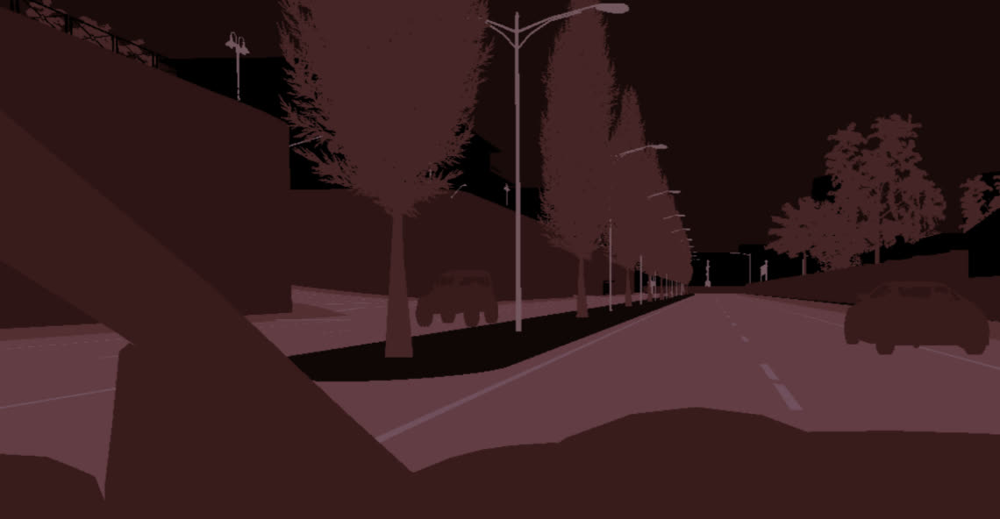

# UE4 场景捕获着色器

对于 [语义分割相机](https://carla.readthedocs.io/en/0.9.13/ref_sensors/#semantic-segmentation-camera) 等高级传感器，Carla 使用 [后处理材质](https://github.com/carla-simulator/carla/tree/master/Unreal/CarlaUE4/Plugins/Carla/Content/PostProcessingMaterials) 充当着色器，以最小的性能成本产生高质量的结果。

您可以在 [此处 (youtube)](https://www.youtube.com/watch?v=PiQ_JLJKi0M)  找到有关此主题的 UE4 精彩教程。

无需过多介绍细节，这里保存的后期处理效果材料可作为着色器，获取自定义模板/深度缓冲区等信息并非常有效地进行逐像素计算。

| 描述                                                                                                                                                                                                                                                                           | 示例                                              |
|------------------------------------------------------------------------------------------------------------------------------------------------------------------------------------------------------------------------------------------------------------------------------|-------------------------------------------------|
| 例如，Carla 的 `GTMaterial.uasset` 着色器用于将自定义模板信息编码到输出图像的**红色**通道中，从而生成如下图像（颜色夸张以方便查看）。然后在 PythonAPI 客户端中，应用 [City Palettes](https://github.com/OpenHUTB/carla/blob/OpenHUTB/LibCarla/source/carla/image/CityScapesPalette.h) 的 LibCarla 定义，按索引将图像转换为用户所需的颜色。                |    |
| 相比之下，我们的 `DReyeVR_SemanticSegmentation` 着色器建立在 Carla GTMaterial 的基础上，但直接在着色器本身中索引颜色数组，因此您可以毫不费力地直接在第一人称摄像机中获取语义颜色信息。 |  |

我们有兴趣在我们的重放功能中包含各种着色器输出。

为了实时演示我们在 DReyeVR 中包含的着色器，请按 `.`（句点）显示下一个着色器，按 `,`（逗号）显示上一个着色器。
