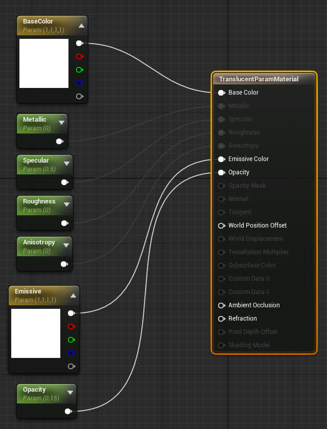

# DReyeVR 自定义参与者

## 什么？
我们经常对在模拟器中运行时生成任意“类似AR（增强现实）”的元素感兴趣，这些元素可以完全记录并轻松重现。 

### 示例：3D边界框
- 使用半透明（不透明度小于 1）材质，​​我们可以简单地创建一个细长的立方体演员，并将其覆盖在任何范围内，作为一个简单的 BBOX 指示器。
    - 我们可以让参与者跟踪一定的范围，这样它就可以跟随车辆/行人/任何东西，而不会干扰物理（物理模拟被禁用）。
    - 嘘！这实际上已经在代码中基本实现（但被禁用），请查看 [底部的示例](CustomActor.md#bounding-box-example) 

### 示例：凝视线
- 如果您想实时绘制视线（不使用仅限编辑器的 DrawDebugLine），您可以简单地使用细长的立方体作为从用户凝视原点到世界空间凝视目标的“射线”。

### 示例：调试轨迹
- 与 Carla 中的调试路径类似，生成动态球体轨迹有助于在世界中绘制类似 AR 的指导方针，并帮助引导驾驶员通过地图。

## 为什么？
1. 让每个“自定义参与者CustomActor”成为其自己的实体（不一定与 EgoVehicle/EgoSensor 绑定），可以轻松使用 Carla 记录器进行记录，而无需修改核心 DReyeVR 数据。当我们想要更改记录器的 API（这种情况经常发生）但又不想丢失之前实验的数据（这些实验的数据记录（二进制格式）我们无法轻松修改）时，这一点很重要。
2. 抽象“自定义参与者CustomActor”为我们在运行时操纵模拟器中的参与者提供了足够的灵活性，并允许轻松地执行新的有趣场景，而不必担心记录/重放。


# 使用

使用这些 CustomActors 的设计非常简单，并与 UE4/Carla 的 [AActors](https://docs.unrealengine.com/5.0/en-US/API/Runtime/Engine/GameFramework/AActor/) 概念相配合。您可以在 [`DReyeVRData.h`](https://github.com/OpenHUTB/carla/blob/OpenHUTB/Unreal/CarlaUE4/Plugins/Carla/Source/Carla/Sensor/DReyeVRData.h)`::CustomActorData` 中看到我们如何定义这些参与者的所有核心数据（以及记录/重放的内容）

我们已准备好几种基本的 3D 形状，供简单的 CustomActor 使用。理论上，您可以使用任何静态网格。要访问这些类型（或添加您自己的类型），您应该查看 [`DReyeVRCustomActor.h`](https://github.com/OpenHUTB/carla/blob/OpenHUTB/Unreal/CarlaUE4/Plugins/Carla/Source/Carla/Actor/DReyeVRCustomActor.h) 中的引用：
```c++
#define MAT_OPAQUE "Material'/Game/DReyeVR/Custom/OpaqueParamMaterial.OpaqueParamMaterial'"
#define MAT_TRANSLUCENT "Material'/Game/DReyeVR/Custom/TranslucentParamMaterial.TranslucentParamMaterial'"
#define SM_SPHERE "StaticMesh'/Engine/BasicShapes/Sphere.Sphere'"
#define SM_CUBE "StaticMesh'/Engine/BasicShapes/Cube.Cube'"
#define SM_CONE "StaticMesh'/Engine/BasicShapes/Cone.Cone'"

// 在此处添加新的字符串文字
#define SM_CUSTOM_MESH "StaticMesh'/Path/To/Your/StaticMesh.StaticMesh'"
```

## 生成自定义参与者

```c++
#include "Carla/Actor/DReyeVRCustomActor.h"
...
// 示例参数，你可以将其更改为你想要的任何值
FString PathToSM = SM_CUBE;
FString PathToMat = MAT_TRANSLUCENT;
FString Name = "NewActorName"; // 每个参与者需要一个唯一的名称！
UWorld *World = GetWorld();
ADReyeVRCustomActor *A = ADReyeVRCustomActor::CreateNew(PathToSM, PathToMaterial, World, Name);
```

从实现角度来看，自定义参与者全部由“全局”表 (`static std::unordered_map<std::string, class ADReyeVRCustomActor *>`) 管理，该表按参与者的名称对参与者进行索引，因此，所有参与者都必须具有唯一的名称。当生成许多参与者时，这通常很容易做到，因为 UE4 `AActor` 本身具有按其生成顺序枚举的唯一名称。要进一步了解我们如何使用全局表，请查看 [`DReyevRCustomActor.h`](https://github.com/OpenHUTB/carla/blob/OpenHUTB/Unreal/CarlaUE4/Plugins/Carla/Source/Carla/Actor/DReyeVRCustomActor.h) 中的 `ADReyeVRCustomActor::ActiveCustomActors`


## 激活/停用自定义参与者

要激活（在世界中查看），只需运行
```c++
A->Activate();
```
这将确保该参与者的每一次动作都会被 Carla 记录器记录下来。

同样，要停用参与者（禁用可见性、录制和动作功能），请执行以下操作：
```c++
A->Deactivate();
```

您可以使用 `A->IsActive()` 检查参与者是否“活跃”。如果为真（参与者活跃），则参与者将自动记录在 CArla 记录器中，从而可以轻松重放。

## 更新自定义参与者
这些方法来自 UE4 `AActor` 基类，我们的类继承并扩展了该基类。
```c++
// resize the actor
A->SetActorScale3D(FVector(1, 1, 0.5));

// move the actor
A->SetActorLocation(FVector(100, 200, 0));

// rotate the actor
A->SetActorRotation(FRotator(90, 45, 0));
```

假设您正在使用我们为您提供的参数材料之一，您也可以修改材料参数并让其实时生效：
```c++
// change vector properties
A->MaterialParams.BaseColor = FLinearColor(1, 0, 0, 1); // RGBA
A->MaterialParams.Emissive = 100.f * FLinearColor(1, 0, 0, 1); // RGBA

// change scalar properties
A->MaterialParams.Metallic = 0.f;
A->MaterialParams.Specular += 0.15f;
A->MaterialParams.Roughness = 1.f;
A->MaterialParams.Anisotropy = 0.5f;
```

请注意，为了使用不透明度 `Opacity` 属性，材质需要具有半透明混合模式。到目前为止，我们只有两种材质类型：不透明和半透明，每种都有自己的一组可用属性，如下所示：

| 不透明参数材质 OpaqueParamMaterial                                 | 半透明参数材质 TranslucentParamMaterial                                 |
|-------------------------------------------------------------|------------------------------------------------------------------|
|  |  |

## 边界框示例

作为 CustomActor 边界框实际操作的示例，请查看 [`LevelScript.cpp::DrawBBoxes`](../../DReyeVR/LevelScript.cpp) ，其中包含一些用于绘制半透明边界框的简单逻辑（根据与 EgoVehicle 的距离着色）。要启用此功能，您需要通过删除函数主体周围的 `#if 0` 和相应的 `#endif` 来手动启用它。

实际操作时可能如下所示：

