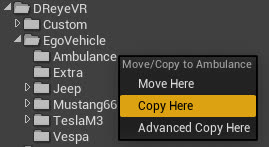
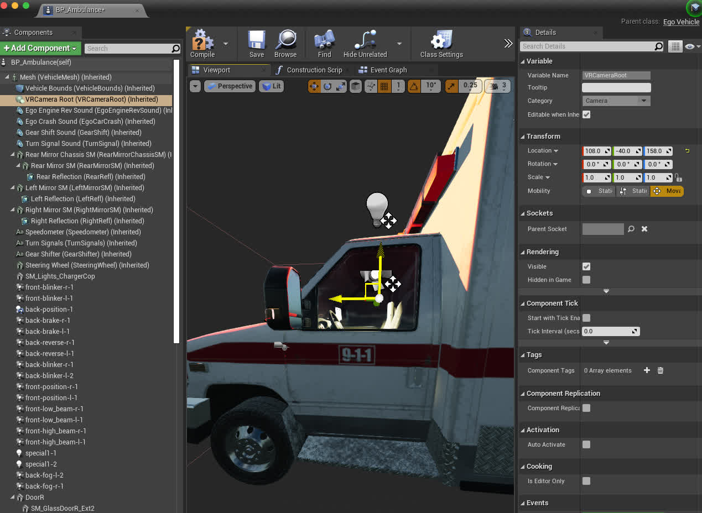
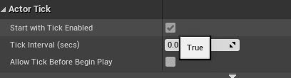

# 如何添加您自己的 EgoVehicle

本指南介绍如何从现有的 Carla 车辆添加您自己的自定义 EgoVehicle，然后您可以在 DReyeVR 中使用。展示将**救护车**添加为新的 DReyeVR EgoVehicle 所需的最少步骤。

## 先决条件
- 您应该已经安装 DReyeVR 并正常运行
- 如果您想修改新车辆的静态网格，您可能应该查看 [Model.md](Model.md)：
    - 例如，创建高多边形镜像网格
    - 例如，拆下方向盘用作动态道具（随动画移动）

## 1. 选择要添加的车辆
1. 由于 DReyeVR EgoVehicle 是 `ACarlaWheeledVehicle` 的子实例，因此您应该使用 Carla 车辆作为所需车辆的基类。在本教程中，我们将使用救护车作为示例，但任何 Carla 车辆都可以。
    - 针对车辆 `XYZ`
    - 蓝图文件位于 `Unreal/CarlaUE4/Content/Carla/Blueprints/Vehicles/XYZ/BP_XYZ.uasset`
    - 静态网格文件位于 `Unreal/CarlaUE4/Content/Carla/Static/Vehicles/XWheeled/XYZ/`
2. 一旦您决定了车辆，就通过复制（在虚幻编辑器中）蓝图文件来创建此结构。
    - 对您想要添加的任何其他网格组件执行相同操作。
    - 您需要让文件结构与现有的 EgoVehicles 相匹配：
    ```
    CarlaUE4/Content/DReyeVR/
    ├── EgoVehicle
    │   ├── Extra
    │   ├── Jeep
    │   ├── Mustang66
    │   ├── Ambulance # <-- 你的新 EgoVehicle
    │   ├── TeslaM3   # <-- DReyeVR 中默认的车
    │   └── Vespa
    ...
    ```
    - 在您的 `XYZ/` 文件夹中，您需要复制新的 BP_XYZ 资源（从编辑器执行此操作以便可以更新缓存路径）并在此处创建您可能需要的任何其他文件夹（例如，`Mesh`、`Mirrors`、`SteeringWheel`、`Tires` 是几个示例）。 
    - 最好在编辑器中执行这些资产文件修改。您可以通过单击并拖动将文件从内容浏览器复制到其他文件夹，以获取此弹出窗口： 

        

!!!注意
   如果您想编辑车辆网格，这里就是您要进行的操作。您可能希望在 `Static` 目录中构建现有的静态网格。

## 2. 重新定义车辆蓝图
（为了本教程的目的，我们假设 `XYZ=Ambulance`）

1. 打开刚从内容浏览器复制的 `Content/DReyeVR/EgoVehicle/Ambulance/BP_Ambulance` 资源

2. 选择 `Class Defaults`，然后在右上角（`Class Options`）中选择`Parent Class`，并搜索 `EgoVehicle` 进行重新父级设置（如下图所示）。这有效地将蓝图的基类从 `BaseVehiclePawn`（Carla 默认）重新组织为 `EgoVehicle`（DReyeVR C++ 类，仍然继承自 BaseVehiclePawn）。

    - 将会弹出有关数据丢失的警告，您应该继续（这纯粹是附加的）。

    - **注意** 如果蓝图损坏，您应该首先尝试重新回到 `BaseVehiclePawn`（原始父级），然后再回到 DReyeVR `EgoVehicle`。

    - 

        - 演示类设置按钮，用于编辑此BP的类实例

    - 
        - 演示重新父级按钮，选择下拉菜单并搜索兼容的类以使用 `BaseVehiclePawn`s（Carla）或 `EgoVehicle`（DReyeVR）重新父级。

3. 现在，从技术上讲，这辆车是 DReyeVR EgoVehicle！

## 3. 添加新的配置文件和代码
现在，要使用 DReyeVR 实际注册这个新蓝图并使其可供生成，您需要在代码中添加两位： 

1. 将新车辆的名称（例如，我们继承的 BP_Ambulance 蓝图的`"Ambulance"`）添加到 [`DReyeVRFactory.h`](https://github.com/OpenHUTB/carla/blob/OpenHUTB/Unreal/CarlaUE4/Source/CarlaUE4/DReyeVR/DReyeVRFactory.h) 中的可用 EgoVehicles 列表中。
    ```c++
    // place the names of all your new custom EgoVehicle types here:
    /// IMPORTANT: make sure these match the ConfigFile AND Blueprint!!
    // We expect Config/EgoVehicle/XYZ.ini and Content/DReyeVR/EgoVehicles/XYZ/BP_XYZ.uasset
    const std::vector<std::string> VehicleTypes = {
        "TeslaM3",   // Tesla Model 3 (Default)
        "Mustang66", // Mustang66
        "Jeep",      // JeepWranglerRubicon
        "Vespa"      // Vespa (2WheeledVehicles)
        "Ambulance", // <-- the new vehicle! (for this tutorial)
        // add more here
    };
    ```
2. 添加一个新的配置文件（到 `Unreal/CarlaUE4/Config/EgoVehicles/`），用于参数化此车辆。这允许 DReyeVR 知道将相机根位置（驾驶员座位）、镜子、方向盘等东西放在哪里，并且此 [`ConfigFile`](https://github.com/OpenHUTB/carla/blob/OpenHUTB/Unreal/CarlaUE4/Source/CarlaUE4/DReyeVR/ConfigFile.h) 可以扩展以支持许多运行时组合。
    - 您需要确保配置文件的名称与您的新 EgoVehicle 完全相同（这是它们的读取方式）。我们建议复制现有配置文件（默认为 `TeslaM3.ini` 并重命名如下）：
        ```
        CarlaUE4/Config/
        ├── ...
        ├── DReyeVRConfig.ini
        ├── ...
        ├── EgoVehicles/
        │   ├── Jeep.ini
        │   ├── Mustang66.ini
        │   ├── Ambulance.ini # <-- your new file!
        │   ├── TeslaM3.ini
        │   └── Vespa.ini
        ├── ...
        ...
        ```
    - 然后，您可能需要编辑此文件的一些内容，以匹配可以从编辑器中获取的 EgoVehicle 规范。例如，下图显示我们要将 VRCameraRoot（头部位置）移动到 (`108, -40, 158`)。 
        - 
        - 您可能还希望将仪表板元素移动到适合您喜好的位置。 
    - **重要** 您还需要为蓝图（组件列表中的 `BP_Ambulance`）启用`Start with Tick Enabled`，因为默认情况下，它们对于 Carla 车辆是禁用的：
        - 
    - 您还应该注意到，SteeringWheel 和 Mirrors 等资产没有分配任何静态网格。您可以通过单击组件（在左侧层次结构上）并分配新的静态网格（在右侧详细信息窗格上）来访问它们。这会直接在蓝图文件中烘焙资产，因此只需执行一次即可。

        | 示例：Mirrors                                    | 示例：Steering wheel                           |
        |-----------------------------------------------|----------------------------------------------|
        |  |  
    - 现在，打开刚刚创建的 `Ambulance.ini` 文件，并开始更新字段（主要是转换）以匹配您关心的参数。重要的是，对于`[Blueprint]::Path` 条目，您可以通过右键单击内容查看器中的蓝图并选择`Copy Reference`来获取此路径。
        - 
        - 请注意，变换的编码如下
        ```ini
        # Format: Location XYZ in CM | Rotation Roll/Pitch/Yaw in Degrees | Scale XYZ percent (1=100%)
        ExampleTransform=(X=0.0, Y=0.0, Z=3.0 | R=-45, P=90.0, Y=0 | X=1, Y=1, Z=1)
        ```

## 4. 将新车辆设置为 DReyeVR 默认车辆
在 `DReyeVRConfig.ini` 通用配置文件（用于非车辆特定参数）中，您应该设置默认生成的车辆。这将采用车辆的名称，在本例中为救护车`Ambulance`。 

```ini
[EgoVehicle]
VehicleType="Ambulance"
```

就这样！现在您应该能够重新启动 `make launch` 了，当您按下 Play 时，您将开始使用新的 EgoVehicle。


## 4. [可选] 创建新动画
有时，尤其是在修改 blender 中的网格并将其导出/导入回虚幻引擎时，原始动画资源可能会有些混乱，无法正常工作。如果轮胎（和方向盘，如果您添加了方向盘）在 EgoVehicle 移动时没有转动，您就会知道动画是否失败。

请参阅 [此处](https://carla.readthedocs.io/en/latest/tuto_A_add_vehicle/#import-and-configure-the-vehicle) 的 Carla 相应文档。

!!! 注意 截至测试，这仅适用于 4WheeledVehicles。2WheeledVehicles 更为复杂，本教程未涉及。

### 为 Carla/DReyeVR 创建新动画蓝图的步骤
1.在 Ambulance/Mesh 目录中创建一个新的动画蓝图（如果有的话，否则在 `Ambulance` 内创建一个新的文件夹 `Mesh/`）。


2.确保动画网格的父级设置为 `VehicleAnimInstance`，并且预览骨架设置为新车辆的骨架网格（例如 `SK_Ambulance_Skeleton`） 
[CreateAnimBP](../Figures/EgoVehicle/CreateAnimBP.jpg)

3.将新资产命名为 `Anim_Ambulance` 并打开它。打开右下角的 AnimationGraph，如下所示：


4.打开另一个附近的动画蓝图（例如 `Content/DReyeVR/EgoVehicle/TeslaM3/Mesh/Animation_model3`）并打开其 AnimationGraph 以复制连接到 Output Pose 的前三个蓝图节点，如下所示：


5.然后，返回 `Anim_Ambulance`，粘贴刚刚复制的三个节点并将它们连接到输出姿势(Output Pose)： 


6.最后，返回车辆蓝图（BP_Ambulance）并在组件部分选择网格，然后在（右侧）详细信息面板中将动画类更改为新的 `Anim_Ambulance`，如下所示：

