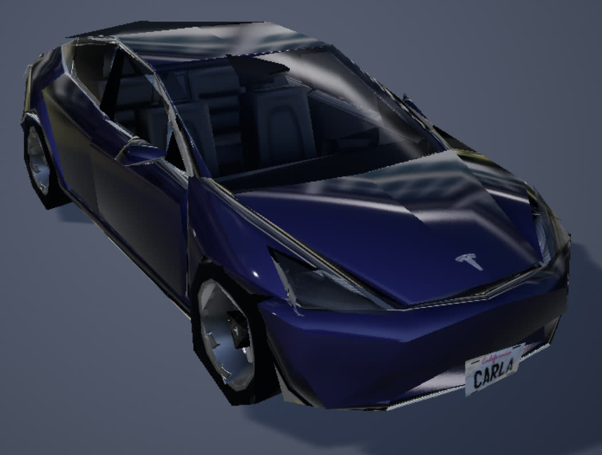

# UE4 中的细节级别（Level Of Detail）模式

## 什么？
LOD = "Level of Detail"（层次细节模型）

有没有注意到，在主流视频游戏/3D 程序中，大多数模型/纹理的质量（多边形数量/分辨率）在距离较远时会降低？这是一种优化，距离较远的物体可能使用较少的计算能力。[UE4 文档](https://docs.unrealengine.com/4.26/en-US/WorkingWithContent/Types/StaticMeshes/HowTo/AutomaticLODGeneration/) 对此进行了最好的解释。

以下是 Carla 提供的 `SM_Tesla` 静态网格的示例

| LOD 0 (14,406 三角形)       | LOD 1 (3,601 三角形)        | LOD 2 (1,799 三角形)        | LOD 3 (864 三角形)          |
| ------------------------------ | ------------------------------ | ------------------------------ | ------------------------------ |
|  |  |  |  |

## 好吧那又怎么样？
虽然 Carla 中的默认 LOD 设置相当不错，但这样做是可行的，因为 **Carla 不是为 VR 设计**的，需要在平面屏幕上运行。但是，我们在 VR 设置中使用 Carla，当模型转换为低质量/高质量形式时，这种现象很快就会变得更加明显。这可能会让佩戴头显的人分心，并破坏沉浸感。

### 下载预编译的网格
如果您对创建自己的 LODSettings 资源并批量应用它的步骤不感兴趣，请跳过所有内容直到**下载所有内容**步骤，否则请继续阅读。

## 如何修复？
最好的“修复”是改变距离阈值，这样转换就会更加积极，并能更长时间地保持高质量。当然，质量的提高是以牺牲性能为代价的。

我们发现了一种可能的解决方法（不幸的是，它对我们不起作用），这是 Carla 贡献者的评论，他详细阐述道：“植被和其他模型的弹出是由细节级别引起的。我们有相同模型的不同版本，具有不同的多边形级别，可根据与相机的距离替换最终模型。理想情况下，这些变化是不可察觉的，但需要进行更多调整才能达到理想状态。您可以通过在虚幻引擎控制台中输入 `r.forcelod 1` 和 `foliage.ForceLOD 1` 来强制将所有内容设置为最高 LoD”。同样，还有进一步的工作要研究纹理 MipMapping（类似的想法，但用于纹理），它使用 UE4 的 TextureStreaming。对于本指南，我们将主要关注更改主要车辆的 LOD 设置。

### 重要
从技术上讲，LOD 选取背后的逻辑并非基于通常描述的“与相机的距离”，而是基于模型所占用的“屏幕空间”。[UE4 文档中关于 LOD 屏幕尺寸](https://docs.unrealengine.com/4.26/en-US/WorkingWithContent/Types/StaticMeshes/HowTo/PerPlatformLODScreenSize/) 的说明对此进行了最好的解释（忽略每个平台的覆盖，我们所做的一切都是在桌面客户端上进行的），其中提到“为了控制一个细节级别 (LOD) 静态网格何时过渡到另一个，虚幻引擎 4 (UE4) 使用屏幕空间中静态网格的当前大小”。

## 深入探究 UE4
为了真正访问每个蓝图的 LOD，我们实际上需要退后一步，查看模型的 [`SkeletalMesh`](https://docs.unrealengine.com/4.26/en-US/WorkingWithContent/Types/SkeletalMeshes/) ，而不是蓝图本身。骨架网格位于 `StaticMesh` 和最终蓝图之间，因为它包含静态网格不包含的所有 animations/rigging/physics/etc ，但不包含可用参与者的任何控制逻辑。

例如，对于 `SM_TeslaM3_v2` 骨架网格（注意，还有一个 `SM_Tesla` 静态网格，遗憾的是命名方案不太一致），转到内容浏览器中的 `Content/Carla/Static/Vehicles/4Wheeled/Tesla/` 以查看以下文件夹布局：


请注意，**粉红色**下划线的模型是我们感兴趣的骨架网格。双击它即可在编辑器中打开它。

然后，在左侧的 `Asset Details` 窗格（下面以**红色**突出显示）中，您可以看到 LOD Picker 设置当前设置为 Auto (LOD0)，这将根据您的距离自动计算并分配此网格的 LOD。您可以在预览窗口的左上角看到当前 LOD 设置的运行情况（下面以**黄色**突出显示）。


您可以从 LOD 选择器中选中`"Custom"`框并手动编辑各个 LOD 设置，但这是一项繁琐的工作，需要单独应用于**每个**静态网格。在本指南中，我们将尝试避免繁琐的工作。

## 有没有更好的方法？
是的，确实有！（ [更多文档](https://docs.unrealengine.com/4.26/en-US/AnimatingObjects/SkeletalMeshAnimation/Persona/MeshDetails/) ）

在 `LOD Settings` 中的 LOD Picker 下，您可能会注意到 LOD Settings 部分。打开它并关注 LODSettings 输入（当前为空“无”）。这意味着存在一个 `.uasset` 资产，我们可以创建它来概括所有车辆的 LOD 设置。我们只需要事先将此 LODSetting 资产应用于每个车辆一次。


如果您没有现有的 LODSettings 资源（我们在 [`Tools/LOD/SM_Vehicle_LODSettings.uasset`](Tools/LOD/SM_Vehicle_LODSettings.uasset) 中提供了一个），您可以使用`Generate Asset`按钮创建一个。我们将我们的资源移至新的 `4Wheeled/DReyeVR/` 目录。然后在 LODSettings 中，选择下拉菜单并选择新创建的 LODSetting。

如果您没有现有的 LODSettings 资源（我们在 [`Tools/LOD/SM_Vehicle_LODSettings.uasset`](Tools/LOD/SM_Vehicle_LODSettings.uasset) 中提供了一个），您可以使用“生成资源”按钮创建一个。我们将我们的资源移至新的 `4Wheeled/DReyeVR/` 目录。然后在 LODSettings 中，选择下拉菜单并选择新创建的 LODSetting。

| LODSettings pre application                    | LODSettings post application                    |
| ---------------------------------------------- | ----------------------------------------------- |
|  |  |

现在您应该能够在编辑器中打开新创建的 `LODSettings` 资源 (`SM_Vehicle_LODSettings`)，并从那里编辑所有重要的 LOD 参数。这里是对屏幕尺寸进行微调的地方，因为您可以在转换发生时手动进行调整。


### 注意

需要注意的是，不同的车辆甚至具有不同的 LOD 数量，有些车辆（例如 `SM_TeslaM3_v2` 有 4 个）的 LOD 数量比其他车辆多或少。因此，为了让单个 LODSetting 适用于所有人，我们需要确保其数组与所有请求网格的最大 LOD 一样大。由于实际上不应该对此有限制，我们使用了一个大小为 7 的数组（并非所有车辆都需要访问所有 7 个）来留出一些腿部空间（无数组 OOB 例外）。

| LOD | 默认 (`SM_TeslaM3_v2`) 屏幕大小 | New LODSettings 屏幕大小 |
| --- |--------------------------------------|---------------------------------|
| 0   | 2.0                                  | 1.0 (max)                       |
| 1   | 0.4                                  | 0.2                             |
| 2   | 0.21                                 | 0.05                            |
| 3   | 0.12                                 | 0.03                            |
| 4   | N/A                                  | 0.01                            |
| 5   | N/A                                  | 0.005                           |
| 6   | N/A                                  | 0.001                           |

这看起来应该类似于以下内容（LODGroups 折叠）：


理论上，我们应该能够完全用 C++ 实现这个类，因为它是一个 [`USkeletalMeshLODSettings`](https://docs.unrealengine.com/4.26/en-US/API/Runtime/Engine/Engine/USkeletalMeshLODSettings/) 类。但它在优先级列表中相当低。

## 好吧现在怎么办？
现在我们可以编辑 `SM_Vehicle_LODSettings.uasset` 文件，并且 `SM_TeslaM3_v2` 的所有 LOD 设置都应遵循它。这太棒了！

- 请注意，有时网格会使用缓存的 LOD 来强制重新生成，单击 `LODSettings` 中 `SM_TeslaM3_v2` 编辑器窗口中的`Regenerate`按钮。下次启动编辑器`make launch`时，这应该不会成为问题。

现在，如果能将这个 `SM_Vehicle_LODSettings.uasset` 一次性应用于所有静态网格，那就太好了，对吧？事实证明，我们可以通过 [bulk-edit-via-property-matrix](https://docs.unrealengine.com/4.26/en-US/Basics/UI/PropertyMatrix/) 来实现这一点

我们建议采取以下步骤：

1. 进入内容浏览器中的 `4Wheeled/` 目录

2. 在右下角（查看选项）取消选中 `Folders` 选项 

3. 在左上角单击`Filters`，然后选中`SkeletalMesh`选项

   - 现在你应该看到这个（注意所有带下划线的粉色）：
	

4. 现在选择`除以下之外`的所有网格

	- Windows:
       1. SM_Cybertruck_v2
       2. SM_ETron
	- Linux:
       1. SK_Charger2020
       2. SK_ChargetCop
       3. SK_lincolnv5
       4. SK_MercedesCCC
	
	- 我们仍不确定原因，但这些特定车辆在此应用程序中会导致分段错误（与它们的顶点构成有关）。您需要手动设置每个车辆的单独自定义 LOD 的 LOD 参数（即，完全不要使用 `SM_Vehicle_LODSettings.uasset`） 

5. 右键单击任意突出显示的车辆 -> `Asset Actions` -> `Bulk Edit via Property Matrix` 
	
6. 在打开的`Bulk Edit`窗口中，验证左侧所有正确的骨架网格体，然后在右侧的 `LODSettings` 中，单击 3x3 网格图标（选择资产）并选择新创建的 `SM_Vehicle_LODSettings.uasset` 资产。

   1. To apply this to all the selected skeletal meshes, go to the top bar -> `File` -> `Save`
   2. The end result should look something like this:
	

As mentioned in step 4, some particular vehicles cause a seg-fault after giving them this `LODSettings`. We are still investigating why exactly but for now its safer to just manually go into each vehicle and tune the individual `LOD` settings after checking `Custom` and seeing the `LOD0`, `LOD1`, `LOD2`, ... etc. options. 

## Finished
Now, all the static meshes (with some exceptions) will respect any changes made to `SM_Vehicle_LODSettings.uasset` automatically, so you won't have to reapply the settings each time you want to make a change to the LODSettings asset, just make the change.

Also, if something unfortunate happens and one of your skeletal meshes gets corrupted (its happened to us), then its fairly simple to reclone a `Carla 0.9.13` build, run the `Update.sh` script and copy over the old (new) static meshes to replace the ones in your existing project. 

## Download everything instead
Option 1: (use our script)
```bash
cd DReyeVR/Tools/LOD/
# installing on Linux
./install_LOD.sh /PATH/TO/CARLA Linux
# installing on Windows
./install_LOD.sh /PATH/TO/CARLA Windows
# installing Original (reset all changes)
./install_LOD.sh /PATH/TO/CARLA Original
```
Option 2: (manually)
- Follow these simple steps:
  1. Download all the static meshes from this link ([Linux](https://drive.google.com/file/d/1OqDOCAflENnXvbJCogBEmRhHQpEF1aKE/view) or [Windows](https://drive.google.com/file/d/191tiK25MJ9C7-5Q1-sHt1mp4_EaefjqM/view)) 
  2. Extract all files 
  3. Copy files to the following directories

These are the important skeleton meshes and directories
```bash
Unreal/CarlaUE4/Content/Carla/Static/Vehicles/4Wheeled/Toyota_Prius/Vh_Car_ToyotaPrius_Rig.uasset
Unreal/CarlaUE4/Content/Carla/Static/Vehicles/4Wheeled/AudiA2_/SK_AudiA2.uasset
Unreal/CarlaUE4/Content/Carla/Static/Vehicles/4Wheeled/BmwGranTourer/SK_BMWGranTourer.uasset
Unreal/CarlaUE4/Content/Carla/Static/Vehicles/4Wheeled/BmwIsetta/SK_BMWIsetta.uasset
Unreal/CarlaUE4/Content/Carla/Static/Vehicles/4Wheeled/CarlaCola/SK_CarlaCola.uasset
Unreal/CarlaUE4/Content/Carla/Static/Vehicles/4Wheeled/DodgeCharger2020/SK_Charger2020.uasset
Unreal/CarlaUE4/Content/Carla/Static/Vehicles/4Wheeled/DodgeCharger2020/ChargerCop/SK_ChargerCop.uasset
Unreal/CarlaUE4/Content/Carla/Static/Vehicles/4Wheeled/Chevrolet/SK_ChevroletImpala.uasset
Unreal/CarlaUE4/Content/Carla/Static/Vehicles/4Wheeled/Citroen/SK_Citroen_C3.uasset
Unreal/CarlaUE4/Content/Carla/Static/Vehicles/4Wheeled/Jeep/SK_JeepWranglerRubicon.uasset
Unreal/CarlaUE4/Content/Carla/Static/Vehicles/4Wheeled/LincolnMKZ2020/SK_lincolnv5.uasset
Unreal/CarlaUE4/Content/Carla/Static/Vehicles/4Wheeled/Mercedes/SK_MercedesBenzCoupeC.uasset
Unreal/CarlaUE4/Content/Carla/Static/Vehicles/4Wheeled/MercedesCCC/SK_MercedesCCC.uasset
Unreal/CarlaUE4/Content/Carla/Static/Vehicles/4Wheeled/MIni/SK_MiniCooperS.uasset
Unreal/CarlaUE4/Content/Carla/Static/Vehicles/4Wheeled/Mustang/SK_Mustang_OLD.uasset
Unreal/CarlaUE4/Content/Carla/Static/Vehicles/4Wheeled/Nissan_Micra/SK_NissanMicra.uasset
Unreal/CarlaUE4/Content/Carla/Static/Vehicles/4Wheeled/Nissan_Patrol/SK_NissanPatrolST.uasset
Unreal/CarlaUE4/Content/Carla/Static/Vehicles/4Wheeled/Leon/SK_SeatLeon.uasset
Unreal/CarlaUE4/Content/Carla/Static/Vehicles/4Wheeled/AudiTT/SM_AudiTT_v1.uasset
Unreal/CarlaUE4/Content/Carla/Static/Vehicles/4Wheeled/DodgeCharge/SM_Charger_v2.uasset
Unreal/CarlaUE4/Content/Carla/Static/Vehicles/4Wheeled/Chevrolet/SM_Chevrolet_v2.uasset
Unreal/CarlaUE4/Content/Carla/Static/Vehicles/4Wheeled/Cybertruck/SM_Cybertruck_v2.uasset
Unreal/CarlaUE4/Content/Carla/Static/Vehicles/4Wheeled/AudiETron/SM_Etron.uasset
Unreal/CarlaUE4/Content/Carla/Static/Vehicles/4Wheeled/LincolnMKZ2017/SM_Lincoln_v2.uasset
Unreal/CarlaUE4/Content/Carla/Static/Vehicles/4Wheeled/Mustang/SM_Mustang_v2.uasset
Unreal/CarlaUE4/Content/Carla/Static/Vehicles/4Wheeled/Tesla/SM_TeslaM3_v2.uasset
Unreal/CarlaUE4/Content/Carla/Static/Vehicles/4Wheeled/Truck/SM_TestTruck.uasset
Unreal/CarlaUE4/Content/Carla/Static/Vehicles/4Wheeled/VolkswagenT2/SM_Van_v2.uasset
```

### NOTE: Sometimes there are still segfaults with these LOD's on different machines. 
For example, the `SM_Cybertruck_v2` and `SM_Etron` skeletal meshes cause seg-faults on Windows, but not on Linux. 
- In order to check which ones cause the segfault, open all the skeletal meshes in `4Wheeled` one by one (or select them all) and replace them with the original skeleton meshes. 
- Note, we've provided the original models [here](https://drive.google.com/file/d/1Vc4e43xZuXOJF_3-r3n3QU-yE5sjiAfw/view) which you can use to replace any broken skeletons
  - But ideally our Windows/Linux downloads should work on those platforms. Summary of broken skeleton mesh:
    - Windows:
      - SM_Cybertruck_v2
      - SM_Etron
    - Linux:
      - SK_Charger2020
      - SK_ChargerCop
      - SK_lincolnv5
      - SK_MercedesCCC
