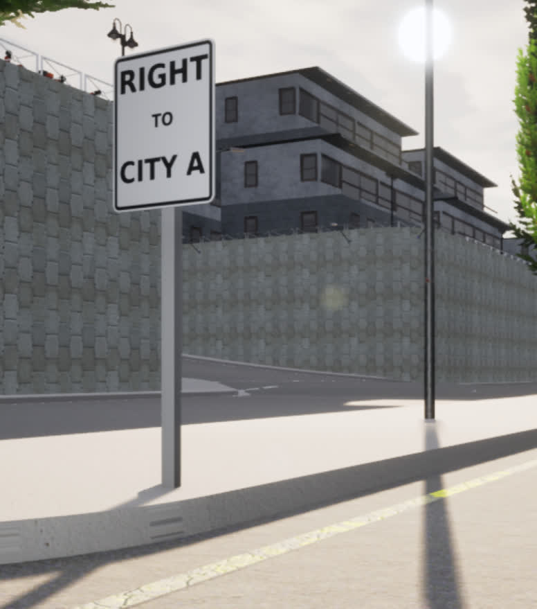

# 在 Carla 世界中添加定制的标志

## 简介
让实验参与者自然地知道要采取什么方向，而无需人工干预，这通常很有用。在 Carla 中这不是问题，因为所有驾驶员都是 AI 控制器，但对于人类来说，我们不能简单地获取表示路点和方向的文本文件。这就是环境中的方向标志可以发挥作用的地方。不幸的是，Carla 没有提供任何方向标志（因为这对他们来说不是问题），而且有足够多的步骤需要指南，所以请看这里。

本指南将向您展示如何创建自己的自定义标志并将其放置在任何 Carla 关卡中（*从技术上讲，该指南可以在 Carla 中添加任何自定义道具，而不仅仅是标志*）

- 步骤如下：

1. 创建标志纹理（RGB/法线）
2. 创建标志网格/材质
3. 将材质应用到蓝图上
4. 手动将蓝图放入世界中
5. **可选：** 使用蓝图库注册新标志

## 入门
可以在 Carla 中的 `carla/Unreal/CarlaUE4/Content/Carla/Static/TrafficSign/` 目录中找到标志纹理。

例如，您应该看到如下所示的目录：


请注意，所有模型都有相应的目录（屏幕截图中有些被截断了）。这些是定义静态网格和纹理的地方，因此它们可以在这些标志形蓝图上使用。

- 对于本指南的其余部分，我们将重点介绍使用 `NoTurn` 目录，该目录在内容浏览器中打开时如下所示：


- 从左到右依次为 **Material Instance** (`M_` 前缀), **Static Mesh** (`SM_` 前缀), **Texture RGB** (`__0` 后缀), 和 **Texture Normals** (`_n` 后缀)

## 步骤 1：创建标志纹理
“禁止转弯(NO TURN)”标志是创建自定义标志的良好基础，尽管任何标志都可以作为起点。

现在，您可以截取图像的屏幕截图（或在“Details->File Path”中找到其源文件）以获取所需纹理的 `.jpg`，然后清除原始文本（“禁止转弯（NO TURN）”），使其成为空白画布。为了方便起见，我们在 [`Content/Static/DefaultSign.jpg`](../../Content/Static/DefaultSign.jpg) 中提供了一个空白的“禁止转弯(NO TURN)”标志

- 请注意，这些图片的右下角有一小块灰色区域。这实际上是标牌的背面，因此当它贴到模型上时，背面就有了金属表面。
  - 这意味着我们希望在黑色边界内的区域内完成大部分标志内容的编辑

为此，拥有一个强大的图像编辑工具很有用，我们使用了 [GIMP](https://www.gimp.org/) （免费和开源），本节的其余部分将其作为图像编辑工具。

在 Gimp 中，您应该能够在指定区域内添加任何您喜欢的静态组件（文本、图像等）。完成新标志图像后，将其导出为 `.jpg`。

接下来，您需要 GIMP 为您创建法线贴图。这可以通过依次选择`Filters -> Generic -> Normal Map`，并将默认法线生成应用于新创建的图像来轻松完成。导出此文件并使用后缀 `_n.jpg` 来表明它是法线贴图。

例如，如果我们希望标志上写着 "RIGHT TO CITY A(右转至 A 市)"，那么经过这个过程后，你应该会看到如下内容：


现在我们已经完成了图像处理和 GIMP 的使用。

现在回到 UE4，如果将 `TrafficSign/NoTurn/` 目录复制到自定义目录（例如具有所有相同的 4 个元素（材质、静态网格、纹理 RGB 和纹理法线）的 `DReyeVR_Signs/`），那会最容易。

!!! 注意
    有些用户报告无法直接在编辑器中复制/粘贴/复制。在这种情况下，只需在文件管理器中执行这些操作，然后重新打开编辑器即可。

```shell
cd $CARLA_ROOT/Unreal/CarlaUE4/Content/Carla/Static/TrafficSign/
    cp -r NoTurn/ RightCityA/
```
```shell
# now RightCityA contains the following
RightCityA
- M_NoTurns.uasset
- SM_noTurn.uasset
- SM_noTurn_n.uasset
- SM_noTurn_.uasset
```


|                                                                                                                                                                                                                                                                      |                                                                    |
|----------------------------------------------------------------------------------------------------------------------------------------------------------------------------------------------------------------------------------------------------------------------| ------------------------------------------------------------------ |
| 现在，在您的新自定义目录中，您可以通过单击顶部的`Reimport`按钮轻松地重新导入新的 `.jpg` 源文件。 </br> </br> 找到用于 `SM_noTurn` 重新导入的 rgb `.jpg` 图像，并使用法线 `.jpg` 图像进行 `SM_noTurn_n` 重新导入。 |  |

您可以**在编辑器中**随意重命名 `SM_noTurn_*` 资产文件（在内容浏览器中单击右键 -> 重命名）并保留命名方案。例如 `SM_RightCityA` 和 `SM_RightCityA_n`。

## 第 2 步：创建标志网格和材质
现在，您应该确保 **Material** (`M_noTurns`) 资源文件已使用新纹理更新。这可能会自动发生，但为了以防万一，您应该在编辑器中打开它，并分别选择新创建的 `SM_RightCityA` 和 `SM_RightCityA_n` 作为 `SpeedSign_d` 和 `SpeedSign_n` 的纹理参数值。

- 为此，请点击显示 `SM_noTurn` 和 `SM_noTurn_n` 的下拉菜单框，然后搜索新的 `RightCityA` 变体
- 参数看起来应该是这样的
	

保存它并重命名（**在编辑器中**）：`M_RightCityA` 就足够了。

现在，最后打开 `SM_noTurn`_（静态网格）资产文件，并通过编辑材质槽中的材质元素确保它使用我们新创建的 `M_RightCityA` 材质：

- 与之前类似，在详细信息窗格中，单击下拉菜单，搜索“RightCity”，然后选择我们的新材料即可完成此操作
	

保存并重命名（始终**在编辑器中**）：`SM_RightCityA` 生效了。

此时您应该有一个如下所示的 `RightCityA` 目录：


## 步骤 3：将新材料应用到蓝图上

一旦所有所需的材料/静态网格准备就绪，复制一个标志蓝图（来自父 `TrafficSign` 目录）并将其放置在 `RightCityA`

- 这应该可以在编辑器中完成。右键单击 `BP_NoTurns` -> 复制 -> 输入新名称 -> 拖动到 `RightCityA`/ -> 选择移动

打开蓝图到`视口(Viewport)`选项卡并选择标志组件（不是杆）

在“细节(Details)”窗格中，您应该再次看到仍然是 `SM_noTurn_` 的静态网格组件，将其替换为新的 `SM_RightCityA_` 资源，重新编译并保存，然后就完成了。

现在它看起来应该是这样的：


## 第四步：将新标志放在世界上

有了新的标志蓝图，我们可以相当轻松地将其放入世界中。只需将其拖放到世界中，然后编辑其变换、旋转和缩放参数即可微调结果。

最终结果看起来应该相当不错，这是我们在 `Town03` 中的新标志的一个例子

| 标志牌正面                           | 标志牌背面                        |
| ------------------------------------------- |----------------------------------------------|
|  |  |

请注意前部和后部看起来都很好，这是因为后部从纹理的右下方获得了金属区域。

## 步骤 5：（可选）向蓝图库注册

使用 Carla 的蓝图库注册我们的新标志使我们能够从 PythonAPI 生成标志，从而允许在运行时动态放置。

这比现有的 Carla 标志更深入一些，因为它们不是设计为动态生成的，而是在编译时静态地放入世界中。如果我们想在地图周围放置不同的标志以适应各种场景，而无需重新编译所有内容，这会变得令人沮丧。

根据 [this issue](https://github.com/carla-simulator/carla/issues/4363) ，在 Carla 0.9.11 上使用自定义道具的常规方式目前已损坏且不可靠。我们找到了一种 [解决方法](https://github.com/carla-simulator/carla/issues/4363#issuecomment-924140532) 并将其包含在问题中。

本质上，您需要编辑 `carla/Unreal/CarlaUE4/Content/Carla/Config/Default.Package.json` 文件以包含您的新标志道具，如下所示：

```json
	{
		"name": "YOUR_SIGN_NAME",
		"path": "/PATH/TO/YOUR/SM_SIGN.SM_SIGN",
		"size": "Medium"
	}
```
Note that the `"path"` source is looking for a UE4 static mesh object, which will be stored as a `.uasset` file. Still denote it as `SM_name.SM_name` in the `json`. 

Importantly, if you want to include a custom prop directory in `Content/` (instead of using our `DReyeVR/DReyeVR_Signs/` content) you should add this to the list of cooked assets in `Config/DefaultGame.ini` such as:

```ini
+DirectoriesToAlwaysCook=(Path="/Game/DReyeVR/DReyeVR_Signs") # what we include
+DirectoriesToAlwaysCook=(Path="/Game/YOUR_PROP_DIR/") # any desired prop directory
```
This ensures your custom props are properly cooked during shipping (`make package`). 

Once this change is imported in the map you will be able to spawn your sign as follows:
```python
bp = blueprint_library.filter(("static.prop.YOUR_SIGN_NAME").lower()) # filter is lowercase!
assert len(bp) == 1 # you should only have one prop of this name
transform = world.get_map().get_spawn_points()[0] # or choose any other spawn point
world.spawn_actor(bp[0], transform) # should succeed with no errors
```

**NOTE** In constructing our (and Carla's) signs, we unlink the sign itself from the pole it connects to. Therefore, if you want to spawn the sign *with* the pole you'll need to combine these static meshes. 
- This is supported within the editor by placing both actors into the world, selecting both, then using the Window -> Developer -> MergeActors button as described in [this guide](https://docs.unrealengine.com/4.27/en-US/Basics/Actors/Merging/). 
- We have already provided a baseline with the [`Content/DReyeVR_Signs/FullSign/`](Content/DReyeVR_Signs/FullSign/) directory where we combined the signs with the poles as a single static mesh. 
	- With this baseline, assuming you have a compatible material (using the same sign template as ours) you can just update the material for the sign component without further modification. 


# Automatic Sign Placement
When using our [scenario-runner fork](https://github.com/HARPLab/scenario_runner/tree/DReyeVR-0.9.13), there is logic to enable spawning the corresponding directional signs automatically according to the route features (straight, turn left, turn right, and goal). The logic for this can be found in the [route_scenario's nav sign code](https://github.com/HARPLab/scenario_runner/blob/3b5e60f15fd97de00332f80610051f9f39d7db8c/srunner/scenarios/route_scenario.py#L284-L355). Since this is automatically applied to all routes, you can disable it manually by commenting the `self._setup_nav_signs(self.route)` method call.

There is also a file method in case you want to manually place signs for specific routes (see [here](https://github.com/HARPLab/scenario_runner/blob/DReyeVR-0.9.13/srunner/data/all_routes_signs.json)), but we found that the automatic sign placement works fine most of the time and is much more convenient. So the automatic method is recommended and you don't have to do anything to enable it.