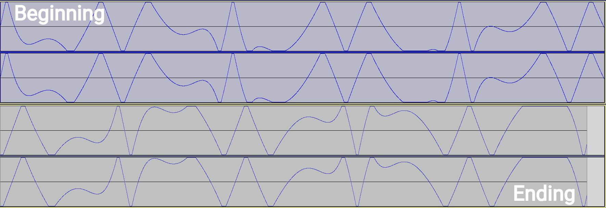
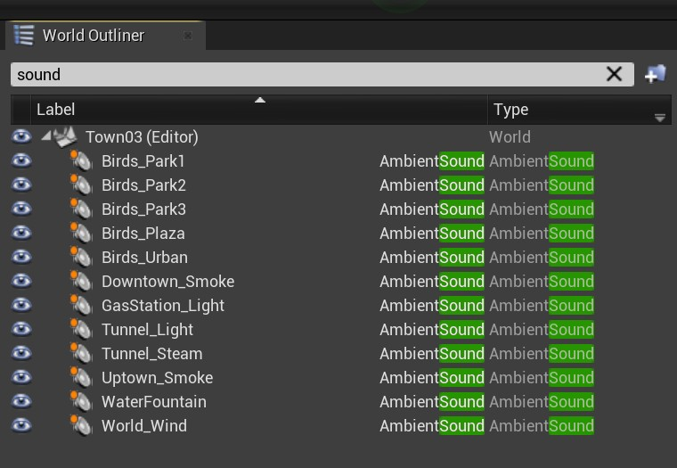
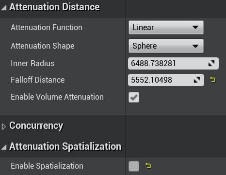
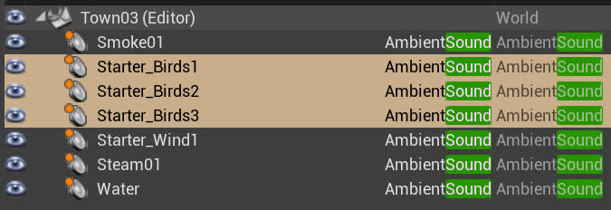

# 在 Carla + `DReyeVR` 中添加和使用声音

试用 `Carla`（所有版本）时，您可能首先注意到的一件事是模拟器中完全没有声音。然而，就我们的目的而言，我们力求为用户提供沉浸式体验，并向用户提供有关世界的大量反馈，而声音是添加这种体验的好方法。

在本文档中，我们将介绍如何添加以下声音：
1. 车辆发动机转速
2. 其他车辆声音（齿轮/转向信号）
3. 环境噪音 
4. 致谢

## 发动机转速
对于用户使用油门来说，最好的反馈机制之一是发动机转速增加时发出的轰鸣声。
- 是的，我们知道，我们为我们的自我车辆使用了特斯拉模型，但却给它配备了发动机/齿轮噪音......亵渎！

[**致谢**]本节大部分内容来自 [YouTube 上这个非常有用的指南](https://www.youtube.com/watch?v=-c-f1aaIOnU) ，该指南也 [以文章的形式提供](https://continuebreak.com/articles/generating-setting-basic-engine-sounds-ue4-part-12/) 。我们强烈建议您查看它以获取以下步骤的分步说明和视觉效果。
### 创造声音
（如果您已经有引擎所需的声音文件，请跳过此步骤）
1. 下载所需软件：
   - [LMMS](https://lmms.io/) （下载适用于 [Linux](https://lmms.io/download#linux) / [Windows](https://lmms.io/download#windows) / [Mac](https://lmms.io/download#mac ）用于创建音乐曲目 
2. 创建 4 种声音，分别对应发动机怠速 (1)、缓慢运转 (2)、正常运转 (3) 和以最大转速运转 (4) 
   - 对于所有这些曲目，我们将从单个 TripleOscillator 播放恒定的 C2 八度（4 个节拍应该就可以了）开始。
      | 配置                                                                                                                                                                                                                                                                                                | 视觉                                                  |
      | ------------------------------------------------------------------------------------------------------------------------------------------------------------------------------------------------------------------------------------------------------------------------------------------------------------ | --------------------------------------------------------- |
      | PM value for OSC1+OSC2   PM value for OSC2+OSC3   OSC1 volume of 60  OSC1 CRS of -4  OSC1 to use triangle wave   OSC2 CRS of -24   OSC3 CRS of -24    图片来源： [ContinueBreak](https://continuebreak.com/articles/generating-setting-basic-engine-sounds-ue4-part-12/) |  |
   - 然后，我们要通过在 FX-Mixer 窗口添加 LMMS 类型的放大器来放大这种效果，并将音量调到最大。
   1. 这适用于怠速发动机声音，这里无需执行其他操作。其余驱动声音将逐渐增加其 CRS 值。
   2. 对于 Drive1，将 OSC1 CRS 更改为 0，将 OSC2 CRS 更改为 -20，将 OSC3 CRS 更改为 -20。
   3. 对于 Drive2，将 OSC1 CRS 更改为 2，将 OSC2 CRS 更改为 -18，将 OSC3 CRS 更改为 -18。
   4. 对于 Drive3，将 OSC1 CRS 更改为 2，将 OSC2 CRS 更改为 -16，将 OSC3 CRS 更改为 -16。
   - 您可以随意调整声音，这些是前面提到的 [指南中推荐](https://continuebreak.com/articles/generating-setting-basic-engine-sounds-ue4-part-12/) 的数字
3. 将所有声音导出 `.wav` 并确保启用“导出为循环”以消除结束静音。

### 在 Audacity 中循环播放声音
（如果您的曲目已经连续循环，请跳过此步骤）
1. 下载所需软件
   - [Audacity](https://www.audacityteam.org/) （下载适用于 [Linux](https://www.audacityteam.org/download/linux/) / [Windows](https://www.audacityteam.org/download/windows/) / [Mac](https://www.audacityteam.org/download/mac/) 的版本）用于在后期编辑音轨（确保循环）
2. 将每个音轨单独导入 Audacity（我们将一次导入一个音轨）
   1. 循环播放时，你可能会在每次重复时听到突然的啪啪声，这是由于波的不连续性造成的
3. 我们要找到声音开始/结束的位置，并确保波大致匹配，以便在重复之间有连续的过渡。
   1. 这可以通过从头开始寻找模式并从音轨上切掉最少部分来实现，这样音轨一结束，新的模式就可以适应。

图片来源： [ContinueBreak](https://continuebreak.com/articles/generating-setting-basic-engine-sounds-ue4-part-12/)
1. 将所有音轨剪切为无缝循环后，将它们导出到新的.wav，然后就可以放入 UE4 中并用作车辆噪音了。
### 在 UE4 中使用声音
1. 有了我们所需的所有曲目，我们会将它们全部导入引擎（内容浏览器中的大导入 `Import` 按钮） 
2. 创建 **SoundCue** 资产（在内容浏览器content browser ->“声音” Sounds ->“SoundCue” 单击鼠标右键）
   1. 在编辑器中打开 SoundCue 蓝图资产（打开新窗口）
      1. 将所有音轨导入蓝图，并勾选 “循环” **"Looping"** 复选框
   2. 将连 续调制器 **Continuous Modulator** 节点连接到循环波播放器的每个输出
      1. 这些连续调制器的参数定义了这些音轨的输入/输出范围（最小值/最大值）
      2. **注意** 所有参数都有相同的名称 `"RPM"` ，保持一致非常重要，因为它将在 `C++` 代码中使用
      
         - 图片来源： [ContinueBreak](https://continuebreak.com/articles/generating-setting-basic-engine-sounds-ue4-part-12/)

      - 这些是指南中推荐的参数值。
         | 参数  | Idle     | Drive1   | Drive2   | Drive3   |
         | ---------- | -------- | -------- | -------- | -------- |
         | 名字       | RPM      | RPM      | RPM      | RPM      |
         | 默认    | 1        | 1        | 1        | 1        |
         | Min Input  | 0        | 20       | 500      | 2200     |
         | Max Input  | 200      | 600      | 2800     | 5700     |
         | Min Output | 0.65     | 0.8      | 1.25     | 1.9      |
         | Max Output | 1.1      | 1.0      | 1.25     | 1.9      |
         | Param Mode | Absolute | Absolute | Absolute | Absolute |
   3. 添加具有 4 个参数的 **Crossfade by Param** 来处理输入/输出转换
      1. 这些连续调制器的参数定义了如何处理过渡（每个音轨的淡入/淡出）
         - 这些是指南中推荐的参数值
            | 参数                | Idle | Drive1 | Drive2 | Drive3 |
            | ------------------------ | ---- | ------ | ------ | ------ |
            | 淡入 RPM 值开始  | 0    | 150    | 550    | 2290   |
            | 淡入 RPM 值结束    | 0    | 350    | 750    | 2340   |
            | 淡出 RPM 值开始 | 200  | 600    | 2300   | 5800   |
            | 淡出 RPM 值结束   | 400  | 800    | 2350   | 5800   |
            | Volume                   | 1.0  | 0.6    | 0.6    | 0.6    |
3. 最后，你可能需要某种衰减装置来消除远处物体的噪音
   1. 创建声音衰减 **Sound Attenuation** 资产（在内容浏览器 `content browser` -> 声音 `Sounds` -> 声音衰减 `SoundAttenuation` 单击鼠标右键）
      1. 将内半径 **Inner Radius** 改为1500
      2. 将衰减距离 **Falloff Distance** 改为 3000
   2. 返回步骤 2 中的 **Sound Cue** 资产，在“详细信息” Details 窗格中向下滚动并使用新创建的声音衰减 **Sound Attenuation** 资产作为其衰减设置：
   
      
         - 图片来源： [ContinueBreak](https://continuebreak.com/articles/generating-setting-basic-engine-sounds-ue4-part-12/)

## 其他车辆噪音
一般来说，添加声音可能会像上面一样复杂，或者对于某些快速的事情来说它们可以非常简单。
- 例如，添加 换档 **gear shifting** 声音就简单得多：
  - 我们只需要导入一个干净的（允许的） `.wav` 文件即可创建 **SoundWave** 实例
  - 然后我们可以直接从 Ego-Vehicle 中播放该 SoundWave 资产
- 类似地，添加转向信号 **turn-signals** 的声音本质上是相同的：
  - 只需导入声音，在代码中找到它们，然后在我们想要的事件上播放它们

要了解我们如何在 DReyeVR 中实现音频组件（针对自我车辆以及基准 CarlaWheeledVehicle），请查看 [`EgoVehicle.h`](../../DReyeVR/EgoVehicle.h) 和 [`CarlaWheeledVehicle.h`](../../Carla/Vehicle/CarlaWheeledVehicle.h)

## 世界中的环境噪声

让世界上的环境噪音根据与声源的距离而衰减也是可行的（并且相当容易）。

作为参考，我们提供的 Town03 有这样的声音提示：

请注意，将声音拖放到世界中后，请确保启用“覆盖衰减” **Override Attenuation** 复选框，以便您可以编辑衰减函数、形状和半径。
- 内半径 Inner Radius 表示体积最大化的区域
- 衰减距离 FallOff Distance 表示衰减函数执行和淡入/淡出的区域

我们针对世界上简单的环境噪声的一般策略遵循以下基本规则：
1. 风是普遍存在的，所以总是有一个覆盖整个地图的大框，即 `Starter_Wind05` ，通常我们将其默认音量设置为70\%
2. 鸟类是绿地/树木/郊区的指示器，所以通常哪里有绿地，我们就添加一个 `Starter_Birds01` 区域
3. 烟雾是工业/城市/建筑物的良好指标，因此通常在建筑物/市中心较多的地方，我们会使用 `Starter_Smoke01`
4. 蒸汽非常适合地下/肮脏的环境，因此隧道/铁路非常适合 `Starter_Steam01`
5. 只要场景中有水，水就非常有用（水`Water`），但最好保持 3D 声音处于启用状态
   1. 即不要取消选中“启用空间化”`Enable Spatialization`（这样鸟儿的声音才能完全在这个区域内听到）

要自定义调整衰减参数，请在生成 AmbientSound 实例后查看“详细信息” `Details` 窗格。还建议参阅 [有关音频衰减 Audio Attenuation 的虚幻引擎文档](https://docs.unrealengine.com/en-US/WorkingWithMedia/Audio/DistanceModelAttenuation/index.html)
| 衰减参数设置示例  | 已选择鸟叫声  |
| --- | --- |
|  |   在 World Outliner 中，只需搜索“Sound”即可返回所有 AmbientSound 实例 |

作为参考，Town03 的鸟类环境噪音如下所示：

很难看到表示衰减球体的橙色线，但所有三条线都被选中并显示（通常覆盖所有草地）。

我们还添加了其他自定义声音，例如轻微的水花声（与中间的喷泉配合良好）。

此外，有些地图被水包围，这带来了挑战，因为海岸线通常非常弯曲，只有当声音足够普遍，能够从一般水体发出时，保持 3D 声音空间化才有效。这对于水对称的喷泉非常有效，但需要在世界中更精细地放置环境声音，如下所示（Town04）：

将这些更小、更精细的声音组件放置在世界上更加繁琐，但它们可以带来更好的体验，并且编辑起来相对较快（只需复制、粘贴和移动）。

**注意** 可能有更好的方法（例如 [音频样条线audio splines](https://blog.audiokinetic.com/volumetric_audio_emitter_for_custom_shapes_in_ue4/) ）来做到这一点，这样我们就不需要放置一堆小声源。

## 致谢
- 我们使用 Arthur Ontuzhan 的 [ContinueBreak 指南](https://continuebreak.com/articles/generating-setting-basic-engine-sounds-ue4-part-12) 来开发我们的引擎轰鸣声。
- 这些是我们从中获取音频文件的来源。一些文件已被修改以更好地满足 DReyeVR 的需求。
   - Light01, Light02, Smoke01, Starter_Birds01, Starter_Wind05, Starter_Wind06, Steam01
      - 这些都来自 [UE4 入门内容包](https://docs.unrealengine.com/4.27/en-US/Basics/Projects/Browser/Packs/)  
   - 水 ([源](https://www.youtube.com/watch?v=QCvnqJz-qIo))
   - 碰撞 ([源](https://www.youtube.com/watch?v=flMN4ME3isU))
   - 转向信号 ([源](https://www.youtube.com/watch?v=EYIw9-pnScQ))
   - 换挡 ([源](https://www.youtube.com/watch?v=g_Gfkgfbz20))