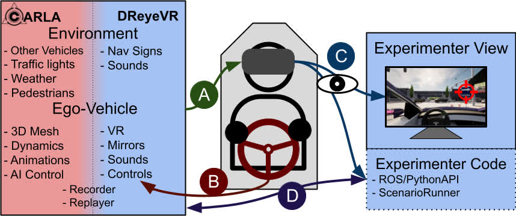
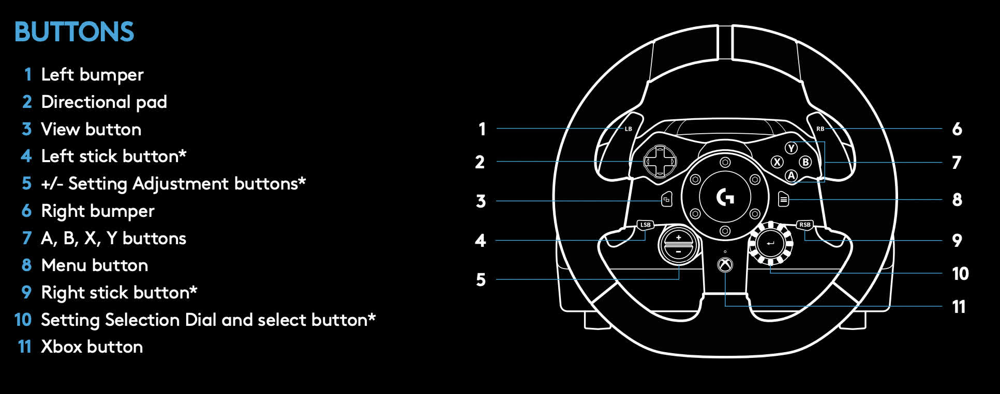
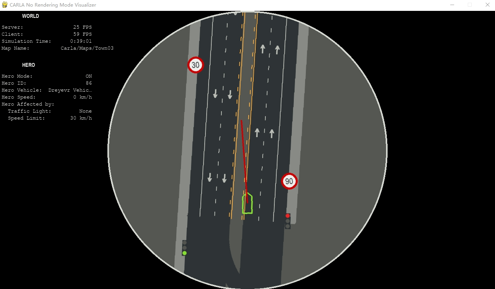

# 使用 `DReyeVR`

现在您已启动并运行 DReyeVR，本指南将重点介绍一些对使用 DReyeVR 的研究人员有用的功能：

- [操纵自我车辆](Usage.md#maneuvering-the-ego-vehicle)
- [使用 PythonAPI](Usage.md#using-the-pythonapi)
- [记录/重放一个场景](Usage.md#recordingreplaying-a-scenario)
- [将控制从手动切换到 AI（切换）](Usage.md#control-handoff-to-ai)
- [使用我们的配置文件修改 DReyeVR 参数](Usage.md#using-our-custom-config-file)
- [带帧捕获的同步重放](Usage.md#synchronized-replay-frame-capture)
- [其他指南](Usage.md#other-guides)



# 操纵自我车辆
这些控制方案在 VR 和非 VR 中均有效。主要区别在于，在 VR 中，您可以通过头部跟踪来移动相机姿势和方向，但在平面模式（非 VR）中，您需要像在第一人称游戏中一样使用鼠标。

- 键盘车辆控制方案：

    - **相机凝视** - 在 2D（平面/非 VR）视图中，通过单击并拖动来转动相机
    - **油门** - 按住 `W` 即可
    - **转向** - `A` 表示左转，`D` 表示右转
    - **刹车** - 按住 `S` 即可
    - **切换倒车** - 通过按 `Alt` 进行倒车和前进（屏幕分别显示`R`和`D`）的切换
    - **转向信号** - 均可通过按 `Q`（左）或 `E`（右）来实现，在屏幕中显示红色的`<<<`或`>>>`，只报4声滴答
    - **相机调整** - 使用箭头键（上、下、左、右）在 X 和 Y 轴上进行调整，使用 `pg-up/pg-down` 按钮在 Z 轴上进行调整
    - **更改摄像机视图位置** - 使用 `Tab` 切换到 `DReyeVRParams.ini` 中定义的下一个摄像机位置。按 `Shift+Tab` 可切换回上一个摄像机位置
    - **更改相机着色器** - 使用 `.`（句点）切换到下一个着色器，使用 `,`（逗号）切换到上一个着色器

- 罗技控制方案：
    - **油门** - 通过踩下油门踏板来实现
    - **转向** - 通过转动方向盘
    - **刹车** - 踩下刹车踏板即可
    - **切换倒车** - 通过按任意 `ABXY`（图中 7）按钮即可 
    - **转向信号** - 均由左（4）和右（6）保险杠发出 
    - **相机调整** - 使用方向盘表面的 4 个方向键 (2) 调整 X 和 Y 轴，使用 +/- 按钮 (5) 调整 Z 轴
-  图片来源：[Logitech g923 manual](https://www.logitech.com/assets/65932/2/g923-racing-wheel-qsg.pdf)

!!! 注意
    所有键盘输入均在 [`DefaultInput.ini`](../Configs/DefaultInput.ini) 中定义，其中所有 DReyeVR 特定控件均带有 "`_DReyeVR`" 后缀。如果您愿意，可以随意更改任何控件。

    但是，罗技方向盘输入是硬编码到源代码中的，因为它们在每个节拍信号上都会被检查（而不是通过 UE4 键盘事件）。要查看和修改这些值，请参阅 [`DReyeVRPawn.cpp`](../DReyeVR/DReyeVRPawn.cpp)

  
# 使用 PythonAPI

在主 Carla 服务器运行后，您现在应该能够运行所有 Carla 提供的 `PythonAPI` 脚本。

- 请注意，原始 [`Carla 0.9.13` PythonAPI](https://github.com/carla-simulator/carla/tree/0.9.13/PythonAPI) 存储库中的脚本并非全部经过测试。我们创建了一些新脚本来替代其他脚本，例如从 `no_rendering_mode.py` 继承的 `diagram_mode.py`，但增加了对我们的 ego-vehicle 和眼动仪的支持。
- 在某些情况下，我们会用较新的脚本替换旧的 Python 脚本，例如 `scene-runner-v0.9.13` 中的 [`no_rendering_mode.py`](https://github.com/carla-simulator/scenario_runner/blob/v0.9.13/no_rendering_mode.py) 实际上来自版本 0.9.5。

### 在示意图模式下可视化
!!! 注意
    需要使用 `PythonAPI/carla\dist/carla-0.9.13-cp37-cp37m-win_amd64.whl` 安装 carla 包
```bash
cd $CARLA_ROOT/PythonAPI/examples/ # 进入 carla/ 目录

./schematic_mode.py
```


### 使用 PythonAPI 记录 DReyeVR 传感器数据
```bash
cd $CARLA_ROOT/PythonAPI/examples/

# 查看所有 DReyeVR 传感器数据
./DReyeVR_logging.py # 直接在标准输出stdout中打印

# 或者如果已经在运行 roscore (带 rospy)
./DReyeVR_logging.py --rh '192.168.X.Y' --rp 11311 # 传递 roscore 主机名和端口号
```

- 我们支持在 Ubuntu 20.04 LTS 主机上使用 `rospy` 进行 ROS 数据流传输。如果您有兴趣为此目的使用虚拟机，我们建议您查看 [`VirtualMachine/README.md`](../Tools/VirtualMachine/README.md) ，因为设置相当复杂。

### 启动 DReyeVR AI 控制器
```bash
cd $CARLA_ROOT/PythonAPI/examples/

# DReyeVR AI 控制器需要运行此脚本
./DReyeVR_AI.py -n 0  # 除非控制权移交给 AI（按 3），否则无法控制车辆
```

### 开始记录/重放
```bash
cd $CARLA_ROOT/PythonAPI/examples/

# 在没有其他代理的情况下开始记录（windows下默认保存在：C:\Users\Administrator\AppData\Local\CarlaUE4\Saved\test1.log）
./start_recording.py -n 0
...

# 重放刚刚记录的文件
./start_replaying.py

# 以人类可读的方式将重放文件转储到 replay.txt
./show_recorder_file_info.py -a > replay.txt
```

### 运行 ScenarioRunner 实例并记录
```bash
cd $SCENARIO_RUNNER_ROOT # 进入目录 scenario-runner/

./run_experiment.py --title name_of_experiment --route srunner/data/routes_debug.xml srunner/data/all_towns_traffic_scenarios1_3_4.json 0 --output --reloadWorld
...
```

## 使用我们新的 DReyeVR PythonAPI
对于您自己的自定义脚本，我们建议您查看 [`DReyeVR_utils.py`](../PythonAPI/DReyeVR_utils.py) 文件，特别是这两个函数：

- `find_ego_vehicle` 接收 `carla.libcarla.World` 实例并返回世界上存在的 DReyeVR 自我车辆 (`carla.libcarla.Vehicle`)，如果没有则生成一个。 
- `find_ego_sensor` 接收 `carla.libcarla.World` 实例并返回世界上存在的 DReyeVR 眼动仪 (`carla.libcarla.Sensor`)，该眼动仪应附加到生成的 EgoVehicle（如果生成了 EgoVehicle）

然后，在您的脚本中，您可以遵循我们在 `diagram_mode.py` 中使用的技术，例如：
```python
world = self.client.get_world()

# 找到自我车辆
self.hero_actor = find_ego_vehicle(world)
self.hero_transform = self.hero_actor.get_transform()

# 找到 ego 传感器
# DReyeVRSensor 隐式调用 find_ego_sensor，然后用自定义类包装它
self.sensor = DReyeVRSensor(world) 
self.sensor.ego_sensor.listen(self.sensor.update)  # 订阅读出 readout
```
现在您可以继续使用 `self.sensor.ego_sensor` 作为标准 [`carla.libcarla.Sensor`](https://github.com/carla-simulator/carla/blob/master/Docs/python_api.md#carlasensor) 对象，并使用 `self.hero_actor` 作为标准 [`carla.libcarla.Vehicle`](https://github.com/carla-simulator/carla/blob/master/Docs/python_api.md#carlavehicle) 对象。

# 记录/重放一个场景
## 动机
记录实验场景通常很有用，以便在后期重现并进行进一步分析。我们必须稍微增强记录器和重放器，以尊重我们的自我载体在世界中的持久性，但其他所有功能均保持不变。我们还重现了自我传感器数据（包括 HMD 姿势和方向），以便实验者可以看到参与者在每个节拍中都在看什么。有关 Carla 记录器的完整说明，请参阅其 [文档](../adv_recorder.md) 。

## 记录
开始录制的最简单方法是使用方便的 `PythonAPI` 脚本。
```bash
cd $CARLA_ROOT/PythonAPI/examples/
# 这开始了与 10 辆自动驾驶汽车的记录
./start_recording.py -n 10  # 更改 -n 参数以更改车辆数量（默认为 10）
...
# 使用 SIGINT（中断）停止记录
```

- 请注意，如果加载了新的世界，记录将停止，因此如果您想改变世界，请确保在世界加载后重新启动记录。

- 记录将默认文件保存为项目默认保存目录中的 `test1.log` 文件：

    - 如果从编辑器记录： `carla/Unreal/CarlaUE4/Saved/test1.log`
  
    - 如果从包中记录：`${PACKAGE}/Unreal/Saved/test1.log` <!-- TODO: CHECK THIS -->
  
- 记录对模拟器性能的影响相对较小，但这可能因机器而异。体验应该基本相同。

  - 请注意，记录器以二进制形式保存所有内容，因此原始的 `test1.log` 文件不是人类可读的。不过，阅读它通常很好，在这种情况下使用：

      ```bash
      # 将输出 (stdout) 保存到 recorder.txt
      ./show_recorder_file_info.py -a -f /PATH/TO/RECORDER-FILE > recorder.txt 
      ```
    
      - 使用此 `recorder.txt` 文件（其中包含整个记录日志的可读转储），您可以使用我们的 [DReyeVR 解析器](https://github.com/harplab/dreyevr-parser) 将此文件解析为有用的 python 数据结构（numpy 数组/pandas dataframes）。

## 重放
通过 PythonAPI 开始重放会话，如下所示：
```bash
# 请注意，这并不依赖于是否处于 VR 模式。
./start_replaying.py # 这将启动重放会话
```

!!! 注意
    在重放模式下，所有用户输入都将被忽略，以支持重放输入。但是，您仍然可以使用以下级别控制：

  1. **切换播放/暂停** - 按空格键 `SpaceBar` 即可
  
  2. **前进** - 按住 `Alt` 并按左箭头（向后）或右箭头（向前）即可
  
  3. **更改播放速度** - 按住 `Alt` 并按向上箭头（增加）或向下箭头（减少）即可
  
  4. **重新启动** - 按住 `Alt` 并按 `BackSpace` 即可
  
  5. **持有观察者 Spectator** - 按 `1` 即可（然后使用 `WASDEQ + 鼠标`飞行）
  
  6. **重新持有车辆** - 按 `2`

为了获得录制的每一帧的精确截图，请参见下文的 [同步重放帧捕获](#synchronized-replay-frame-capture)

!!! 注意
    我们在模拟器中使用自定义配置文件来设置全局和车辆参数（见 [下文](Usage.md#using-our-custom-config-file) ），并且我们还将这些参数存储在记录文件中，以便我们可以验证它们是否与重放相同。例如，在执行重放时，我们将自动比较录制的参数与实时参数。然后，如果我们检测到任何差异，我们将打印这些差异作为警告，以便您注意。例如，如果您使用特定车辆录制，并使用装载了不同车辆的模拟器重放，我们会让您知道重放可能不准确，并且您处于未知领域。


## Scenarios
通常，理想的做法是通过 [ScenarioRunner](https://carla-scenariorunner.readthedocs.io/en/latest/) 解析场景，从而策划实验。

为此，我们创建了一个方便的脚本，该脚本应该能够应对现有实现的一些怪癖。此脚本 ( [`run_experiment.py`](../ScenarioRunner/run_experiment.py) ) 将在加载新地图后自动开始为您记录，并使用唯一的文件名，所有这些都在单个客户端实例上进行，因此您无需担心记录错误或覆盖现有文件。

使用 `scene_runner` v0.9.13，您应该已经设置了这些环境变量：
```bash
# on bash (Linux)
export CARLA_ROOT=/PATH/TO/carla/
export SCENARIO_RUNNER_ROOT=/PATH/TO/scenario_runner/
export PYTHONPATH=$PYTHONPATH:${CARLA_ROOT}/PythonAPI/carla/dist/carla-0.9.13-py3.7-linux-x86_64.egg                                           
export PYTHONPATH=$PYTHONPATH:${CARLA_ROOT}/PythonAPI/carla/agents
export PYTHONPATH=$PYTHONPATH:${CARLA_ROOT}/PythonAPI/carla
export PYTHONPATH=$PYTHONPATH:${CARLA_ROOT}/PythonAPI

# on Windows x64 Visual C++ Toolset
set CARLA_ROOT=C:PATH\TO\carla\
set SCENARIO_RUNNER_ROOT=C:PATH\TO\scenario_runner\
set PYTHONPATH=%PYTHONPATH%;%CARLA_ROOT%\PythonAPI\carla\dist\carla-0.9.13-py3.7-win-amd64.egg
set PYTHONPATH=%PYTHONPATH%;%CARLA_ROOT%\PythonAPI\carla\agents
set PYTHONPATH=%PYTHONPATH%;%CARLA_ROOT%\PythonAPI\carla
set PYTHONPATH=%PYTHONPATH%;%CARLA_ROOT%\PythonAPI
```
然后运行我们的演示示例，使用以下命令：
```bash
# on bash (Linux)
cd $SCENARIO_RUNNER_ROOT # go to scenario-runner
./run_experiment.py --title "dreyevr_experiment" --route $SCENARIO_RUNNER_ROOT/srunner/data/routes_custom.xml $SCENARIO_RUNNER_ROOT/srunner/data/town05_scenarios.json 0

# on Windows x64 Visual C++ Toolset
cd %SCENARIO_RUNNER_ROOT% # go to scenario-runner
python run_experiment.py --title "dreyevr_experiment" --route %SCENARIO_RUNNER_ROOT%\srunner\data\routes_custom.xml %SCENARIO_RUNNER_ROOT%\srunner\data\town05_scenarios.json 0
```
请注意，您可以使用 `--title "your_experiment"` 将实验重命名为任何名称，并且生成的记录文件将在其文件名中包含此标题。

# 将控制从手动切换到 AI（切换）
有时，在实验期间让 AI 接管自我车辆以用于研究目的很有用。借助 Carla 现有的 [基于 TrafficManager 的自动驾驶仪](../adv_traffic_manager) ，在我们的模拟器中可以轻松做到这一点，它可以像驾驶任何其他 Carla 车辆一样驾驶我们的自我车辆。

然而，为了启动自动驾驶仪，我们目前只支持使用 PythonAPI 执行此任务，因此我们创建了 `DReyeVR_AI.py` 来完成这项工作：
```bash
cd $CARLA_ROOT/PythonAPI/examples # 进入目录 carla PythonAPI
./DReyeVR_AI.py -n 0 # 不产生其他车辆，在 EgoVehicle 上启用自动驾驶仪
```

在内部，AI 系统使用 Carla 车辆自动驾驶系统，因此可以在自定义 PythonAPI 脚本中启用此功能，而无需使用 `DReyeVR_AI.py`，方法是执行以下操作：
```python
from DReyeVR_utils import find_ego_vehicle
...

world = client.get_world()
traffic_manager = client.get_trafficmanager(args.tm_port)
...

DReyeVR_vehicle = find_ego_vehicle(world)
if DReyeVR_vehicle is not None:
    DReyeVR_vehicle.set_autopilot(True, traffic_manager.get_port())
    print("Successfully set autopilot on ego vehicle")
```

目前我们仅支持通过按键盘上的 `3` 键进行手动切换。这将为 Carla [WheeledVehicleAIController](https://github.com/carla-simulator/carla/blob/0.9.13/Unreal/CarlaUE4/Plugins/Carla/Source/Carla/Vehicle/WheeledVehicleAIController.cpp) 提供输入优先级，它将遵循 Carla 的 TrafficManager 定义的某些路线。

为了重新拥有车辆（将控制权交还给玩家），只需按 `1`。键盘输入的优先级自动高于自动驾驶仪。

!!! 可选
    使用同样的方法，还有第三种选择，您可以按 `2` 来控制“观察者”，该观察者可以使用 `WASDEQ + 鼠标`控制在地图上无碰撞地飞行。

您可以随时按下任意控制选项：`1`（人类驾驶员）、`2`（观察者）、`3`（AI 驾驶员）。摘要：

| 按 `1`             | 按 `2`               | 按 `3` |
|-------------------|---------------------|-------|
| 人类驾驶 | 观察者模式 | AI 驾驶 |


# 使用我们的自定义配置文件
在整个开发过程中，我们发现，即使是修改 DReyeVR 中的小东西，也需要很长的重新编译/重新链接/重新烘焙等周期，因此我们希望找到一种可以大大减轻这种负担同时仍提供灵活性的方法。

这就是我们开发 [`ConfigFile`](../DReyeVR/ConfigFile.h) 类和相应的 [`DReyeVRConfig.ini`](../Configs/DReyeVRConfig.ini)（以及每个车辆）“params”的原因，这样我们就可以在运行时读取文件来在模拟器中设置变量，而无需重新编译。

使用我们的 params API 的过程很简单：
```c++
// in, any class, say EgoVehicle.h
#include "DReyeVRUtils.h" // 确保包含了我们本地的头文件！

class CARLAUE4_API AEgoVehicle : public ACarlaWheeledVehicle
{
  ... // existing code

  float MyFavouriteNumber; // <--你的新参数
}
```

然后，选择该变量属于哪种类型的配置文件，目前我们有两种主要配置文件：模拟器范围的 `GeneralParams` 和每辆车的 `VehicleParams`。

`GeneralParams` 可以被视为可以从任何地方访问的全局模拟器配置文件，而 `VehicleParams` 则专门用于特定的 EgoVehicle（例如locations/specifications ），可以在  [`Config/EgoVehicles/`](../Config/EgoVehicles/) 中找到与可用的 DReyeVR EgoVehicles 匹配的配置文件。要了解有关这些内容的更多信息，请参阅 [EgoVehicle.md](EgoVehicles.md) 。

(对于一般参数)
```ini
[MyFavourites]
Number=867.5309 # 您也可以写注释！
```
然后，您可以在任何您想要的地方通过指定区域和变量名称来获取参数： 

```c++
void AEgoVehicle::SomeFunction()
{
  // 可以使用这种格式直接分配给变量
  MyFavouriteNumber = GeneralParams.Get<float>("MyFavourites", "Number");

  // 或者通过引用传递变量并获取 Get 操作是否成功
  bool bSuccess = GeneralParams.Get("MyFavourites", "Number", MyFavouriteNumber);
}
```

如果你使用特定于车辆的参数，那么这需要在某些 EgoVehicle 的上下文中
```c++

void SomeClass::SomeOtherFunction(AEgoVehicle *Vehicle){
  // VehicleParams 是一个公有成员 
  const ConfigFile &VehicleSpecificParams = Vehicle->GetVehicleParams();
  int VehicleParam = VehicleSpecificParams.Get<int>("VehicleParamSection", "VariableName");
}
```


而且，就像文件中的其他变量一样，您可以将它们捆绑并组织在同一个节标题下。

我们内置的另一个有用功能是导入、导出和比较配置文件。这很有用，因为我们可以跟踪在记录特定示例时使用的配置文件，然后如果您尝试使用不同的*配置*参数重放此场景（例如，使用不同的车辆，或者在记录中没有后视镜的情况下启用后视镜），则在比较（差异）记录的配置文件（保存在 .log 文件中）和实时配置文件（当前正在运行的配置文件）时会出现一些警告。

# 同步重放帧捕获
## 动机
在执行（并记录） [实验](../ScenarioRunner/run_experiment.py) 后，我们会获得模拟器中发生的所有事情的日志，可用于实时重现和事后分析。通常情况下，在对数据进行一些后期处理后，我们可能有兴趣在模拟器视图上叠加一些东西，以匹配参与者所看到/做的事情以及世界的样子。不幸的是，使用 [OBS](https://github.com/obsproject/obs-studio) 等异步屏幕记录器很难获得与精确记录事件相对应的精确图像帧，因此我们在引擎本身中嵌入了此功能，这样它就可以直接转到任何记录的事件并截取高质量的屏幕截图。最终结果是与记录的世界条件相对应的精确逐帧视图，无需插值。

### 同步重放
要使用此功能，请在 `[Replayer]` 部分下禁用 [`DReyeVRConfig.ini`](../Configs/DReyeVRConfig.ini) 中的 `ReplayInterpolation` 标志。禁用重放插值将允许逐帧重现所捕获的内容（否则重放将遵循挂钟时间并在帧之间引入插值）。

### 帧捕获
在重放期间（即实验结束后），我们还可以在此重放期间执行帧捕获。由于拍摄高分辨率屏幕截图的成本很高，因此这是一个缓慢的过程，在实时性能不太重要的重放期间完成。要启用此功能，请在 `[Replayer]` 部分中启用 `RecordFrames` 标志。下面还有其他几个帧捕获选项，例如分辨率和伽马参数。

生成的帧捕获图像（`.png` 或 `.jpg`，取决于 `FileFormatJPG` 标志）将在 `Unreal/CarlaUE4/{FrameDir}/{DateTimeNow}/{FrameName}*` 中找到，其中 `{FrameDir}` 和` {FrameName}` 均在 [`DReyeVRConfig.ini`](../Configs/DReyeVRConfig.ini) 中确定。`{DateTimeNow}` 字符串唯一地基于您机器的本地当前时间，因此您可以运行多个记录而不会覆盖旧文件。

**注意**：根据您运行的是编辑器模式还是 DReyeVR 的包模式，FrameCapture 目录将放置在以下位置：

- 编辑器 (调式): `%CARLA_ROOT%\Unreal\CarlaUE4\FrameCap\`
- 打包 (发布): `%CARLA_ROOT%\Build\UE4Carla\0.9.13-dirty\WindowsNoEditor\CarlaUE4\FrameCap\`

（为方便起见，显示 Windows 路径，但 Linux/Mac 的目标路径类似）

启用这些标志后，任何时候您启动重放，例如：
```bash
# 在目录 PythonAPI/examples
./start_replaying.py -f /PATH/TO/RECORDING/FILE # unix

python start_replaying.py -f /PATH/TO/RECORDING/FILE # windows
```


# 其他指南
我们还编写了其他指南来满足更特殊的需求：
- 请参阅 [`F.A.Q. wiki`](https://github.com/HARPLab/DReyeVR/wiki/Frequently-Asked-Questions) ，了解我们的常见问题 wiki 页面。
- 请参阅 [`SetupVR.md`](Tutorials/SetupVR.md) 了解如何使用 Carla 快速、简便地设置 VR
- 请参阅 [`Sounds.md`](Tutorials/Sounds.md) 了解我们如何添加自定义声音以及如何添加您自己的自定义声音
- 请参阅 [`Signs.md`](Tutorials/Signs.md) 以添加自定义世界方向标志并在运行时动态地将它们生成到世界中
- 请参阅 [`Shaders/README.md`](../Shaders/README.md) 以查看我们的后处理着色器并了解如何使用它们
- 请参阅 [`CustomActor.md`](Tutorials/CustomActor.md) 以使用我们的 CustomActor 类在场景中使用完全可记录的 3D 动态元素
- 请参阅 [`Model.md`](Tutorials/Model.md) ，了解我们如何向车辆网格添加响应式方向盘
- 请参阅 [`CustomEgo.md`](Tutorials/CustomEgo.md)，将您自己的自定义 EgoVehicle 模型添加到 DReyeVR
- 请参阅 [`LODs.md`](Tutorials/LODs.md) ，了解我们如何调整车辆的细节级别模式，以获得更愉快的 VR 体验

# Quirks:
- 在 Windows 上，您将需要使用 `Windows x64 Visual C++ Toolset`，并使用 `python SCRIPT.py` 调用所有 python 文件，而不仅仅是 `./SCRIPT.py` 

    - 此外，环境变量的访问方式是 `%LIKE_THIS%` 而不是 `$LIKE_THIS`。

    - 请记住，文件路径使用反斜杠来表示 `LOCATE\FILES\THIS\WAY\`，而不是 `THE/NORMAL/WAY/`  
- 有一个错误（我们不确定原因，在基本 carla 中也会出现），其中 `Town06/07/10HD` 未出现在`打包`版本中。[此处](https://carla.readthedocs.io/en/0.9.13/start_quickstart/#import-additional-assets) 有一些文档。