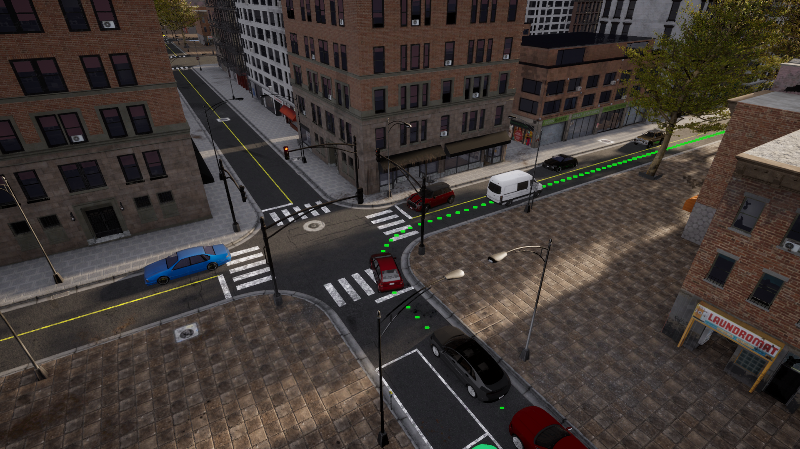

# 开始使用排行榜 2.0

!!! 笔记
    本页信息涉及最新版本 Leaderboard 2.0。如果您使用的是以前版本的排行榜，请参阅排行榜 1.0 入门说明。

为了开始开发您的自主智能体，您需要完成以下过程：

# 系统设置
## 下载 CARLA 排行榜包
* 下载打包的 Carla 排行榜版本。

* 将包解压到一个文件夹中，例如 Carla。

!!! 笔记
    在以下命令中，更改 ${CARLA_ROOT} 变量以对应于您的 Carla 根文件夹。

* 为了使用 Carla Python API，您需要在您喜欢的环境中安装一些依赖项。作为参考，对于conda，首先创建一个新环境：

```shell
conda create -n py37 python=3.7
conda activate py37
cd ${CARLA_ROOT}  # 改变您的 Carla 根目录 ${CARLA_ROOT}

pip3 install -r PythonAPI/carla/requirements.txt
```

!!! 笔记
    Carla 排行榜版本基于 0.9.14 版本。它还具有即将发布的 0.9.14 版本的一些功能，例如新的大地图功能。因此，在使用 API 时请参考最新的文档。


## 获取排行榜和场景跑者

* 下载排行榜存储库 Leaderboard-2.0 分支。

```shell
git clone -b leaderboard-2.0 --single-branch https://github.com/carla-simulator/leaderboard.git
```

在以下命令中，更改${LEADERBOARD_ROOT}变量以对应于您的排行榜根文件夹。


* 安装所需的 Python 依赖项。

```shell
cd ${LEADERBOARD_ROOT} # 改变您的排行榜根目录 ${LEADERBOARD_ROOT}
pip3 install -r requirements.txt
```

* 下载 Scenario Runner 存储库排行榜-2.0 分支。

```shell
git clone -b leaderboard-2.0 --single-branch https://github.com/carla-simulator/scenario_runner.git
```

在以下命令中，将 更改为 ${SCENARIO_RUNNER_ROOT} 与您的 Scenario_Runner 根文件夹相对应。

* 使用相同的 Python 环境安装所需的 Python 依赖项。

```shell
cd ${SCENARIO_RUNNER_ROOT} # 改变您的 Scenario_Runner 的根目录 ${SCENARIO_RUNNER_ROOT}
pip3 install -r requirements.txt
```


### 基于 ROS 的智能体
首先，下载并安装适当的 ROS 或 ROS2 发行版。 Leaderboard 2.0 支持 ROS Melodic、ROS Noetic 和 ROS2 Foxy。然后，克隆并构建 ROS 或 ROS2 的 Carla ROS 桥存储库。确保 leaderboard-2.0 在克隆 Carla ROS Bridge 存储库时指定分支：
```shell
git clone --recurse-submodules -b leaderboard-2.0 --single-branch https://github.com/carla-simulator/ros-bridge
```

## 定义环境变量
我们需要确保不同的模块可以找到彼此。


* `~/.bashrc` 使用以下命令打开配置文件：

```shell
gedit ~/.bashrc
```

编辑您的 ~/.bashrc个人资料，添加以下定义。编辑后保存并关闭文件。

```shell
export CARLA_ROOT=PATH_TO_CARLA_ROOT
export SCENARIO_RUNNER_ROOT=PATH_TO_SCENARIO_RUNNER
export LEADERBOARD_ROOT=PATH_TO_LEADERBOARD
export PYTHONPATH="${CARLA_ROOT}/PythonAPI/carla/":"${SCENARIO_RUNNER_ROOT}":"${LEADERBOARD_ROOT}":"${CARLA_ROOT}/PythonAPI/carla/dist/carla-0.9.14-py3.7-linux-x86_64.egg":${PYTHONPATH}
```

请记住`.bashrc`使用以下命令来使这些更改生效：
```shell
source ~/.bashrc
```


# 创建带有排行榜的自治智能体

## 排行榜的第一步
排行榜将负责运行您的自主智能体，并评估其在多条路线的不同交通情况下的行为。为了更好地理解这个过程，让我们运行一个基本智能体。

在一个终端中运行 Carla 服务器。
```shell
cd ${CARLA_ROOT}
./CarlaUE4.sh -quality-level=Epic -world-port=2000 -resx=800 -resy=600
```

在另一个终端中，导航到`${LEADERBOARD_ROOT}`.虽然排行榜是使用`leaderboard_evaluator.py` python 脚本运行的，但使用的参数数量可能会让使用终端直接执行此操作感到非常不舒服。因此，建议使用 bash 脚本。排行榜提供的`run_leaderboard.sh`脚本正是这样做的。运行脚本：

```shell
./run_leaderboard.sh
```

这将启动一个 pygame 窗口，让您可以选择手动控制智能体。按照彩色航点指示的路线到达目的地。该脚本加载 Town 12 中的两条路线。


遵循路线并遵守交通规则，直到到达目的地。

!!! 笔记
    手动中断排行榜将抢先停止路线仿真，自动进入下一条路线。


## 了解排行榜组件
运行测试时，我们设置了一系列参数。让我们了解一下它们以及它们在排行榜中的作用。

* ROUTES (XML) — 将用于仿真的路线集。每条路线都有一个起点（第一个航点）和一个终点（最后一个航点）。此外，它们还可以包含天气概况来设置特定的天气条件。一份 XML 包含许多路由，每条路由都有一个 ID。用户可以修改、添加和删除路线以进行培训和验证。排行榜附带了一组用于调试、训练和验证的路线。用于在线评估的路线是秘密的。该文件还包括将在仿真中测试的场景，每条路线都有自己的一组场景。场景被定义为交通状况。特工必须克服这些场景才能通过测试。参与者可以访问一组适用于公共城镇的交通场景。存在使用不同参数实例化的多种类型的场景。以下是可用方案的列表。

* REPETITIONS (int) — 出于统计目的，每条路线重复的次数。
* TEAM_AGENT (Python 模块) — 智能体的 Python 模块的路径。创建智能体的步骤将在下一步中解释。


其他相关参数如下所述。

TEAM_CONFIG （由用户定义） — 所提供的智能体读取的任意配置文件的路径。您负责在智能体类中定义和解析此文件。
DEBUG_CHALLENGE (int) — 指示仿真期间是否应显示调试信息的标志。默认情况下，该变量未设置 (0)，这不会生成要显示的调试信息。当设置为 1 时，仿真器将显示要遵循的参考路线。如果此变量设置为大于任何值， 1引擎将打印仿真的完整状态以用于调试目的。
CHECKPOINT_ENDPOINT (JSON) — 将记录 Leaderboard 指标的文件的名称。
RECORD_PATH （字符串） — 将存储 Carla 日志的文件夹的路径。默认情况下未设置。
RESUME— 指示仿真是否应从最后一条路线恢复的标志。默认情况下未设置。
CHALLENGE_TRACK_CODENAME （字符串） — 智能体正在竞争的赛道。有两个可能的选项： SENSORS 和 MAP。该 SENSORS 赛道允许使用多个摄像头、激光雷达、雷达、GNSS、IMU 和速度计。除了这些传感器之外，MAP 赛道还允许直接访问 OpenDRIVE 高清地图。您负责根据需要解析和处理 OpenDRIVE 映射。

这些环境变量被传递到 `${LEADERBOARD_ROOT}/LEADERBOARD/LEADERBOARD_evaluator.py` ，作为执行仿真的入口点。查看`leaderboard_evaluator.py`，了解有关如何执行和评估智能体的更多详细信息。

# 创建自己的自动驾驶智能体

新智能体的定义始于创建一个新类，该类继承自 `leaderboard.autoagents.autonomous_agent.AutonomousAgent`。

## 创建 get_entry_point

首先，定义一个名为 `get_entry_point` 的函数，该函数返回新类的名称。这将用于自动实例化您的智能体。

```python
from leaderboard.autoagents.autonomous_agent import AutonomousAgent

def get_entry_point():
    return 'MyAgent'

class MyAgent(AutonomousAgent):
...
```

## 重写 setup 方法

在智能体类中重写 `setup` 方法。此方法执行智能体所需的所有初始化和定义。每次初始化路由时，都会自动调用它。它可以接收指向配置文件的可选参数。用户应分析此文件。至少，您需要指定参与的曲目。

```python
from leaderboard.autoagents.autonomous_agent import Track
...
def setup(self, path_to_conf_file):
    self.track = Track.SENSORS # 此方法至少设置排行榜模式。在这种情况下 SENSORS
```

!!! 注意
    `self.track` 属性应该是枚举，而不是字符串。它只能取可能的值 `Track.SENSORS` 或 `Track.MAP`。

## 重写传感器方法

您还必须覆盖传感器方法，该方法定义了您的智能体所需的所有传感器。

```python
def sensors(self):
    sensors = [
        {'type': 'sensor.camera.rgb', 'id': 'Center',
         'x': 0.7, 'y': 0.0, 'z': 1.60, 'roll': 0.0, 'pitch': 0.0, 'yaw': 0.0, 'width': 300, 'height': 200, 'fov': 100},
        {'type': 'sensor.lidar.ray_cast', 'id': 'LIDAR',
         'x': 0.7, 'y': -0.4, 'z': 1.60, 'roll': 0.0, 'pitch': 0.0, 'yaw': -45.0},
        {'type': 'sensor.other.radar', 'id': 'RADAR',
         'x': 0.7, 'y': -0.4, 'z': 1.60, 'roll': 0.0, 'pitch': 0.0, 'yaw': -45.0, 'fov': 30},
        {'type': 'sensor.other.gnss', 'id': 'GPS',
         'x': 0.7, 'y': -0.4, 'z': 1.60},
        {'type': 'sensor.other.imu', 'id': 'IMU',
         'x': 0.7, 'y': -0.4, 'z': 1.60, 'roll': 0.0, 'pitch': 0.0, 'yaw': -45.0},
        {'type': 'sensor.opendrive_map', 'id': 'OpenDRIVE', 'reading_frequency': 1},
        {'type': 'sensor.speedometer', 'id': 'Speed'},
    ]
    return sensors
```

大多数传感器属性都具有固定值。这些可以在 `agent_wrapper.py` 中进行检查。这样做可以使所有团队在一个通用的传感器框架内进行竞争。

每个传感器都表示为字典，包含以下属性：

* `type`: 要添加的传感器的类型。
* `id`: 将被给予稍后要访问的传感器的标签。
* `other attributes`: 这些是传感器依赖性的，例如：外参和 fov。

用户可以在相对于车辆的相对坐标中设置每个传感器的内部和外部参数（位置和方向）。请注意，Carla 使用虚幻引擎坐标系，即：`x-front`，`y-right`，`z-up`。

可用的传感器有：

* `sensor.camera.rgb`: 捕捉图像的普通相机。
* `sensor.lidar.ray_cast`: Velodyne 64激光雷达。
* `sensor.other.radar`: 远程雷达（高达100米）。
* `sensor.other.gnss`: GPS传感器返回地理位置数据。
* `sensor.other.imu`: 6轴惯性测量单元。
* `sensor.opendrive_map`: 伪传感器，以解析为字符串的OpenDRIVE格式公开HD映射。
* `sensor.speedometer`: 提供近似线速度的伪传感器。

!!! 注意
    试图设置另一个传感器或拼错这些传感器，将导致设置失败。

您可以使用这些传感器中的任何一个来配置传感器堆栈。然而，为了保持适度的计算负载，我们对可以添加到智能体的传感器数量设置了以下限制：

* `sensor.camera.rgb`: 4
* `sensor.lidar.ray_cast`: 1
* `sensor.other.radar`: 2
* `sensor.other.gnss`: 1
* `sensor.other.imu`: 1
* `sensor.opendrive_map`: 1
* `sensor.speedometer`: 1

!!! 注意
    试图设置过多的传感器单元会导致设置失败。

还有一些空间限制限制了传感器在车辆体积内的放置。如果传感器在任何轴（例如`[3.1,0.0,0.0]`）上距离其父传感器超过 3 米，则设置将失败。


## 重写 run_step 方法

此方法将在每个时间步长调用一次，以生成 `carla.VehicleControl` 对象形式的新动作。确保此函数返回将用于更新智能体的控制对象。

```python
def run_step(self, input_data, timestamp):
    control = self._do_something_smart(input_data, timestamp)
    return control
```

* **input_data**: 包含所请求传感器的传感器数据的字典。数据已经在`sensor_interface.py`上进行了预处理，并将以numpy数组的形式给出。该字典由传感器方法中定义的id索引。
* **timestamp**: 当前仿真瞬间的时间戳。

请记住，您还可以访问自我智能体为达到目的地而应走的路线。利用`self._global_plan`成员访问地理位置路由和`self._global_plan_world_coord`作为其世界位置对应项。


## 重写 destroy 方法

在每条路由结束时，将调用`destroy`方法，在需要清理的情况下，智能体可以覆盖该方法。例如，您可以使用此功能擦除网络中任何不需要的内存

```python
def destroy(self):
    pass
```

## 基于智能体的 ROS
如果您想将 ROS 作为智能体的一部分，以下是一些需要考虑的建议：

* **ROS Melodic**: 由于排行榜仅与 Python 3 兼容，我们建议使用 [roslibpy](https://github.com/gramaziokohler/roslibpy) 在排行榜和ROS堆栈之间进行通信。
* **ROS Noetic**: 由于 ROS Noetic 的目标是 Python3，您可以直接使用**rospy**创建一个节点来与您的ROS堆栈通信排行榜。
* **ROS2 Foxy**: 与ROS Noetic类似，您可以直接使用**rcpy**与您的堆栈建立通信。


# 训练和测试智能体

我们准备了一组预定义的路线作为起点。您可以使用这些途径来训练和验证智能体的性能。可以在文件夹`{LEADERBOARD_ROOT}/data`:

* **routes_training.xml**: 拟用作训练数据的50条路线（112.8公里）。
* **routes_testing.xml**: 拟用作验证数据的26条路线（58.9公里）。

## 基准

Brady Zhou 在 [Learning by Cheating](https://arxiv.org/abs/1912.12294) 的基础上创造了一套出色的 [starter kit](https://github.com/bradyz/2020_CARLA_challenge/) 。


