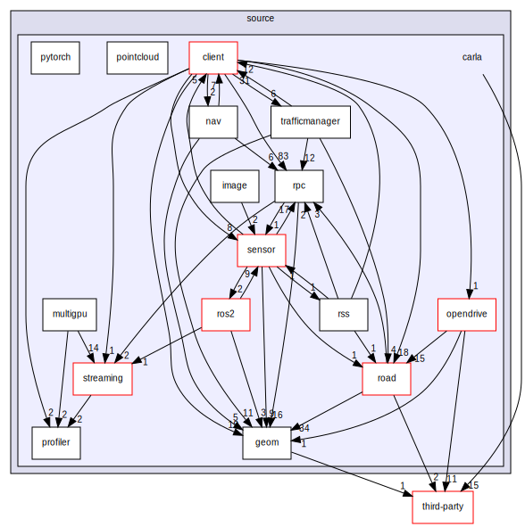
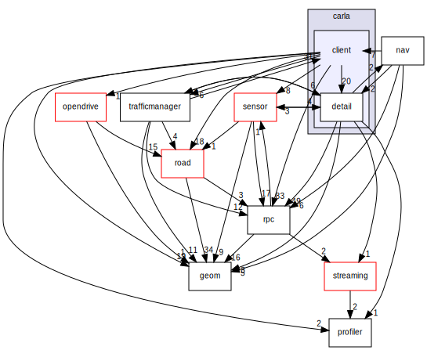

# LibCarla

所有模块之间的调用关系图：

第三方库包括：[simplify](https://github.com/sp4cerat/Fast-Quadric-Mesh-Simplification) （使用二次曲面减少网格三角形）、[pugixml](http://pugixml.org/) （轻量级的 C++ XML 处理库）、[odrSpiral](http://www.netlib.org/cephes/) （OpenDrive应用程序中计算螺旋的方法）、[moodycamel](https://github.com/cameron314/concurrentqueue) （C++11实现的一个多生产者、多消费者的[无锁队列](http://moodycamel.com/blog/2014/detailed-design-of-a-lock-free-queue) ）、[marchingcube](https://en.wikipedia.org/wiki/Marching_cubes) （从给定的有符号距离函数重建三角形网格）。

!!! 笔记
    Marching Cubes(三维规则数据场等值面生成、从三维体素中提取三角形网格)。有符号距离函（Signed Distance Function, SDF）, 指的是给定一个点的坐标, 返回这个点与某一面的最短距离。如果这个距离是负数, 则说明在面内, 是正数则说明在面外, 如果是0, 则刚好在面上，SDF的signed就是由此而来.
  

Visual Studio 工程所在地目录为：`Build\libcarla-visualstudio\`。

## 客户端

各个模块之间的[调用关系图](https://carla.org/Doxygen/html/dir_64d7bb605f27024d49af86070bd3f0b6.html) ：

黑色框表明当前显示的是类文档。红色边线的方框表示有文档的结构体或类，该类未展示全部的继承/包含关系。实心箭头指示公有继承。 

编译后的安装目录位于：`PythonAPI\carla\dependencies\`。

### CMakeLists.txt

file GLOB 命令用于将指定目录下的所有文件匹配到一个变量中。

install 用于指定在安装时运行的规则。
DESTINATION 定义了安装的路径，使用 CMAKE_INSTALL_PREFIX 来定义安装路径（在`Util\BuildTools\BuildLibCarla.bat`中的`-DCMAKE_INSTALL_PREFIX`中定义，即`PythonAPI\carla\dependencies\`），就要写成相对路径，那么安装后的路径就是${CMAKE_INSTALL_PREFIX}/<DESTINATION 定义的路径>。将对应目录下的.cpp和.h文件拷贝到安装路径下。

- add_library：用于向项目添加一个库文件,并定义其类型(静态库`STATIC`或共享库)。

    `carla_client${carla_target_postfix}_debug` 对应：`carla_client_debug.lib`

- target_include_directories：
指定目标（exe或者so文件）需要包含的头文件路径

- target_link_libraries：指定目标（exe或者so文件）需要包含的库

- set_target_properties：可以设置编译标记（区分调试还是发布）

## 服务端

编译后的安装目录位于：`Unreal\CarlaUE4\Plugins\Carla\CarlaDependencies\`。

### CMakeLists.txt

## 参考

* [C++文档](https://carla.org/Doxygen/html/dir_1604d568fa4d964dfa9079b701bbfa07.html)

* [Doxygen Doxygen v1.63 中文手册](https://d1.amobbs.com/bbs_upload782111/files_38/ourdev_630418WOJPW6.pdf) 

