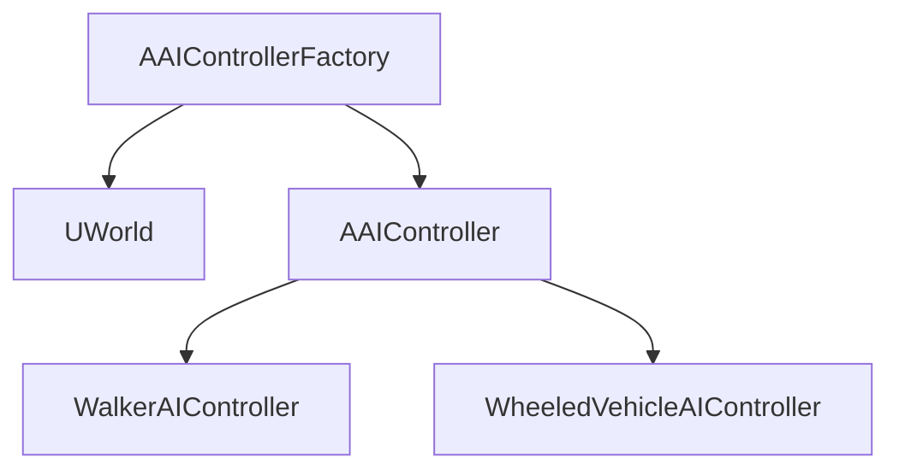
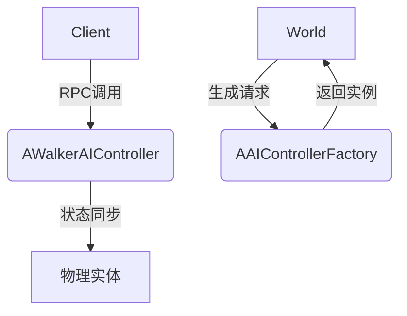
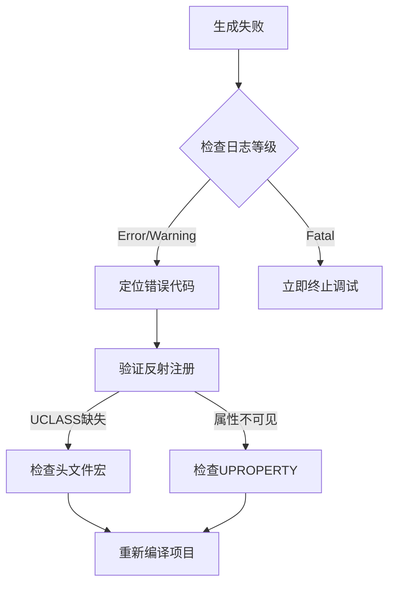

# AI 模块说明文档

---

## **概述**  
CARLA AI模块是仿真平台中负责AI控制器的动态生成与管理的核心组件，支持对行人、车辆等智能体的仿真控制。
包含的核心组件如下：
-`AWalkerAIController`：行人AI代理，实现轻量级状态同步。
-`AAIControllerFactory`：基于工厂模式的AI控制器生成器。

CARLA AI模块能实现的关键功能：
- 控制器动态生成：
  - 通过`AAIControllerFactory`按需生成行人、车辆等AI控制器实例。
  - 支持反射系统注册，允许通过蓝图扩展新的AI类型。
- 轻量级代理与状态同步
  - `AWalkerAIController`作为服务端与客户端的中间层，通过RPC（远程过程调用）实现跨网络指令传递与状态同步。
  - 避免直接操作物理实体，降低网络传输开销。
- 提供标准化的Actor生成接口
- 提供错误日志机制

## AI模块引用关系图


## AI模块交互关系图


## **核心类说明**
### **AIControllerFactory 类** 
`AIControllerFactory`是CARLA仿真平台中实现AI控制器动态生成的核心工厂类。
- 继承关系：继承自`ACarlaActorFactory`基类。
- 职责：
  - 定义支持的AI控制器类型（如行人、车辆等）  
  - 通过Unreal Engine的反射系统实现类型注册
  - 通过改写`GetDefinitions`和`SpawnActor`方法实现具体的逻辑。  
  - 提供标准化的Actor生成接口
  - 提供错误处理机制

#### 成员函数  
##### `GetDefinitions`  
- **代码示例**：  
  ```cpp
  TArray<FactorDefinitions> AAIControllerFactory::GetDefinitions() {
      // 使用工具类创建Walker控制器定义
      auto WalkerController = ABFL::MakeGenericDefinition(
          TEXT("controller"), TEXT("ai"), TEXT("walker")
      );
      // 绑定具体类对象
      WalkerController.Class = WalkerAIController::StaticClass();
      return { WalkerController };
  }
  ```
- **功能**：该方法创建了一个`FActorDefinition`对象，用于描述行人AI控制器。
- **参数说明**：
  - `TEXT("controller")`：控制器类型ID，需全局唯一。
  - `TEXT("ai")`：用于编辑器分类的元数据。
  - `TEXT("walker")`：语义标签，支持场景语义查询。
- **返回值**：返回一个包含`WalkerController`的数组。

##### `SpawnActor`
- **代码示例**： 
```cpp
FActorSpawnResult AAIControllerFactory::SpawnActor(
    const FTransform &Transform,
    const FActorDescription &Description)
{
  auto *World = GetWorld();
  if (World == nullptr)
  {
    UE_LOG(LogCarla, Error, TEXT("AAIControllerFactory: cannot spawn controller into an empty world."));
    return {};
  }

  FActorSpawnParameters SpawnParameters;
  SpawnParameters.SpawnCollisionHandlingOverride = ESpawnActorCollisionHandlingMethod::AlwaysSpawn;
  auto *Controller = World->SpawnActor<AActor>(Description.Class, Transform, SpawnParameters);
  if (Controller == nullptr)
  {
    UE_LOG(LogCarla, Error, TEXT("AAIControllerFactory: spawn controller failed."));
  }
  return FActorSpawnResult{Controller};
}
```
- **功能**：
  - 通过`GetWorld()`获取当前世界对象
  - 根据给定的变换信息和描述信息在游戏世界中生成AI控制器Actor。
  - 检查世界对象是否为空，如果为空则输出错误日志。 
- **关键参数**：  
  - `FTransform`：指定Actor的生成位置和方向。  
  - `FactorDescription`：提供Actor的描述信息，例如类型和配置。
- **返回值**：返回一个`FActorSpawnResult`对象，包含生成的Controller。


### **WalkerAIController 类**    
`AWalkerAIController`类是一个表示行人AI控制器的类，仅作为客户端实际控制器的一个句柄。
- **继承关系**  ：继承自 AActor
- **核心作用** 
  - 轻量级代理：作为服务端与客户端控制逻辑的中介，避免直接操作物理实体。
  - 状态同步：通过RPC（Remote Procedure Call）实现跨网络的状态同步。
  - 生命周期管理：处理控制器的激活/休眠状态切换。
    
#### 类定义与继承
```cpp
UCLASS()
class CARLA_API AWalkerAIController : public AActor
{
  GENERATED_BODY()

public:
  AWalkerAIController(const FObjectInitializer &ObjectInitializer)
    : Super(ObjectInitializer)
  {
    PrimaryActorTick.bCanEverTick = false;
    RootComponent = CreateDefaultSubobject<USceneComponent>(TEXT("RootComponent"));
    RootComponent->bHiddenInGame = true;
  }
};
```
- **继承关系**：`AWalkerAIController`继承自`AActor`，是Unreal Engine中的一个基础类。
- **UCLASS 宏**：`UCLASS()`宏用于声明这是一个Unreal Engine的类。
- **CARLA_API**：用于在不同平台上正确导出类和函数。

#### 构造函数

```cpp
AWalkerAIController(const FObjectInitializer &ObjectInitializer)
  : Super(ObjectInitializer)
{
  PrimaryActorTick.bCanEverTick = false;
  RootComponent = CreateDefaultSubobject<USceneComponent>(TEXT("RootComponent"));
  RootComponent->bHiddenInGame = true;
}
```

- **功能**：
  - 设置`PrimaryActorTick.bCanEverTick`为`false`，表示该Actor不需要每帧调用`Tick`函数。
  - 创建一个默认的`USceneComponent`作为根组件，并将其设置为在游戏中隐藏。
- **组件配置**

  | 属性               | 类型               | 默认值              | 说明                           |
  |--------------------|--------------------|---------------------|--------------------------------|
  | `PrimaryActorTick` | `FTickFunction`    | `bCanEverTick=false`| 禁止帧更新以优化性能           |
  | `RootComponent`    | `USceneComponent`  | 隐藏状态            | 作为坐标系的锚点（不可见组件） |


## 使用方法
### 包含头文件

在需要使用这些类的文件中，包含以下头文件：

```cpp
#include "Carla/AI/AIControllerFactory.h"
#include "Carla/AI/WalkerAIController.h"
```

### 获取AI控制器定义

通过`AAIControllerFactory`类的`GetDefinitions`方法获取支持的AI控制器类型：

```cpp
AAIControllerFactory Factory;
TArray<FActorDefinition> Definitions = Factory.GetDefinitions();
```

### 生成AI控制器Actor

使用`SpawnActor`方法在游戏世界中生成AI控制器Actor：

```cpp
FTransform Transform; // 设置变换信息
FActorDescription Description; // 设置描述信息
FActorSpawnResult Result = Factory.SpawnActor(Transform, Description);
```

## **Unreal Engine 集成机制**
### 反射系统集成
- **UCLASS宏扩展**  ：UCLASS宏用于在Unreal Engine中注册C++类到反射系统，使得这些类可以被蓝图访问和继承，以及支持序列化、垃圾回收等功能。
  - 示例：
```cpp
UCLASS(
  Blueprintable,                     // 允许蓝图继承
  ClassGroup = (Custom),             // 自定义编辑器分类
  meta = (DisplayName = "AI Controller Factory")  // 编辑器显示名称
)
class CARLA_API AAIControllerFactory : public ACarlaActorFactory {
  GENERATED_BODY()
  // ...
};
```
- 参数说明：

| 参数             | 作用                                                         |
| ---------------- | ------------------------------------------------------------ |
| `Blueprintable`  | 允许在 Unreal 蓝图中创建子类                                 |
| `ClassGroup`     | 控制编辑器中的分类显示（如 `"Custom"` 表示自定义分类）       |
| `DisplayName`    | 覆盖类在编辑器中的显示名称                                   |
| `ShortTooltip`   | 鼠标悬停时的简要描述                                         |

- **属性暴露到编辑器**  
  - 示例：
```cpp
UPROPERTY(
  EditDefaultsOnly,                  // 仅在默认值编辑器中可修改
  Category = "AI Controller",        // 分类标签
  meta = (Tooltip = "Controller类型ID")  // 悬浮提示
)
FString ControllerTypeId = TEXT("default");      
```
- 参数说明：

| 参数               | 说明                                                    |
| ------------------ | ------------------------------------------------------- |
| `EditDefaultsOnly` | 仅在类默认值（CDO）中可编辑，实例化后不可修改          |
| `Category`         | 在编辑器属性面板中的分组标签                            |
| `meta=(Tooltip)`   | 在属性上悬浮时显示的提示文字                            |
| `meta=(ClampMin)`  | 对数值型属性设置的最小值约束（最小可输入值）            |


## 错误调试指南
### **日志排查体系** 
- **日志排查示例**
```cpp
  // 生成失败检测
if (Controller == nullptr) {
  UE_LOG(LogCarla, Error, 
      TEXT("生成控制器失败 - 类型: %s, 位置: %s"), 
      *Description.Id, 
      *Transform.ToString());
}

// 反射类检查
if (!Description.Class->IsChildOf(AAIController::StaticClass())) {
  UE_LOG(LogCarla, Fatal, TEXT("无效的控制器类: %s"), *Description.Class->GetName());
}
```
- **日志等级规范：**

| 日志等级   | 使用场景           | 示例                    |
|------------|--------------------|-------------------------|
| `Log`      | 常规调试信息       | 生成进度报告           |
| `Warning`  | 非致命性异常       | 碰撞策略降级           |
| `Error`    | 功能失败但可恢复   | 生成参数无效           |
| `Fatal`    | 不可恢复的严重错误 | 类未注册到反射系统     |


### **断点调试策略**
**关键检查点**
- World对象验证：
```cpp
if (!World || World->WorldType != EWorldType::Game) {
  // 触发断点
  UE_DEBUG_BREAK(); 
}
```
- 碰撞参数验证：
```cpp
#if WITH_EDITOR
if (SpawnParameters.SpawnCollisionHandlingOverride != ESpawnActorCollisionHandlingMethod::AlwaysSpawn) {
  UE_LOG(LogCarla, Verbose, TEXT("当前碰撞策略: %d"), (int32)SpawnParameters.SpawnCollisionHandlingOverride);
}
#endif
```
### **典型错误修复流程**



## 5. 相关文件与依赖
### 头文件依赖树
```plaintext
AI/
    ├── AIControllerFactory.h  
    ├── CarlaActorFactory.h  
    ├── ActorBlueprintFunctionLibrary.h  
    ├── WalkerAIController.h  
    └── GameFramework/Actor.h  
 ```

### 依赖的引擎模块
- **Actor系统**  ：GameFramework/Actor.h（Actor基类）。
- **反射系统**  ：UObject/UObjectGlobals.h（支持 UCLASS 和 GENERATED_BODY）。
- **工具库**  ：ActorBlueprintFunctionLibrary.h（提供快速定义工具）。

### Build.cs配置示例
  ```cpp
  PublicDependencyModuleNames.AddRange(new string[] {
    "Core",
    "CoreUObject",
    "Engine",
    "Carla",  // CARLA插件模块
    "NavigationSystem"  // 依赖导航系统
  });
  ```

