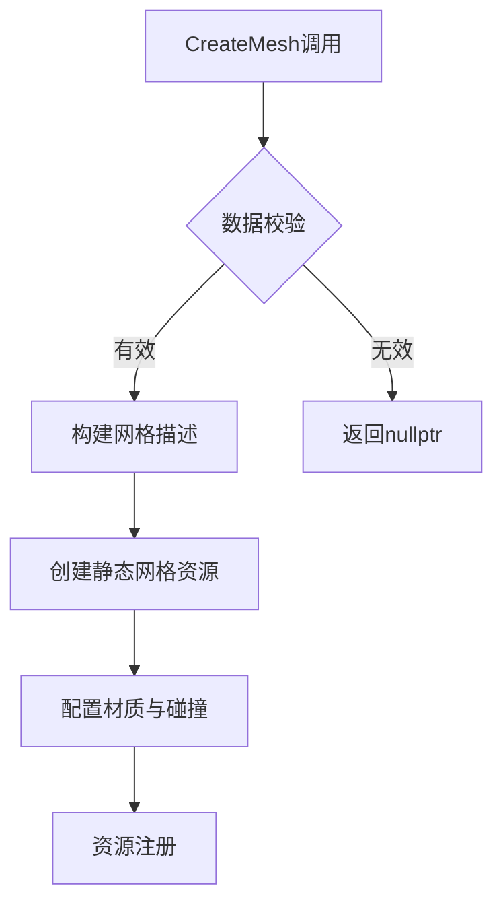

# BlueprintLibary模块说明文档  
`UMapGenFunctionLibrary` 是 CARLA 中用于地图生成和网格操作的蓝图函数库，继承自 `UBlueprintFunctionLibrary`。该类提供静态方法支持自定义网格生成、地理坐标转换、渲染控制等核心功能。

---

## 类成员函数  

### **网格生成系统**  

#### `CreateMesh`  
```cpp  
static UStaticMesh* CreateMesh(  
    const FProceduralCustomMesh& Data,  
    const TArray<FProcMeshTangent>& ParamTangents,  
    UMaterialInstance* MaterialInstance,  
    FString MapName,  
    FString FolderName,  
    FName MeshName)  
```  
- **功能**：根据自定义网格数据创建静态网格资源。  
- **参数**：  
  | 参数 | 类型 | 说明 |  
  |------|------|------|  
  | `Data` | `FProceduralCustomMesh` | 包含顶点、三角形等网格数据 |  
  | `ParamTangents` | `TArray<FProcMeshTangent>` | 切线数据数组 |  
  | `MaterialInstance` | `UMaterialInstance*` | 材质实例（可空） |  
  | `MapName` | `FString` | 目标地图名称 |  
  | `FolderName` | `FString` | 资源存储目录 |  
  | `MeshName` | `FName` | 网格资源名称 |  
- **返回值**：生成的 `UStaticMesh` 对象指针，失败返回 `nullptr`。  

**核心流程**：  
1. 构建包路径 `/Game/CustomMaps/[MapName]/Static/[FolderName]/[MeshName]`  
2. 调用 `BuildMeshDescriptionFromData` 生成网格描述  
3. 创建静态网格资源并配置物理碰撞  

---

#### `BuildMeshDescriptionFromData`  
```cpp  
static FMeshDescription BuildMeshDescriptionFromData(  
    const FProceduralCustomMesh& Data,  
    const TArray<FProcMeshTangent>& ParamTangents,  
    UMaterialInstance* MaterialInstance)  
```  
- **功能**：将自定义网格数据转换为 `FMeshDescription` 对象。  
- **关键步骤**：  
  ```cpp  
  // 顶点处理  
  for (int32 VertexIndex = 0; VertexIndex < NumVertex; ++VertexIndex) {  
    VertexPositions[VertexID] = Data.Vertices[VertexIndex];  
  }  
  // 三角形构建  
  for (int32 TriIdx = 0; TriIdx < NumTri; TriIdx++) {  
    MeshDescription.CreatePolygon(NewPolygonGroup, VertexInstanceIDs);  
  }  
  ```  
- **错误处理**：  
  - 材质实例为空时记录错误日志  
  - UV 数据不匹配时自动填充默认值 `(0,0)`  

---

### **地理坐标转换**  

#### `GetTransversemercProjection`  
```cpp  
static FVector2D GetTransversemercProjection(  
    float lat, float lon,  
    float lat0, float lon0)  
```  
- **功能**：横向墨卡托投影转换（经纬度 → 平面坐标）。  
- **公式**：  
  ```  
  x = R * asinh(sin(Δλ)/sqrt(tan²φ + cos²Δλ))  
  y = R * atan(tanφ / cosΔλ)  
  ```  
  - `R=6373000`（地球半径，米）  
  - `Δλ = lon - lon0`（经度偏移）  
- **返回值**：投影后坐标（厘米单位），应用 `OSMToCentimetersScaleFactor=100` 缩放因子  

---

### **系统控制**  

| 方法 | 功能 | 参数 |  
|------|------|------|  
| `SetThreadToSleep` | 线程休眠 | `seconds`：休眠时长（秒） |  
| `FlushRenderingCommandsInBlueprint` | 强制刷新渲染管线 | 无 |  
| `CleanupGEngine` | 执行垃圾回收并清理编辑器事务 | 无 |  

```cpp  
// 示例：资源清理逻辑  
void UMapGenFunctionLibrary::CleanupGEngine() {  
  GEngine->PerformGarbageCollectionAndCleanupActors();  
#if WITH_EDITOR  
  GEditor->Trans->Reset(...);  
#endif  
}  
```  

---

## 数据结构说明  

### `FProceduralCustomMesh`  
自定义网格数据容器（需与代码实现匹配）：  
```cpp  
struct FProceduralCustomMesh {  
  TArray<FVector> Vertices;      // 顶点坐标  
  TArray<int32> Triangles;       // 三角形索引  
  TArray<FVector> Normals;       // 法线向量  
  TArray<FVector2D> UV0;         // UV 通道0坐标  
  TArray<FProcMeshTangent> Tangents; // 切线数据  
};  
```  

---

## 错误代码与日志  

### 日志类别  
```cpp  
DECLARE_LOG_CATEGORY_EXTERN(LogCarlaMapGenFunctionLibrary, Log, All);  
```  
- **关键日志点**：  
  - `MaterialInstance is nullptr`：材质未指定警告  
  - 网格顶点/UV 数据不匹配时静默处理  

---

## 性能优化建议  
1. **资源路径管理**：  
   - 使用 `/Game/CustomMaps/` 固定路径规范资源存储  
   - 创建前检查目录存在性 `PlatformFile.DirectoryExists`  

2. **内存控制**：  
   - 调用 `MeshDescription.ReserveNewVertices()` 预分配内存  
   - 完成构建后执行 `FlushRenderingCommandsInBlueprint()` 释放GPU资源  

3. **多线程安全**：  
   - `SetThreadToSleep` 需避免在主线程调用  
   - 网格构建期间建议使用异步任务  

---

## 扩展接口说明  

| 宏定义 | 用途 |  
|--------|------|  
| `WITH_EDITOR` | 编辑器专用代码段隔离 |  
| `TRACE_CPUPROFILER_EVENT_SCOPE` | 性能分析标记（示例未展示） |  

