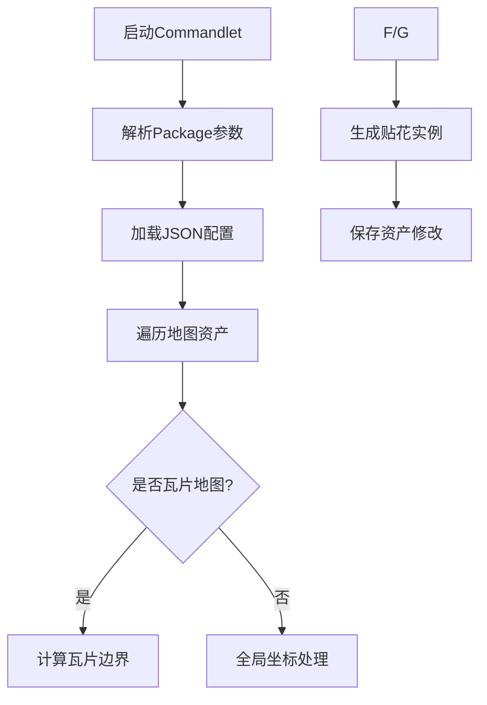

# CARLA 资产材质加载模块技术文档 (LoadAssetMaterialsCommandlet)

---

## 目录  
1. [模块概述](#模块概述)  
2. [核心功能](#核心功能)  
3. [类与方法详解](#类与方法详解)  
4. [数据结构与配置](#数据结构与配置)  
5. [关键流程](#关键流程)  
6. [配置参数](#配置参数)  
7. [注意事项](#注意事项)  
8. [示例配置](#示例配置)  
9. [附录](#附录)  

---

## 模块概述  
`LoadAssetMaterialsCommandlet` 是 CARLA 模拟器中用于批量处理场景材质资源的命令行工具，主要功能包括：  
- **贴花材质动态加载**：根据配置文件自动生成道路贴花（Decal）  
- **瓦片地图支持**：支持分块地图的坐标转换与材质应用  
- **配置文件驱动**：通过 JSON 文件定义贴花类型、密度、缩放等参数  
- **OpenDrive 集成**：基于道路数据精准放置贴花  
- **编辑器集成**：支持 Unreal Editor 的资产管理与保存  

---

## 核心功能  
### 1. 材质配置解析  
- **JSON 配置文件解析**  
  ```cpp
  FDecalsProperties ReadDecalsConfigurationFile(const FString &PackageName);
  ```
  - 解析 `roadpainter_decals.json` 文件  
  - 支持定义贴花类型、生成数量、缩放范围等参数  

### 2. 动态贴花生成  
- **基于瓦片的坐标计算**  
  ```cpp
  void ApplyRoadPainterMaterials(const FString &LoadedMapName, ...);
  ```
  - 根据瓦片索引计算世界坐标与局部坐标转换  
  - 使用 `ADecalActor` 动态创建贴花实例  

- **随机化参数**  
  - 位置随机偏移（`RandomOffset`）  
  - 旋转随机偏航角（`DecalRandomYaw`）  
  - 缩放随机范围（`DecalMinScale` - `DecalMaxScale`）  

### 3. 资产批量处理  
- **地图包加载**  
  ```cpp
  void LoadAssetsMaterials(const FString &PackageName, const TArray<FMapData> &MapsPaths);
  ```
  - 自动扫描指定包的 `/Maps/` 目录  
  - 支持分块地图（`_Tile_` 后缀识别）  

---

## 类与方法详解  
### `ULoadAssetMaterialsCommandlet` 类  
继承自 `UCommandlet`，是 CARLA 中用于批量处理材质资产的核心命令行工具类。通过 Unreal Engine 的反射机制实现，支持在编辑器环境下执行资产处理操作。

#### 关键方法  
| 方法                          | 功能描述                                                                 |
|-------------------------------|-------------------------------------------------------------------------|
| `Main(const FString &Params)` | Commandlet 入口方法，解析命令行参数并触发材质加载流程。返回执行状态码。 |
| `ApplyRoadPainterMaterials()` | 核心贴花生成逻辑，处理瓦片坐标转换、材质实例化及贴花参数随机化。       |
| `ReadDecalsConfigurationFile()` | 读取并解析 `roadpainter_decals.json` 配置文件，返回材质参数结构体。    |
| `GetAssetsPathFromPackage()`  | 扫描指定资产包，获取所有待处理地图的路径列表。                         |
| `ParseParams()`               | 解析命令行输入的参数，提取包名、地图过滤条件等关键信息。               |

#### 成员变量说明  
| 变量                      | 类型                      | 描述                                                                 |
|---------------------------|---------------------------|----------------------------------------------------------------------|
| `AssetDatas`              | `TArray<FAssetData>`      | 存储从对象库加载的资产元数据，用于批量处理。                         |
| `World`                   | `UWorld*`                 | 指向当前编辑器世界的指针，用于场景操作。                             |
| `MapObjectLibrary`        | `UObjectLibrary*`         | 对象库实例，用于动态加载地图资产。                                   |
| `RoadPainterSubclass`     | `TSubclassOf<ARoadPainterWrapper>` | 道路绘制器蓝图类的引用，用于生成道路贴花。                |
| `DecalNamesMap`           | `TMap<FString, FString>`  | 贴花名称到材质路径的映射表，解析 JSON 时填充。                       |
| `TileData`                | `FLargeMapTileData`       | 瓦片地图元数据，包含起始瓦片中心坐标及尺寸。                         |
| `XODRMap`                 | `boost::optional<carla::road::Map>` | 存储解析后的 OpenDrive 地图数据，用于道路坐标转换。       |

### `FLargeMapTileData` 结构体  
描述瓦片地图的布局信息，通过 `TilesInfo.txt` 文件初始化：

| 字段                 | 类型    | 描述                          |
|----------------------|---------|-------------------------------|
| `FirstTileCenterX`   | float   | 起始瓦片中心 X 坐标（UE 单位） |
| `FirstTileCenterY`   | float   | 起始瓦片中心 Y 坐标（UE 单位） |
| `Size`               | float   | 单个瓦片边长（米）             |

---

## 数据结构与配置  
### 1. 贴花配置结构体  
```cpp
struct FDecalsProperties {
    TArray<UMaterialInstanceConstant*> DecalMaterials; // 材质实例
    TArray<int32> DecalNumToSpawn;       // 各类型贴花生成数量
    FVector DecalScale;                  // 基础缩放比例
    float DecalMinScale, DecalMaxScale;  // 随机缩放范围
    float DecalRandomYaw;                // 最大随机偏航角
};
```

### 2. 材质映射表  
| 贴花类型   | 材质路径                                      |
|------------|----------------------------------------------|
| dirt1      | `MaterialInstanceConstant'/Game/.../DI_Dirt1'` |
| cracksbig1 | `MaterialInstanceConstant'/Game/.../DI_Crack1'` |

---

## 关键流程  
### 贴花生成流程  
1. **配置文件读取**  
   - 解析 `roadpainter_decals.json` 获取材质路径与生成参数  
2. **瓦片坐标计算**  
   - 根据 `TilesInfo.txt` 计算当前瓦片的世界边界  
   - 转换 OpenDrive 坐标到 UE 坐标系  
3. **实例化贴花**  
   - 在道路表面随机生成位置  
   - 应用材质、随机旋转与缩放  
   - 命名规范：`RoadDecal`  

### 命令行执行流程  


---

## 配置参数  
### JSON 配置文件示例 (`roadpainter_decals.json`)  
```json
{
  "decals": [
    {
      "dirt1": 50,
      "cracksbig1": 20,
      "decal_scale": {"x_axis": 1.0, "y_axis": 1.0, "z_axis": 1.0},
      "decal_min_scale": 0.8,
      "decal_max_scale": 1.2,
      "decal_random_yaw": 45.0,
      "random_offset": 150.0
    }
  ]
}
```

### 参数说明  
| 字段               | 类型     | 描述                          |
|--------------------|----------|-------------------------------|
| `dirt1`            | int      | "dirt1" 类型贴花生成数量       |
| `decal_scale`      | Vector3D | 基础缩放比例 (X/Y/Z)           |
| `decal_random_yaw` | float    | 最大随机旋转角度（度）          |
| `random_offset`    | float    | 位置随机偏移范围（厘米）        |

---

## 注意事项  
1. **路径规范**  
   - 材质路径必须包含完整 UE 资源路径（如 `MaterialInstanceConstant'/Game/...'`）  
   - 地图包必须包含 `TilesInfo.txt` 以支持瓦片计算  

2. **性能优化**  
   - 单瓦片建议贴花数量 ≤ 200  
   - 高精度贴花（如 4K 材质）建议减少生成密度  

3. **坐标系统**  
   - CARLA 使用左手坐标系，Y 轴方向与 UE 相反  
   - 转换公式：`UE_Y = -OpenDrive_Y`  

---

## 示例配置  
### 命令行调用  
```bat
UE4Editor-Cmd.exe ProjectName -run=LoadAssetMaterials 
  -PackageName=CityPack 
  -MapFilter=Downtown
```

---

## 附录  
### 依赖项  
- **Unreal Engine 4.26+**：Commandlet 框架、材质系统  
- **CARLA OpenDrive 解析器**：道路数据坐标转换  

### 调试支持  
- **日志输出**：  
  ```cpp
  UE_LOG(LogTemp, Warning, TEXT("Could not read TilesInfo.txt file"));
  ```
- **编辑器实时预览**：在 `ADecalActor` 创建后立即可见  

### 已知问题与解决方案  
| 问题现象                  | 可能原因                | 解决方案                          |
|---------------------------|-------------------------|-----------------------------------|
| 贴花漂浮在空中            | 碰撞检测未命中          | 增大 `BoxTrace` 的 Z 轴范围       |
| 材质显示为粉色            | 材质路径错误            | 检查 `DecalNamesMap` 映射是否正确 |
| 瓦片边界计算错误          | TilesInfo.txt 格式错误  | 确保每行为 `中心X,中心Y,尺寸`     |

---