# CARLA 资产材质加载与迁移模块技术文档

---

## 目录  
1. [模块概述](#模块概述)  
2. [核心功能](#核心功能)  
3. [类与方法详解](#类与方法详解)  
4. [数据结构与配置](#数据结构与配置)  
5. [关键流程](#关键流程)  
6. [配置参数](#配置参数)  
7. [注意事项](#注意事项)  
8. [示例配置](#示例配置)  
9. [附录](#附录)  

---

## 模块概述  
本模块包含 CARLA 模拟器三大核心资产处理工具：  
1. **LoadAssetMaterialsCommandlet**  
   - 动态贴花生成与材质应用  
   - 基于 OpenDrive 的精准贴花布局  
2. **MoveAssetsCommandlet**  
   - 资产批量分类与迁移  
   - 基于语义标签的智能路径管理  
3. **PrepareAssetsForCookingCommandlet**  
   - 资产预处理与烹饪准备  
   - 分块地图动态生成  
   - 大规模场景材质优化  

---

## 核心功能  
### 1. 材质处理模块  
（原有内容保持不变）

### 2. 资产迁移模块  
（原有内容保持不变）

### 3. 资产预处理模块  
- **智能材质替换**  
  - 基于语义标签的自动材质分配（道路/标线/路缘石等）  
  ```cpp
  MeshActor->GetStaticMeshComponent()->SetMaterial(0, RoadNodeMaterial);
  ```
  - 复杂碰撞简化处理（CTF_UseComplexAsSimple）

- **分块地图系统**  
  - 支持 _Tile_X_Y 命名规范的自动识别  
  - 动态生成瓦片空间布局（基于 TilesInfo.txt 配置）

- **OpenDrive 集成**  
  - 自动生成道路生成器（AOpenDriveActor）  
  - 基于 XODR 的导航点批量生成

- **资产批处理**  
  - 对象库动态加载（UObjectLibrary）  
  - 跨地图资产引用管理  

---

## 类与方法详解  
### `UPrepareAssetsForCookingCommandlet` 类  
继承自 `UCommandlet`，实现资产烹饪预处理的核心逻辑。

#### 关键方法  
| 方法                                  | 功能描述                                                                 |
|---------------------------------------|-------------------------------------------------------------------------|
| `Main(const FString &Params)`         | 入口方法，返回执行状态码                                               |
| `ParseParams(const FString &InParams)`| 解析命令行参数，提取包名、地图列表等参数，返回 `FPackageParams` 结构体 |
| `LoadWorld(FAssetData &AssetData)`    | 加载 Carla 基础地图模板到内存                                          |
| `LoadWorldTile(FAssetData &AssetData)`| 加载分块地图模板                                                       |
| `LoadLargeMapWorld(FAssetData &AssetData)` | 加载大规模地图资产                                               |
| `SpawnMeshesToWorld(...)`             | 实例化静态网格资产到场景，执行材质替换逻辑                            |
| `SaveWorld(...)`                      | 保存处理后的世界资产到指定路径，支持生成导航点                        |
| `PrepareMapsForCooking(...)`          | 主地图预处理流程控制器，处理分块逻辑                                  |
| `PreparePropsForCooking(...)`         | 道具资产批量处理入口                                                  |
| `GenerateMapPathsFile(...)`           | 生成跨平台地图路径配置文件                                            |

#### 成员变量  
| 变量                              | 类型                | 描述                          |
|-----------------------------------|---------------------|-------------------------------|
| `RoadNodeMaterial`                | `UMaterialInstance*`| 基础道路材质实例              |
| `CurbNodeMaterialInstance`        | `UMaterialInstance*`| 路缘石材质实例                |
| `GutterNodeMaterialInstance`      | `UMaterialInstance*`| 排水沟材质实例                |
| `MarkingNodeYellow`               | `UMaterialInstance*`| 黄色道路标线材质实例          |
| `MarkingNodeWhite`                | `UMaterialInstance*`| 白色道路标线材质实例          |
| `TerrainNodeMaterialInstance`     | `UMaterialInstance*`| 地形材质实例                  |
| `SidewalkNodeMaterialInstance`    | `UMaterialInstance*`| 人行道材质实例                |
| `MapObjectLibrary`                | `UObjectLibrary*`   | 地图资产对象库                |
| `AssetsObjectLibrary`             | `UObjectLibrary*`   | 通用资产对象库                |

### 数据结构与配置  
#### `FPackageParams` 结构体  
命令行参数解析容器：  

| 字段              | 类型     | 描述                    |
|-------------------|----------|-------------------------|
| `Name`            | `FString`| 资源包名称              |
| `bOnlyPrepareMaps`| `bool`   | 是否仅预处理地图资产    |

#### `FMapData` 结构体  
地图配置元数据：  

| 字段                     | 类型     | 描述                          |
|--------------------------|----------|-------------------------------|
| `Name`                   | `FString`| 地图名称                      |
| `Path`                   | `FString`| 资产路径                      |
| `bUseCarlaMapMaterials`  | `bool`   | 是否强制使用 Carla 原生材质    |

### 分块地图配置  
`TilesInfo.txt` 格式规范：  
```
[原点X坐标],[原点Y坐标],[瓦片尺寸(米)]
```
示例：  
```
-2500.0,1500.0,2000.0
```

---

## 关键流程  
### 资产预处理增强流程  

```mermaid
graph TD
  A[命令行参数解析] --> B[加载对象库资源]
  B --> C{是否分块地图?}
  C -->|是| D[按瓦片坐标迭代加载]
  C -->|否| E[整体地图加载]
  D --> F[动态实例化分块网格]
  E --> G[应用语义材质系统]
  F/G --> H[生成OpenDrive导航网络]
  H --> I[碰撞体优化设置]
  I --> J[序列化保存世界资产]
  J --> K[生成路径清单文件]
```


---

## 配置参数  
### 扩展命令行参数说明  
```bash
-PackageName=EuroPack        # 指定资源包名称
-Maps=Berlin,Tokyo          # 指定待处理地图列表  
-OnlyPrepareMaps=true       # 仅预处理地图资产
-TileSize=2000              # 分块地图尺寸（单位：米）
-ForceCarlaMaterials=true   # 强制使用Carla材质系统
```

---

## 注意事项  
### 预处理模块专项增强  
1. **材质系统依赖**  
   - 必须确保 `Carla/Static/GenericMaterials` 路径下包含完整材质实例  
   - 材质引用缺失将导致静默失败，需检查日志输出  

2. **分块处理规范**  
   - 分块地图命名必须遵循 `[MapName]_Tile_[X]_[Y]` 格式（如 Berlin_Tile_0_1）  
   - 原点坐标系需与 OpenDrive 数据严格对齐  

3. **对象库管理**  
   - 使用 `UObjectLibrary` 动态加载资产时需确保路径白名单配置正确  
   - 跨地图引用资产需在 `AssetsPaths.json` 中显式声明  

---

## 示例配置  
### 分块地图预处理命令（Windows）  
```bat
UE4Editor-Cmd.exe Carla -run=PrepareAssetsForCooking  
  -PackageName=EuroPack  
  -Maps=Berlin  
  -TileSize=2000  
  -ForceCarlaMaterials
```

### 道具资产预处理命令（Linux）  
```bash
./UE4Editor-Cmd Carla -run=PrepareAssetsForCooking  
  -PackageName=VehiclePack  
  -OnlyPrepareMaps=false  
  -Props=Car,Sign,Truck
```

---

## 附录  
### 增强错误代码表  
| 代码 | 含义                     | 解决方案                  |
|------|--------------------------|---------------------------|
| 0x31 | 分块布局文件缺失         | 检查 Maps/[Map]/TilesInfo.txt |
| 0x32 | 材质实例加载失败         | 验证材质路径正确性        |
| 0x33 | OpenDrive 数据异常       | 重新导出 XODR 文件        |

---
