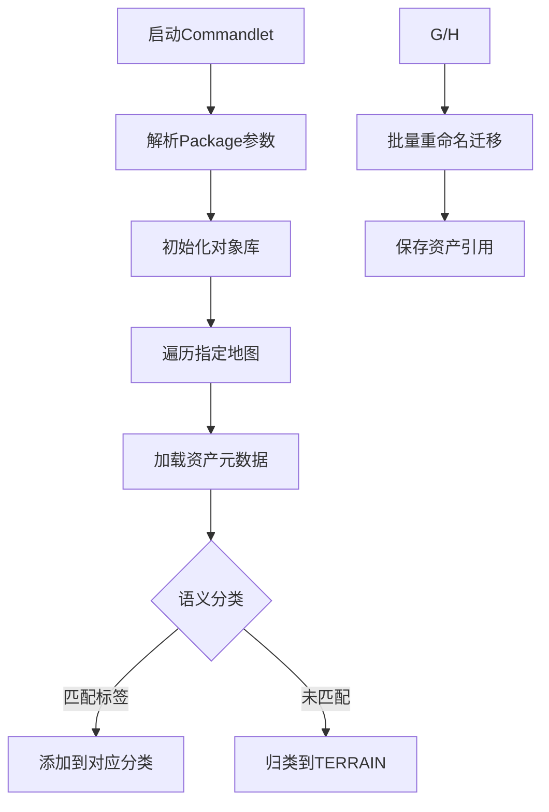

# CARLA 资产材质加载与迁移模块技术文档

---

## 目录  
1. [模块概述](#模块概述)  
2. [核心功能](#核心功能)  
3. [类与方法详解](#类与方法详解)  
4. [数据结构与配置](#数据结构与配置)  
5. [关键流程](#关键流程)  
6. [配置参数](#配置参数)  
7. [注意事项](#注意事项)  
8. [示例配置](#示例配置)  
9. [附录](#附录)  

---

## 模块概述  
本模块包含 CARLA 模拟器中两大核心资产处理工具：  
1. **LoadAssetMaterialsCommandlet**  
   - 动态贴花生成与材质应用  
   - 基于 OpenDrive 的精准贴花布局  
2. **MoveAssetsCommandlet**  
   - 资产批量分类与迁移  
   - 基于语义标签的智能路径管理  
   - 大规模地图资产管理  

---

## 核心功能  
### 1. 材质处理模块  
（原有内容保持不变）

### 2. 资产迁移模块  
- **语义分类系统**  
  - 内置 7 种语义标签：道路、标线、地形等  
  - 基于资产名称的自动分类（`R_ROAD1`, `R_SIDEWALK2` 等）  

- **智能路径管理**  
  ```cpp
  FString DestPath = TEXT("/Game/") + PackageName + TEXT("/Static/") + Elem.Key + "/" + MapName;
  ```
  - 自动构建目标路径层级  
  - 支持多地图并行处理  

- **资产批量操作**  
  - 对象库管理（`UObjectLibrary`）  
  - 原子化重命名迁移（`RenameAssets`）  

---

## 类与方法详解  
### `UMoveAssetsCommandlet` 类  
继承自 `UCommandlet`，实现资产分类迁移的核心逻辑。

#### 关键方法  
| 方法                                  | 功能描述                                                                 |
|---------------------------------------|-------------------------------------------------------------------------|
| `Main(const FString &Params)`         | 入口方法，返回执行状态码                                               |
| `ParseParams(const FString &InParams)`| 解析命令行参数，提取包名、地图列表                                      |
| `MoveAssets()`                        | 资产迁移主流程控制器                                                   |
| `MoveAssetsFromMapForSemanticSegmentation()` | 语义分类与路径生成实现                                               |

#### 成员变量  
| 变量                 | 类型                | 描述                          |
|----------------------|---------------------|-------------------------------|
| `AssetsObjectLibrary`| `UObjectLibrary*`   | 资产对象库实例                |
| `MapContents`        | `TArray<FAssetData>`| 当前处理的地图资产数据集      |

### `FMovePackageParams` 结构体  
迁移任务参数容器：

| 字段        | 类型            | 描述                |
|-------------|-----------------|---------------------|
| `Name`      | `FString`       | 目标资产包名称      |
| `MapNames`  | `TArray<FString>` | 待处理地图列表      |

---

## 数据结构与配置  
### 语义标签定义  
| 标签常量          | 对应路径        | 匹配规则                  |
|-------------------|-----------------|---------------------------|
| `R_ROAD1`         | ROAD/           | 名称包含"Road"            |
| `R_MARKING1`      | ROADLINE/       | 名称包含"Marking"         |
| `R_TERRAIN`       | TERRAIN/        | 默认分类                  |

---

## 关键流程  
### 资产迁移流程  


---

## 配置参数  
### 命令行参数规范  
```bash
-PackageName=CityPack       # 目标资产包名称
-Maps=Downtown Suburbs     # 待处理地图列表（空格分隔）
```

---

## 注意事项  
### 迁移模块专项  
1. **命名规范**  
   - 资产名称必须包含语义标签关键词（如`Road1`, `Curb2`）  
   - 标签常量定义在 `SSTags.h` 头文件  

2. **路径深度**  
   - 目标路径遵循 `/Game/[Package]/Static/[Category]/[Map]/` 结构  

3. **事务安全**  
   - 建议在版本控制系统下操作  
   - 支持增量迁移（已存在资产自动跳过）  

---

## 示例配置  
### 完整命令行调用  
```bat
UE4Editor-Cmd.exe Carla -run=MoveAssets 
  -PackageName=EuroPack 
  -Maps=Berlin Hamburg
```

---

## 附录  
### 错误代码表  
| 代码 | 含义                     | 解决方案                  |
|------|--------------------------|---------------------------|
| 0x21 | 对象库初始化失败         | 检查引擎资源加载状态      |
| 0x22 | 语义标签未识别           | 验证资产名称符合规范      |
| 0x23 | 路径权限不足             | 关闭资源管理器后重试      |

--- 
