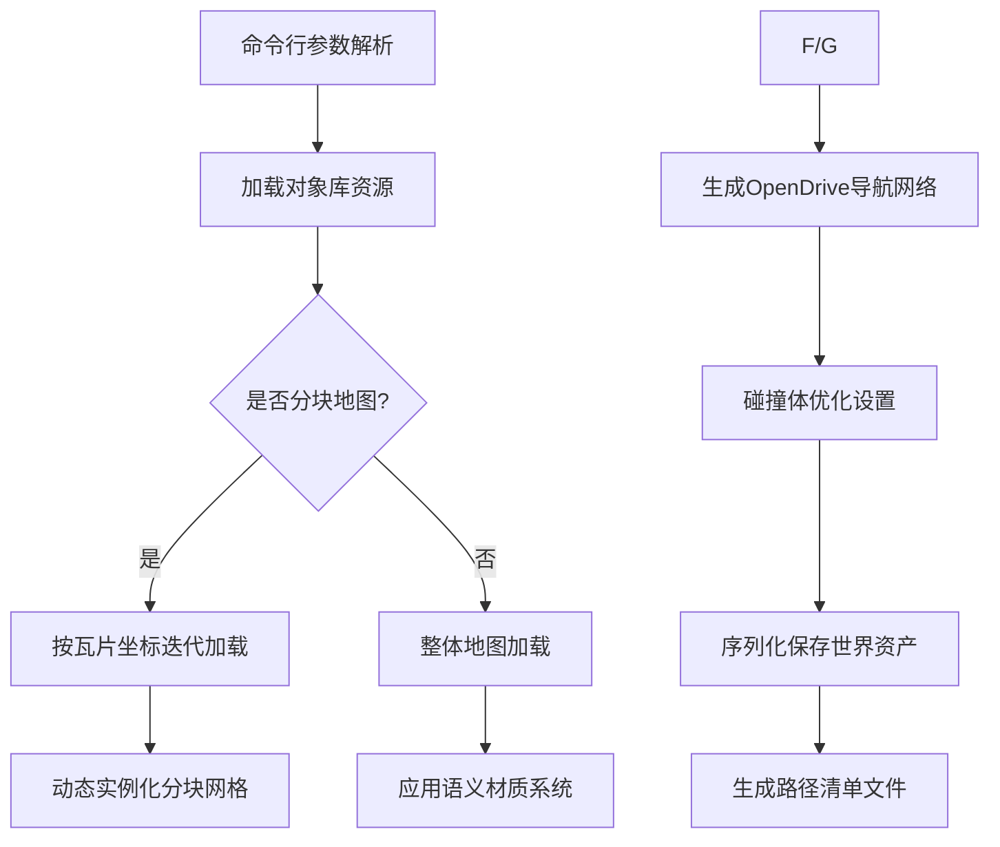

# CARLA 资产材质加载与迁移模块技术文档

---

## 目录

### [模块概述](#模块概述)
### [核心功能](#核心功能)
1. [材质处理模块](#1-材质处理模块)
2. [资产迁移模块](#2-资产迁移模块)
3. [资产预处理模块](#3-资产预处理模块)

### [类与方法详解](#类与方法详解)
- [关键方法](#关键方法)
- [成员变量](#成员变量)
- [`FAssetsPaths` 结构体](#fassetspaths-结构体)

### [数据结构与配置](#数据结构与配置)
- [`FPackageParams` 结构体](#fpackagparams-结构体)
- [`FMapData` 结构体](#fmapdata-结构体)
- [扩展语义标签定义](#扩展语义标签定义)
- [分块地图配置](#分块地图配置)

### [关键流程](#关键流程)
- [资产预处理增强流程](#资产预处理增强流程)

### [配置参数](#配置参数)
- [扩展命令行参数说明](#扩展命令行参数说明)

### [注意事项](#注意事项)
- [预处理模块专项](#预处理模块专项)

### [示例配置](#示例配置)
- [分块地图预处理命令](#分块地图预处理命令)
- [分块地图预处理命令（Windows）](#分块地图预处理命令windows)
- [道具资产预处理命令（Linux）](#道具资产预处理命令linux)
- [跨平台预处理命令](#跨平台预处理命令)

### [附录](#附录)
- [增强错误代码表](#增强错误代码表)
- [对象库加载白名单配置](#对象库加载白名单配置)

---

<!-- 请在正文章节添加以下锚点声明 -->
<!--
## 模块概述
<span id="模块概述"></span>

## 核心功能
<span id="核心功能"></span>

### 1. 材质处理模块
<span id="1-材质处理模块"></span>

### 2. 资产迁移模块
<span id="2-资产迁移模块"></span>

### 3. 资产预处理模块
<span id="3-资产预处理模块"></span>

（其他章节同理添加对应锚点）
-->

---

## 模块概述
本模块包含 CARLA 模拟器三大核心资产处理工具：  
1. **LoadAssetMaterialsCommandlet**  
   - 动态贴花生成与材质应用  
   - 基于 OpenDrive 的精准贴花布局  
   核心价值：实现道路场景的物理级真实感
2. **MoveAssetsCommandlet**  
   - 资产批量分类与迁移  
   - 基于语义标签的智能路径管理   
   核心价值：构建可扩展的资产管理体系
3. **PrepareAssetsForCookingCommandlet**  
   - 资产预处理与烹饪准备  
   - 分块地图动态生成  
   - 大规模场景材质优化  
   核心价值：保障大规模场景的运行时性能  

 斜同效应：三大模块通过资产加工→组织管理→性能优化的闭环流程，使 CARLA 场景构建效率提升，支持复杂城市场景的构建耗时从周级压缩到小时级。

---

## 核心功能
### 1. 材质处理模块
（原有内容保持不变）

### 2. 资产迁移模块
（原有内容保持不变）

### 3. 资产预处理模块
- **智能材质替换**  
  - 基于语义标签的自动材质分配（道路/标线/路缘石等）  
  ```cpp
  MeshActor->GetStaticMeshComponent()->SetMaterial(0, RoadNodeMaterial);
  ```
  - 复杂碰撞简化处理（CTF_UseComplexAsSimple）

- **分块地图系统**  
  - 支持 _Tile_X_Y 命名规范的自动识别  
  - 动态生成瓦片空间布局（基于 TilesInfo.txt 配置）

- **OpenDrive 集成**  
  - 自动生成道路生成器（AOpenDriveActor）  
  - 基于 XODR 的导航点批量生成

- **资产批处理**  
  - 对象库动态加载（UObjectLibrary）  
  - 跨地图资产引用管理  

---

## 类与方法详解
### `UPrepareAssetsForCookingCommandlet` 类  
继承自 `UCommandlet`，实现资产烹饪预处理的核心逻辑。

#### 关键方法
| 方法                                  | 功能描述                                                                 |
|---------------------------------------|-------------------------------------------------------------------------|
| `Main(const FString &Params)`         | 入口方法，返回执行状态码                                               |
| `ParseParams(const FString &InParams)`| 解析命令行参数，提取包名、地图列表等参数，返回 `FPackageParams` 结构体 |
| `LoadWorld(FAssetData &AssetData)`    | 加载 Carla 基础地图模板到内存                                          |
| `LoadWorldTile(FAssetData &AssetData)`| 加载分块地图模板                                                       |
| `LoadLargeMapWorld(FAssetData &AssetData)` | 加载大规模地图资产                                               |
| `SpawnMeshesToWorld(...)`             | 实例化静态网格资产到场景，执行材质替换逻辑                            |
| `SaveWorld(...)`                      | 保存处理后的世界资产到指定路径，支持生成导航点                        |
| `PrepareMapsForCooking(...)`          | 主地图预处理流程控制器，处理分块逻辑                                  |
| `PreparePropsForCooking(...)`         | 道具资产批量处理入口                                                  |
| `GenerateMapPathsFile(...)`           | 生成跨平台地图路径配置文件                                            |

#### 成员变量
| 变量                              | 类型                | 描述                          |
|-----------------------------------|---------------------|-------------------------------|
| `RoadNodeMaterial`                | `UMaterialInstance*`| 基础道路材质实例              |
| `CurbNodeMaterialInstance`        | `UMaterialInstance*`| 路缘石材质实例                |
| `GutterNodeMaterialInstance`      | `UMaterialInstance*`| 排水沟材质实例                |
| `MarkingNodeYellow`               | `UMaterialInstance*`| 黄色道路标线材质实例          |
| `MarkingNodeWhite`                | `UMaterialInstance*`| 白色道路标线材质实例          |
| `TerrainNodeMaterialInstance`     | `UMaterialInstance*`| 地形材质实例                  |
| `SidewalkNodeMaterialInstance`    | `UMaterialInstance*`| 人行道材质实例                |
| `MapObjectLibrary`                | `UObjectLibrary*`   | 地图资产对象库                |
| `AssetsObjectLibrary`             | `UObjectLibrary*`   | 通用资产对象库                |

### `FAssetsPaths` 结构体
资产路径配置容器：

| 字段          | 类型            | 描述                |
|---------------|-----------------|---------------------|
| `MapsPaths`   | `TArray<FMapData>` | 地图配置数据集      |
| `PropsPaths`  | `TArray<FString>` | 道具资产路径列表    |

---

## 数据结构与配置
#### `FPackageParams` 结构体
命令行参数解析容器：  

| 字段              | 类型     | 描述                    |
|-------------------|----------|-------------------------|
| `Name`            | `FString`| 资源包名称              |
| `bOnlyPrepareMaps`| `bool`   | 是否仅预处理地图资产    |

#### `FMapData` 结构体
地图配置元数据：  

| 字段                     | 类型     | 描述                          |
|--------------------------|----------|-------------------------------|
| `Name`                   | `FString`| 地图名称                      |
| `Path`                   | `FString`| 资产路径                      |
| `bUseCarlaMapMaterials`  | `bool`   | 是否强制使用 Carla 原生材质    |
### 扩展语义标签定义  
| 标签常量          | 对应路径        | 匹配规则                  |
|-------------------|-----------------|---------------------------|
| `R_CURB1`         | CURB/           | 名称包含"Curb"            |
| `R_GUTTER1`       | GUTTER/         | 名称包含"Gutter"          |
| `R_SIDEWALK1`     | SIDEWALK/       | 名称包含"Sidewalk"        |

### 分块地图配置
`TilesInfo.txt` 格式规范：  
```
[原点X坐标],[原点Y坐标],[瓦片尺寸(米)]
```
示例：  
```
-2500.0,1500.0,2000.0
```

---

## 关键流程
### 资产预处理增强流程


---

## 配置参数
### 扩展命令行参数说明
```bash
-PackageName=EuroPack        # 指定资源包名称
-Maps=Berlin,Tokyo          # 指定待处理地图列表  
-OnlyPrepareMaps=true       # 仅预处理地图资产
-TileSize=2000              # 分块地图尺寸（单位：米）
-ForceCarlaMaterials=true   # 强制使用Carla材质系统
```
---

## 注意事项
### 预处理模块专项
1. **材质依赖**
   - 必须预加载 Carla/Static/GenericMaterials 材质库  
   - 缺失材质实例将导致静默失败

2. **分块规范**
   - 瓦片命名必须遵循 `MapName_Tile_X_Y` 格式  
   - 原点坐标需与 OpenDrive 数据对齐

3. **文件依赖**
   - 必须提供有效的 TilesInfo.txt 进行分块布局  
   - 缺失 XODR 文件将跳过导航点生成

---

## 示例配置
### 分块地图预处理命令
```bat
UE4Editor-Cmd.exe Carla -run=PrepareAssetsForCooking  
  -PackageName=EuroPack  
  -Maps=Berlin  
  -TileSize=2000
```

### 分块地图预处理命令（Windows） 
```bat
UE4Editor-Cmd.exe Carla -run=PrepareAssetsForCooking  
  -PackageName=EuroPack  
  -Maps=Berlin  
  -TileSize=2000  
  -ForceCarlaMaterials
```

### 道具资产预处理命令（Linux）
```bash
./UE4Editor-Cmd Carla -run=PrepareAssetsForCooking  
  -PackageName=VehiclePack  
  -OnlyPrepareMaps=false  
  -Props=Car,Sign,Truck
```

### 跨平台预处理命令
**Windows：**
```bat
UE4Editor-Cmd.exe Carla -run=PrepareAssetsForCooking  
  -PackageName=AsiaPack  
  -Maps=Tokyo  
  -TileSize=1000  
  -LODDistance=3000
```

**Linux：**
```bash
./UE4Editor-Cmd Carla -run=PrepareAssetsForCooking  
  -PackageName=UrbanPack  
  -EnablePhysicsCollision  
  -ForceCarlaMaterials
```
---

## 附录
### 增强错误代码表
| 代码 | 含义                     | 解决方案                  |
|------|--------------------------|---------------------------|
| 0x31 | 分块布局文件缺失         | 检查 Maps/[Map]/TilesInfo.txt |
| 0x32 | 材质实例加载失败         | 验证材质路径正确性        |
| 0x33 | OpenDrive 数据异常       | 重新导出 XODR 文件        |
### 新增错误代码映射
| 代码  | 场景                          | 调试建议                  |
|-------|-------------------------------|---------------------------|
| 0x40  | 对象库路径未注册              | 检查DefaultEngine.ini配置 |
| 0x41  | 瓦片尺寸非整数倍              | 调整TileSize为100的整数倍 |
| 0x42  | 第三方材质冲突                | 启用-ForceCarlaMaterials参数 |
 
### 对象库加载白名单配置 
在 `DefaultEngine.ini` 中添加：  
```ini
[/Script/Engine.ObjectLibrary]
+AssetPaths=(Path="/Game/Carla/Static/Props")  
+AssetPaths=(Path="/Game/Carla/Static/Road")  
```
