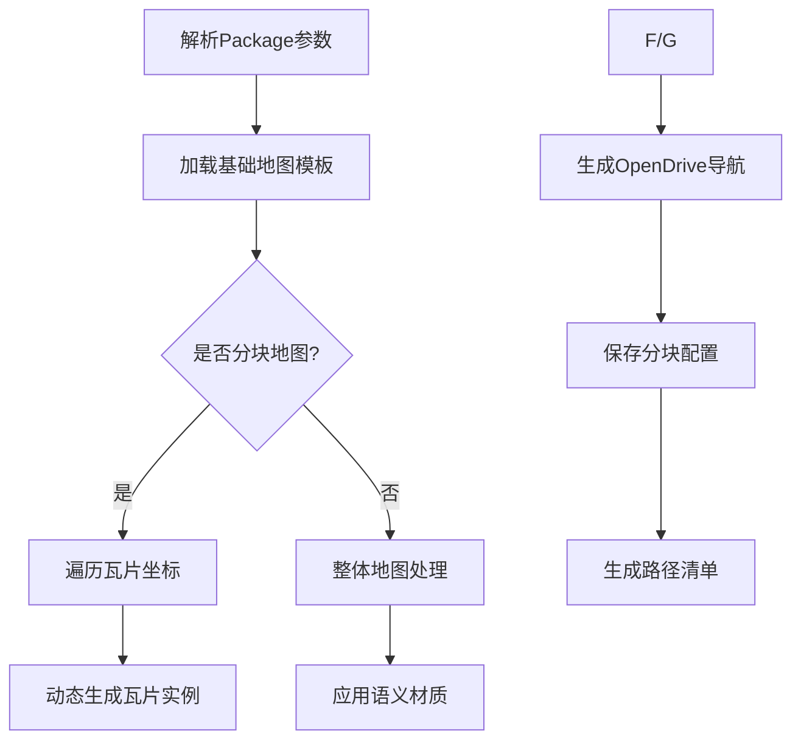

# CARLA 资产材质加载与迁移模块技术文档

---

## 目录  
1. [模块概述](#模块概述)  
2. [核心功能](#核心功能)  
3. [类与方法详解](#类与方法详解)  
4. [数据结构与配置](#数据结构与配置)  
5. [关键流程](#关键流程)  
6. [配置参数](#配置参数)  
7. [注意事项](#注意事项)  
8. [示例配置](#示例配置)  
9. [附录](#附录)  

---

## 模块概述  
本模块包含 CARLA 模拟器三大核心资产处理工具：  
1. **LoadAssetMaterialsCommandlet**  
   - 动态贴花生成与材质应用  
   - 基于 OpenDrive 的精准贴花布局  
2. **MoveAssetsCommandlet**  
   - 资产批量分类与迁移  
   - 基于语义标签的智能路径管理  
3. **PrepareAssetsForCookingCommandlet**  
   - 资产预处理与烹饪准备  
   - 分块地图动态生成  
   - 大规模场景材质优化  

---

## 核心功能  
### 1. 材质处理模块  
（原有内容保持不变）

### 2. 资产迁移模块  
（原有内容保持不变）

### 3. 资产预处理模块  
- **智能材质替换**  
  - 基于语义标签的自动材质分配（道路/标线/路缘石等）  
  ```cpp
  MeshActor->GetStaticMeshComponent()->SetMaterial(0, RoadNodeMaterial);
  ```
  - 复杂碰撞简化处理（CTF_UseComplexAsSimple）

- **分块地图系统**  
  - 支持 _Tile_X_Y 命名规范的自动识别  
  - 动态生成瓦片空间布局（基于 TilesInfo.txt 配置）

- **OpenDrive 集成**  
  - 自动生成道路生成器（AOpenDriveActor）  
  - 基于 XODR 的导航点批量生成

- **资产批处理**  
  - 对象库动态加载（UObjectLibrary）  
  - 跨地图资产引用管理  

---

## 类与方法详解  
### `UPrepareAssetsForCookingCommandlet` 类  
继承自 `UCommandlet`，实现资产烹饪预处理的核心逻辑。

#### 关键方法  
| 方法                                  | 功能描述                                                                 |
|---------------------------------------|-------------------------------------------------------------------------|
| `Main(const FString &Params)`         | 入口方法，返回执行状态码                                               |
| `ParseParams(const FString &InParams)`| 解析命令行参数，提取包名、地图列表                                      |
| `PrepareMapsForCooking()`             | 地图预处理主控制器                                                    |
| `SpawnMeshesToWorld()`                | 资产实例化与材质替换实现                                              |
| `GenerateMapPathsFile()`              | 生成跨平台地图路径配置文件                                            |

#### 成员变量  
| 变量                 | 类型                | 描述                          |
|----------------------|---------------------|-------------------------------|
| `MarkingNodeYellow`  | `UMaterialInstance*`| 黄色道路标线材质实例          |
| `RoadNodeMaterial`   | `UMaterialInstance*`| 基础道路材质实例              |
| `TerrainNodeMaterialInstance` | `UMaterialInstance*` | 地形材质实例          |

### `FAssetsPaths` 结构体  
资产路径配置容器：

| 字段          | 类型            | 描述                |
|---------------|-----------------|---------------------|
| `MapsPaths`   | `TArray<FMapData>` | 地图配置数据集      |
| `PropsPaths`  | `TArray<FString>` | 道具资产路径列表    |

---

## 数据结构与配置  
### 扩展语义标签定义  
| 标签常量          | 对应路径        | 匹配规则                  |
|-------------------|-----------------|---------------------------|
| `R_CURB1`         | CURB/           | 名称包含"Curb"            |
| `R_GUTTER1`       | GUTTER/         | 名称包含"Gutter"          |
| `R_SIDEWALK1`     | SIDEWALK/       | 名称包含"Sidewalk"        |

### 分块地图配置  
`TilesInfo.txt` 格式规范：  
```
[原点X坐标],[原点Y坐标],[瓦片尺寸(米)]
```
示例：  
```
-2500.0,1500.0,2000.0
```

---

## 关键流程  
### 资产预处理流程  


---

## 配置参数  
### 扩展命令行参数  
```bash
-OnlyPrepareMaps=true      # 仅预处理地图资产
-TileSize=2000             # 分块地图尺寸（单位：米） 
```

---

## 注意事项  
### 预处理模块专项  
1. **材质依赖**  
   - 必须预加载 Carla/Static/GenericMaterials 材质库  
   - 缺失材质实例将导致静默失败

2. **分块规范**  
   - 瓦片命名必须遵循 `MapName_Tile_X_Y` 格式  
   - 原点坐标需与 OpenDrive 数据对齐

3. **文件依赖**  
   - 必须提供有效的 TilesInfo.txt 进行分块布局  
   - 缺失 XODR 文件将跳过导航点生成

---

## 示例配置  
### 分块地图预处理命令  
```bat
UE4Editor-Cmd.exe Carla -run=PrepareAssetsForCooking  
  -PackageName=EuroPack  
  -Maps=Berlin  
  -TileSize=2000
```

---

## 附录  
### 增强错误代码表  
| 代码 | 含义                     | 解决方案                  |
|------|--------------------------|---------------------------|
| 0x31 | 分块布局文件缺失         | 检查 Maps/[Map]/TilesInfo.txt |
| 0x32 | 材质实例加载失败         | 验证材质路径正确性        |
| 0x33 | OpenDrive 数据异常       | 重新导出 XODR 文件        |

---
