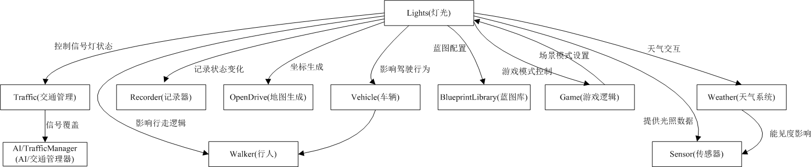
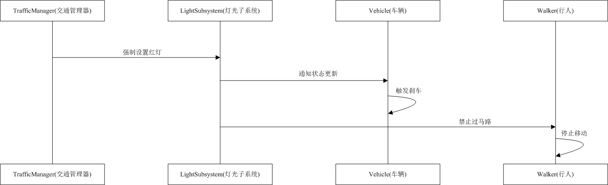
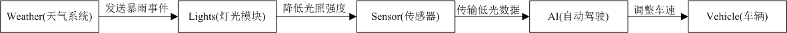
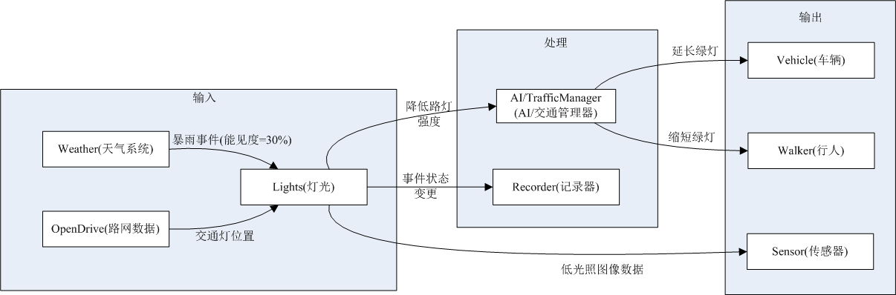

# 灯光模块(Lights)说明文档

## 目录

 - [**1. 模块概述**](#1-模块概述)
    - [1.1 UCarlaLightSubsystem介绍](#11-UCarlaLightSubsystem介绍)
         * [1.1.1 主要功能](#111-主要功能)
    - [1.2 UCarlaLight介绍](#12-ucarlalight介绍)
         * [1.2.1 主要功能](#121-主要功能)
         * [1.2.2 组件核心功能](#122-组件核心功能)
    - [1.3 灯光模块](#13-灯光模块)
 - [**2. 模块关系总览**](#2-模块关系总览)
    - [2.1 灯光模块(Lights)与其他模块关系总览](#21-灯光模块(Lights)与其他模块关系总览)
    - [2.2 模块控制关系](#22-模块控制关系)
         * [2.2.1 交通信号控制流程](#221-交通信号控制流程)
         * [2.2.2 天气影响灯光](#222-天气影响灯光)
    - [2.3 场景示例图](#23-场景示例图)
 - [**3. 技术实现**](#3-技术实现)
    - [3.1 核心类函数](#31-核心类函数)
    - [3.2 灯光注册与注销](#32-灯光注册与注销)
    - [3.3 属性控制函数](#33-属性控制函数)
    - [3.4 辅助功能](#34-辅助功能)
 - [**4. 使用场景**](#4-使用场景)
    - [4.1 动态环境光照](#41-动态环境光照)
    - [4.2 车辆信号灯同步](#42-车辆信号灯同步)
    - [4.3 仿真事件回放](#43-仿真事件回放)
 - [**5. 注意事项**](#5-注意事项)


---

## 1. 模块概述 <a id="1-模块概述"></a>
### 1.1 UCarlaLightSubsystem介绍 <a id="11-UCarlaLightSubsystem介绍"></a>
`UCarlaLightSubsystem`是 carla 仿真平台中用于管理动态灯光的核心组件类，属于 carla 的虚幻引擎插件(CarlaUnreal)的一部分。这个子系统主要负责管理 carla 世界中的灯光（如交通灯、路灯等），并处理客户端与灯光状态的同步。[UCarlaLightSubsystem源代码](https://openhutb.github.io/carla_cpp/d3/d13/CarlaLightSubsystem_8cpp_source.html)

#### 1.1.1 主要功能 <a id="121-主要功能"></a>
- **灯光注册与注销**：在模拟环境中，灯光（如交通灯、路灯等）是动态的资源。通过注册和注销机制，`UCarlaLightSubsystem`可以动态地管理这些灯光资源。当灯光被创建时，注册到子系统中，这样子系统就可以跟踪和管理它们；当灯光被销毁时，从子系统中注销，避免资源泄漏或无效引用。
- **灯光状态同步**：`GetLights` 和 `SetLights` 是实现这种双向通信的核心机制。它们确保了客户端能够获取最新的灯光信息，同时服务器可以动态调整灯光状态。
- **日夜循环控制**：通过控制昼夜变化，`CarlaLightSubsystem` 可以模拟真实世界中的光照条件，使自动驾驶系统能够在不同光照条件下进行测试和验证。
- **脏标记机制**：在多客户端的仿真环境中，频繁的同步操作可能会导致性能问题。通过脏标记机制，子系统可以记录哪些客户端需要更新，避免对所有客户端进行不必要的同步操作。

### 1.2 UCarlaLight介绍 <a id="12-ucarlalight介绍"></a>
`UCarlaLight`定义了一个 灯光组件，用于管理 carla 中的各类灯光（如交通灯、路灯等）。负责单个灯光的状态管理，并与 carla 的天气系统、RPC 通信、大型地图管理等模块交互。属于 carla 的虚幻引擎插件(CarlaUnreal)的一部分，为 carla 提供了高度可配置的、逼真的动态照明系统，是创建逼真昼夜循环和天气效果的关键组件。[UCarlaLight源代码](https://openhutb.github.io/carla_cpp/d9/d95/CarlaLight_8cpp_source.html)
#### 1.2.1 主要功能 <a id="121-主要功能"></a>
- **动态光照控制**：实时调整光源强度、颜色和方向；支持昼夜循环的光照变化；天气相关光照效果（雨、雾、云等）。
- **光源类型支持**：定向光（模拟太阳/月亮）；点光源；聚光灯；天光（Skylight）。
- **车辆专用灯光**：车头灯、尾灯、刹车灯、转向灯；应急灯；车内照明。
- **街道照明系统**：路灯控制；交通信号灯；建筑外部照明。
#### 1.2.2 组件核心功能 <a id="122-组件核心功能"></a>
在动态灯光组件中，核心功能包括：灯光属性控制、子系统集成、状态同步、事件记录。

- **灯光属性控制**：动态调整灯光强度、颜色、开关状态及类型。
- **子系统集成**：与 `CarlaLightSubsystem` 交互实现全局灯光管理。
- **状态同步**：支持与 RPC 协议兼容的灯光状态序列化（`carla::rpc::LightState`）。
- **事件记录**：灯光状态变化时触发事件记录，支持仿真回放与调试。
### 1.3 灯光模块 <a id="13-灯光模块"></a>
灯光模块在 carla 中负责模拟现实世界中的各类光源（如交通灯、路灯、车辆灯等），并确保它们在虚拟环境中的行为符合物理规律和交通规则。
通过红绿灯管理车辆和行人的通行权；动态调整灯光颜色、强度以匹配昼夜或天气变化；为摄像头、激光雷达提供光照条件（如夜间低光、雨雾散射）；支持自动驾驶算法在不同终端获取一致的灯光状态。
## 2. 模块控制关系<a id="2-模块控制关系"></a>
### 2.1 灯光模块(Lights)与其他模块关系总览<a id="21-灯光模块(Lights)与其他模块关系总览"></a>
 - 展示灯光模块与其他核心模块的全局依赖关系，帮助 lights 在 carla 系统中的定位。快速了解模块间上下游关系，设计新功能时避免遗漏依赖。
 - 核心枢纽：灯光模块直接控制交通信号，间接影响车辆、行人、传感器等模块。



### 2.2 关键交互图<a id="22-关键交互图"></a>
#### 2.2.1 交通信号控制流程 <a id="221-交通信号控制流程"></a>
 - 描述信号灯状态变化时，系统如何协调车辆和行人的行为。例如，在测试场景中交通管理器强制设置红灯，灯光子系统通知所有车辆和行人，车辆触发刹车逻辑，行人停止移动。
 - 应用场景：调试交通灯同步问题；验证自动驾驶算法对红灯的响应等。
> 
 - 流程顺序：交通管理器 → 灯光模块 → 车辆/行人响应。
#### 2.2.2 天气影响灯光 <a id="222-天气影响灯光"></a>
 - 展示天气变化如何通过灯光模块传递到自动驾驶系统。例如，天气系统发送暴雨事件；灯光模块降低路灯强度；传感器捕获低光照数据；自动驾驶 AI 决策降速。
 - 应用场景：模拟极端天气下的传感器性能；测试车辆在低能见度下的行为。

> 

 - 数据流：天气事件 → 灯光强度调整 → 传感器数据 → 车辆控制。

### 2.3 场景示例图<a id="23-场景示例图"></a>
 - 场景：模拟暴雨天气下的交通系统响应。
 - 天气系统触发能见度下降；交通管理器延长绿灯时间以缓解拥堵；传感器数据用于算法性能分析。
> 

## 3. 技术实现<a id="3-技术实现"></a>
`UCarlaLight`继承自虚幻引擎的 `ULightComponent` 类，并扩展了 carla 特有的功能。
### 3.1 核心类函数<a id="31-核心类函数"></a>
继承自 `ULightComponent` 的类都必须通过这两个函数管理生命周期。批量处理入口 `BeginPlay()` 时合并提交所有灯光参数到渲染线程（减少每帧开销）。资源回收枢纽 `EndPlay()` 集中释放GPU资源（避免帧间卡顿）。
- **`BeginPlay()`**：替代构造函数（因UE禁止直接使用构造函数初始化游戏逻辑）。
- **`EndPlay()`**：替代析构函数（保证资源安全释放）。组件销毁时的资源清理函数，确保灯光从系统中安全移除。

### 3.2 灯光注册与注销<a id="32-灯光注册与注销"></a>

#### RegisterLight()
- **作用**：将灯光注册到天气系统，使灯光效果能响应天气变化。预期可以实现在雨天/雾天自动调整灯光强度和散射；根据昼夜循环自动开关路灯；支持天气特效（如雨滴折射）对灯光的影响。
- **关键逻辑**：
  - 通过 `GetWorld()->GetSubsystem<UCarlaLightSubsystem>()` 获取子系统实例。
  - 调用 `CarlaLightSubsystem->RegisterLight(this)` 完成注册。
  - 标记 `bRegistered = true` 防止重复注册。
- **注销逻辑**：在 `EndPlay()` 中调用 `CarlaLightSubsystem->UnregisterLight(this)`。

### 3.3 属性控制函数<a id="33-属性控制函数"></a>

| 函数名 | 参数 | 功能描述 |
| --- | --- | --- |
| SetLightIntensity() | `float Intensity` | 设置灯光强度并更新渲染效果。 |
| SetLightColor() | `FLinearColor Color` | 设置颜色并记录状态变化事件。 |
| SetLightOn() | `bool bOn` | 切换灯光开关状态并触发更新。 |
| SetLightType() | `ELightType Type` | 设置灯光类型（如车灯、路灯等）。 |

#### GetLightState() 与 SetLightState()
- **作用**：实现与 RPC 协议的状态双向同步。
- **数据结构**：
  ```cpp
  carla::rpc::LightState {
    FVector _location;      // 世界坐标位置
    float _intensity;       // 强度
    LightGroup _group;      // 类型（枚举）
    FLinearColor _color;    // 颜色
    bool _active;           // 是否开启
    int _id;                // 唯一标识符
  }
  ```

### 3.4 辅助功能<a id="34-辅助功能"></a>

#### GetLocation()
- **作用**：获取灯光在全局坐标系中的位置，支持大型地图场景中的坐标转换。
- **流程**：
  1. 获取组件所属 Actor 的本地坐标: `GetOwner()->GetActorLocation()`。
  2. 通过Carla游戏模式获取大型地图管理器：
    ```cpp
    ACarlaGameModeBase* GameMode = UCarlaStatics::GetGameMode(GetWorld());
    ALargeMapManager* LargeMap = GameMode->GetLMManager();
  }
  ```
  3. 通过 `ALargeMapManager` 将坐标转换为全局坐标系,并返回转换后的全局坐标。

#### RecordLightChange()
- **作用**：记录灯光状态变化事件，支持仿真回放和状态同步。。
- **触发条件**：调用 `SetLightColor()`改变灯光颜色 ， `SetLightOn()`改变灯光开关状态，`SetLightState()`更新灯光的总体状态。
- **依赖模块**：通过 `UCarlaStatics::GetCurrentEpisode()` 获取记录器实例。
   - 记录时间包含灯光ID(灯光的唯一标识)、时间戳(由记录器自动添加)、灯光当前位置、当前颜色值、当前强度值、当前开关状态等。


## 4. 使用场景<a id="4-使用场景"></a>

### 4.1 动态环境光照<a id="41-动态环境光照"></a>
CARLA 支持高度灵活的动态光照系统，允许用户通过代码实时调整场景中的光照效果，以模拟不同时间、天气条件下的真实环境。代码示例展示路灯夜间自动开启，通过 Unreal Engine 的 `LightComponent` 控制光照属性：
```cpp
// 脚本控制路灯夜间自动开启
LightComponent->SetLightOn(true);  //启用路灯
LightComponent->SetLightIntensity(5000.0f);  //设置光照强度
LightComponent->SetLightColor(FLinearColor(0.9f, 0.9f, 0.8f));  //设置光照颜色
```
 - 开关控制（`SetLightOn`）可通过布尔值 true/false 动态开启或关闭路灯，适用于昼夜循环仿真。
 - 光照强度（`SetLightIntensity`）调整光源亮度（如 5000.0f 模拟高亮度路灯），影响场景的明暗表现。
 - 光照颜色（`SetLightColor`）使用 `FLinearColor` 设置 RGB 值（如 (0.9, 0.9, 0.8) 接近自然暖白光），匹配现实世界的光谱特性。
### 4.2 车辆信号灯同步<a id="42-车辆信号灯同步"></a>
CARLA 提供了精细化的车辆信号灯控制系统，允许用户通过代码实时调整车灯状态（如刹车灯、转向灯等），以模拟真实车辆的灯光行为。以下是一个典型的刹车灯状态同步示例代码，展示如何通过 RPC（远程过程调用）协议动态更新车灯状态：
```cpp
// 同步刹车灯状态到 RPC 协议
carla::rpc::LightState state = LightComponent->GetLightState();
state._color = FLinearColor::Red;  // 设置刹车灯颜色为红色
state._active = bIsBraking;  // 根据刹车状态激活/关闭刹车灯  
LightComponent->SetLightState(state);  // 应用新的灯光状态 
```
 - 灯光状态获取（`GetLightState`）通过`carla::rpc::LightState` 结构体读取当前车灯的颜色、亮度、开关状态等参数。
 - 动态灯光控制（`SetLightState`）可实时修改`_color`（如`FLinearColor::Red` 设为红色）和`_active`（布尔值控制开关）。
 - 与车辆行为同步，示例中的 `bIsBraking` 可绑定到车辆的刹车信号，实现刹车时自动亮红灯。

### 4.3 仿真事件回放<a id="43-仿真事件回放"></a>
CARLA 提供事件回放（Replay）功能，允许用户记录并复现仿真过程中的关键状态变化，例如车辆运动、信号灯切换、天气变化等。通过调用`RecordLightChange()`，可以精确记录灯光状态（如开关、颜色、强度）的修改时间点，并在回放时按时间轴还原这些变化。
 - **事件回放的特点：**
   - 时间戳记录：自动保存灯光状态变化的触发时间，确保回放时同步。
   - 精准复现：支持快进、暂停、逐帧分析，便于调试和算法验证。
   - 多事件同步：可与车辆轨迹、传感器数据等结合，实现完整场景回放。


## 5. 注意事项<a id="5-注意事项"></a>

- **子系统依赖**：Actor 必须存在于已启用 `CarlaLightSubsystem` 的场景中。
- **线程安全**：避免在非游戏线程（如异步任务）中直接调用 `SetLightXxx` 函数。
- **大型地图支持**：使用 `GetLocation()` 而非直接获取 Actor 坐标以确保跨地图兼容性。

---

