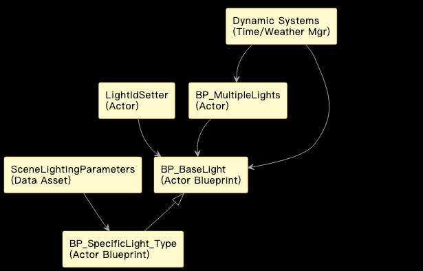

# 灯光蓝图

* 灯光 [BP_Lights](https://bitbucket.org/carla-simulator/carla-content/src/master/Blueprints/Lights/BP_Lights.uasset)
* 多灯 [BP_multipleLights](https://bitbucket.org/carla-simulator/carla-content/src/master/Blueprints/Lights/BP_multipleLights.uasset)
* 灯ID设置器 [LightIdSetter](https://bitbucket.org/carla-simulator/carla-content/src/master/Blueprints/Lights/LightIdSetter.uasset)

# 人车模拟器虚幻场景灯光系统技术文档

## 目录

1. [项目概述](#1项目概述)
2. [核心组件与蓝图结构](#2核心组件与蓝图结构)
    i. [BP_BaseLight](#21bp_baselight)
    ii. [BP_SpecificLight_Type](#22bp_specificlight_type)
    iii. [BP_MultipleLights](#23bp_multiplelights)
    iv. [LightIdSetter](#24lightidsetter)
    v. [SceneLightingParameters 数据资产](#25scenelightingparameters-数据资产)
3. [关键功能实现](#3关键功能实现)
    i. [灯光实例化与初始化](#31灯光实例化与初始化)
    ii. [灯光控制接口](#32灯光控制接口)
    iii. [ID 分配机制](#33id-分配机制)
    iv. [与动态系统的集成](#34与动态系统的集成)
    v. [性能优化考虑](#35性能优化考虑)
4. [工作流程](#4工作流程)
5. [优化与扩展建议](#5优化与扩展建议)
    i. [文件格式支持扩展（不适用）](#51文件格式支持扩展不适用)
    ii. [异常处理与日志记录](#52异常处理与日志记录)
    iii. [性能优化](#53性能优化)
    iv. [单元测试](#54单元测试)
    v. [更多灯光特性](#55更多灯光特性)
6. [总结](#6总结)

---

## 1. 项目概述

虚幻引擎作为人车模拟器的渲染核心，场景中的灯光是构建逼真仿真环境的关键要素之一。本模块专注于设计和实现场景中的人工光源（如路灯、建筑灯、交通信号灯等）的蓝图系统。通过提供结构化的蓝图资产和统一的控制接口，使得场景中的灯光能够灵活配置、易于管理，并能与模拟器的其他动态系统（如昼夜循环、天气变化）进行联动。

本灯光系统模块参考了类似 CARLA 模拟器在灯光蓝图组织上的实践，旨在提供一个既能满足仿真需求，又具有良好扩展性和维护性的解决方案。一个高质量的人工灯光系统对于提升夜间、黄昏、黎明或特殊天气（如雨雾）下的模拟真实感至关重要，直接影响车辆传感器（尤其是摄像头）对环境的感知效果。

### 模块依赖与集成

本灯光系统模块作为一个重要的场景组件，与模拟器的多个系统存在交互：

*   **虚幻引擎渲染管线**: 直接利用 UE 的灯光组件和渲染特性。
*   **场景管理系统**: 关卡设计师通过放置灯光蓝图实例来构建场景。
*   **模拟器控制接口 (例如 Python API)**: 外部系统可能需要通过 ID 等方式控制特定灯光的开关或属性。
*   **动态环境系统 (昼夜循环/天气)**: 灯光系统需要接收来自这些系统的指令，根据时间和天气自动调整状态。


该图展示了灯光系统模块如何与虚幻引擎渲染、场景管理以及模拟器的动态系统交互，提供受控的人工照明。

---

## 2. 核心组件与蓝图结构

本灯光系统由以下核心蓝图资产构成，它们组织在虚幻引擎的内容浏览器中，例如位于 `/Game/Blueprints/Scene/Lights/` 目录下：

### i. BP_BaseLight

*   **功能**: 作为所有具体人工光源蓝图的基类。封装了标准人工光源所需的基本组件和通用逻辑。
*   **设计**:
    *   包含一个或多个 `LightComponent` (如 SpotLightComponent, PointLightComponent)，具体类型可根据需要或在子类中指定。
    *   包含 `StaticMeshComponent` 用于表示灯具模型（可选）。
    *   定义了通用的变量，如 `LightColor`, `LightIntensity`, `AttenuationRadius` 等，这些变量可在编辑器中修改或通过函数调用设置。
    *   提供了基础控制函数，如 `TurnOn()`, `TurnOff()`, `SetIntensity(float NewIntensity)`, `SetColor(FLinearColor NewColor)`。
    *   可以包含一个用于存储唯一 ID 的变量 (如 `LightID`，类型为 String 或 Integer)。
*   **作用**: 提供了灯光蓝图代码的复用基础和统一的控制接口。

### ii. BP_SpecificLight_Type

*   **功能**: 从 `BP_BaseLight` 继承，用于表示特定类型的灯光实例，如 **`BP_Streetlight_Modern`**, **`BP_BuildingLight_Window`**, **`BP_TrafficLight_Simple`** 等。
*   **设计**:
    *   继承 `BP_BaseLight` 的组件和函数。
    *   在 `Construction Script` 中配置特定的灯具网格体资产 (`StaticMeshComponent`)。
    *   可以设置默认的灯光属性值（如特定路灯的默认强度、颜色）。
    *   如果需要，可以添加该特定类型灯光独有的变量或函数（例如，交通信号灯蓝图可能包含一个表示当前状态的枚举变量和用于切换状态的函数）。
    *   可以在 `BeginPlay` 事件中读取数据资产 (`SceneLightingParameters`) 来初始化自身的属性。
*   **作用**: 为不同外观和用途的灯光提供具体的资产，便于关卡设计师在场景中使用和配置。

#### 蓝图实现示例（BeginPlay 初始化）

```cpp
// 这是一个概念性的蓝图伪代码示例
Event BeginPlay
    // 查找 SceneLightingParameters 数据资产
    LocalVariable SceneParams = LoadDataAsset("SceneLightingParametersAssetReference");

    // 根据自身类型（例如，蓝图标签或变量）查找对应的配置
    LocalVariable MyConfig = SceneParams.FindConfigForLightType(Self.LightTypeIdentifier);

    If MyConfig Is Valid
        // 应用配置到灯光组件
        LightComponent.SetIntensity(MyConfig.DefaultIntensity);
        LightComponent.SetLightColor(MyConfig.DefaultColor);
        LightComponent.SetAttenuationRadius(MyConfig.DefaultAttenuationRadius);
        StaticMeshComponent.SetStaticMesh(MyConfig.LampMesh);
    End If
End Event
```

### iii. BP_MultipleLights

*   **功能：** 一个控制器蓝图，用于管理场景中的一组相关的 `BP_BaseLight` 实例。
*   **设计：**
    *   包含一个 `Array` 变量，存储 `BP_BaseLight` 或其子类 Actor 的引用。这些引用可以在编辑器中手动指定，或在运行时通过搜索获取。
    *   提供对该组灯光进行批量操作的函数，如 `TurnGroupOn()`、`TurnGroupOff()`、`SetGroupIntensity(float NewIntensity)`。这些函数内部会遍历数组，并对每个灯光 Actor 调用其相应的控制函数。
*   **作用：** 便于对场景中的一组灯光进行统一管理和控制（例如，同时开启或关闭一条街上的所有路灯），减少外部系统需要直接操作大量单个 Actor 的需求。

### iv. LightIdSetter

*   **功能：** 一个放置在场景中的蓝图 Actor 或一个可添加到 Actor 上的 Actor Component，负责在运行时扫描场景并为特定的灯光 Actor 分配唯一的标识符 (ID)。
*   **设计：**
    *   可以设计为在游戏开始 (`BeginPlay`) 时执行一个函数 `AssignUniqueIDs()`。
    *   该函数使用 `GetAllActorsOfClass` 获取所有需要分配 ID 的灯光 Actor（例如，所有 `BP_BaseLight` 的实例）。
    *   生成唯一的 ID（例如，基于递增计数器、GUID、或基于 Actor 名称/位置的哈希）。
    *   将生成的 ID 存储在每个灯光 Actor 的 `Tags` 数组或其自定义的 `LightID` 变量中。
    *   需要考虑 ID 的持久性（如果场景需要保存/加载）和在运行时动态生成灯光的处理。
*   **作用：** 使得外部系统能够通过唯一的 ID 精准地引用和控制场景中的任何一个或一组灯光 Actor。这是实现外部控制和自动化测试的关键。

**蓝图示例 (AssignUniqueIDs 函数)**

```cpp
// 这是一个概念性的蓝图伪代码示例
Function AssignUniqueIDs

LocalVariable LightActors Array<Actor> = GetAllActorsOfClass(BP_BaseLight);
LocalVariable CurrentID Integer = 0;

For Each Actor In LightActors
    // 生成唯一ID，例如 "LightID_" + 当前计数
    LocalVariable NewIDString = "LightID_" + ToString(CurrentID);

    // 将ID作为标签添加到Actor
    Actor.AddTag(FName(NewIDString));

    // 如果 BP_BaseLight 有 LightID 变量，也可以设置它
    // Cast Actor To BP_Baselight
    // If Cast Successful
    //     BP_Baselight_Ref.LightID = NewIDString;
    // End If

    CurrentID = CurrentID + 1;
End For Each
End Function
```

### v. SceneLightingParameters 数据资产

*   **功能**: 这是一个 Data Asset 类型的资产，用于集中存储场景中不同类型灯光的配置参数。
*   **设计**:
    *   包含一个或多个结构体 (`Struct`) 定义，每个结构体代表一种灯光类型 (例如，`ST_StreetlightConfig`, `ST_BuildingLightConfig`)。
    *   每个结构体包含该类型灯光的默认属性 (如默认强度、颜色、衰减半径、灯具模型资产引用、是否受昼夜循环影响等)。
    *   蓝图 (如 `BP_SpecificLight_Type`) 可以在初始化时读取这个数据资产，根据自身的类型获取对应的配置参数来设置自身属性。
*   **作用**: 将灯光的配置数据与蓝图代码分离，便于美术和策划人员在不修改蓝图代码的情况下调整灯光参数，提高了数据的管理效率和灵活性。

### 3. 关键功能实现

本节描述灯光蓝图系统的主要功能及其实现方式。

#### i. 灯光实例化与初始化

**实现过程**:

1.  关卡设计师将 `BP_SpecificLight_Type` (如 `BP_Streetlight_Modern`) 的实例直接拖拽到场景中。
2.  在蓝图实例的详情面板中，关卡设计师可以直接调整该实例的公共变量 (如强度、颜色)，覆盖掉默认值。
3.  在 `BP_SpecificLight_Type` 的 `Construction Script` 中，代码会设置灯具模型 (`StaticMeshComponent`)。
4.  在 `BP_SpecificLight_Type` 的 `BeginPlay` 事件中，蓝图可以读取 `SceneLightingParameters` 数据资产，并根据该蓝图自身的类型 (可以通过标签、类名或蓝图中的特定变量标识) 查找对应的配置参数，然后根据这些参数设置灯光组件的初始属性。

#### ii. 灯光控制接口

*   **功能**: 提供蓝图内部和外部系统控制灯光状态和属性的能力。
*   **实现过程**:
    1.  在 `BP_BaseLight` 中，实现 `TurnOn`, `TurnOff`, `SetIntensity(float)`, `SetColor(FLinearColor)` 等自定义事件或函数。这些函数直接操作内部的 `LightComponent` 的 `SetVisibility`, `SetIntensity`, `SetLightColor` 等方法。
    2.  在 `BP_MultipleLights` 中，实现 `TurnGroupOn`, `TurnGroupOff` 等函数。这些函数遍历其拥有的 `BP_BaseLight` 引用数组，并对数组中的每个 Actor 调用其相应的控制函数。
    3.  外部系统 (如模拟控制脚本) 可以通过以下方式控制灯光:
        *   直接获取特定灯光 Actor 的引用 (例如，通过其名称，但不推荐用于大量灯光)。
        *   使用 `GetActorsWithTag` 或自定义查找函数，根据 `LightIdSetter` 分配的唯一 ID 找到目标灯光 Actor，然后调用其公共函数。
        *   查找 `BP_MultipleLights` 实例，并调用其批量控制函数。

#### iii. ID 分配机制

*   **功能**: 为场景中的灯光 Actor 分配唯一的运行时 ID，便于外部系统引用。
*   **实现过程**:
    i. 创建一个蓝图 Actor `LightIdSetter` 并将其放置在场景中。
    ii. 在 `LightIdSetter` 的 `BeginPlay` 事件中，执行 `AssignUniqueIDs()` 函数。
    iii. `AssignUniqueIDs()` 函数使用 `GetAllActorsOfClass(BP_BaseLight)` 或其子类，获取所有需要分配 ID 的灯光 Actor 列表。
    iv. 遍历列表，为一个计数器递增生成 ID，或者使用 GUID。
    v. 将生成的 ID 存储在当前灯光 Actor 的 `Tags` 数组中 (使用 `AddTag(FName)`)。例如，将 ID 格式化为 `"LightID_123"` 这样的标签。
    vi. 外部系统可以通过 `GetAllActorsWithTag(FName("LightID_123"))` 查找具有特定 ID 的灯光。

#### iv. 与动态系统的集成

*   **功能**: 使灯光系统能够响应昼夜循环和天气变化。
*   **实现过程**:
    i. 模拟器的 TimeOfDay/Weather Manager 蓝图 (假设存在) 在时间和天气变化时触发事件或调用函数。
    ii. TimeOfDay/Weather Manager 获取相关的灯光 Actor 或 `BP_MultipleLights` 实例的引用。这可以通过直接引用、按标签查找 ID、或查找特定的灯光组控制器来实现。
    iii. 例如，当时间到达黄昏时，Manager 调用所有路灯组 (如由一个 `BP_MultipleLights` 管理的组，或者通过遍历所有带有 `"Streetlight"` 标签的 Actor) 的 `TurnGroupOn()` 函数。
    iv. Manager 也可以根据天气强度 (如雨量、雾密度) 调整灯光的强度，调用 `SetGroupIntensity()` 或单个灯光的 `SetIntensity()` 函数。

### v. 性能优化考虑

*   **功能**: 确保场景中大量灯光不会导致性能下降。
*   **实现过程**:
    i. 在 `BP_BaseLight` 的 `LightComponent` 设置中，配置适当的 `Attenuation Radius` (衰减半径)，使灯光只影响局部区域。
    ii. 根据需要调整灯光的 `Cast Shadows` 设置。动态阴影对性能影响较大，对于不关键的灯光可以禁用。
    iii. 对于外观相同的灯具网格体，考虑在 `BP_SpecificLight_Type` 中使用 `Hierarchical Instanced Static Mesh` (HISM) 组件来代替多个 `StaticMeshComponent`，减少 Draw Call。
    iv. 利用虚幻引擎的 Level of Detail (LOD) 和剔除机制。

### 4. 工作流程

本灯光系统模块的典型使用工作流程如下:

1.  **数据资产配置**: 美术或关卡设计师编辑 `SceneLightingParameters` 数据资产，定义不同类型灯光的默认外观和性能参数。
2.  **蓝图资产创建与修改**: 蓝图工程师创建或修改 `BP_BaseLight` 及其子类 `BP_SpecificLight_Type` 蓝图，设置灯具模型、组件，实现基础控制函数，并在 `BeginPlay` 中添加数据资产读取参数的逻辑。
3.  **场景布局**: 关卡设计师在虚幻场景中放置 `BP_SpecificLight_Type` 实例来构建人工照明环境。对于需要成组控制的灯光，将其引用添加到 `BP_MultipleLights` 实例的数组中。
4.  **ID 分配配置**: 在场景中放置 `LightIdSetter` Actor，确保在游戏开始时能够正确执行 ID 分配逻辑。

### 5. 优化与扩展建议

基于当前的设计，可以考虑以下优化和未来扩展方向:

#### i. 文件格式支持扩展 (不适用)

*   本模块主要处理虚幻引擎内的蓝图资产和运行时 Actor，不涉及外部文件格式的读写，因此此项不适用。

#### ii. 异常处理与日志记录

*   在蓝图函数中添加更健壮的错误检查，例如检查引用的 Actor 是否有效。
*   使用虚幻引擎的 Log 系统在系统发生重要事件 (如 ID 分配错误、引用失效) 时输出警告或错误信息，便于调试。

#### iii. 性能优化

*   对复杂场景进行 Lightmap Baking (烘焙静态灯光)，只保留动态灯光 (如交通信号灯) 为动态。
*   进一步优化灯光参数，例如减少不必要的阴影投射、调整光源的移动性和更新频率。
*   对于非常远距离的灯光，考虑使用简单的发光材质平面来代替实际光源，节省渲染开销。

### iv. 单元测试

*   虽然蓝图的单元测试框架不如 C++ 成熟，但可以创建专门的测试场景，编写测试蓝图来实例化灯光、调用其函数，并检查属性是否按预期改变。例如，测试 `TurnOn()` 后灯光是否可见、`SetIntensity()` 是否生效。

### v. 更多灯光特性

*   **IES Profiles**: 支持使用 IES 文件来定义光源的光强分布，提升灯光效果的真实感。
*   **体积光 (Volumetric Lighting)**: 在有雾或灰尘的场景中，通过体积光效果增加光束的可见性。
*   **灯光破坏**: 实现灯光 Actor 在受到碰撞或特定事件触发时闪烁、闪烁或熄灭的效果。
*   **更高级的交通信号灯**: 实现复杂的交通信号灯逻辑，包括多种模式、闪烁、故障等。

### 6. 总结

本灯光系统技术文档描述了车载模拟器虚幻场景中人工光源蓝图的设计、核心组件、关键功能实现以及工作流程。通过采用基于继承的蓝图结构、集中式的数据资产、以及基于 ID 的控制接口，该系统提供了灵活、可控且易于扩展的灯光管理解决方案。它能够支持场景中各种类型人工光源的表现，并能与模拟器的动态环境系统集成，为构建逼真且功能丰富的仿真场景提供了坚实基础。未来的工作可以进一步提升系统的真实感、性能和复杂功能支持。

